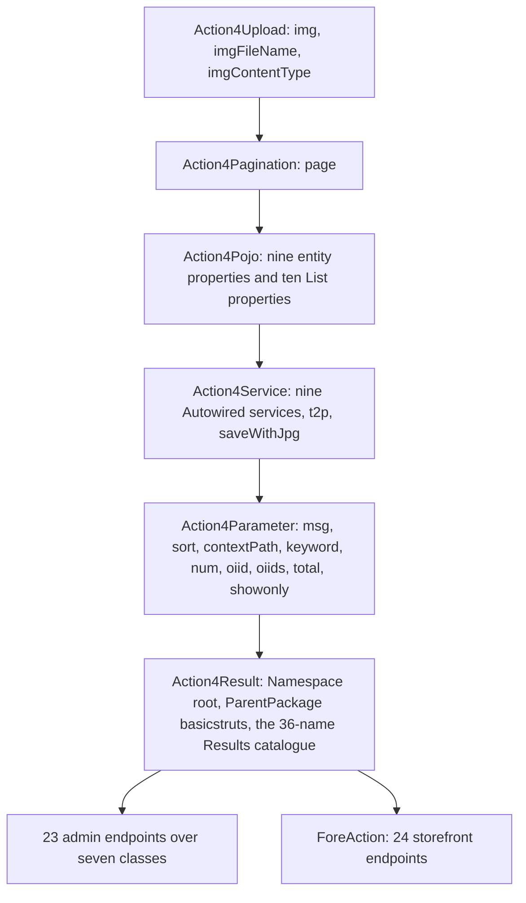
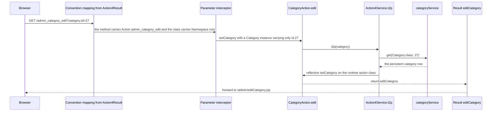

# Action Layer: the Action4* Chain, Endpoint Annotations, and Result Resolution

`src/com/caozhihu/tmall/action/` contains fourteen classes: eight concrete actions and the six-class
`Action4*` chain they all extend. Every HTTP endpoint the application serves is one `@Action`-annotated
method on one of those eight classes, and every view is named by a `String` that method returns
(`src/struts.xml#L7-L26` declares no `<action>` and no `<result>`). The layer's job is therefore narrow:
take what the request bound, call a service, choose a result name.

This page owns the layer itself — the chain and why it exists, the annotations that generate the routing
table, the inherited bindable surface, `t2p()`, `saveWithJpg()`, service injection, and what happens when
an action method fails. Four neighbouring pages own the consequences and are cross-linked rather than
repeated:

| Not this page's subject | Owner |
|---|---|
| Filters, the `auth-dafault` interceptor stack, OGNL binding mechanics, result resolution into a forward or `302`, direct-JSP and static paths | [Request Pipeline](/openwiki/architecture/request-pipeline.md) |
| The 47 URL rows, the 36 result-name rows, which parameter each caller sends, which JSP each result targets | [Action Catalog](/openwiki/reference/action-catalog.md) |
| `BaseService`, the reflection-derived `clazz`, `ServiceDelegateDAO`, where `@Transactional` really sits | [Service Layer](/openwiki/architecture/service-layer.md) |
| JSP includes, EL/JSTL reads, static assets | [View Layer](/openwiki/architecture/view-layer.md) |

## The six-class chain

Each class in the chain owns exactly one kind of member, and each adds its members to the one above it —
the top link, `Action4Result`, adds only annotations and an empty class body. Nothing in the chain extends
Struts or Spring base classes; all six are plain POJOs.

*What a concrete action inherits. The chain is the only place these members are declared; the concrete classes add methods only.*

| Chain class | Single responsibility | Members it declares | Evidence |
|---|---|---|---|
| `Action4Upload` | Hold the multipart upload triple | `protected File img`, `String imgFileName`, `String imgContentType`, each with a public getter and setter | `src/com/caozhihu/tmall/action/Action4Upload.java#L5-L28` |
| `Action4Pagination` | Hold the paging bean | `protected Page page` with accessors (it extends `Action4Upload`) | `src/com/caozhihu/tmall/action/Action4Pagination.java#L5-L13` |
| `Action4Pojo` | Be the data surface: setters accept what the request binds, getters serve what the JSP renders | nine entity properties (`category` … `orderItem`) and ten list properties (`categories`, `products`, `productSingleImages`, `productDetailImages`, …) with accessors | `src/com/caozhihu/tmall/action/Action4Pojo.java#L7-L28`, `#L30-L180` |
| `Action4Service` | Give every action its service dependencies, plus the two cross-cutting helpers | `@Component`; nine `@Autowired` service fields; `t2p(Object)`; `saveWithJpg(File)`; accessor pairs for the services | `src/com/caozhihu/tmall/action/Action4Service.java#L15-L44`, `#L57-L83` |
| `Action4Parameter` | Hold the loose scalar parameters that are neither an entity nor a page | `msg`, `sort`, `contextPath`, `keyword`, `int num`, `int oiid`, `int[] oiids`, `float total`, `boolean showonly` | `src/com/caozhihu/tmall/action/Action4Parameter.java#L3-L29`, `#L31-L102` |
| `Action4Result` | Carry the routing metadata and nothing else — the class body is empty | `@Namespace("/")`, `@ParentPackage("basicstruts")`, the whole `@Results` catalogue (36 names) | `src/com/caozhihu/tmall/action/Action4Result.java#L8-L68` |

Consequences a reader should carry into any change:

- **The bindable surface is the chain, not the action.** Adding a parameter means adding a field and a
  public setter to the one chain class that owns that kind of data. Binding mechanics (dotted names,
  arrays, `page.start`, multipart) are owned by
  [Request Pipeline](/openwiki/architecture/request-pipeline.md) §6.
- **The chain is shared by storefront and back office.** `ForeAction` (24 storefront endpoints) and the
  seven admin classes use the same `page`, the same nine entity fields and the same `img` triple, so a
  rename on the chain is a rename for all 47 endpoints at once.
- **Only `Action4Service` carries a Spring stereotype** (`@Component`, `#L15`), and it declares no
  `@Action` method; the concrete actions are annotated with neither `@Component` nor `@Service`.
- **`Action4Service` also declares the getter/setter pairs for its nine service fields**
  (`#L85-L155`). Both directions exist for the container's benefit: injection sets the field, and
  nothing in the repository calls those setters itself (the only occurrence of any of them is its own
  declaration).

## Why the chain exists

The design intent is stated in the README's action-layer refactor section: a single `CategoryAction` had
accumulated seven unrelated concerns — page-result definitions, single-object and collection
getters/setters, the paging object, the upload object, service injection, and access-path mapping — which
made the controller hard to read and hard to maintain (`README.md#L298-L340`). The refactor moved each of
those concerns into a class of its own, as the README lists them: `Action4Upload` for uploads,
`Action4Pagination` for paging (extending the upload class), `Action4Pojo` for entity and collection
properties, `Action4Service` for injection, and `Action4Result` for page definitions
(`README.md#L314-L340`).

What the refactor did **not** do is generate the endpoint bodies: each `@Action` method is still written
by hand on its class, and the chain only removes the boilerplate around it. The observable shape of that
split is that a concrete class such as `CategoryAction` is five annotation strings, five service calls,
five `return` statements and the two upload writes of its add/update handlers
(`src/com/caozhihu/tmall/action/CategoryAction.java#L14-L61`).

## Annotations: inheritance is the routing table

Four annotation uses, one of them repeated 47 times, produce the entire URL surface:

1. **`@Namespace("/")`** on `Action4Result` — the namespace is the root, so an `@Action` value is the
   whole URL below the context path (`Action4Result.java#L8`). No concrete class repeats it.
2. **`@ParentPackage("basicstruts")`** on `Action4Result` (`#L9`) — attaches every endpoint to the
   `basicstruts` package in `src/struts.xml`, and with it the `auth-dafault` interceptor stack
   ([Request Pipeline](/openwiki/architecture/request-pipeline.md) §3, §5).
3. **One `@Results` block** on `Action4Result` (`#L10-L67`) holding **36 result names** — 26 plain
   dispatcher forwards and 10 `type="redirect"` results. Subclasses return the name only
   (`return "listCategory";`), so the view behind an endpoint is changed in this block, not in the
   action method. The names themselves, their targets and the endpoints returning them are tabulated in
   [Action Catalog](/openwiki/reference/action-catalog.md).
4. **`@Action("<url>")` on each method** — 47 of them. Because every method carries an explicit value,
   the convention plugin's class-name-derived fallback naming is never used: `CategoryAction.list` is
   `/admin_category_list`, not `/category/list` (`CategoryAction.java#L16`).

The per-class distribution, re-derived from the source rather than from prose:

| Class | Endpoints | `@Action` lines | Evidence |
|---|---|---|---|
| `CategoryAction` | 5 | `L16, L28, L37, L50, L56` | `src/com/caozhihu/tmall/action/CategoryAction.java#L16-L56` |
| `PropertyAction` | 5 | `L11-L47` | `src/com/caozhihu/tmall/action/PropertyAction.java#L11-L47` |
| `ProductAction` | 5 | `L11-L47` | `src/com/caozhihu/tmall/action/ProductAction.java#L11-L47` |
| `ProductImageAction` | 3 | `L12-L54` | `src/com/caozhihu/tmall/action/ProductImageAction.java#L12-L54` |
| `PropertyValueAction` | 2 | `L7-L15` | `src/com/caozhihu/tmall/action/PropertyValueAction.java#L7-L15` |
| `OrderAction` | 2 | `L11-L23` | `src/com/caozhihu/tmall/action/OrderAction.java#L11-L23` |
| `UserAction` | 1 | `L8` | `src/com/caozhihu/tmall/action/UserAction.java#L8` |
| `ForeAction` | 24 | `L18-L320` | `src/com/caozhihu/tmall/action/ForeAction.java#L18-L320` |
| **Total** | **47** (23 admin + 24 storefront) | | |

Two properties of this arrangement are load-bearing and easy to break:

- **Only `@Action` methods are addresses.** Helpers inherited from the chain (`t2p`, `saveWithJpg`) and
  every non-annotated method are unreachable over HTTP, so adding a public method to an action class is
  not adding an endpoint.
- **The result-name string is untyped.** An action method returns a `String` that the compiler does not
  check against `@Results`; the coupling is resolved at request time only. Without `@ParentPackage` an
  endpoint would also silently lose the application's interceptor stack.

## The two naming families

The 23 back-office endpoints follow one shape: `admin_` + the entity class simple name with a lower-case
first letter + `_` + the method name — `admin_category_list` / `admin_category_add` / `admin_category_edit`
(`CategoryAction.java#L16-L56`), `admin_productImage_list` (`ProductImageAction.java#L12`),
`admin_propertyValue_edit` (`PropertyValueAction.java#L7`), `admin_order_delivery`
(`OrderAction.java#L23`). The entity token being an uncapitalized class name is why `ProductImage` and
`PropertyValue` appear as camelCase URL segments while `category`, `product`, `order` and `user` do not.

The 24 storefront endpoints follow a different shape: a single lower-case `fore` prefix glued to a verb
phrase — `forehome`, `forebuyone`, `foreaddCart`, `forechangeOrderItem`, `foreorderConfirmed`,
`foredoreview` (`ForeAction.java#L18-L320`). The storefront has no entity segmentation: one class holds
every storefront endpoint, whereas a new back-office entity means a new `XxxAction` class.

| URL family | Class pattern | Endpoints | URL token |
|---|---|---|---|
| `admin_…` | one class per entity | 23 | `admin_` + uncapitalized entity class name + `_` + verb |
| `fore…` | one class for the whole storefront | 24 | `fore` + verb phrase, no separator |

Two mismatches between URL and method name are worth knowing before renaming anything: `forereview` is
implemented by `ForeAction.revice()` (`ForeAction.java#L310-L318`), and every other storefront URL shares
its verb with the method name only by convention. The `/fore` auth gate keys on the request URI rather
than on the method name ([Request Pipeline](/openwiki/architecture/request-pipeline.md) §5.1), so the
do-not-break framing of these names lives on
[Runtime Invariants](/openwiki/conventions/runtime-invariants.md).

## One endpoint, start to finish

`admin_category_edit` is a compact complete path through the layer: a dotted parameter that arrives as
an id-only object, a `t2p()` rebinding, and a result name that resolves to an edit form.

*Binding, rebinding and result naming for one endpoint. Interceptor order and dispatch are owned by [Request Pipeline](/openwiki/architecture/request-pipeline.md); the JSP side by [View Layer](/openwiki/architecture/view-layer.md).*

State worth noting: every field the chain declares is per-request scratch space, and the only cross-request
carriers an action body writes are session attributes — `user` and `orderItems`
(`src/com/caozhihu/tmall/action/ForeAction.java#L51`, `#L185`). The redirect results re-send their inputs
explicitly (`/admin_property_list?category.id=${property.category.id}`,
`Action4Result.java#L24`), which is only necessary because an action instance's fields do not survive the
`302`.

## `t2p(Object)`: rebinding an id-only object to a persistent one

A dotted parameter such as `category.id=27` produces an entity carrying exactly one field, so any handler
that needs a complete row must reload it. `t2p` is the inherited, entity-agnostic way to do that
(`src/com/caozhihu/tmall/action/Action4Service.java#L57-L71`, with the design rationale in the comment at
`#L46-L56`):

1. `o.getClass()` gives the entity class, and `clazz.getMethod("getId").invoke(o)` reads the id as an
   `Integer` (`#L59-L60`).
2. `categoryService.get(clazz, id)` fetches the persistent row. The *same* `categoryService` bean serves
   every entity type, because `BaseService.get(Class, int)` is type-agnostic
   ([Service Layer](/openwiki/architecture/service-layer.md) §1).
3. The setter name is built from the entity's simple name — `Category` becomes `setCategory` — and
   resolved with `getClass().getMethod("set" + beanName, clazz)`, i.e. against the **runtime action
   class**, where the inherited setter is public (`#L63-L66`).
4. `setMethod.invoke(this, persistentBean)` rebinds the *action field*, not the caller's argument
   (`#L66`). The comment's example is `Action4Pojo.setCategory(category)`.

The contract this imposes, none of which the compiler checks:

- The entity must expose a public `getId()` whose value autoboxes to `Integer`; all nine entities declare
  `int id` with such a getter (`src/com/caozhihu/tmall/pojo/Category.java#L9-L12`, `#L27-L29`).
- The action property must be named `set<EntitySimpleName>` — spelling, not type, is what is resolved.
  That is why the usable arguments are the nine `Action4Pojo` entity properties; a differently named field
  (or a renamed entity class) makes the lookup fail.
- The action field is replaced wholesale. A value bound onto the same object must be read *before* the
  call: `PropertyValueAction.update` stashes `propertyValue.getValue()` in a local first and writes it
  back afterwards (`src/com/caozhihu/tmall/action/PropertyValueAction.java#L15-L22`), otherwise the
  request value is lost with the replaced instance.

**Failure is silent.** The whole body sits in one `try` whose `catch (Exception e)` only calls
`e.printStackTrace()` (`#L67-L70`); the method returns `void`, rethrows nothing and reports nothing, so
the action continues with whatever it had — usually the id-only object. The code records one downstream
symptom explicitly: `ProductImageAction.delete` must call `t2p` because the redirect location dereferences
`productImage.product.id`, and skipping it raises
`org.hibernate.TransientObjectException: object references an unsaved transient instance`
(`src/com/caozhihu/tmall/action/ProductImageAction.java#L57-L61`). Other failures surface later as a
missing value in a form or as whatever `NullPointerException` the next dereference produces. The
per-screen consequences are catalogued in
[Workflow: Admin CRUD Screens](/openwiki/workflows/admin-crud.md).

`t2p` is called from 21 places — `CategoryAction.edit`; nine sites in `ForeAction`; `OrderAction.delivery`;
`ProductAction.list`, `#delete`, `#edit`; `ProductImageAction.list`, `#delete`; `PropertyAction.list`,
`#delete`, `#edit`; and `PropertyValueAction.edit`, `#update`. It is not the only rebinding strategy:
`PropertyAction.update` deliberately skips it because the bound object already carries every field to
write (`PropertyAction.java#L47-L51`), and `ProductAction.update` re-reads the row only to copy the
unchanged `createDate` onto the submitted object
(`src/com/caozhihu/tmall/action/ProductAction.java#L47-L53`).

## Upload fields and `saveWithJpg(File)`

`Action4Upload` declares exactly the three properties the framework's multipart handling needs, so every
action in the package can accept a file under the form field name `img`
(`src/com/caozhihu/tmall/action/Action4Upload.java#L5-L28`). Which directory a file lands in, how the
name is derived and which derivatives are written is the
[Image Pipeline](/openwiki/workflows/image-pipeline.md)'s subject; the layer-level contract is:

- **`saveWithJpg(File file)` takes the *target* as its parameter and reads the uploaded bytes off the
  inherited `img` field** (`src/com/caozhihu/tmall/action/Action4Service.java#L75-L83`). It is therefore
  not reusable for a second, different upload inside one action, and it only works on an action whose
  chain includes `Action4Upload`.
- Its body is three statements inside one `try`: `FileUtils.copyFile(img, file)`,
  `BufferedImage img = ImageUtil.change2jpg(file)` — a local variable that shadows the field from there on
  — and `ImageIO.write(img, "jpg", file)`. The method returns `void` and catches `IOException` only, so a
  write failure leaves the database row committed and the file absent or partial, with a stack trace as
  the sole record.
- **The null-upload case is asymmetric.** `CategoryAction.update` guards the call with `if (img != null)`
  (`CategoryAction.java#L37-L46`) while `CategoryAction.add` calls it unconditionally
  (`#L28-L35`), so a multipart submit with no file selected reaches `FileUtils.copyFile` with a null
  source after `categoryService.save(category)` has already written the row. That failure is not an
  `IOException`, so the surrounding `catch` does not intercept it.
- Three call sites use the helper: `CategoryAction.add`, `CategoryAction.update`, and
  `ProductImageAction.add`, the last also writing the two 56×56 and 217×190 derivatives immediately
  afterwards (`src/com/caozhihu/tmall/action/ProductImageAction.java#L20-L52`).

## Service injection: nine fields on `Action4Service`

`Action4Service` declares nine package-private service fields, each annotated `@Autowired`, each typed as
the interface: `categoryService`, `propertyService`, `productService`, `productImageService`,
`propertyValueService`, `userService`, `orderService`, `orderItemService`, `reviewService`
(`src/com/caozhihu/tmall/action/Action4Service.java#L19-L44`). This one declaration is what every one of
the 47 endpoint bodies reaches the database through; no concrete action declares a service field of its
own.

- **Wiring is by type, not by name.** There is no `@Qualifier`, no `@Resource(name = …)` and no string
  bean name anywhere in the action package; each of the nine interfaces has exactly one implementation in
  `com.caozhihu.tmall.service.impl` (nine `*ServiceImpl` classes plus the base and delegate classes).
  `CategoryServiceImpl` is the extreme case — an empty class annotated `@Service("categoryService")`
  (`src/com/caozhihu/tmall/service/impl/CategoryServiceImpl.java#L6-L10`).
- **The instances are not Spring beans.** `Action4Service` is the only `@Component` in the package and has
  no `@Action` method; the concrete actions carry no stereotype. They are created and autowired through
  `struts.objectFactory=spring` ([Request Pipeline](/openwiki/architecture/request-pipeline.md) §3), which
  is also why the `@Transactional(readOnly = false)` on `PropertyAction.add`
  (`src/com/caozhihu/tmall/action/PropertyAction.java#L25-L30`) has no proxy to apply to — recorded in
  [Workflow: Admin CRUD Screens](/openwiki/workflows/admin-crud.md) and
  [Persistence Layer](/openwiki/architecture/persistence-layer.md).
- **Business-level constants are consumed, not declared, here.** Action bodies reference strings such as
  `OrderService.waitPay` / `waitDelivery` / `waitConfirm` / `waitReview` / `finish` / `delete` and
  `ProductImageService.type_single` / `type_detail`
  (`src/com/caozhihu/tmall/action/ForeAction.java#L66-L67`, `#L257`, `#L272`, `#L296`, `#L325`,
  `src/com/caozhihu/tmall/action/OrderAction.java#L27`); their definitions belong to the
  service interfaces ([Service Layer](/openwiki/architecture/service-layer.md)).

A cross-cutting defect this arrangement makes possible: because the fields are all injected and the base
service is entity-agnostic, a call can be routed through the wrong field without any compile error:
`ProductImageAction.delete` deletes a `ProductImage` through `propertyService`
(`ProductImageAction.java#L60`). Nothing in the action layer can detect that; it is recorded in
[Workflow: Admin CRUD Screens](/openwiki/workflows/admin-crud.md).

## What an action method does when something fails

Unlike the two chain helpers, the endpoint bodies contain **no exception handling at all**: the only
`catch` blocks in the whole package are the two inside `Action4Service`
(`Action4Service.java#L67`, `#L80`). Failure behaviour therefore follows from what the method does and
from the fact that `src/struts.xml` declares no exception mapping and no global results:

- **An exception from a service call, a dereference or a reflection step escapes the method**, so the
  `return "<result>"` statement is never reached and no result name is produced. The framework's default
  failure path is the only handler; the exact error page and status are a framework default not visible
  in this checkout.
- **`t2p()` and `saveWithJpg()` cannot fail the request.** Both swallow their exceptions
  (`Action4Service.java#L67-L70`, `#L80-L82`), which is precisely why a missing entity shows up as an
  empty form rather than an error.
- **A result name with no `@Result` cannot be resolved**, and the failure happens *after* the action body
  has run — any database write, file write or session attribute the body performed is already done. There
  is no fallback result and no `input` result anywhere in the annotations.
- **Unbound primitives silently default.** `num`, `oiid`, `total` and `showonly` are primitives, so a
  request that omits them yields `0` / `false` rather than `null`; the `String` and object fields stay
  `null`, which is why `ForeAction.category` tests `if (sort != null)`
  (`ForeAction.java#L108`). Action classes are plain POJOs with no `validate()` method
  ([Request Pipeline](/openwiki/architecture/request-pipeline.md) §6).
- **Session state is dereferenced without a guard in one place.** `ForeAction.createOrder` reads the
  session `orderItems` list and calls `ois.isEmpty()`, so a fresh session reaches the method with a null
  list and throws instead of redirecting to `login.jsp`
  (`ForeAction.java#L243-L248`).

## Extension points

- **A new endpoint** is one method carrying `@Action("…")` on a class that extends `Action4Result`, whose
  body returns an existing result name or a new one. A new name means one more `@Result` in the shared
  block on `Action4Result`, which applies to all 47 endpoints at once.
- **A new bindable parameter** means a field plus a public setter on the chain class that owns that kind
  of data (`Action4Upload` for files, `Action4Pagination` for paging, `Action4Pojo` for entities and
  collections, `Action4Parameter` for scalars), never a method argument.
- **A new service dependency** means one more `@Autowired` field on `Action4Service`, which makes it
  available to every action; the service itself must follow the naming rules that make
  `BaseServiceImpl`'s reflection work ([Service Layer](/openwiki/architecture/service-layer.md) §2).
- **A new upload** reuses the inherited `img` / `imgFileName` / `imgContentType` triple; a second
  concurrent file in the same action would need its own fields, because `saveWithJpg` hard-codes the
  `img` field as its source.
- **A new back-office entity** means a new `XxxAction` class next to its siblings; a new storefront
  endpoint usually means one more method on `ForeAction`. The placement and naming checklist is on
  [SDD Baseline](/openwiki/concepts/sdd-baseline.md) §2.

## Related pages

- [Request Pipeline](/openwiki/architecture/request-pipeline.md) — the filters, the `auth-dafault` stack, OGNL binding and how a result name becomes a forward or a `302`.
- [Service Layer](/openwiki/architecture/service-layer.md) — `BaseService`, the reflection-derived `clazz`, `ServiceDelegateDAO` and the location of `@Transactional`.
- [View Layer](/openwiki/architecture/view-layer.md) — the JSP pages and fragments the result locations point at, and what the markup reads off the action.
- [Action Catalog](/openwiki/reference/action-catalog.md) — the per-URL lookup table of all 47 endpoints and all 36 result names.
- [SDD Baseline](/openwiki/concepts/sdd-baseline.md) — where a new action, service, entity or view goes and what it must be called.

## Review items

【人工评审待确认】

- The exact framework response when an action method returns a result name that no `@Result` declares
  (status code, message, whether the already-committed side effects are expected to stand). The repository
  shows only that no exception mapping or fallback result exists; the resolution code lives in
  `struts2-core-2.5.14.1.jar`, which is not readable text in this checkout.
- Whether the contract that `t2p()` depends on — action property name equals the entity class simple
  name, and the entity exposes `int getId()` — is an intended naming rule or an accident of the current
  nine entities. A rename on either side fails silently inside `t2p`'s `catch (Exception)`.
- Whether `CategoryAction.add` should guard `saveWithJpg` with `if (img != null)` as `update` does, and
  whether a submission without a file is meant to be accepted at all.
- Whether the endpoint bodies are meant to have any failure path: no `try`/`catch`, no `input` result, no
  `validate()`, and no exception mapping are declared anywhere in the action layer.
- Whether `@Component` on `Action4Service` is required for the concrete actions to be wired, given that
  nothing in the repository references the bean by name and the concrete classes carry no stereotype.
- Whether the unbound-primitive defaults are intended (`num` = 0 produces a zero-quantity `OrderItem`
  when a caller omits the parameter).
