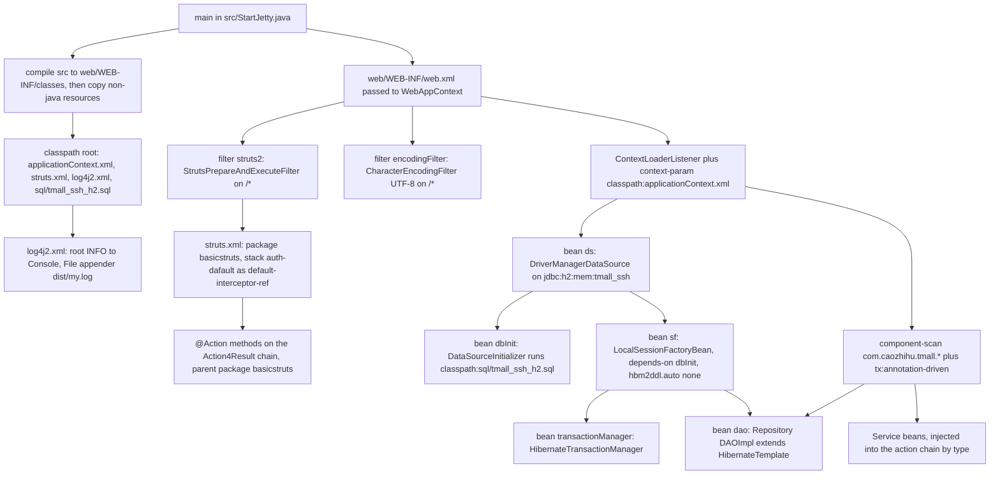

# Configuration Surface: web.xml, applicationContext.xml, struts.xml, log4j2

This checkout has no build descriptor: no `pom.xml`, `build.gradle`, `build.xml` or CI workflow
exists anywhere in the repository. The things that decide how the application boots are therefore
the *locations* of four XML files plus a handful of `static final` constants inside
`src/StartJetty.java`, and the `web/WEB-INF/lib` directory whose file names are the dependency
declaration. Nothing is generated into a config file at build time, and nothing is read from
environment variables or system properties: editing one of these files and starting again is the
whole configuration workflow.

This page is the map. The mechanism pages own the consequences:
[Runtime Bootstrap](/openwiki/architecture/runtime-bootstrap.md) explains *how* the launcher brings
the pieces up,
[Request Pipeline](/openwiki/architecture/request-pipeline.md) explains what the filters and the
interceptor stack do to a request,
[Runtime Invariants](/openwiki/conventions/runtime-invariants.md) lists the string contracts and
their failure symptoms, and
[Startup and Diagnostics](/openwiki/operations/startup-and-diagnostics.md) is the failure runbook.
This page records what each file contains, where it is loaded from, and what breaks if it changes.

## 1. The surface, and what loads each file

| Artifact | Loaded from | Loaded by | Owns |
|---|---|---|---|
| `web/WEB-INF/web.xml` | Absolute path passed to `WebAppContext.setDescriptor(...)` (`src/StartJetty.java#L57-L70`) | Jetty (`WebXmlConfiguration`) | two `/*` filters, the Spring `context-param`, the `ContextLoaderListener` |
| `src/applicationContext.xml` | `classpath:applicationContext.xml` (`web/WEB-INF/web.xml#L32-L35`), i.e. `web/WEB-INF/classes/applicationContext.xml` at runtime | Spring `ContextLoaderListener` (root web context); also `TestTmall` via `@ContextConfiguration` | component scan, annotation config, `ds`, `dbInit`, `sf`, `transactionManager` |
| `src/struts.xml` | filter init-param `contextConfigLocation=classpath:struts.xml` (`web/WEB-INF/web.xml#L9-L12`), i.e. `web/WEB-INF/classes/struts.xml` | `StrutsPrepareAndExecuteFilter` | two constants, the `basicstruts` package, three interceptors, the `auth-dafault` stack |
| `src/log4j2.xml` | classpath root (Log4j2 auto-detection), copied to `web/WEB-INF/classes/log4j2.xml` by the launcher | Log4j2 2.9.1 | the `Console` and `File` appenders, the root logger, one named logger |
| `src/StartJetty.java` | compiled by itself; run as `main` | the JVM | ports, context path, Jetty `Configuration` chain, `addSystemClass` list, the `/` rewrite, `javac` options |
| `tmall_ssh.iml` (+ `.vscode/settings.json` per `MIGRATION.md`) | IDE only | the IDE | per-jar classpath entries for the editor |

The two `classpath:` references are the load-bearing part of that table. `web/WEB-INF/classes/` does
not exist in the checkout and is listed in `.gitignore`; it is produced at every launch by
`StartJetty.ensureCompiledClasses` / `syncResources`, which compiles every `.java` under `src/` and
then copies every non-`.java` file — `applicationContext.xml`, `struts.xml`, `log4j2.xml`,
`sql/tmall_ssh_h2.sql` — into `web/WEB-INF/classes` preserving relative paths
(`src/StartJetty.java#L149-L206`). A resource that is not under `src/` therefore never reaches the
classpath, and a new SQL script referenced as `classpath:...` in `applicationContext.xml` must live
under `src/` to be found.

## 2. One wiring map



*Which file defines which bean, filter and constant, and how they meet at startup.*

Three different loaders consume the three wiring files (Spring, Struts, Log4j2), and none of them is
referenced from a build descriptor — the file path *is* the configuration. The launcher is the only
code that knows about all of them: it copies the files to where `classpath:` resolves, hands
`web.xml` to Jetty untouched, and fixes the class-loading and rewrite behaviour that the XML cannot
express.

## 3. `web/WEB-INF/web.xml`

The descriptor is minimal and has three responsibilities, in this declaration order:

1. `struts2` → `org.apache.struts2.dispatcher.filter.StrutsPrepareAndExecuteFilter`, mapped to
   `/*`, with init-param `contextConfigLocation` = `classpath:struts.xml` (`#L6-L17`). No
   `<dispatcher>` element is declared.
2. `encodingFilter` → `org.springframework.web.filter.CharacterEncodingFilter` with
   `encoding=UTF-8`, mapped to `/*` (`#L19-L30`). Because it is declared after the Struts filter, the
   Struts filter is the outer one for a matched request.
3. `<context-param>contextConfigLocation</context-param>` = `classpath:applicationContext.xml` plus
   `org.springframework.web.context.ContextLoaderListener` (`#L32-L39`), which is what creates the
   Spring root context — and therefore the datasource, the seed script and the SessionFactory —
   during web-app startup rather than on first request.

There is nothing else: no `<servlet>`, no `<welcome-file-list>`, no `<session-config>`, no security
constraint, and no `struts-*.xml` or `context.xml` in `web/WEB-INF/`. Two facts follow directly from
the absences and are the reason the launcher carries extra code:

- No welcome file → the launcher installs a rewrite rule that maps the exact target `/` to
  `/forehome` (`src/StartJetty.java#L90-L104`).
- No in-app place for the H2 console → it is started as a separate server on port 8082
  (`src/StartJetty.java#L107-L108`).

The descriptor declares version 4.0 of the Java EE web-app schema (`#L2-L5`) while the vendored
servlet API is `web/WEB-INF/lib/servlet-api-3.1.jar`; the jar/API alignment itself is owned by
[Runtime Dependencies](/openwiki/integrations/runtime-dependencies.md).

`MIGRATION.md` records that `web.xml` was changed by **zero lines** in the embedded-Jetty/H2
conversion (`MIGRATION.md#L7-L11`). Anything the old Tomcat deployment needed from `web.xml` is
therefore still what the current deployment declares — the launcher adapts around it instead of
editing it.

【人工评审待确认】 whether the `contextConfigLocation` init-param on the Struts filter is honoured by
`StrutsPrepareAndExecuteFilter` at all, or whether `struts.xml` is picked up simply because Struts'
default configuration provider also reads `struts.xml` from the classpath root — the file lands there
anyway through the launcher's resource copy, so the running system cannot distinguish the two.

## 4. `src/applicationContext.xml`

### The five declarations that matter

| Line range | Declaration | Role |
|---|---|---|
| `#L14` | `<context:annotation-config/>` | registers the `@Autowired` / `@Resource` / `@Transactional` post-processors |
| `#L15` | `<context:component-scan base-package="com.caozhihu.tmall.*"/>` | creates the service, DAO and action-component beans |
| `#L17` | `<tx:annotation-driven transaction-manager="transactionManager"/>` | makes `@Transactional` on the service layer effective, bound to that manager by name |
| `#L21-L27` | bean `ds` | the datasource |
| `#L31-L44` | bean `dbInit` | runs the seed script |
| `#L47-L66` | bean `sf` | Hibernate `SessionFactory` |
| `#L69-L72` | bean `transactionManager` | `HibernateTransactionManager` over `sf` |

`base-package="com.caozhihu.tmall.*"` is a wildcard path, so the scan target is effectively
`com/caozhihu/tmall/*/**/*.class` — the sub-packages (`action`, `service`, `dao`, `pojo`,
`interceptor`, `util`) that the code is actually laid out in. The Hibernate side uses a *different*
value, `packagesToScan` = `com.caozhihu.*` (`#L51-L55`), which is why the entity annotations are
found even though the Spring scan is narrower. 【人工评审待确认】 whether the two values were meant to
match; they are recorded as they are, and a component added outside `com.caozhihu.tmall.<sub-package>`
would need the `base-package` value changed.

### The 【H2改造-1/2/3】 blocks

The conversion to the H2 in-memory database is confined to three commented blocks inside this file,
marked with the literal tags `【H2改造-1】`, `【H2改造-2】` and `【H2改造-3】`:

- **【H2改造-1】** (`#L19-L27`) — `ds` becomes a `DriverManagerDataSource` with
  `driverClassName=org.h2.Driver` and URL
  `jdbc:h2:mem:tmall_ssh;MODE=MySQL;DB_CLOSE_DELAY=-1`, user `sa`, empty password. `MODE=MySQL`
  keeps the original MySQL DDL syntax valid; `DB_CLOSE_DELAY=-1` keeps the in-memory database alive
  for the life of the JVM so the console can reach it (`MIGRATION.md#L37-L39`).
- **【H2改造-2】** (`#L29-L44`) — `dbInit`, a Spring `DataSourceInitializer` wired to `ds` with a
  nested `ResourceDatabasePopulator` whose `sqlScriptEncoding` is `UTF-8` and whose single script is
  `classpath:sql/tmall_ssh_h2.sql`. This is the only thing that creates the schema and inserts the
  demo rows.
- **【H2改造-3】** (`#L46-L66`) — `sf`, a `LocalSessionFactoryBean` that now carries
  `depends-on="dbInit"` and uses `hibernate.dialect=org.hibernate.dialect.H2Dialect`,
  `hibernate.show_sql=false`, `hibernate.hbm2ddl.auto=none`.

### The retained MySQL configuration, and how to switch back

The tail of the file (`#L74-L101`) keeps the original configuration as an XML comment: a second `sf`
definition using `org.hibernate.dialect.MySQL5Dialect` with `hibernate.hbm2ddl.auto=update`, and a
second `ds` using `com.mysql.cj.jdbc.Driver`,
`jdbc:mysql://localhost:3306/tmall_ssh?characterEncoding=UTF-8`, user `root`, password `admin`. The
in-file instructions above that block are: comment the three 【H2改造】 blocks, uncomment the MySQL
block, and "restore from the H2 console script". `MIGRATION.md` states the same switch — "swap the
two configuration sections" — and notes that `mysql-connector-java-8.0.13.jar` is already vendored in
`web/WEB-INF/lib` (`MIGRATION.md#L42`).

Consequences a reader should know before doing it:

- Because `dbInit` lives inside 【H2改造-2】, the swap removes the seed-script runner entirely; the
  MySQL path relies on `hibernate.hbm2ddl.auto=update` to create and evolve the schema, which is the
  behaviour the original project had.
- The swap touches only `applicationContext.xml`. No business Java, JSP, `struts.xml`, `web.xml` or
  directory-structure change is involved — `MIGRATION.md` records that the 53 original business Java
  files, the JSPs, `web.xml`, the directory structure and the Action/Service/DAO/entity classes were
  changed by one line or none, and that no framework version was upgraded
  (`MIGRATION.md#L7-L11`).
- The `transactionManager` bean (`#L69-L72`) sits *outside* the three blocks and keeps referring to
  `sf`, so it survives either way.
- The commented block defines `ds` and `sf` — the same names as the live beans. If it were
  uncommented *without* commenting the 【H2改造】 blocks, the file would contain two definitions of
  each name, which is why the in-file recipe orders the steps the way it does. 【人工评审待确认】
  whether Spring 4.3's default bean-definition overriding would let the later MySQL definitions win
  silently or the context would fail.
- Step 3 of the in-file recipe ("从 H2 控制台脚本恢复") is not actionable as written — it does not say
  whether it means restoring `sql/tmall_ssh.sql` into a running MySQL or something else.
  【人工评审待确认】. The original script is still in the repository untouched at
  `repo://sql/tmall_ssh.sql`, alongside the adapted `src/sql/tmall_ssh_h2.sql` (`MIGRATION.md#L19`).

### Why `hbm2ddl.auto=none`

`update` was the original MySQL value. Under H2 it caused Hibernate to add foreign keys derived from
the entity annotations (for example `propertyvalue.pid`) to a schema that never had them, and the
existing demo rows violated them, producing constraint-violation noise at startup. Setting `none`
makes the seed script the single owner of the schema and restores the original observable behaviour;
`MIGRATION.md` records that the exception disappeared (`MIGRATION.md#L64-L71`). With `none`,
Hibernate performs no DDL — a table that the script does not create does not exist, which is the
`Table "XXX" not found` case in the runbook.

## 5. `src/struts.xml`

Small and fully enumerable (`#L7-L26`):

| Element | Value | Consumers |
|---|---|---|
| `<constant>` | `struts.i18n.encoding` = `UTF-8` | request/response encoding inside Struts |
| `<constant>` | `struts.objectFactory` = `spring` | Struts object creation |
| `<package name="basicstruts" extends="struts-default">` | package for every action | `@ParentPackage("basicstruts")` on `Action4Result` (`src/com/caozhihu/tmall/action/Action4Result.java#L8-L9`); `@Namespace("/")` there also fixes the URL prefix |
| `<interceptor name="authorityInterceptor">` | `com.caozhihu.tmall.interceptor.AuthInterceptor` | the stack, first |
| `<interceptor name="categoryNamesBelowSearchInterceptor">` | `com.caozhihu.tmall.interceptor.CategoryNamesBelowSearchInterceptor` | the stack, second |
| `<interceptor name="cartTotalItemNumberInterceptor">` | `com.caozhihu.tmall.interceptor.CartTotalItemNumberInterceptor` | the stack, third |
| `<interceptor-stack name="auth-dafault">` | those three, then `defaultStack` | the default for the package |
| `<default-interceptor-ref name="auth-dafault">` | the stack name | all 47 mapped endpoints |

There are no `<action>`, `<include>`, `<result-types>` or `<global-results>` elements; the DTD is
Struts 2.5 (`#L3-L5`). Every URL, result name and view therefore exists only in the `@Action`
annotations and the JSPs — the per-endpoint inventory is
[Action Catalog](/openwiki/reference/action-catalog.md), and the interceptor behaviour is
[Request Pipeline](/openwiki/architecture/request-pipeline.md).

Two configuration-level facts:

- `struts.objectFactory=spring` (with `web/WEB-INF/lib/struts2-spring-plugin-2.5.14.1.jar` on the
  webapp classpath) is what makes Struts delegate instance creation to Spring. That is how the three
  interceptor classes and the action classes — none of which is a Spring component — still get their
  `@Autowired` collaborators (for example `AuthInterceptor`'s `OrderItemService`,
  `src/com/caozhihu/tmall/interceptor/AuthInterceptor.java#L18-L21`). Removing the constant
  leaves those fields unpopulated.
- The stack name is spelled `auth-dafault` (a typo preserved from the original project, as is
  `MIGRATION.md`'s statement that `web.xml` was not touched). Nothing in Java refers to it by string:
  it is referenced only by `<default-interceptor-ref>` in the same file. Renaming it consistently in
  both places is safe; renaming only one silently changes which stack every endpoint runs.

## 6. `src/log4j2.xml`

```xml
<Configuration status="warn">
    <Appenders>
        <Console name="Console" target="SYSTEM_OUT">
            <PatternLayout pattern="[%-5p] %d %c - %m%n"/>
        </Console>
        <File fileName="dist/my.log" name="File">
            <PatternLayout pattern="%m%n"/>
        </File>
    </Appenders>
    <Loggers>
        <Logger level="INFO" name="mh.sample2.Log4jTest2"><AppenderRef ref="File"/></Logger>
        <Root level="INFO"><AppenderRef ref="Console"/></Root>
    </Loggers>
</Configuration>
```

Read together with the repository, the effective configuration is "root at INFO to the console";
the `File` appender (`dist/my.log`, relative to the process working directory) is attached only to
the logger `mh.sample2.Log4jTest2`, and no class in that package exists anywhere in `src/`
(`mh.sample2` appears only in this file). 【人工评审待确认】 whether that logger and the `dist` log file
are vestigial. The file appender cannot leak into version control in any case: `dist/` and `*.log`
are both ignored by `.gitignore` (`#L5`, `#L14-L15`), and `dist/` is also in `.openwikiignore`.

No application class uses a logging API — `src/` contains no `Logger` reference — so every log line
comes from a framework. `log4j-api-2.9.1.jar` and `log4j-core-2.9.1.jar` are vendored, and
`commons-logging-1.2.jar` is present without any `log4j-jcl` bridge 【人工评审待确认】 which bridge each
framework picks and therefore which of its messages reach the `Console` appender.

## 7. Launcher constants and the settings that cannot be expressed in XML

`src/StartJetty.java` holds the deployment-only values as compile-time constants (`#L49-L51`):
`PORT = 8080`, `H2_CONSOLE_PORT = 8082`, `CONTEXT_PATH = "/"`. Changing a port is a one-line Java
edit followed by a restart; the banner and `STARTUP.md` print the same three addresses.

The rest of the launcher's configuration exists because `web.xml` may not be edited:

| Setting | Value / effect (`src/StartJetty.java`) |
|---|---|
| `context.addSystemClass(...)` | pins `org.apache.logging.log4j.`, `org.h2.`, `org.apache.juli.`, `org.apache.jasper.`, `org.apache.el.`, `javax.servlet.jsp.`, `org.eclipse.jetty.apache.jsp.` to the parent loader, because every jar is on both the JVM classpath and `WEB-INF/lib` (`#L71-L81`) |
| `context.setConfigurations(...)` | the full chain `WebInf, WebXml, MetaInf, Fragment, Env, Plus, Annotation, JettyWebXml`; the embedded default chain omits `AnnotationConfiguration`, without which JSP's `JasperInitializer` never runs (`#L83-L88`) |
| rewrite rule | an anonymous `Rule` matching only the exact target `/` and returning `/forehome`; a `RewritePatternRule` would treat `/` as a prefix and swallow static assets (`#L90-L104`) |
| `server.setStopAtShutdown(true)` | orderly stop on JVM shutdown (`#L105`) |
| H2 console | `org.h2.tools.Server.createWebServer("-webPort", "8082")` started as a second, independent server (`#L107-L108`) |
| `javac` options | `-encoding UTF-8 -nowarn -source 8 -target 8`, classpath = every `web/WEB-INF/lib/*.jar` plus `WEB-INF/classes` (`#L165-L171`, `#L208-L213`) |
| `openJdk9PlusModules()` | programmatic `addOpens` for `java.lang`, `java.util`, `java.lang.reflect`, `java.net`, `java.io`, `java.nio`, `java.nio.file`, `java.sql`, `java.text`; a no-op on JDK 8 (`#L215-L236`) |

Do not treat any of these as tuning knobs; `STARTUP.md` names the two symptoms that follow from
breaking them (`getTldCache() is null` / `TldCache cannot be cast`, and the H2 console
`no action mapped`) and defers the mechanism to
[Runtime Bootstrap](/openwiki/architecture/runtime-bootstrap.md) and
[Startup and Diagnostics](/openwiki/operations/startup-and-diagnostics.md).

## 8. Settings whose change alters behaviour: treat as invariants

These are the configuration values other files or other code depend on. The owning page for the
string contracts and their symptoms is
[Runtime Invariants](/openwiki/conventions/runtime-invariants.md); this table only records where each
value lives.

| Value | Location | What breaks if it changes |
|---|---|---|
| bean name `ds`, referenced by `ref="ds"` twice | `applicationContext.xml#L21-L27`, `#L33`, `#L49` | context load fails on an unresolved reference |
| bean name `dbInit`, referenced by `depends-on="dbInit"` | `applicationContext.xml#L31-L44`, `#L47` | the seed script runs after Hibernate and tables are missing; the runbook's `Table "XXX" not found` case |
| `depends-on="dbInit"` itself | `applicationContext.xml#L47` | same ordering failure |
| `hibernate.hbm2ddl.auto=none` | `applicationContext.xml#L63` | back to Hibernate creating schema objects, including the entity FKs the seed data violates |
| `packagesToScan` = `com.caozhihu.*` | `applicationContext.xml#L51-L55` | mapped entities disappear from the `SessionFactory` |
| `component-scan base-package` = `com.caozhihu.tmall.*` | `applicationContext.xml#L15` | service, DAO and action-component beans are never created; every `@Autowired`/`@Resource` injection fails |
| bean name `sf` | `applicationContext.xml#L47`, referenced by `@Resource(name = "sf")` in `src/com/caozhihu/tmall/dao/impl/DAOImpl.java#L14` and `src/com/caozhihu/tmall/service/impl/ServiceDelegateDAO.java#L27` | Hibernate has no session factory: the DAO layer fails at runtime |
| bean name `dao` — defined in Java, not XML, as `@Repository("dao")` on `DAOImpl` | `src/com/caozhihu/tmall/dao/impl/DAOImpl.java#L10-L18`, referenced by `@Resource(name = "dao")` in `src/com/caozhihu/tmall/service/impl/ServiceDelegateDAO.java#L24` | the service layer's DAO reference is never injected |
| bean name `transactionManager` | `applicationContext.xml#L69-L72`, referenced by the `transaction-manager` attribute at `#L17` | `@Transactional` on the service methods stops working; on Spring 4.3 a missing name fails the context load |
| `struts.objectFactory=spring` | `src/struts.xml#L9` | actions and interceptors lose their injected collaborators |
| `<default-interceptor-ref name="auth-dafault">` and the matching `<interceptor-stack name="auth-dafault">` | `src/struts.xml#L18-L25` | if the two spellings diverge, no endpoint is checked or augmented by the three custom interceptors |
| classpath locations `classpath:applicationContext.xml`, `classpath:struts.xml`, `classpath:sql/tmall_ssh_h2.sql` | `web/WEB-INF/web.xml#L11`, `#L34`; `applicationContext.xml#L39` | the file must stay in `src/` (any depth, path preserved) or the loader finds nothing |
| `PORT`, `H2_CONSOLE_PORT`, `CONTEXT_PATH` | `src/StartJetty.java#L49-L51` | the documented URLs and `STARTUP.md` stop matching, and anything hard-coding 8080/8082 follows |
| `addSystemClass` list and the `Configuration` chain | `src/StartJetty.java#L71-L88` | duplicate classes across loaders: `ServiceConfigurationError`, `TldCache` `ClassCastException` |
| the exact-match `/` rewrite | `src/StartJetty.java#L90-L104` | `http://localhost:8080/` returns 404 (or, with a pattern rule, static assets return HTML) |
| `fileName="dist/my.log"` | `src/log4j2.xml#L7` | the named logger writes elsewhere; `dist/` and `*.log` are ignored, so this is untracked either way |

## 9. Environment-only artifacts

Nothing in this group affects the running application; all of it exists so an editor can compile the
project that has no build file.

- `tmall_ssh.iml` — IntelliJ module metadata. `MIGRATION.md` records it as *modified*: the dead
  Windows absolute paths (`D:/myRepository` and friends) were replaced by 65 per-jar
  `<orderEntry type="module-library">` references into `web/WEB-INF/lib`
  (`MIGRATION.md#L20-L21`, `tmall_ssh.iml#L48-L56`). It also carries Struts2, Spring and Hibernate
  facet blocks that point at `src/struts.xml` and `src/applicationContext.xml` for the IDE's
  navigation views. `StartJetty` never reads it — it globs the `web/WEB-INF/lib` directory
  (`src/StartJetty.java#L208-L213`), which is why adding a jar means dropping the file in and
  rebuilding nothing.
- `.vscode/settings.json` — `MIGRATION.md` records it as added for TRAE/VSCode's Java language
  service, which does not read `.iml` (`MIGRATION.md#L22`). `.vscode/` is listed in
  `.openwikiignore`, and it is not visible in this checkout's source view, so that file is
  documented by the migration note rather than verifiable here.
- `.gitignore` — ignores the launcher's output and everything else disposable:
  `web/WEB-INF/classes/`, `dist/`, `build/`, `out/`, `target/`, `.DS_Store`, `Thumbs.db`, `*.log`,
  `*.mv.db`, `*.trace.db`.
- `.openwikiignore` — `.idea/`, `.vscode/`, `dist/`, `*.log`, `web/WEB-INF/classes/`.

The absence of `pom.xml` / `build.gradle` / `build.xml` and of any CI workflow is part of this same
picture: dependency versions are the jar file names in `web/WEB-INF/lib`, the classpath is that
directory, and the "build" is `StartJetty`'s own `javac` call. The jar inventory and its version
constraints belong to
[Runtime Dependencies](/openwiki/integrations/runtime-dependencies.md).

## 10. What validates a configuration change

Only `web.xml`, `applicationContext.xml`, `struts.xml` and `StartJetty` are exercised by running
anything, and only the Spring half has a repeatable check:

- `src/com/caozhihu/tmall/test/TestTmall.java` is annotated
  `@ContextConfiguration("classpath:applicationContext.xml")` with `@RunWith(SpringJUnit4ClassRunner.class)`
  (`#L15-L17`) — the same file the web app loads, so it re-parses the bean graph, creates `ds`,
  runs `dbInit` against H2 and maps `Category`. There is no build system or test task that runs it;
  a human starts it (see [Testing and Verification](/openwiki/testing/verification.md)).
- `web.xml`, `struts.xml`, `log4j2.xml` and the launcher constants have no automated check at all.
  A wrong `basicstruts` or `auth-dafault` spelling, a moved `struts.xml`, or a broken appender only
  shows up in the browser and in the startup log.

## 11. Review items for the human reviewer

- 【人工评审待确认】 Is the `contextConfigLocation` init-param on the Struts filter load-bearing?
- 【人工评审待确认】 Should `component-scan base-package="com.caozhihu.tmall.*"` and
  `packagesToScan = com.caozhihu.*` be aligned, and is the wildcard form intentional?
- 【人工评审待确认】 What does step 3 of the in-file MySQL switch-back recipe ("从 H2 控制台脚本恢复")
  require, and should the MySQL block also declare its own seed/ddl story rather than relying on
  `hbm2ddl.auto=update`?
- 【人工评审待确认】 Would uncommenting the MySQL block while the 【H2改造】 blocks stay active fail the
  context, or silently let the later `ds`/`sf` definitions win?
- 【人工评审待确认】 Are `struts.i18n.encoding=UTF-8` plus the `CharacterEncodingFilter` both wanted,
  or is one redundant?
- 【人工评审待确认】 Is the `mh.sample2.Log4jTest2` logger and the `dist/my.log` file appender
  intentional, and which logging bridge are the frameworks expected to use?
