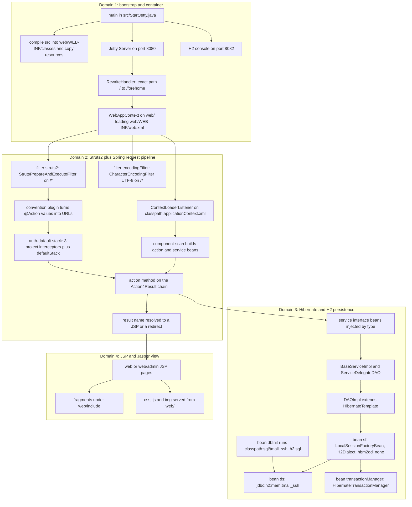

# System Overview: Modules, Runtime Domains, and Original-vs-New Source

Tmall_SSH is a clone of the Tmall storefront on the classic SSH stack — Struts2 2.5.14.1,
Spring 4.3.18, Hibernate 5.3.7 and JSP — with two faces: a customer storefront (`fore…`
endpoints) and an admin back office (`admin_…` endpoints). This checkout is the
*self-contained* variant: no Tomcat installation and no MySQL server are involved. One
`main()` in `src/StartJetty.java` compiles the sources, starts embedded Jetty on port 8080
with an H2 in-memory database, and serves the working site
(`MIGRATION.md#L3-L11`, `STARTUP.md#L3-L8`).

This page is orientation and a map: what the pieces are, which direction dependencies run,
where the entry points sit, and which page owns the detail of each subsystem. It deliberately
does not repeat the mechanism pages.

## 1. Entry points

| Entry point | Kind | What happens |
|---|---|---|
| `StartJetty.main()` | JVM | Compiles `src/**/*.java` into `web/WEB-INF/classes`, starts Jetty on 8080 and the H2 console on 8082 (`src/StartJetty.java#L53-L122`) |
| `http://localhost:8080/` (exact path `/`) | HTTP | Rewritten to `/forehome` by a `RewriteHandler` rule installed by the launcher (`src/StartJetty.java#L90-L104`) |
| `http://localhost:8080/forehome` | HTTP | The storefront home action; the first of 24 `fore*` URLs |
| `http://localhost:8080/admin_category_list` | HTTP | A back office list screen; the first of 23 `admin_*` URLs |
| `http://localhost:8082` | HTTP | H2 console, a separate port because the Struts2 filter mapped to `/*` would swallow an in-app console path (`MIGRATION.md#L32-L32`) |
| `web/index.jsp` | JSP | Contains `response.sendRedirect("/forehome")` (`web/index.jsp#L8-L18`); under the launcher a request for `/` is rewritten before that page can be reached |
| `classpath:sql/tmall_ssh_h2.sql` | Data | The only source of schema and seed rows; executed at every container startup (`src/applicationContext.xml#L29-L44`) |
| `web/WEB-INF/web.xml` | Config | Passed as the deployment descriptor to `WebAppContext`; both `/*` filters and the Spring `ContextLoaderListener` are declared there (`web/WEB-INF/web.xml#L6-L39`) |

## 2. Source module layout

Everything that is not the launcher lives under `src/com/caozhihu/tmall`, in eight packages,
plus a handful of resources at the root of `src/`.

| Location | Contents | Responsibility |
|---|---|---|
| `action` | 6 `Action4*` base classes + 8 concrete action classes | URL mapping, request binding, orchestration, result selection |
| `service` | 10 interfaces (`BaseService`, `CategoryService`, `ProductService`, …) | The business vocabulary the actions are allowed to call |
| `service/impl` | `BaseServiceImpl`, `ServiceDelegateDAO`, 9 concrete `*ServiceImpl` | Generic CRUD/paging implementation, delegation to the DAO, domain-specific queries |
| `dao/impl` | `DAOImpl` | The single persistence gateway; extends Spring `HibernateTemplate` |
| `pojo` | 9 annotation-mapped entities (`Category`, `Property`, `Product`, `PropertyValue`, `ProductImage`, `Review`, `User`, `Order`, `OrderItem`) | The persistence model and the objects the JSPs read |
| `interceptor` | `AuthInterceptor`, `CategoryNamesBelowSearchInterceptor`, `CartTotalItemNumberInterceptor` | Cross-cutting request preparation, registered in `struts.xml` |
| `util` | `Page`, `ImageUtil` | Shared pagination value object and image conversion helper |
| `test` | `TestTmall`, empty `tmp.java` | The only automated test in the repository |
| `src/` root | `StartJetty.java`, `applicationContext.xml`, `struts.xml`, `log4j2.xml`, `sql/tmall_ssh_h2.sql` | Runtime scaffolding, wiring and seed data |

On the web side there are likewise two surfaces: top-level `web/*.jsp` pages for the
storefront and `web/admin/*.jsp` for the back office, both composing fragments under
`web/include`, plus static `web/css`, `web/js` and `web/img` assets. Detail lives on
[View Layer](view-layer.md).

## 3. The one-way dependency chain

Dependencies run strictly downwards, and the source enforces it:

```text
Action (action/*.java)
  -> Service interface (service/*.java)          injected by type in Action4Service
    -> BaseServiceImpl / ServiceDelegateDAO      generic CRUD, criteria, delegation
      -> DAOImpl extends HibernateTemplate       the only bean touching a Session
        -> SessionFactory sf -> DataSource ds -> H2 in-memory database
```

- **Actions never see persistence.** `Action4Service` autowires the nine `*Service`
  interfaces and nothing else (`src/com/caozhihu/tmall/action/Action4Service.java#L15-L44`).
  No class under `action` imports `com.caozhihu.tmall.dao.*` or anything from
  `org.hibernate`; the only production imports of `DAOImpl` are in `ServiceDelegateDAO`
  (`src/com/caozhihu/tmall/service/impl/ServiceDelegateDAO.java#L3-L3`).
- **One DAO, no DAO interface.** `DAOImpl` is annotated `@Repository("dao")`, extends
  Spring's `HibernateTemplate`, and overrides `setSessionFactory` with
  `@Resource(name = "sf")` to bind the `sf` bean (`src/com/caozhihu/tmall/dao/impl/DAOImpl.java#L9-L18`).
  `README.md` records the design decision not to use a DAO interface (`README.md#L81-L85`).
- **The service layer owns the CRUD vocabulary once.** `BaseService` declares `list`,
  `listByPage`, `total`, `listByParent`, `list(Page, parent)`, `total(parent)`,
  `save`/`delete`/`get`/`update` and a varargs pair-keyed `list`; `BaseServiceImpl`
  implements them with `DetachedCriteria` and HQL (`src/com/caozhihu/tmall/service/BaseService.java#L7-L23`,
  `src/com/caozhihu/tmall/service/impl/BaseServiceImpl.java#L45-L146`). Concrete services
  add only domain queries, e.g. `ProductService` adds `fill(...)`, `search(...)`,
  `setSaleAndReviewNumber(...)` (`src/com/caozhihu/tmall/service/ProductService.java#L9-L16`).
- **A naming contract links `service.impl` to `pojo`.** `BaseServiceImpl` derives its entity
  class `clazz` in its own constructor: it throws and catches an exception, takes
  `stackTrace[1]` to learn the subclass name (`CategoryServiceImpl`), strips the
  `ServiceImpl` suffix and rewrites `.service.impl` to `.pojo` by reflection
  (`src/com/caozhihu/tmall/service/impl/BaseServiceImpl.java#L17-L43`). Renaming a
  `*ServiceImpl` class or moving a `*Service` interface out of `service.impl` breaks
  querying — this is the least obvious coupling in the codebase.
- **Delegation is what makes services call database methods directly.**
  `ServiceDelegateDAO` injects the single DAO by name (`@Resource(name = "dao")`) and
  forwards the whole `HibernateTemplate` API to it
  (`src/com/caozhihu/tmall/service/impl/ServiceDelegateDAO.java#L19-L34`), so a service can
  write `findByCriteria(dc)` instead of `dao.findByCriteria(dc)` (`README.md#L248-L266`).
- **`Page` is the shared paging value object**, defaulting to 5 rows per page and deriving
  `getTotalPage()` and the last offset from `start`/`count`/`total`
  (`src/com/caozhihu/tmall/util/Page.java#L3-L50`); it is bound from the request through
  `Action4Pagination` (`src/com/caozhihu/tmall/action/Action4Pagination.java#L5-L12`).

## 4. Two URL families, two JSP surfaces

`src/struts.xml` declares **no** `<action>` element at all: only constants, the `basicstruts`
package and the interceptors. Every URL therefore exists solely as an `@Action` annotation
value, and every result name solely in an `@Results` block. There are **47** such endpoints —
24 storefront (`fore…`) and 23 back office (`admin_…`):

| Class | Endpoints | Family |
|---|---|---|
| `ForeAction` | 24 | storefront |
| `CategoryAction` | 5 | admin |
| `ProductAction` | 5 | admin |
| `PropertyAction` | 5 | admin |
| `ProductImageAction` | 3 | admin |
| `OrderAction` | 2 | admin |
| `PropertyValueAction` | 2 | admin |
| `UserAction` | 1 | admin |

Two facts bind that table together. First, the `@Namespace("/")` / `@ParentPackage("basicstruts")`
declarations and the global `@Results` catalogue sit on the shared base class `Action4Result`,
not on each action, so the concrete classes only add `@Action` methods
(`src/com/caozhihu/tmall/action/Action4Result.java#L8-L68`). Second, the `Action4*` chain exists
purely to split the responsibilities a single action class would otherwise carry: upload fields
(`Action4Upload`), paging (`Action4Pagination`), entity and collection getters/setters
(`Action4Pojo`), service injection and `t2p()` (`Action4Service`), request parameters
(`Action4Parameter`) and result definitions (`Action4Result`) — see
[Action Layer](action-layer.md).

`t2p(Object)` is the mechanism that keeps request binding honest: an object bound from the
query string carries only an id, so `t2p` re-reads the entity through a service and reflects it
back through the matching setter, leaving the action's field pointing at the persistent object
before the view renders (`src/com/caozhihu/tmall/action/Action4Service.java#L57-L71`).

View-side, the two surfaces are separate directories with separate fragment sets:

- **Back office** — the ten `web/admin/*.jsp` list and edit screens each include
  `../include/admin/adminHeader.jsp` and `../include/admin/adminNavigator.jsp`, and the five
  paged list screens additionally include `../include/admin/adminPage.jsp`
  (`web/admin/listCategory.jsp#L11-L13`). Entities are rendered with JSTL
  (`<c:forEach items="${categories}" var="c">`) against the action's getters.
- **Storefront** — top-level `web/*.jsp` are thin wrappers that include fragments from
  `web/include` (`web/home.jsp#L11-L15` pulls `include/header.jsp`, `include/top.jsp`,
  `include/search.jsp`, `include/home/homePage.jsp`, `include/footer.jsp`;
  `web/cart.jsp#L12-L16` swaps in `include/cart/cartPage.jsp`). The fragments are
  grouped by screen area: `include/home`, `include/category`, `include/product`, `include/cart`,
  `include/admin`, plus shared `header`/`top`/`footer`/`search`/`modal` fragments.

Images are the one place the view, the file system and the actions meet: uploads are written
into the exploded webapp directory via `ServletActionContext.getServletContext().getRealPath("img/category")`
and then served as static files from `web/img`
(`src/com/caozhihu/tmall/action/CategoryAction.java#L28-L46`). The whole pipeline is owned by
[Image Pipeline](/openwiki/workflows/image-pipeline.md).

## 5. The four runtime domains

The four domains are separable: each has its own trigger, its own configuration and its own
failure modes. The diagram shows how a request traverses all four.



*The four runtime domains, their triggers, and how one HTTP request crosses all of them.*

**Domain 1 — bootstrap and container.** `StartJetty.main` fixes the ports as constants
(8080 / 8082, context path `/`), compiles every `.java` under `src/` into
`web/WEB-INF/classes` with UTF-8 and `-source/-target 8`, then copies every non-Java resource
there so that `classpath:applicationContext.xml`, `classpath:struts.xml` and
`classpath:sql/tmall_ssh_h2.sql` resolve; there is no manual build step and
`web/WEB-INF/classes` is disposable output (`src/StartJetty.java#L149-L206`). The launcher
also installs Jetty-specific compensations: an explicit `Configuration` chain that includes
`AnnotationConfiguration` (without it the JSP `JasperInitializer` never runs and JSP
compilation fails with `getTldCache() is null`), `addSystemClass` for log4j/H2/Jasper/EL
classes so the duplicated jars on the JVM classpath and in `WEB-INF/lib` do not produce two
copies of the same class, an exact-match `/` rewrite (an anonymous `Rule`, not
`RewritePatternRule`, whose prefix semantics would rewrite `/img/**` too), and
`openJdk9PlusModules()` for Spring 4.x reflection on JDK 9+
(`src/StartJetty.java#L71-L110`, `MIGRATION.md#L28-L34`). Full detail:
[Runtime Bootstrap](runtime-bootstrap.md).

**Domain 2 — Struts2 + Spring request pipeline.** `web.xml` maps two filters on `/*` — the
Struts2 dispatcher (with init-param `contextConfigLocation=classpath:struts.xml`) and
Spring's `CharacterEncodingFilter` — and registers `ContextLoaderListener` against
`classpath:applicationContext.xml` (`web/WEB-INF/web.xml#L6-L39`). `struts.xml` sets
`struts.objectFactory=spring`, so actions are Spring beans resolved from the root context,
and installs the `auth-dafault` stack as the package default: three project interceptors
before `defaultStack` (`src/struts.xml#L7-L26`). Because no `<action>` element exists, the
Struts convention plugin is what turns `@Action` values and the `Action4Result` `@Results`
catalogue into live URLs and views. Full detail: [Request Pipeline](request-pipeline.md).

**Domain 3 — Hibernate + H2 persistence.** Spring's `DataSource ds` points at
`jdbc:h2:mem:tmall_ssh;MODE=MySQL;DB_CLOSE_DELAY=-1`; `dbInit`
(`DataSourceInitializer` + `ResourceDatabasePopulator`) runs `classpath:sql/tmall_ssh_h2.sql`
at context startup; `sf` (`LocalSessionFactoryBean`) declares `depends-on="dbInit"`, scans
`com.caozhihu.*` for annotations and sets `hibernate.dialect=org.hibernate.dialect.H2Dialect`
with `hibernate.hbm2ddl.auto=none`; `transactionManager` is a `HibernateTransactionManager`
driven by `<tx:annotation-driven>`
(`src/applicationContext.xml#L14-L72`). The 9 entities are annotation-mapped
(`@Entity`, `@Table`, `@Id`, `@GeneratedValue`, `@Transient`, e.g.
`src/com/caozhihu/tmall/pojo/Category.java#L1-L21`), and because `hbm2ddl.auto=none` the
schema is created **only** by the SQL script, which defines 9 business tables
(`src/sql/tmall_ssh_h2.sql#L1-L15`). Full detail: [Persistence Layer](persistence-layer.md),
[Configuration Surface](/openwiki/architecture/configuration.md),
[Operations: Data and Schema](/openwiki/operations/data-and-schema.md).

**Domain 4 — JSP / Jasper view.** The JSP engine ships inside `web/WEB-INF/lib` as
`org.mortbay.jasper.apache-jsp-8.5.100.jar` plus the matching EL implementation, and the
launcher's configuration chain is what activates it. Views are reached by returning a result
name from an action method (`return "listCategory";`), which `@Results` on `Action4Result`
maps to a JSP path or a redirect. Fragments are statically included at translation time and
read the action's getters through JSTL/EL (the pages declare `isELIgnored="false"`; only the
two global result stubs `web/success.jsp` and `web/fail.jsp` are plain text).
Detail: [View Layer](view-layer.md).

## 6. What is original business source, and what is runtime scaffolding

`MIGRATION.md` records the hard constraint of this variant: the original business Java
(53 files by its own count — see the discrepancy below), the JSPs, `web.xml` and the directory
structure were to be left unchanged — not a single line — and no framework version was to be
upgraded (`MIGRATION.md#L9-L11`). The repository's file set matches that division:

| Artifact | Status | Notes |
|---|---|---|
| `src/StartJetty.java` | **New, runtime-only** | The only new business-independent class, containing `main` (`MIGRATION.md#L17-L17`) |
| `src/applicationContext.xml` | **Modified, business config** | Three `【H2改造-N】` blocks; the original MySQL datasource and `MySQL5Dialect` session factory are retained as a comment block (`src/applicationContext.xml#L19-L101`) |
| `src/sql/tmall_ssh_h2.sql` | **New, adapted copy** | Minimal syntax adaptation of `sql/tmall_ssh.sql`: `DROP/CREATE DATABASE` and `USE` removed, `ENGINE=InnoDB … DEFAULT CHARSET` suffixes stripped, `int(11)` → `int`, and `ALTER TABLE … ALTER COLUMN id RESTART WITH n` appended to calibrate auto-increment (`MIGRATION.md#L44-L49`, `src/sql/tmall_ssh_h2.sql#L1-L15`) |
| `web/WEB-INF/lib/*.jar` | **New, runtime-only** | The directory was empty in the original repository; 65 jars were added, pinned to the framework versions the source requires (`MIGRATION.md#L20-L20`; the same document's dependency section says 64 in its heading, `MIGRATION.md#L58-L62`) |
| `tmall_ssh.iml`, `.vscode/settings.json`, `.gitignore` | **Modified/new, IDE + VCS only** | Classpath metadata; not business code (`MIGRATION.md#L21-L23`) |
| `web/WEB-INF/web.xml`, `src/struts.xml`, all `web/**/*.jsp`, all `src/com/**` | **Unchanged** | Covered by the zero-change constraint; the `src/com/**` set is 52 `.java` files in this checkout |

**Where repository prose and the checkout disagree.** Three details in `MIGRATION.md` /
`STARTUP.md` do not survive a check against the files, and the files are what the runtime follows:

- **The business-Java count is one high.** The constraint above says 53 original business Java
  files; this checkout holds **52** `.java` files under `src/com/**`. The 53rd `.java` file in the
  repository is `src/StartJetty.java`, which the same document classifies as the one new,
  business-independent class — so the prose either counted the launcher or drifted by one. The
  frozen-set statement itself is unaffected: the 52 files under `src/com/**` are what this page
  treats as original business source.
- **The jar count is inconsistent inside one document.** Its change list says 65 jars, its
  dependency-section heading says 64, and `web/WEB-INF/lib` holds 65 (the table row above cites
  both statements).
- **`STARTUP.md` still advertises a warning the code was changed to eliminate.** Its
  troubleshooting table lists the `PROPERTYVALUE FOREIGN KEY(PID)` referential-integrity message as
  a harmless startup log line, while `MIGRATION.md` records it as removed by changing
  `hibernate.hbm2ddl.auto` from `update` to `none` (`MIGRATION.md#L64-L71`) — the value
  `src/applicationContext.xml` carries today, with that reason written into the bean comment. A
  reader trusting only `STARTUP.md` would expect a log line that should no longer appear.

So when reading any code in `src/com/caozhihu/tmall`, the embedded Jetty / H2 conversion is
*invisible*: it changes how the application is started and where its data lives, not what the
application does. The recorded acceptance evidence follows the same split — one-command start
without Tomcat or MySQL, `200` for `/forehome` and `/admin_category_list`, static resources
`200`, H2 console queries against 9 tables, and auto-increment parity with MySQL — all on
JDK 17 (`MIGRATION.md#L73-L83`, `STARTUP.md#L5-L8`). See
[Operations: Start and Troubleshoot](/openwiki/operations/startup-and-diagnostics.md) and
[Testing and Verification](/openwiki/testing/verification.md).

## 7. Review items

- **The 23 `admin_*` endpoints have no interceptor-level auth gate.** `AuthInterceptor`
  only inspects URIs starting with `/fore`, redirecting to `login.jsp` when the session has
  no `user`; `admin_*` URLs never enter that branch
  (`src/com/caozhihu/tmall/interceptor/AuthInterceptor.java#L24-L48`). Whether back office
  access is intended to be unauthenticated is a product decision, not something the source
  states. 【人工评审待确认】
- **The storefront auth gate is a path-prefix check on the raw request URI.** The two other
  interceptors strip `servletContext.getContextPath()` before matching
  (`src/com/caozhihu/tmall/interceptor/CartTotalItemNumberInterceptor.java#L29-L32`), while
  `AuthInterceptor` compares `request.getRequestURI()` directly against `/fore…`. With the
  hard-coded context path `/` both behave the same; whether the launcher's context path is a
  fixed assumption of the application is worth a reviewer's confirmation. 【人工评审待确认】

## 8. Where each subsystem is documented

| Topic | Page |
|---|---|
| How the launcher boots Jetty, compiles `src` and starts the H2 console | [Runtime Bootstrap](runtime-bootstrap.md) |
| Filters, convention mapping, the `auth-dafault` interceptor stack, result dispatch | [Request Pipeline](request-pipeline.md) |
| The `Action4*` chain, `t2p()`, the `@Results` catalogue, upload helpers | [Action Layer](action-layer.md) |
| `BaseService` / `BaseServiceImpl`, reflection-based `clazz`, delegation | [Service Layer](service-layer.md) |
| `DAOImpl`, `HibernateTemplate`, `sf`, `ds`, transactions, seed script | [Persistence Layer](persistence-layer.md) |
| The 9 entities and their relationships | [Domain Model](/openwiki/concepts/domain-model.md) |
| JSP surfaces, fragments and what the pages read from actions | [View Layer](view-layer.md) |
| Which bean, filter, constant and port lives where | [Configuration Surface](/openwiki/architecture/configuration.md) |
| Every URL, result name and view path | [Action URL Catalog](/openwiki/reference/action-catalog.md) |
| Storefront flows, admin CRUD, orders, paging, images | [Storefront Shopping](/openwiki/workflows/storefront-shopping.md), [Admin CRUD Screens](/openwiki/workflows/admin-crud.md), [Order Lifecycle](/openwiki/workflows/order-lifecycle.md), [Pagination and Search](/openwiki/workflows/pagination-and-search.md), [Image Pipeline](/openwiki/workflows/image-pipeline.md) |
| Starting and troubleshooting the launcher | [Operations: Start and Troubleshoot](/openwiki/operations/startup-and-diagnostics.md) |
| The H2 script, the nine seeded tables and their rows, id calibration, console queries | [Operations: Data and Schema](/openwiki/operations/data-and-schema.md) |
| The jars the runtime needs and which framework version each one is | [Runtime Dependencies](/openwiki/integrations/runtime-dependencies.md) |
| Do-not-break names and the SDD conventions | [Runtime Invariants](/openwiki/conventions/runtime-invariants.md), [SDD Baseline](/openwiki/concepts/sdd-baseline.md) |
| What is provable here (one Spring-context JUnit test, manual smoke path) | [Testing and Verification](/openwiki/testing/verification.md) |
| Running it the first time | [Quickstart](/openwiki/quickstart.md) |
