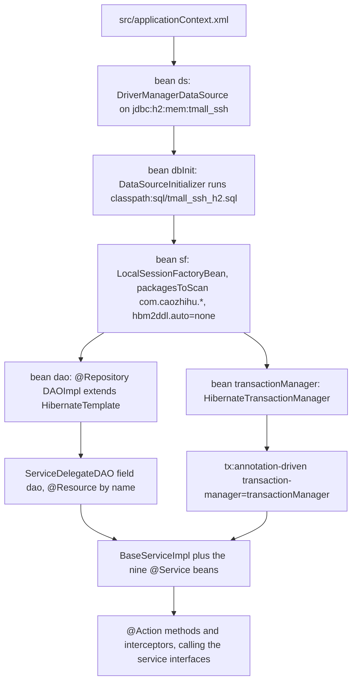
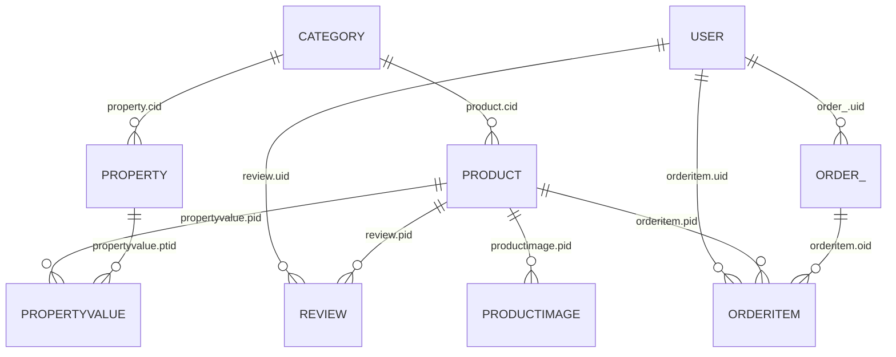

# Persistence Layer: HibernateTemplate, Delegation, and Transactions

Every database statement in this application leaves through one Spring bean: `dao`, an instance of
`DAOImpl`, which extends Spring's `HibernateTemplate`. No service, action, interceptor or test opens a
Hibernate `Session`, and none of them writes a `SessionFactory` lookup either — the mapping from Java
object to SQL is entirely the template's business. This page owns that path: the gateway bean and its
two string-name injections, the small slice of the `HibernateTemplate` API the service layer actually
calls, the JPA mapping facts that decide which rows those calls can reach, and the transaction
boundaries (`@Transactional` on the service classes) together with what sits outside them.

Configuration *values* — the datasource, the seed script, the H2 blocks and the MySQL fallback — are
recorded in [Configuration Surface](/openwiki/architecture/configuration.md); the tables and demo rows
themselves belong to [Operations: Data and Schema](/openwiki/operations/data-and-schema.md) and
[Domain Model](/openwiki/concepts/domain-model.md); the entity-agnostic CRUD surface the services
expose is [Service Layer](/openwiki/architecture/service-layer.md)'s subject.

## 1. One gateway bean, named by string

`DAOImpl` is fifteen lines long; all of them matter
(`src/com/caozhihu/tmall/dao/impl/DAOImpl.java#L9-L18`):

```java
//定义了一个name = "dao" 的bean
@Repository("dao")
public class DAOImpl extends HibernateTemplate {

    //为该方法注入了一个name = "sf" 的bean
    @Resource(name = "sf")
    @Override
    public void setSessionFactory(SessionFactory sessionFactory) {
        super.setSessionFactory(sessionFactory);
    }
}
```

- `@Repository("dao")` gives the bean a fixed name. Nothing injects it by type: `ServiceDelegateDAO`
  declares `@Resource(name = "dao") private DAOImpl dao;`
  (`src/com/caozhihu/tmall/service/impl/ServiceDelegateDAO.java#L19-L25`). The literal string `"dao"`
  is therefore the contract between the two classes.
- The `HibernateTemplate` superclass is what supplies `save`, `update`, `delete`, `get`,
  `find`, `findByCriteria` and the exception translation; `DAOImpl` adds nothing but the wiring.
- `@Resource(name = "sf")` on the overridden setter injects the `sf` bean by name. Because
  `HibernateTemplate` (through `HibernateAccessor`) implements `InitializingBean`, Spring invokes
  `afterPropertiesSet()` on this bean, and that check rejects a null `SessionFactory`: a missing or
  renamed `sf` bean fails the container load instead of surfacing on the first query.
- The template is used directly, not through a subclass of its own: `HibernateTemplate` is
  instantiated as a bean, which Spring permits because `DAOImpl` is annotated and the type is concrete.

`ServiceDelegateDAO` then injects the `SessionFactory` a *second* time — its own
`@Resource(name = "sf") public void setSessionFactory(SessionFactory sessionFactory)` calls
`dao.setSessionFactory(sessionFactory)` (`ServiceDelegateDAO.java#L27-L30`). Both injections resolve
to the same bean, so the duplicate is harmless, but the in-file comment explains it as a workaround
("此处用 @AutoWired 会注入失败，dao = null") whose stated reason is that the object calling these
methods is `new`ed rather than injected. The object in question is the `DAOImpl` bean reached from the
service beans Spring does manage; the session factory arrives on `DAOImpl` from the container's own
`@Resource` processing regardless. 【人工评审待确认】 whether the second injection is load-bearing or
only a leftover of the debugging that produced the comment.

Nothing else in the application touches Hibernate's session API. `SessionFactory` appears in exactly
two places — the two setters above and `ServiceDelegateDAO.getSessionFactory()`, which only forwards
`dao.getSessionFactory()` — and `openSession()` / `getCurrentSession()` appear nowhere in `src/`
(`src/com/caozhihu/tmall/service/impl/ServiceDelegateDAO.java#L27-L34`). Writers do not flush either:
`flush()` and `clear()` are mirrored on `ServiceDelegateDAO#L259-L265` and have no caller.

## 2. SessionFactory, transaction manager, and how a write is advised



*Which bean supplies the SessionFactory and the transaction advice to the service beans, and where the single DAO sits in that chain.*

- `sf` is a `LocalSessionFactoryBean` over `ds` with `packagesToScan` = `com.caozhihu.*`,
  `hibernate.dialect=org.hibernate.dialect.H2Dialect`, `hibernate.show_sql=false` and
  `hibernate.hbm2ddl.auto=none`, declared `depends-on="dbInit"` so the seed script runs first
  (`src/applicationContext.xml#L47-L66`).
- `transactionManager` is a `HibernateTransactionManager` whose `sessionFactory` is `sf`, and
  `<tx:annotation-driven transaction-manager="transactionManager"/>` binds `@Transactional` on
  container-managed beans to it (`src/applicationContext.xml#L14-L17`, `#L69-L72`).
- The `sf` bean is what makes `HibernateTemplate` participate in a Spring transaction when one is
  active and open a short-lived session of its own when one is not. That single behaviour is why the
  codebase never manages sessions, and why its transaction gaps (§6) never show up as
  `SessionException` during normal operation.

## 3. What the service layer actually calls

`ServiceDelegateDAO` mirrors the whole `HibernateTemplate` API — roughly a hundred forwarding methods —
and every `@Service` bean inherits them through `BaseServiceImpl extends ServiceDelegateDAO`
(`BaseServiceImpl.java#L16-L20`). That makes any operation reachable on any service; only this subset
has call sites:

| `HibernateTemplate` call | Reached through | Real callers |
|---|---|---|
| `findByCriteria(DetachedCriteria)` | `ServiceDelegateDAO#L299-L301` | `BaseServiceImpl.list()`, `listByParent()`, `list(Object...)`, `PropertyServiceImpl.listByCategory()`, `list(Page, Category)`, `OrderServiceImpl.listByUserWithoutDelete()`, `ProductImageServiceImpl.setFirstProductImage()` |
| `findByCriteria(dc, firstResult, maxResults)` | `ServiceDelegateDAO#L303-L305` | `BaseServiceImpl.listByPage()`, `list(Page, parent)`, `ProductServiceImpl.search()` |
| `find(hql)` / `find(hql, values)` | `ServiceDelegateDAO#L267-L269` | `BaseServiceImpl.total()`, `total(Object)`, `PropertyServiceImpl.total(Category)` |
| `save(Object)` | `ServiceDelegateDAO#L176-L179` | `BaseServiceImpl.save()` (the only insert path, including `Order` and `Review`) |
| `get(Class, Serializable)` | `ServiceDelegateDAO#L104-L106` | `BaseServiceImpl.get(Class,int)` / `get(int)` / `Action4Service.t2p()` |
| `update(Object)` | `ServiceDelegateDAO#L186-L189` | status transitions and every admin edit |
| `delete(Object)` | `ServiceDelegateDAO#L238-L241` | admin deletes, `foredeleteOrderItem` |

Nothing else in the mirrored surface is used: `load`, `loadAll`, `refresh`, `contains`, `evict`,
`initialize`, `enableFilter`, `lock`, `replicate`, `persist`, `merge`, `deleteAll`, `flush`, `clear`,
`findByNamedParam`, `findByValueBean`, `findByNamedQuery*`, `findByExample*`, `iterate`,
`closeIterator`, `bulkUpdate`, `execute` / `executeWithNativeSession`, and the cache, fetch-size,
filter, `checkWriteOperations` and `exposeNativeSession` setters all have zero callers under `src/`
(`ServiceDelegateDAO.java#L96-L333`). They are not a safety net: changing one cannot change behaviour,
because no code path reaches it.

Two properties of that table shape how the layer behaves:

- **Every method is entity-agnostic.** The template is given an entity class, an entity instance or a
  criteria; it has no idea which service called it. This is why `ProductImageAction.delete` can delete
  a `ProductImage` through `propertyService` and still work
  (`src/com/caozhihu/tmall/action/ProductImageAction.java#L54-L62`) — recorded as a defect in
  [Admin CRUD](/openwiki/workflows/admin-crud.md), not a crash here.
- **The entity behind the generic calls is resolved by reflection, not by the type system.**
  `BaseServiceImpl`'s constructor throws and catches an exception to read its own subclass name off
  the stack, strips the `ServiceImpl` suffix, rewrites `.service.impl` to `.pojo` in the package name
  and `Class.forName`s the result into the `protected Class clazz` field
  (`BaseServiceImpl.java#L20-L43`). `clazz` is what every `DetachedCriteria.forClass(clazz)` and the
  `select count(*) from <FQN>` HQL strings use, so the naming convention
  `<X>ServiceImpl in ...service.impl` ↔ `<X> in ...pojo` is load-bearing; a class that breaks it
  leaves `clazz` null and takes the failure into the query call, while the constructor itself only
  prints a stack trace.

## 4. Query shapes and the mapping they depend on

The read side is `DetachedCriteria` built against Java property names, plus a couple of raw HQL
strings. The details below are the ones a change to a service or an entity actually trips over.

- **Criteria reference association properties, not columns.** `Restrictions.eq("category", category)`
  becomes a `cid` comparison; `Restrictions.eq("order", oi.getOrder())` reaches `oid`;
  `Restrictions.eq("user", user)` reaches `uid`; `Restrictions.like("name", "%"+keyword+"%")` is the
  product search (`BaseServiceImpl.java#L76-L91`, `PropertyServiceImpl.java#L16-L30`,
  `ProductServiceImpl.java#L81-L86`).
- **A null value in the pair-parameter list means `IS NULL`.** `list(Object... pairParams)` folds key /
  value pairs into a map and emits `Restrictions.isNull(key)` when the value is null, `Restrictions.eq`
  otherwise (`BaseServiceImpl.java#L128-L146`). That is what expresses "still in the cart":
  `orderItemService.list("user", user, "order", null)`
  (`src/com/caozhihu/tmall/action/ForeAction.java#L152-L160`,
  `src/com/caozhihu/tmall/interceptor/CartTotalItemNumberInterceptor.java#L32-L44`).
- **`listByParent` derives its property name from the parent's class name.** The parent's simple name
  is uncapitalized (`Order` → `order`, `Product` → `product`) and used as the criteria property
  (`BaseServiceImpl.java#L70-L91`). Renaming a parent class without renaming the corresponding
  association property silently changes — or breaks — the query.
- **Counting is done with HQL strings, not criteria.** `total()` concatenates the entity's fully
  qualified class name into `select count(*) from <FQN>`; `total(Object parent)` and
  `PropertyServiceImpl.total(Category)` build `select count(*) from <FQN> bean where bean.<prop> = ?0`
  and bind the parent entity as the last positional parameter, then cast the single result to `Long`
  (`BaseServiceImpl.java#L59-L68`, `#L93-L106`, `PropertyServiceImpl.java#L32-L44`). The count and the
  paged rows are two separate statements with no shared snapshot.
- **Paging is an offset and a limit, not a page number.** `findByCriteria(dc, page.getStart(),
  page.getCount())` passes `start` as `firstResult`
  (`BaseServiceImpl.java#L52-L57`, `#L83-L91`); `Page.count` defaults to 5 and `page.start` is
  an absolute row offset, incremented by `page.count` in the JSP links
  (`src/com/caozhihu/tmall/util/Page.java#L10-L20`, `web/include/admin/adminPage.jsp#L23-L51`) even
  though the field's own comment calls it a page number. `ProductServiceImpl.search(keyword, 0, 20)`
  uses the same call with a fixed window.
- **`save` returns the generated key.** `BaseServiceImpl.save` wraps `HibernateTemplate.save` and casts
  its `Serializable` return to `Integer` (`BaseServiceImpl.java#L108-L116`). That cast is valid only
  while the mapped identifier is a primitive `int` (see §5): changing an entity's `@Id` to `long`
  would turn every insert on that service into a `ClassCastException`.

## 5. The mapping side: what the entities tell Hibernate

There are nine `@Entity` classes in `com.caozhihu.tmall.pojo`, discovered through `packagesToScan` =
`com.caozhihu.*` (`src/applicationContext.xml#L47-L55`). Their annotation choices, not any XML or
`.hbm.xml` file, define the object/relational mapping.

### Tables and identity

| Entity | `@Table` | `@Id` |
|---|---|---|
| `Category` | `category` | `int id`, `IDENTITY` |
| `Product` | `product` | `int id`, `IDENTITY` |
| `ProductImage` | `productImage` | `int id`, `IDENTITY` |
| `Property` | `property` | `int id`, `IDENTITY` |
| `PropertyValue` | `propertyvalue` | `int id`, `IDENTITY` |
| `Review` | `review` | `int id`, `IDENTITY` |
| `User` | `user` | `int id`, `IDENTITY` |
| `OrderItem` | `orderItem` | `int id`, `IDENTITY` |
| `Order` | `order_` | `int id`, `IDENTITY` |

- `Order` maps to `order_`, not `order`, because `order` is a reserved word in the DDL and in HQL
  (`src/com/caozhihu/tmall/pojo/Order.java#L9-L15`); the seed script creates the same name
  (`src/sql/tmall_ssh_h2.sql#L39-L56`).
- `GenerationType.IDENTITY` maps onto the script's `id int NOT NULL AUTO_INCREMENT`. The important
  consequence is scheduling: with an identity column Hibernate must execute the `INSERT` while
  `save()` runs to obtain the key, instead of deferring it to flush time. That is why callers can read
  the new id immediately after saving — `CategoryAction.add` builds the image file name from
  `category.getId()` right after `categoryService.save(category)`, and `ForeAction.buyone` takes
  `oiid` from the newly saved `OrderItem`
  (`src/com/caozhihu/tmall/action/CategoryAction.java#L28-L35`,
  `src/com/caozhihu/tmall/action/ForeAction.java#L162-L169`).
- **An unannotated field's column name is the Java field name, and the only source of a column is
  `src/sql/tmall_ssh_h2.sql`.** `remark` is the live example: `Product` declares
  `private String remark;` with no `@Column` and no annotation at all
  (`src/com/caozhihu/tmall/pojo/Product.java#L19-L21`), and the column exists only because the script
  appends `ALTER TABLE product ADD COLUMN remark varchar(255) DEFAULT NULL;` after the product
  `INSERT` block (`src/sql/tmall_ssh_h2.sql#L155-L155`) — the `CREATE TABLE product` above it never
  mentions the column (`src/sql/tmall_ssh_h2.sql#L58-L69`), so every seeded row carries a null
  `remark`. Nothing validates that pairing at startup: `sf` sets no naming strategy and
  `hbm2ddl.auto=none` performs no check (`src/applicationContext.xml#L47-L66`), so a field whose
  column is missing from the script fails on the first query that touches it, not at boot.
- The same fallback explains why the script's camelCase columns (`orderCode`, `userMessage`,
  `subTitle`, `promotePrice`, `createDate`) line up with the entity fields. Where the mapping *is*
  annotated, the names differ in case from the script's (`productImage` vs `CREATE TABLE productimage`,
  `orderItem` vs `CREATE TABLE orderitem`), and the script and Hibernate both emit unquoted
  identifiers, so the two spellings resolve to the same table. A property renamed without a matching
  DDL rename is therefore a runtime SQL error rather than a compile-time one.
- **Persistence is entity-wide, not field-by-field.** `ServiceDelegateDAO.save` / `update`
  (`ServiceDelegateDAO.java#L176-L189`) and `BaseServiceImpl.save` (`BaseServiceImpl.java#L108-L116`)
  accept a whole entity instance and hand it to the template; no layer holds a list of permitted
  properties, so a new field is persisted by the code that already exists. That is why `remark` is
  writable with a zero-change DAO and service layer: the admin forms post `product.remark`
  (`web/admin/editProduct.jsp#L61-L61`, `web/admin/listProduct.jsp#L117-L117`), OGNL binds it onto the
  entity, and the existing generic `productService.save` / `update` calls carry it to the new column
  (`src/com/caozhihu/tmall/action/ProductAction.java#L27-L32`, `#L47-L53`,
  `.openspec/specs/scene2-product-remark-selfcheck.md#L7-L17`).

### Associations



*Every mapped relationship is a unidirectional `@ManyToOne`; there is no mapped collection and no bidirectional side.*

| Owning entity | Annotation | Column | Target |
|---|---|---|---|
| `Product.category` | `@ManyToOne @JoinColumn` | `cid` | `Category` |
| `Property.category` | `@ManyToOne @JoinColumn` | `cid` | `Category` |
| `ProductImage.product` | `@ManyToOne @JoinColumn` | `pid` | `Product` |
| `PropertyValue.product` / `.property` | `@ManyToOne @JoinColumn` | `pid` / `ptid` | `Product` / `Property` |
| `OrderItem.product` / `.order` / `.user` | `@ManyToOne @JoinColumn` | `pid` / `oid` / `uid` | `Product` / `Order` / `User` |
| `Order.user` | `@ManyToOne @JoinColumn` | `uid` | `User` |
| `Review.user` / `.product` | `@ManyToOne @JoinColumn` | `uid` / `pid` | `User` / `Product` |

The `@ManyToOne` default fetch is `EAGER`, and no `@OneToMany` is mapped anywhere, so loading a
`Product` also loads its `Category`, and loading an `OrderItem` loads its `Product`, `Order` and `User`.
That is what lets the JSPs navigate `orderItem.product.promotePrice` and `product.category.name` after
the DAO call has returned. It is also why `orderItem.oid` being null is a *meaning* and not an error:
a null `oid` is a cart line rather than an order line, and the column carries no foreign key in the
script (`src/sql/tmall_ssh_h2.sql#L14699-L14708`).

### Fields that are never queryable

The render-time data is held in `@Transient` fields, which Hibernate ignores completely:

- `Category.products`, `Category.productsByRow` (`Category.java#L16-L20`)
- `Order.orderItems`, `Order.total`, `Order.totalNumber` (`Order.java#L33-L38`)
- `Product.firstProductImage`, `Product.productSingleImages`, `Product.productDetailImages`,
  `Product.reviewCount`, `Product.saleCount` (`Product.java#L27-L36`)

These are filled in memory by the services — `OrderItemServiceImpl.fill(Order)` reloads the items and
computes `total` / `totalNumber` (`OrderItemServiceImpl.java#L25-L41`),
`ProductImageServiceImpl.setFirstProductImage` (`ProductImageServiceImpl.java#L16-L26`),
`ProductServiceImpl.setSaleAndReviewNumber` (`ProductServiceImpl.java#L58-L79`). A criteria or HQL
string that mentions any of them fails; the property names that *are* queryable are exactly the
mapped ones listed above.

## 6. Transaction boundaries, and what falls outside them

Spring's transaction advice is applied at the service layer only, because those are the beans the
component scan creates (`src/applicationContext.xml#L14-L17`). Within that layer the boundaries are:

| Operation | Annotation | Entities in one unit |
|---|---|---|
| `ServiceDelegateDAO.save` / `update` / `delete` / `saveOrUpdate` (`#L176-L241`) | `@Transactional(readOnly = false)` | one entity per call |
| `BaseServiceImpl.save` (`#L112-L116`) | `@Transactional` | one entity per call |
| `OrderServiceImpl.createOrder` (`#L23-L34`) | `@Transactional(propagation = REQUIRED, rollbackForClassName = "Exception")` | the `Order` plus N `OrderItem` updates |
| `ReviewServiceImpl.saveReviewAndUpdateOrderStatus` (`#L18-L23`) | `@Transactional(propagation = REQUIRED, rollbackForClassName = "Exception")` | the `Order` update plus the `Review` insert |

- **Single-entity writes need no action-level boundary.** `@Transactional(readOnly=false)` on
  `ServiceDelegateDAO.update` / `delete` / `save` is inherited by every service subclass and is
  detected through the interface the actions inject, so `orderService.update(order)`,
  `propertyService.update(property)`, `orderItemService.delete(orderItem)` and
  `productService.save(product)` each run in their own transaction when the action calls them outside
  one. This is the boundary used by every status transition and every admin CRUD endpoint; the same
  fact is tabulated per endpoint in [Order Lifecycle](/openwiki/workflows/order-lifecycle.md) and
  [Admin CRUD](/openwiki/workflows/admin-crud.md).
- **Only two flows need more than one entity**, and both are annotated as above. Inside `createOrder`
  the `save(order)` is a self-call on the inherited method (no new boundary), while each
  `orderItemService.update(oi)` leaves through a sibling bean proxy and joins the same transaction;
  `rollbackForClassName = "Exception"` widens rollback past unchecked exceptions, so a partial order
  cannot be left behind (`OrderServiceImpl.java#L23-L34`).
- **The one action-level annotation is inert.** `PropertyAction.add` carries
  `@Transactional(readOnly = false)` (`src/com/caozhihu/tmall/action/PropertyAction.java#L25-L30`),
  but action instances are not Spring beans — `Action4Service` is the only `@Component` in the action
  package and it declares no `@Action` method (`Action4Service.java#L15-L16`), so Struts creates the
  action and there is no proxy for the annotation to attach to. The write is still transactional,
  because `propertyService.save` carries it. 【人工评审待确认】 whether the annotation was meant to do
  anything for that call.

The gaps are the interesting part, and all of them follow from the same design choice — no
request-scoped session and no request-scoped transaction:

- **No `OpenSessionInView` filter or interceptor exists.** `web/WEB-INF/web.xml` declares exactly two
  filters, `struts2` and `encodingFilter` (`web/WEB-INF/web.xml#L6-L30`), and
  `src/applicationContext.xml` declares none, so the session that loaded an entity is closed before
  the action returns its result and the JSPs render detached objects. Today that is invisible because
  every mapped association is an eager `@ManyToOne` and every collection a view needs is a plain
  `@Transient` list the service filled in memory. A future `@OneToMany` (or a `fetch = LAZY`
  override) would introduce `LazyInitializationException` at render time, far from the code that
  caused it.
- **Read-then-write sequences span two transactions.** In `PropertyValueAction.update` the request
  value is stashed in a local, `t2p(propertyValue)` re-reads the row in one template call, then
  `propertyValueService.update` opens its own transaction and writes
  (`src/com/caozhihu/tmall/action/PropertyValueAction.java#L15-L22`). Nothing holds a lock or a
  snapshot across those two steps. The same shape appears wherever an action does `t2p(...)`, mutates
  and then calls `update`. 【人工评审待确认】 whether concurrent edits by two administrators are
  considered possible in this deployment.
- **Database work and file work are not one unit.** `CategoryAction.add` saves the row (committing
  before it returns because `save` is transactional) and only then writes and re-encodes the uploaded
  image, while `ProductImageAction.add` does the same and then derives resized copies from it
  (`CategoryAction.java#L28-L46`, `ProductImageAction.java#L20-L52`). A failure in the image step —
  `saveWithJpg` swallows `IOException` with a stack trace
  (`src/com/caozhihu/tmall/action/Action4Service.java#L75-L83`) — leaves a committed row without the
  bytes its JSP `src` points at.
- **Read helpers run outside any boundary.** The two `intercept()` methods query through the service
  proxies on every `/fore*` request (`CategoryNamesBelowSearchInterceptor.java#L31-L34`,
  `CartTotalItemNumberInterceptor.java#L32-L44`), and paging screens issue a count and a page query as
  two statements. `@Transactional` is absent from all of them, which is correct for reads here only
  because the results are consumed immediately.

## 7. Operational consequences

- **Hibernate never touches the schema.** `hibernate.hbm2ddl.auto=none`
  (`src/applicationContext.xml#L60-L63`) means no DDL, no validation and no mapping check at startup;
  the schema arrives exclusively from `dbInit`'s `classpath:sql/tmall_ssh_h2.sql`. Two divergences
  between the mapping and the script are therefore permanent and invisible: `propertyvalue.pid` is a
  mapped `@ManyToOne` column with **no** foreign key in the script (only `ptid` has one,
  `src/sql/tmall_ssh_h2.sql#L1358-L1366`) — the constraint that `hbm2ddl.auto=update` used to add and
  that the demo rows violated, which is why the setting is `none` — and `orderitem.oid` likewise has
  no foreign key (`src/sql/tmall_ssh_h2.sql#L14699-L14708`). Adding a mapped field adds no DDL either:
  `remark` exists only because the script was edited by hand (§5), and a field left without a column
  would surface as a SQL error on first use, never at startup.
- **Four string names are load-bearing across files**: bean `dao` (injected by `@Resource(name="dao")`),
  bean `sf` (injected twice), `transaction-manager="transactionManager"`, and `depends-on="dbInit"`
  (ordering the seed script before Hibernate). Renaming any of them breaks the container or the
  ordering, and no compiler checks them. [Configuration Surface](/openwiki/architecture/configuration.md)
  tracks the same table of names.
- **Detached is the normal state of a returned entity.** Because there is no session scope, every
  entity the services hand out is detached; `update`/`delete` on it re-attach by identifier, which is
  why `t2p()` exists and why `delete` on an id-only object works, and why
  `ProductImageAction.delete` needs `t2p` before deleting (the comment in that file names the
  `TransientObjectException` otherwise thrown) (`ProductImageAction.java#L54-L62`).

## 8. What verifies this layer

`src/com/caozhihu/tmall/test/TestTmall.java` is the only code that drives `DAOImpl` directly: it
`@Autowired`s the DAO, loads the context from `classpath:applicationContext.xml`, and its two
`@Test` methods build a `DetachedCriteria` over `Category`, then either `delete` every row or `save`
ten new ones, both under `@Transactional` so the work rolls back
(`src/com/caozhihu/tmall/test/TestTmall.java#L15-L47`). Loading that context proves the `dao` / `sf` /
`dbInit` / `transactionManager` wiring, the H2 datasource, the seed script and the mapping of
`Category` — and nothing about the other eight entities, the criteria the services build, or any
transaction boundary. There is no build or CI task that runs it; the invocation and its limits are in
[Verification](/openwiki/testing/verification.md).

## See also

- [Configuration Surface](/openwiki/architecture/configuration.md) — every value in
  `applicationContext.xml`, the 【H2改造】 blocks and the commented MySQL fallback.
- [Service Layer](/openwiki/architecture/service-layer.md) — the CRUD surface and `ServiceDelegateDAO`
  delegation.
- [Domain Model](/openwiki/concepts/domain-model.md) — the entities and their fields.
- [Operations: Data and Schema](/openwiki/operations/data-and-schema.md) — the seed script and the H2
  console.
- [Order Lifecycle](/openwiki/workflows/order-lifecycle.md) — the composite writes and status
  semantics in context.
- [Verification](/openwiki/testing/verification.md) — `TestTmall` and the manual smoke path.
