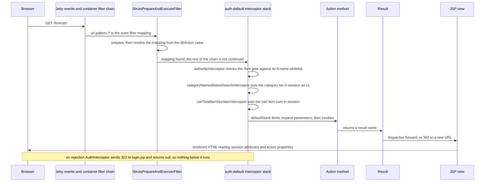
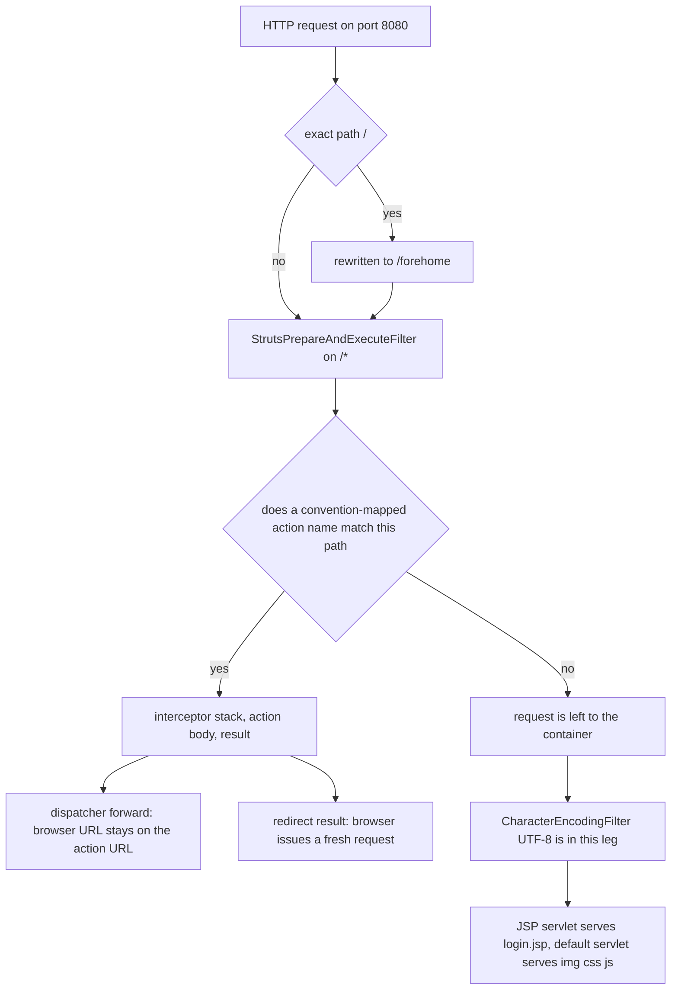

# Request Pipeline: URL to Action to Result to View

There is no controller layer in this application. A request is turned into an action invocation by
two things only: the filter chain declared in `web/WEB-INF/web.xml`, and the Struts2 *convention*
annotations that the plugin turns into URLs and views at startup (`src/struts.xml` declares no
`<action>` at all). Between the two sits the interceptor stack `auth-dafault`, which gates `/fore*`
URIs, and puts two session attributes in place for every storefront request.

This page owns that path: the container chain, the interceptor behaviour and its ordering, how
parameters bind to the `Action4*` setter surface, how a result name becomes a forward or a redirect,
and which requests never touch an action. The per-URL inventory lives in
[Action Catalog](/openwiki/reference/action-catalog.md); the `Action4*` class chain and the
`t2p()` helper live in [Action Layer](/openwiki/architecture/action-layer.md); which file is loaded
from where is [Configuration Surface](/openwiki/architecture/configuration.md); the JSPs themselves
are [View Layer](/openwiki/architecture/view-layer.md).

## 1. One request, end to end

*One storefront request through the two filters, the four-step interceptor stack, the action, the result and the JSP.*

The same decision expressed as paths shows where requests leave the action pipeline:

*A request either becomes an action invocation, or it never enters the stack at all.*

【人工评审待确认】 which exact component decides the fall-through leg (`login.jsp`, `img/**`,
`css/**`, `js/**`) — the repository only shows that the Struts filter is mapped to `/*` and that
those paths carry no `@Action` name; the framework dispatch rule behind the leg is inside
`web/WEB-INF/lib/struts2-core-2.5.14.1.jar`, which is not readable text in this checkout.

## 2. The container chain declared in `web.xml`

`web/WEB-INF/web.xml` is 41 lines long and contains exactly three declarations that affect a request
(`repo://web/WEB-INF/web.xml#L6-L39`):

| # | Element | Declaration | Effect on a request |
|---|---|---|---|
| 1 | `<filter>` + `<filter-mapping>` `struts2` | `org.apache.struts2.dispatcher.filter.StrutsPrepareAndExecuteFilter`, init-param `contextConfigLocation` = `classpath:struts.xml`, `url-pattern` `/*` (`#L6-L17`) | Outermost filter; reads `struts.xml`, resolves the action mapping and runs the invocation |
| 2 | `<filter>` + `<filter-mapping>` `encodingFilter` | `org.springframework.web.filter.CharacterEncodingFilter`, init-param `encoding` = `UTF-8`, `url-pattern` `/*` (`#L19-L30`) | Inner filter; declared after the Struts filter, so it runs only in the leg that continues down the chain |
| 3 | `<context-param>` + `<listener>` | `contextConfigLocation` = `classpath:applicationContext.xml`, `org.springframework.web.context.ContextLoaderListener` (`#L32-L39`) | Not per-request: builds the Spring root context during web-app startup |

There is nothing else: no `<servlet>`, no `<welcome-file-list>`, no `<session-config>`, no
`<security-constraint>`, and no `open-session-in-view` style filter. Consequences worth knowing:

- **Encoding is pinned twice, by two owners.** `struts.i18n.encoding` = `UTF-8`
  (`src/struts.xml#L8`) covers the Struts side, `CharacterEncodingFilter` covers whatever is left to
  the container, and every JSP declares `contentType` / `pageEncoding` `UTF-8`
  (`web/admin/listCategory.jsp#L8-L9`). Because the Struts filter is declared first it is the outer
  filter, so a mapped action is executed from inside it. 【人工评审待确认】 whether a mapped action
  request ever reaches the inner Spring filter depends on the Struts dispatcher not continuing the
  chain for mapped requests; what is certain from this repository is that both UTF-8 declarations
  exist and neither is redundant for the fall-through leg.
- **The Spring root context exists before the first request.** `ContextLoaderListener` loads
  `classpath:applicationContext.xml`, which is where the datasource, the seed script, the
  `SessionFactory`, the annotation post-processors and the component scan
  (`src/applicationContext.xml#L14-L17`) come from; those beans are what the actions and interceptors
  are wired with. Nothing in the request path opens a Hibernate session on behalf of the action:
  services open and close their own, which is why actions call `t2p()` to re-attach an id-only entity
  before using it ([Action Layer](/openwiki/architecture/action-layer.md)).
- **`/` is not a welcome file.** No `<welcome-file-list>` is declared, so the launcher installs an
  exact-match rewrite of `/` to `/forehome` (`src/StartJetty.java#L90-L104`); `web/index.jsp` would
  redirect to `"/forehome"` by itself if it were requested by name (`web/index.jsp#L15-L17`). The
  rewrite is what makes `/` a `/fore` request, and every `/fore` interceptor therefore runs for it.
- **The H2 console had to leave the webapp.** Because the Struts filter is mapped to `/*`, the
  console runs on its own port 8082 instead of under the application (`STARTUP.md#L68`).

## 3. What `src/struts.xml` decides

The file is fully enumerable (`repo://src/struts.xml#L7-L26`):

- two constants — `struts.i18n.encoding` = `UTF-8` and `struts.objectFactory` = `spring`;
- `<package name="basicstruts" extends="struts-default">`, with no `<action>`, `<include>`,
  `<global-results>` or `<result-types>` element anywhere;
- three `<interceptor>` declarations: `authorityInterceptor` →
  `com.caozhihu.tmall.interceptor.AuthInterceptor`, `categoryNamesBelowSearchInterceptor` →
  `...CategoryNamesBelowSearchInterceptor`, `cartTotalItemNumberInterceptor` →
  `...CartTotalItemNumberInterceptor`;
- `<interceptor-stack name="auth-dafault">` = those three, in that order, followed by the framework's
  `defaultStack`;
- `<default-interceptor-ref name="auth-dafault"/>`, so the stack is the package default and applies to
  every endpoint that inherits the package.

Two facts a reader should not trip over:

- **The stack name is misspelled on purpose-as-wired.** `auth-dafault` appears in both the
  `<interceptor-stack>` and the `<default-interceptor-ref>` (`#L18-L25`). That spelling is the
  contract: renaming one side without the other silently disables all three project interceptors.
- **`struts.objectFactory=spring`** makes Struts ask Spring for action and interceptor instances, which
  is how the `@Autowired` service fields on those classes resolve even though the concrete action
  classes carry no Spring stereotype — the only `@Component` in the action package is on the shared
  superclass `Action4Service` (`src/com/caozhihu/tmall/action/Action4Service.java#L15-L44`). The
  `struts2-spring-plugin-2.5.14.1.jar` in `web/WEB-INF/lib` supplies the factory.
- **The `defaultStack` contents are not in this repository.** It is referenced by name; its parameter
  binding, upload and result-type interceptors are declared in the `struts-default` package inside
  `struts2-core-2.5.14.1.jar`. 【人工评审待确认】

## 4. Convention mapping: annotations are the routing table

`src/struts.xml` maps nothing, so every URL exists because of an annotation:

- `Action4Result`, the direct superclass of all eight action classes, carries
  `@Namespace("/")` and `@ParentPackage("basicstruts")` exactly once
  (`src/com/caozhihu/tmall/action/Action4Result.java#L8-L9`). The namespace is the root, so an
  `@Action` value is the whole URL below the context path: `@Action("forehome")` → `/forehome`,
  `@Action("admin_category_list")` → `/admin_category_list`.
- The parent package is what makes the class inherit the `basicstruts` package, and with it the
  `auth-dafault` stack and the `struts-default` result types. No action class repeats `@Namespace`,
  `@ParentPackage`, `@Result` or `@Results`.
- Because every method carries an explicit `@Action` value, the convention plugin's class-name derived
  naming is never used: `CategoryAction.list` is `/admin_category_list`, not `/category/list`
  (`src/com/caozhihu/tmall/action/CategoryAction.java#L16`). Callers always use the extensionless
  form; no JSP appends `.action`.
- Only `@Action` methods are addresses. Helpers such as `t2p()` / `saveWithJpg()` and every
  non-annotated method are unreachable over HTTP.
- All 36 result names are declared in one `@Results` block on `Action4Result`
  (`src/com/caozhihu/tmall/action/Action4Result.java#L10-L67`) — 26 plain dispatcher forwards and 10
  `type="redirect"` results. Subclasses return the name only (`return "listCategory";`), so the view
  behind an endpoint is changed by editing that one block, not the action method.

The practical rule for a new endpoint is therefore: add a method with `@Action("name")` to one of the
action classes, return one of the existing result names, and add a `@Result` to `Action4Result` if a
new view is needed.

## 5. The `auth-dafault` stack, in order

The order is load-bearing: the three project interceptors run before `defaultStack`, so the auth gate
runs before parameter binding, and the two session-refreshing interceptors run before the action body
(`repo://src/struts.xml#L18-L23`).

### 5.1 `authorityInterceptor` — the `/fore*` gate

`src/com/caozhihu/tmall/interceptor/AuthInterceptor.java#L24-L47`:

1. Whitelist, hard-coded in the method:
   `home, checkLogin, register, loginAjax, login, product, category, search`.
2. Take `request.getRequestURI()` and test `uri.startsWith("/fore")`.
3. Inside that branch, `StringUtils.substringAfterLast(uri, "/fore")` is the "method" name:
   `/forehome` → `home`, `/forecheckLogin` → `checkLogin`, `/foreaddCart` → `addCart`.
4. If the name is not whitelisted, read session key `user`; when it is `null`, call
   `response.sendRedirect("login.jsp")` and **return `null`** instead of a result name.

Read as a whole, the gate has these properties:

- The **eight public endpoints** are exactly the ones the name list contains; the other sixteen
  storefront endpoints (`forelogout` through `foredoreview`) need a session `user`. Because the gate is
  a path-prefix test, it is the URI that decides, not the action mapping.
- The `return null` is a short-circuit: because `authorityInterceptor` is first in the stack, a
  rejected request never reaches `CategoryNamesBelowSearchInterceptor`,
  `CartTotalItemNumberInterceptor`, parameter binding, the action body or a result. The only output is
  the `302` to `login.jsp` issued directly on the response
  ([Storefront Shopping](/openwiki/workflows/storefront-shopping.md) covers the AJAX-side effects).
- `sendRedirect("login.jsp")` is a relative location, resolved by the browser against the current
  request URL, which is why the redirect works without knowing the context path.
- **No storefront-only assumption holds for the back office.** The 23 `admin_*` URLs never start with
  `/fore`, so every back-office list, write and delete endpoint runs the stack as a pass-through and
  executes anonymously. Nothing else in the repository adds a check: `web.xml` has no
  `<security-constraint>`, and the admin JSP fragments only render navigation. 【人工评审待确认】
  whether that is intended for this practice project or an oversight.
- **The three interceptors do not measure the URI the same way.**
  `CategoryNamesBelowSearchInterceptor` and `CartTotalItemNumberInterceptor` strip
  `servletContext.getContextPath()` before testing `/fore`
  (`.../CategoryNamesBelowSearchInterceptor.java#L28-L31`,
  `.../CartTotalItemNumberInterceptor.java#L29-L32`), while `AuthInterceptor` compares the raw
  `getRequestURI()` (`...#L35-L37`). The launcher pins `CONTEXT_PATH = "/"`
  (`src/StartJetty.java#L49-L51`), where `getContextPath()` is empty and all three agree — but under a
  non-root context path the auth gate would silently stop matching while the other two kept working.
  【人工评审待确认】

### 5.2 `categoryNamesBelowSearchInterceptor` — session key `cs`

On every `/fore*` request the interceptor calls `categoryService.list()` and overwrites session key
`cs` with the whole category list (`.../CategoryNamesBelowSearchInterceptor.java#L22-L35`). Two search
fragments consume it: `web/include/search.jsp#L20-L31` renders items 5–8 and
`web/include/simpleSearch.jsp#L14-L25` renders items 8–11 of that list. Consequences:

- The list is written **before** the action runs, so it is a pre-action snapshot of the `category`
  table, refreshed on every storefront request (including AJAX endpoints such as `foreaddCart`).
- `admin_*` requests skip the query entirely, so an admin page never refreshes `cs`.
- A session that has never issued a `/fore*` request has no `cs`, and the fragments then render an
  empty list — this is the state of e.g. a direct `/registerSuccess.jsp` hit.

### 5.3 `cartTotalItemNumberInterceptor` — session key `cartTotalItemNumber`

On every `/fore*` request (`.../CartTotalItemNumberInterceptor.java#L23-L46`):

- with a session `user`, it lists the user's order items filtered on `order == null`
  (`orderItemService.list("user", user, "order", null)`) and sums `number` over them;
- without one, it writes `0`;
- the result always lands in session key `cartTotalItemNumber`, which `web/include/top.jsp#L31-L34`
  renders as the "购物车 N 件" counter.

Because the write happens before `invocation.invoke()`, a page rendered by a cart-mutating action
shows the **pre-action** count; a fresh count only appears on the next `/fore*` request. An
`admin_*` request leaves the key untouched.

### 5.4 `defaultStack`

The fourth stack member is the framework's standard stack, referenced by name in this package. It is
what actually performs parameter binding, multipart upload handling and the standard result types for
every endpoint; the repository contains no custom replacement. 【人工评审待确认】 (its members live in
`struts-default` inside `struts2-core-2.5.14.1.jar`, not in a readable file here.)

## 6. Parameter binding: `object.property`, arrays, `page.start`

Binding is done by the stack's parameter interceptor, which pushes request parameters onto the value
stack — whose top object is the action instance — through OGNL. Practically:

- **Targets are public setters on the `Action4*` chain, never method arguments.** The bindable surface
  is `Action4Pojo` (nine entities and ten lists), `Action4Pagination` (`page`), `Action4Parameter`
  (`num`, `oiid`, `oiids`, `total`, `keyword`, `sort`, `showonly`, `contextPath`, `msg`) and
  `Action4Upload` (`img`, `imgFileName`, `imgContentType`). There is no per-action whitelist: adding a
  bindable name means adding a field and a setter to one of those classes — or to a nested entity they
  expose, which is how `product.remark` works (`src/com/caozhihu/tmall/action/Action4Parameter.java#L16-L93`,
  `.../Action4Pagination.java#L5-L13`, `.../Action4Pojo.java#L9-L28`, `.../Action4Upload.java#L5-L28`).
- **A dotted name instantiates the nested object.** `admin_category_edit?category.id=27` produces a
  `Category` carrying only that id, which is exactly why the action calls `t2p(category)` to replace it
  with the persistent row (`src/com/caozhihu/tmall/action/CategoryAction.java#L56-L60`); a form can go
  one level deeper, as the add-product form's hidden `name="product.category.id"` does
  (`web/admin/listProduct.jsp#L137`).
- **A newly added nested field needs nothing beyond a setter.** The 备注 row of the same add form posts
  `name="product.remark"` (`web/admin/listProduct.jsp#L115-L119`), which follows the identical OGNL path
  as `product.name` and lands on `Product.setRemark`
  (`src/com/caozhihu/tmall/pojo/Product.java#L110-L116`); the edit form echoes the value back as
  `value="${product.remark}"` and posts it again on update
  (`web/admin/editProduct.jsp#L59-L63`). No interceptor, whitelist or action-body check is involved —
  see the last bullet in this section.
- **`page.start` is the pagination channel.** `?page.start=15` binds `Page.start` (`Page` is
  constructed with its default constructor, so `count` = 5 unless also passed —
  `src/com/caozhihu/tmall/util/Page.java#L10-L20`). The list actions create a default `Page` when the
  parameter is absent and stamp `page.param` with the parent id
  (`page.setParam("&category.id=" + category.getId())`, `src/com/caozhihu/tmall/action/ProductAction.java#L12-L24`),
  and `web/include/admin/adminPage.jsp#L22-L53` emits relative `?page.start=…${page.param}` links. That
  pair is what keeps `/admin_product_list?category.id=3` and its paging links on the same category.
- **A repeated name binds an array.** `forebuy?oiids=x1&oiids=x2` fills `int[] oiids`
  (`src/com/caozhihu/tmall/action/ForeAction.java#L173-L187`), and `forebuyone` hands a single `oiid` to
  the `buyPage` redirect which re-enters as `oiids`.
- **Multipart fields arrive as a file plus metadata.** `admin_category_add` posts
  `enctype="multipart/form-data"` with `name="img"` (`web/admin/listCategory.jsp#L77-L86`), which binds
  `File img` with `imgFileName` / `imgContentType`; the action copies the file into the web root at
  `img/category/<id>.jpg` ([Image Pipeline](/openwiki/workflows/image-pipeline.md)).
- **An unresolvable name is silently ignored** — there is no whitelist and no error path in the
  application. `Action4Parameter.contextPath` is the clean example: the field and setter exist and the
  JSPs read `${contextPath}` (`web/include/search.jsp#L12`, `web/include/simpleSearch.jsp#L5`), but
  nothing in the repository ever sets it, so it renders empty unless a caller invents a
  `contextPath` parameter. 【人工评审待确认】
- The action classes are POJOs: none extends `ActionSupport`, there is no `validate()` method and no
  `input` result anywhere in the annotations. How a malformed value (for example `page.start=abc`)
  surfaces is therefore not determined by repository evidence. 【人工评审待确认】 The only checks in the
  repository are browser-side: the submit handlers of the two product forms test
  name/subTitle/originalPrice/promotePrice/stock, and the remark input those forms now carry is not one
  of the fields they test (`web/admin/listProduct.jsp#L17-L29`, `web/admin/editProduct.jsp#L17-L33`).

## 7. From a result name to a view

A result name is resolved against the `@Results` block inherited from `Action4Result`; the *type* is
the decisive part:

| Kind | Declared as | Observable behaviour |
|---|---|---|
| Forward (default `dispatcher`) | `@Result(name = "listCategory", location = "/admin/listCategory.jsp")` (`#L16`) | Server-side forward; the browser URL stays on the action URL, so relative links in the JSP resolve against it and the action's properties remain readable |
| `type="redirect"` | `@Result(name = "listCategoryPage", type = "redirect", location = "/admin_category_list")` (`#L18`) | `302` and a fresh browser request; the action and its value stack are gone, only session state survives |

Details that follow from the same block:

- Redirect locations may contain OGNL, evaluated against the action before the `302`:
  `listPropertyPage` → `/admin_property_list?category.id=${property.category.id}` (`#L24`),
  `listProductPage` → `/admin_product_list?category.id=${product.category.id}` (`#L29`),
  `alipayPage` → `forealipay?order.id=${order.id}&total=${total}` (`#L65`).
- That is the coupling that forces `t2p()`: a redirect target that dereferences an association needs the
  action to have populated it, which is why `admin_property_delete` calls `t2p(property)` before
  returning `listPropertyPage`, whose location embeds `${property.category.id}`
  (`src/com/caozhihu/tmall/action/PropertyAction.java#L32-L39`). The same rule explains the action that
  skips it: `admin_category_delete` returns `listCategoryPage` with the id-only `category` still
  unloaded, because `/admin_category_list` is a location with no OGNL in it
  (`src/com/caozhihu/tmall/action/CategoryAction.java#L50-L54`).
- Locations without a leading `/` (`homePage` → `forehome`, `buyPage` → `forebuy?oiids=${oiid}`) are
  relative and resolve against the current action URL.
- The naming convention in the block is strict and worth preserving: `*.jsp`, `listXxx` and `editXxx`
  are forwards, everything ending in `Page` is a redirect.
- Forwarded JSPs keep the action URL, so a link written as `admin_category_edit?category.id=${c.id}`
  inside `/admin/listCategory.jsp` works from the `/admin_category_list` URL
  (`web/admin/listCategory.jsp#L56-L63`).

## 8. What the views read

Two different channels reach a rendered JSP:

| Channel | Written by | Read in |
|---|---|---|
| Session key `user` | `ForeAction#login` / `#loginAjax` (`ActionContext.getContext().getSession().put("user", user_session)`, `src/com/caozhihu/tmall/action/ForeAction.java#L51`), removed by `forelogout` | `web/include/top.jsp#L18-L25`, every protected action, both interceptors |
| Session key `cs` | `CategoryNamesBelowSearchInterceptor` | `web/include/search.jsp`, `web/include/simpleSearch.jsp` |
| Session key `cartTotalItemNumber` | `CartTotalItemNumberInterceptor` | `web/include/top.jsp#L33` |
| Session key `orderItems` | `ForeAction#buy` (`src/com/caozhihu/tmall/action/ForeAction.java#L185`) | `forecreateOrder` |
| Action properties | the action body, per request | `${categories}` in `web/admin/listCategory.jsp#L50`, `${products}` / `${category.name}` in `web/admin/listProduct.jsp#L39-L63`, `${page.param}` / `${page.totalPage}` in `web/include/admin/adminPage.jsp#L19` |

The first four are plain `HttpSession` attributes — `ActionContext.getSession()` is the servlet session
map — so EL finds them in session scope. The last row is the interesting one: **no servlet-side
`setAttribute` call exists anywhere in the repository** (the only request attribute writes are absent
from `src/**` and `web/**`), yet the forwarded JSPs read action properties directly. The mechanism is
the request wrapper Struts puts in place, whose attribute lookup falls through to the OGNL value stack
that holds the action. 【人工评审待确认】 (framework behaviour, not visible in this checkout).

The product table shows the other flavour of the same lookup. `${products}` is resolved from the value
stack, but once `<c:forEach items="${products}" var="p">` has bound the loop variable, each row's
`${p.remark}` — the 备注 cell added next to the name and subtitle cells — is read off that `Product`
element rather than off the action (`web/admin/listProduct.jsp#L63`, `#L75`). A new column therefore
needs no action field as long as it iterates an existing collection.

## 9. Paths that never reach an action

Because the Struts filter is mapped to `/*`, *every* request passes the filter, but only requests whose
path matches an `@Action` name produce an invocation. The following are therefore served without any
of §5:

- **Direct JSP requests.** `web/include/top.jsp#L19-L24` links to `login.jsp` and `register.jsp`;
  `registerSuccessPage` redirects to `/registerSuccess.jsp`; `web/index.jsp` is its own entry point. No
  interceptor runs, so no `cs` / `cartTotalItemNumber` refresh and no auth gate — but a session
  attribute written earlier is still readable.
- **The whole `web/admin/**` tree.** These JSPs sit outside `WEB-INF`, so `/admin/listCategory.jsp` can
  be requested directly; with no action having run, `${categories}` is empty and the page renders its
  frame with an empty table. They are the *forward* targets of the actions in §7, not endpoints.
- **Static resources.** `web/include/header.jsp#L12-L14` loads `js/bootstrap/...` and
  `css/fore/style.css`, `web/admin/listCategory.jsp#L53` renders `img/category/${c.id}.jpg` — all
  relative to the current URL, all served from `web/` by the container. They are public, they carry no
  session state, and they are why uploaded images are written under `img/` in the web root.
- **The `/` rewrite target.** `/` becomes `/forehome` before the filter chain sees it (§2), so the
  launch URL is a real `/fore` request; `web/index.jsp` is only reached if requested by name.

Cross-links: the view side of all this (fragments, includes, EL usage) is
[View Layer](/openwiki/architecture/view-layer.md); the names that must not drift (session keys, stack
name, result names) are [Runtime Invariants](/openwiki/conventions/runtime-invariants.md).

## 10. Failure and change symptoms

| Change | Symptom |
|---|---|
| Rename `auth-dafault` on one side of `struts.xml` | No project interceptor runs at all: no auth gate, no `cs`, no `cartTotalItemNumber` (`src/struts.xml#L18-L25`) |
| Remove `struts.objectFactory=spring` | Action and interceptor instances are constructed without the container, so their `@Autowired` service fields stay null |
| Change an `@Action` value | The old URL stops mapping; no XML references it, so nothing else fails visibly |
| Change a result name in the action or the `@Results` block | Either no view is found for the returned name, or the wrong JSP/redirect is used — the block is shared by all 47 endpoints |
| Add a `@Result` without a matching `return` value, or vice versa | A dead entry, or a "result not defined" failure for that endpoint |
| Run the app under a context path other than `/` | The `/fore` auth gate stops matching (§5.1); `sendRedirect("/forehome")` in `web/index.jsp` also points outside the app |
| Expect an admin login | There is none (§5.1) |

## 11. Review items

- 【人工评审待确认】 Which component serves `login.jsp` / `img/**` / `css/**` / `js/**` after the Struts
  filter declines the request — recorded as behaviour, not as a cited dispatch rule (§1).
- 【人工评审待确认】 Whether a mapped action request ever reaches `CharacterEncodingFilter`; the
  repository pins UTF-8 twice anyway (§2).
- 【人工评审待确认】 The intent behind unauthenticated `admin_*` endpoints (§5.1).
- 【人工评审待确认】 The context-path mismatch between `AuthInterceptor` and the two session
  interceptors, under any deployment other than the launcher's `CONTEXT_PATH = "/"` (§5.1).
- 【人工评审待确认】 The members of `defaultStack`, and therefore the exact binding/upload/result-type
  interceptors behind §6–§7 (defined inside `struts2-core-2.5.14.1.jar`).
- 【人工评审待确认】 `contextPath` is bindable and read by two fragments but never set by the
  application (§6), and POJO actions have no validation or `input` result path (§6).
