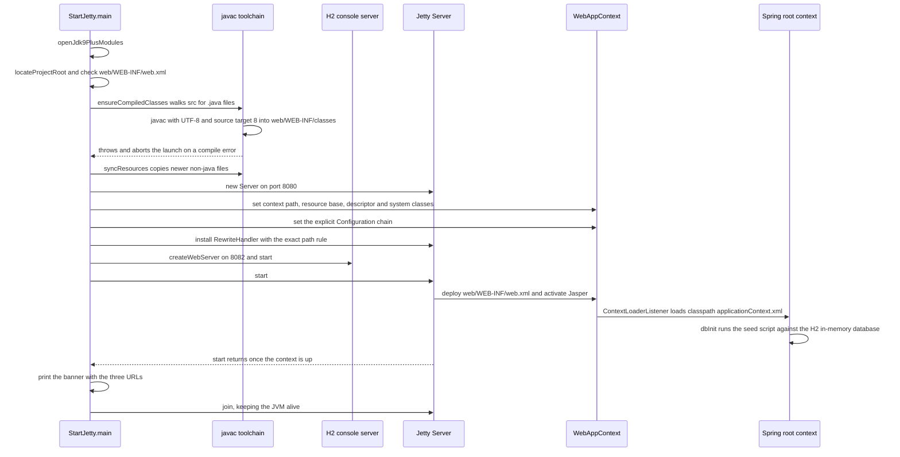
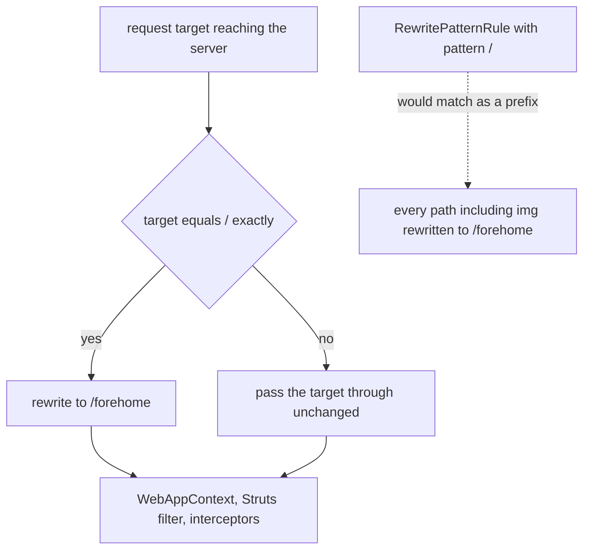

# Runtime Bootstrap: StartJetty, Jetty Wiring, and the Root-Path Rewrite

`src/StartJetty.java` is the single entry point of this checkout. There is no Tomcat, no
`pom.xml`, no CI workflow: one `main()` compiles the sources, starts embedded Jetty 9.4.58 on
port 8080 with the original `web/` directory as the web application, rewrites one exact path,
and starts the H2 console on a second port (`MIGRATION.md#L3-L11`, `STARTUP.md#L3-L8`).

The class is *business-independent*: it never names a class under `src/com/caozhihu/tmall`, and
it depends only on the JDK and the jars in `web/WEB-INF/lib`. That is the reason the original
`web.xml`, the JSPs and all 53 business Java files could stay byte-for-byte unchanged
(`MIGRATION.md#L9-L11`, `MIGRATION.md#L17-L17`): everything the original deployment expected from
Tomcat is supplied by this launcher instead.

## 1. Responsibilities and entrypoints

| Responsibility | Mechanism | Location |
|---|---|---|
| Entry point | `public static void main(String[] args)` | `src/StartJetty.java#L53-L122` |
| Fixed deployment values | constants `PORT = 8080`, `H2_CONSOLE_PORT = 8082`, `CONTEXT_PATH = "/"` | `src/StartJetty.java#L49-L51` |
| Project root discovery | `locateProjectRoot()` — working directory first, then the class code source | `src/StartJetty.java#L124-L143` |
| Self-compilation + resource sync | `ensureCompiledClasses()`, `syncResources()`, `buildLibClasspath()` | `src/StartJetty.java#L145-L213` |
| Web application deployment | `WebAppContext` with `web/` as resource base and `web/WEB-INF/web.xml` as descriptor | `src/StartJetty.java#L66-L70` |
| Classloader reconciliation | seven `addSystemClass(...)` prefixes | `src/StartJetty.java#L71-L81` |
| Jasper activation | explicit `Configuration[]` chain including `AnnotationConfiguration` | `src/StartJetty.java#L83-L88` |
| Root-path entry | `RewriteHandler` with a rule matching only the exact target `/` | `src/StartJetty.java#L90-L104` |
| H2 console | `org.h2.tools.Server.createWebServer("-webPort", "8082").start()` | `src/StartJetty.java#L107-L108` |
| JDK 9+ module access | `openJdk9PlusModules()`, programmatic `--add-opens` equivalent | `src/StartJetty.java#L215-L236` |

Two launch modes are documented and both run the same `main()`
(`src/StartJetty.java#L38-L41`): run the class from an IDE, or
`java -cp "web/WEB-INF/lib/*" src/StartJetty.java` from the project root. In both modes the jars
are on the JVM classpath *and* in `web/WEB-INF/lib` — that duplication is what section 6 exists to
neutralise.

The ports and context path are compile-time constants, and this is a one-directional dependency:
`web.xml`, the JSPs and the Struts configuration cannot read or override them, so a port change is
a Java edit plus a restart ([Configuration Surface](/openwiki/architecture/configuration.md#7-launcher-constants-and-the-settings-that-cannot-be-expressed-in-xml)).

## 2. Start-up sequence



*The launcher's start-up order from `src/StartJetty.java#L53-L122`; everything after
`server.start()` is container work, not launcher work.*

Ordering facts that matter operationally:

- `openJdk9PlusModules()` is the **first** statement of `main` (`#L54`), before any Jetty or
  Spring class is touched.
- Compilation happens **before** any server object exists (`#L64`), and a compile failure throws,
  so the process dies without opening a port. There is no "start with stale classes" path on a
  JDK.
- The H2 console is started **before** `server.start()` (`#L107-L110`), so port 8082 starts
  listening slightly earlier than port 8080. The database itself appears later, when Spring's
  `dbInit` bean runs inside the Jetty context start.
- The banner is printed **after** `server.start()` returns and before `server.join()`
  (`#L110-L121`). A taken port therefore fails with `BindException` and *no banner*
  (`STARTUP.md#L81-L81`). The banner is a start signal, not a health check: the launcher's own
  comments describe the double-class failure of section 6 as the webapp coming up "unavailable",
  which is a webapp-level outcome rather than a JVM-level abort
  (`src/StartJetty.java#L77-L77`). 【人工评审待确认】 whether Jetty 9.4 treats that failure as
  non-fatal for `server.start()`.
- `server.join()` is the last statement. The launcher adds no watchdog, no reload and no
  `System.exit`.

## 3. Locating the project root

`locateProjectRoot()` (`src/StartJetty.java#L124-L143`) answers "which directory contains `web/`?"
in two passes:

1. Start from `new File("").getAbsoluteFile()` (the JVM working directory) and walk **up to 4**
   parents, accepting the first directory that contains `web/WEB-INF/web.xml`.
2. If that fails, take the code source location of `StartJetty` itself (which works when an IDE
   sets a different working directory, or when the class is compiled into
   `web/WEB-INF/classes`) and walk **up to 6** parents the same way.

If neither pass finds the marker, it throws `IllegalStateException` with the instruction to set
the working directory to the project root (`#L142`). `main` then re-checks
`web/WEB-INF/web.xml` and throws again before compiling (`#L57-L62`).

The marker file is the contract: the launcher identifies the root by the presence of the
deployment descriptor, not by a name, a marker file of its own, or a system property. Adding a
second `web/WEB-INF/web.xml` above the real one would silently retarget the launcher.

## 4. Self-compilation into `web/WEB-INF/classes`

`ensureCompiledClasses(projectRoot, libDir, classesDir)` (`src/StartJetty.java#L145-L186`) is the
only build step in this repository.

1. `src/` must exist, otherwise `IllegalStateException("找不到源码目录 src/")` (`#L150-L151`).
2. `ToolProvider.getSystemJavaCompiler()` is probed. On a **JRE** it returns `null`, the launcher
   prints `[StartJetty] 当前是 JRE 环境，跳过编译…` and returns — no compilation *and no resource
   sync* (`#L153-L157`). This is the one path where stale output under `web/WEB-INF/classes` is
   used on purpose.
3. All files under `src/` ending in `.java` are collected. An empty result returns early, which
   likewise skips `syncResources` (`#L158-L162`).
4. `classesDir` is created and `javac` runs in-process through the JDK's compiler API with the
   options in the table below (`#L164-L171`). There is no timestamp comparison: every launch
   recompiles every source file.
5. Diagnostics are streamed, but only `Diagnostic.Kind.ERROR` is printed (`#L174-L178`). If the
   task does not return `true`, the launcher throws
   `IllegalStateException("源码编译失败，请查看上方编译错误")` and the launch aborts
   (`#L179-L183`).
6. `syncResources` runs and the launcher prints how many files it compiled (`#L184-L185`).

| Option | Value | Why it matters |
|---|---|---|
| `-encoding` | `UTF-8` | the sources, `applicationContext.xml` and JSPs are Chinese-language UTF-8 |
| `-source` / `-target` | `8` | bytecode stays Java 8 (class file 52) regardless of whether the run is on JDK 8, 11 or 17 |
| `-nowarn` | — | warnings are suppressed at the compiler and are also filtered out by the in-code diagnostic listener, which prints only `Diagnostic.Kind.ERROR` entries |
| `-cp` | every `web/WEB-INF/lib/*.jar` (sorted) **plus** `web/WEB-INF/classes` | the compile classpath is the same jar set the runtime uses, so IDE settings can never diverge from a build |
| `-d` | `web/WEB-INF/classes` | the exploded webapp's class directory |

`buildLibClasspath(libDir)` (`src/StartJetty.java#L208-L213`) is a directory glob: it lists
`*.jar` case-insensitively, sorts them for a stable command line, and joins them with
`File.pathSeparator`. Nothing reads a dependency manifest — dropping a jar into
`web/WEB-INF/lib` is the way to add a dependency, and it is picked up by both the compiler and
the container ([Runtime Dependencies](/openwiki/integrations/runtime-dependencies.md)).

`syncResources(srcDir, classesDir)` (`src/StartJetty.java#L188-L206`) walks `src/` once more and
copies every **non-`.java` regular file**, preserving its relative path, but only when the target
is missing or older than the source. A copy failure is wrapped in
`RuntimeException("复制资源失败: …")`. This is how three classpath contracts are satisfied:

- `classpath:applicationContext.xml` and `classpath:struts.xml` land at
  `web/WEB-INF/classes/applicationContext.xml` / `…/struts.xml`;
- `classpath:sql/tmall_ssh_h2.sql` lands at `web/WEB-INF/classes/sql/tmall_ssh_h2.sql`;
- `src/log4j2.xml` lands at `web/WEB-INF/classes/log4j2.xml`, which is what gives log4j2 its
  configuration ([Configuration Surface](/openwiki/architecture/configuration.md#6-srclog4j2xml)).

Consequences to keep in mind before editing anything:

- **`web/WEB-INF/classes` is disposable output.** It is git-ignored (`.gitignore`) and in
  `.openwikiignore`; nothing in the repository reads it except the JVM at start-up.
- **Deletion is not propagated.** The launcher only recompiles existing sources and copies
  resources; it never deletes stale `.class` or resource files from `web/WEB-INF/classes`. After
  removing a source file, the corresponding class file can still be loaded until the directory is
  cleaned by hand.
- **Only `src/` reaches the classpath.** A resource placed elsewhere (for example under `web/`)
  is served by the webapp but is not on the application classpath
  ([Configuration Surface](/openwiki/architecture/configuration.md#1-the-surface-and-what-loads-each-file)).

## 5. Deploying the untouched web application

```java
Server server = new Server(PORT);
WebAppContext context = new WebAppContext();
context.setContextPath(CONTEXT_PATH);
context.setResourceBase(webRoot.getAbsolutePath());
context.setDescriptor(webXml.getAbsolutePath());
```

Four settings carry the whole deployment (`src/StartJetty.java#L66-L70`):

| Setting | Value | Consequence |
|---|---|---|
| context path | `/` (`CONTEXT_PATH`) | the application owns the server root; URLs are the bare `@Action` values |
| resource base | the absolute path of `web/` | static files, the two JSP surfaces and the exploded `WEB-INF` all come from `web/` |
| descriptor | the absolute path of `web/WEB-INF/web.xml` | the original descriptor is used verbatim; it is never rewritten or copied |
| handler nesting | `rewrite.setHandler(context)` then `server.setHandler(rewrite)` | the rewrite handler sits **outside** the webapp (section 8) |

`web/WEB-INF/web.xml` declares only two `/*` filters (Struts2's
`StrutsPrepareAndExecuteFilter` and Spring's `CharacterEncodingFilter`), the
`contextConfigLocation` context-param and the `ContextLoaderListener`
(`web/WEB-INF/web.xml#L6-L39`). It declares **no servlet at all**, so the servlet that serves JSPs
and the default servlet that serves `web/css`, `web/js` and `web/img` come from Jetty's own
default web application descriptor plus the JSP setup enabled by the `Configuration` chain in
section 7. `org.eclipse.jdt.ecj-3.26.0.jar` is vendored as the JSP compiler, so JSP translation
does not depend on the JDK's `javac`. 【人工评审待确认】 whether Jasper always selects the
vendored ECJ compiler over a JDK `javac`, and therefore whether JSPs compile in every launch mode.

Because the Spring listener is declared in `web.xml`, the application's entire context refresh —
`ds`, `dbInit` (the seed script), `sf`, `transactionManager`, the component scan
(`src/applicationContext.xml#L14-L72`) — happens *inside* `server.start()`. "The banner has not
printed yet" is therefore a normal state during a healthy start (`STARTUP.md#L27-L27` records
5–8 seconds), not evidence of a hang.

`server.setStopAtShutdown(true)` (`src/StartJetty.java#L105`) registers a JVM shutdown hook so
`Ctrl+C` stops Jetty and its handlers in the normal order instead of killing the process.

## 6. Why jars are pinned to the parent classloader

In both documented launch modes the same jars are on the JVM classpath *and* inside
`web/WEB-INF/lib`, and Jetty's `WebInfConfiguration` adds `WEB-INF/lib` to the webapp
classloader. Without intervention, a class such as `org.apache.logging.log4j.core.Logger` is
defined twice in one JVM: once by the parent (system) loader for Jetty/Spring's own use, once by
the webapp loader for application code. `addSystemClass(prefix)` tells Jetty that classes whose
names start with that prefix are system classes — they are only ever loaded by the parent loader,
so one definition serves both sides (`src/StartJetty.java#L71-L81`).

This is deliberately `addSystemClass` rather than the softer "server class" form: a server class
may still be overridden by the webapp's own copy, which is precisely the situation being
prevented.

| Prefix | Pinned because | Symptom if it is not |
|---|---|---|
| `org.apache.logging.log4j.` | log4j discovers its plugins/appenders through a service registry; two copies break the registry | `ServiceConfigurationError` at start-up, and a logging setup that silently loses appenders |
| `org.h2.` | the console on 8082 and the webapp's datasource must be the same JVM-local in-memory database, which requires the same `org.h2` classes | two isolated `jdbc:h2:mem:tmall_ssh` databases; the console shows no business data |
| `org.apache.juli.` | the logging bridge used by the JSP engine; the original deployment shipped it as a container jar | 【人工评审待确认】 no standalone `juli` jar exists in `web/WEB-INF/lib`, so the pinned classes are the ones bundled inside the vendored Jasper artifacts |
| `org.apache.jasper.`, `org.apache.el.`, `javax.servlet.jsp.`, `org.eclipse.jetty.apache.jsp.` | the JSP/EL API and implementation must have one identity: Jetty's Jasper glue publishes a `TldCache` that the webapp's Jasper must accept | `TldCache` `ClassCastException` or `getTldCache() is null`; the webapp comes up **unavailable** (`src/StartJetty.java#L76-L77`, `STARTUP.md#L83-L83`) |

Practical rule: treat the list as append-only. A new jar that exists both in `WEB-INF/lib` and on
the JVM classpath is added here rather than replacing an existing entry, and the list is one of
the two settings `STARTUP.md` explicitly tells readers not to touch (`STARTUP.md#L83-L83`).

Note that there is no separate `jsp-api` jar in `web/WEB-INF/lib`; the JSP API travels with the
vendored Jasper artifacts (`org.mortbay.jasper.apache-jsp-8.5.100.jar`,
`org.mortbay.jasper.apache-el-8.5.100.jar`), which is why the `javax.servlet.jsp.` prefix is as
load-bearing as the implementation prefixes.

## 7. The explicit `Configuration` chain

```java
context.setConfigurations(new Configuration[]{
        new WebInfConfiguration(), new WebXmlConfiguration(), new MetaInfConfiguration(),
        new FragmentConfiguration(), new EnvConfiguration(), new PlusConfiguration(),
        new AnnotationConfiguration(), new JettyWebXmlConfiguration()});
```

`AnnotationConfiguration` is the reason this array is written out instead of left to the embedded
default (`src/StartJetty.java#L83-L88`). Jetty's annotation configuration is what runs
`ServletContainerInitializer`s discovered from the webapp's jars; without it, the JSP engine's
`JasperInitializer` never runs, the shared `TldCache` is never installed, and JSP compilation
fails with `getTldCache() is null` (`MIGRATION.md#L31-L31`, `STARTUP.md#L83-L83`).

The order is the conventional webapp order and each element has a role: `WebInfConfiguration`
sets up `WEB-INF/classes` + `WEB-INF/lib`, `WebXmlConfiguration` reads the descriptor named by
`setDescriptor`, `MetaInfConfiguration`/`FragmentConfiguration` collect `META-INF/resources` and
web fragments, `EnvConfiguration`/`PlusConfiguration` provide the Java EE namespace and
`@Resource` injection from `jetty-plus`/`jetty-jndi`, `AnnotationConfiguration` runs the SCIs, and
`JettyWebXmlConfiguration` comes last so a per-webapp `WEB-INF/jetty-web.xml` could still adjust
the context. This repository has no `WEB-INF/jetty-web.xml`, so the launcher's settings are the
final word.

【人工评审待确认】 `MIGRATION.md` asserts only that the embedded default chain lacks
`AnnotationConfiguration`; whether the other seven entries are exactly Jetty's defaults is a
Jetty-internals question not decidable from this repository.

## 8. The root-path rewrite: exact match, not a pattern

`web.xml` has no `<welcome-file-list>`, and Jetty's default servlet does not hand a welcome file
to the JSP servlet the way Tomcat does, so `web/index.jsp` is never reached by a request for `/`.
Because `web.xml` may not be edited, the launcher installs a rewrite instead
(`src/StartJetty.java#L90-L104`):

```java
RewriteHandler rewrite = new RewriteHandler();
rewrite.addRule(new Rule() {
    @Override
    public String matchAndApply(String target, HttpServletRequest request, HttpServletResponse response) {
        return "/".equals(target) ? "/forehome" : null;
    }
});
rewrite.setHandler(context);
server.setHandler(rewrite);
```

The decision is deliberately written as an anonymous `Rule` that compares the target to `/`
exactly, returning `null` for everything else (meaning "leave the request untouched"). The
comments record why the obvious built-in rule is wrong: `RewritePatternRule`'s `pattern` has
regex/prefix semantics, so a pattern of `/` would rewrite **every** path — `/img/**`, `/css/**`,
`/admin_category_list` — to `/forehome`, turning site images into HTML
(`src/StartJetty.java#L90-L94`, `MIGRATION.md#L33-L33`).



*The rule's branching, and the anti-pattern the in-file comment warns about.*

Three knock-on facts:

- The rewrite runs **before** the webapp dispatches, so the rewritten request is what the Struts
  filter, the convention mapper and the `auth-dafault` interceptor stack see; the resulting
  `/forehome` request passes `AuthInterceptor`'s whitelist entry `home`
  ([Request Pipeline](/openwiki/architecture/request-pipeline.md#9-paths-that-never-reach-an-action)).
- Because the match is on the literal `/`, the rule is only correct while `CONTEXT_PATH` is `/`.
  Under a non-root context path the request target arriving at the rewrite handler would carry the
  context prefix, the exact match would never fire, and `/` would 404. This is the same
  hard-coded assumption flagged for `AuthInterceptor`
  ([Configuration Surface](/openwiki/architecture/configuration.md#8-settings-whose-change-alters-behaviour-treat-as-invariants)).
- `web/index.jsp` remains a second route to the same place — it calls
  `response.sendRedirect("/forehome")` (`web/index.jsp#L15-L17`) — but only when requested as
  `/index.jsp`, since `/` itself never reaches it.

## 9. The H2 console on its own port

```java
org.h2.tools.Server.createWebServer("-webPort", String.valueOf(H2_CONSOLE_PORT)).start();
```

The console is a second, independent server on port 8082 (`src/StartJetty.java#L107-L108`). It
cannot live under the application because the Struts2 filter is mapped to `/*`, so an in-app
console path would be fed to the dispatcher and answered with `no action mapped`
(`src/StartJetty.java#L107-L107`, `STARTUP.md#L68-L68`).

Details that follow from the source:

- The launcher keeps **no reference** to the H2 `Server` object; it is started fire-and-forget for
  the life of the JVM.
- The console is started before `server.start()`, so 8082 is listening while the Spring context is
  still refreshing. The database is created/loaded by `dbInit` at context start, and
  `DB_CLOSE_DELAY=-1` in `jdbc:h2:mem:tmall_ssh;MODE=MySQL;DB_CLOSE_DELAY=-1` keeps it alive as
  long as the JVM does — which is why the console can attach to the running application's data
  ([Persistence Layer](/openwiki/architecture/persistence-layer.md)).
- Pinning `org.h2.` to the parent loader (section 6) is the other half of that story: the console
  and the datasource must load the same `org.h2` classes to share one in-memory instance.
- Data is JVM-local and disappears with the process ([Quickstart](/openwiki/quickstart.md)).

## 10. JDK 9+ module opening

`openJdk9PlusModules()` (`src/StartJetty.java#L215-L236`) is a best-effort, reflective equivalent
of `--add-opens` for the old framework stack (Spring 4.3.x / cglib / Hibernate 5.3) that
reflectively touches JDK-internal packages:

1. It probes `Class.forName("java.lang.Module")`. On JDK 8 that throws and the outer
   `catch (Throwable)` makes the whole method a no-op (`#L233-L235`).
2. It obtains the `java.base` module through `Class.class.getModule()` and its own module through
   `StartJetty.class.getModule()`.
3. For each of `java.lang`, `java.util`, `java.lang.reflect`, `java.net`, `java.io`, `java.nio`,
   `java.nio.file`, `java.sql`, `java.text` it calls `Module.addOpens(pkg, thisModule)`.
4. Each `addOpens` call is individually wrapped in `catch (Exception ignore)`
   (`#L228-L231`), so a package that cannot be opened fails silently.

Two properties make this work as written: all classpath code — Spring, cglib, Hibernate and the
application — shares the single unnamed module, so opening to `StartJetty`'s module opens the
package for the whole stack; and the method runs first in `main`, before those frameworks start
reflecting. It is a defence, not a guarantee: because failures are swallowed, the diagnostic
signal for a genuinely missing module access is a framework stack trace, not a launcher message.
【人工评审待确认】 whether any of these nine `addOpens` calls actually take effect on the tested
JDK 17 (a silently ignored failure would look identical from the outside), and whether the list
covers everything Spring 4.3.18 and its cglib/ASM version need.

## 11. Invariants and consequences other pages depend on

| Invariant | Evidence | Who depends on it |
|---|---|---|
| The web application lives in `web/`; that directory is the resource base | `src/StartJetty.java#L56`, `#L69` | JSP paths, `web/css`, `web/js`, `web/img`, and the image uploads written through `getRealPath("img/category")` ([Image Pipeline](/openwiki/workflows/image-pipeline.md)) |
| The context path is `/` | `src/StartJetty.java#L49-L51` | bare-`@Action` URLs, `AuthInterceptor`'s raw `getRequestURI()` check, and the exact-match rewrite |
| There is no build step; `web/WEB-INF/classes` is regenerated (and disposable) output | `src/StartJetty.java#L145-L186` | editing anything under `src/` takes effect on the next launch with no `javac` invocation by the developer |
| The deployment descriptor is used as-is and is not to be modified | `src/StartJetty.java#L70`, `MIGRATION.md#L9-L11` | every container-level compensation is expressed in `StartJetty` instead of `web.xml` |
| `addSystemClass` list + `Configuration` chain are load-bearing | `src/StartJetty.java#L71-L88`, `STARTUP.md#L83-L83` | JSP/EL class identity and log4j/H2 single-instance semantics |
| The `/` rewrite matches exactly one path | `src/StartJetty.java#L90-L104` | `http://localhost:8080/` renders the storefront, and `/img/**` still returns image bytes |
| Ports are `8080` / `8082` | `src/StartJetty.java#L49-L50` | the banner, `STARTUP.md`, and the manual smoke path |
| `server.setStopAtShutdown(true)` | `src/StartJetty.java#L105` | an orderly stop on `Ctrl+C` |
| Only the seed script creates schema and rows | `src/sql/tmall_ssh_h2.sql`, `dbInit` in `src/applicationContext.xml` | restarting the launcher resets the demo data |

## 12. How a change here is verified

There is no automated test for the launcher. `src/com/caozhihu/tmall/test/TestTmall.java` covers
the Spring context only and never starts Jetty, so the launcher is verified by starting it and
probing the observable consequences
([Testing and Verification](/openwiki/testing/verification.md#4-the-manual-smoke-path)):

1. the banner and its three URLs appear (absent if the port is taken or compilation fails);
2. `curl -i http://localhost:8080/` renders the storefront, while
   `curl -i http://localhost:8080/img/site/logo.gif` returns image bytes — this pair is what
   proves the rewrite is still narrow;
3. `/forehome` and `/admin_category_list` return the same content as the recorded acceptance run
   (`MIGRATION.md#L73-L83`);
4. `http://localhost:8082` logs into the same in-memory database and sees the rows the UI shows.

Diagnostics for each failure mode are collected on
[Startup and Diagnostics](/openwiki/operations/startup-and-diagnostics.md).

## 13. Review items

- 【人工评审待确认】 `org.apache.juli.` is pinned with no standalone juli jar in
  `web/WEB-INF/lib`; confirm which artifact supplies those classes and whether the prefix is still
  needed.
- 【人工评审待确认】 Whether the nine reflective `addOpens` calls take effect on JDK 17, given
  that every failure is swallowed.
- 【人工评审待确认】 Whether the seven non-`AnnotationConfiguration` entries match Jetty's
  embedded default chain, as `MIGRATION.md` implies.
- 【人工评审待确认】 Is the missing cleanup of `web/WEB-INF/classes` (no propagation of deleted
  sources) acceptable, or should the launcher clear the directory before compiling?
- 【人工评审待确认】 `-source 8 -target 8` is accepted by JDK 17; confirm the launcher's stance for
  a future JDK that drops source/target 8.
- 【人工评审待确认】 Is keeping no handle on the H2 console `Server` (no explicit stop, no port
  conflict handling) intended?
