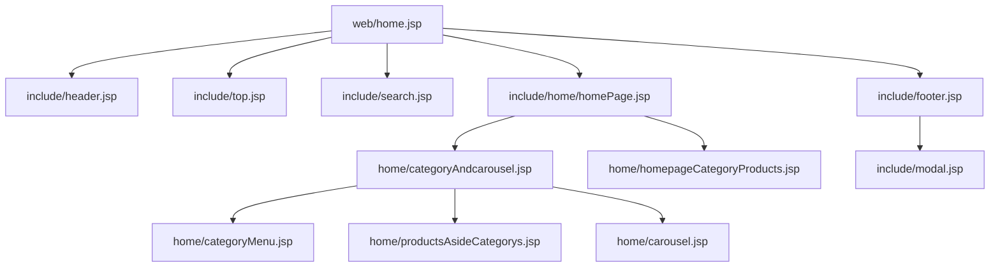
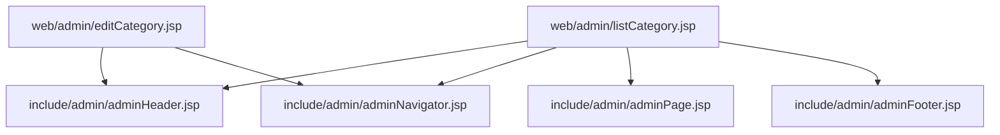

# View Layer: JSP Pages, Fragment Includes, and Static Assets

There is no template engine other than JSP in this project. Every HTML response is a JSP
translation unit compiled by Jasper (the JSP engine that ships inside Jetty) and rendered from a
Struts dispatcher forward or a browser redirect. The view tree holds 64 JSP files: 18 page-level
JSPs directly under `web/`, 10 under `web/admin/`, and 36 reusable fragments under `web/include/`.
Nothing in the tree uses `<jsp:include>`, tag files, custom tags, or a layout framework — the only
composition mechanism is the static include directive `<%@include file="…"%>`, which the JSP
translator expands *before* compiling.

The result is a strict two-level convention:

| Level | Location | Role |
|---|---|---|
| Page | `web/<name>.jsp`, `web/admin/<name>.jsp` | Target of a `@Result` location. Contains a page directive and a handful of `<%@include%>` lines — markup that is unique to that page stays here (all admin pages, `web/index.jsp`, `web/success.jsp`, `web/fail.jsp`) |
| Fragment | `web/include/**` | The actual markup, scripts and forms, shared between pages, or included once by exactly one page when it is large (`include/cart/cartPage.jsp`, `include/cart/buyPage.jsp`) |

The binding half of the view — which `Action` getters, `Page` properties, session attributes and
request parameters the markup reads — is described in [What the fragments read](#what-the-fragments-read).
Which URL renders which view, and how a forward differs from a redirect, is owned by
[Request Pipeline](/openwiki/architecture/request-pipeline.md) §7; the do-not-break framing of the
names involved lives on `/openwiki/conventions/runtime-invariants.md` and
[SDD Baseline](/openwiki/concepts/sdd-baseline.md).

## The storefront page pattern

Fourteen of the fifteen storefront HTML pages follow one include order. `web/home.jsp` is the
canonical example (`web/home.jsp#L11-L15`):

```jsp
<%@include file="include/header.jsp"%>
<%@include file="include/top.jsp"%>
<%@include file="include/search.jsp"%>
<%@include file="include/home/homePage.jsp"%>
<%@include file="include/footer.jsp"%>
```

- `include/header.jsp` opens `<!DOCTYPE html>`, `<html>`, `<head>` and `<body>`, declares the three
  JSTL taglibs, and loads jQuery/Bootstrap plus the page-wide JavaScript helpers.
- `include/top.jsp` is the member bar: home link, login/logout links driven by the session `user`,
  and the shopping-cart count.
- `include/search.jsp` (large logo + keyword form) or `include/simpleSearch.jsp` (small logo,
  right-aligned form) is the search header. `web/home.jsp`, `web/category.jsp` and
  `web/searchResult.jsp` use the large one; `web/cart.jsp`, `web/product.jsp`, `web/register.jsp`,
  `web/registerSuccess.jsp`, `web/review.jsp`, `web/bought.jsp`, `web/payed.jsp`,
  `web/confirmPay.jsp` and `web/orderConfirmed.jsp` use the small one; `web/buy.jsp` and
  `web/alipay.jsp` include `top.jsp` with neither search fragment.
- `include/<domain>/<name>Page.jsp` holds the page's own markup. The fragment is named after the
  page it backs: `home.jsp` → `include/home/homePage.jsp`, `cart.jsp` →
  `include/cart/cartPage.jsp`, `product.jsp` → `include/product/productPage.jsp`, `category.jsp` →
  `include/category/categoryPage.jsp`.
- `include/footer.jsp` renders the footer *and* closes `</body></html>`; it also pulls in
  `include/modal.jsp`.

`web/login.jsp` is the single storefront page that skips both the member bar and the search header:
`header.jsp` → `include/loginPage.jsp` → `footer.jsp` (`web/login.jsp#L11-L13`). `web/index.jsp`
contains no include at all — it is a scriptlet redirect (see
[Paths that bypass Struts](#paths-that-bypass-struts)).

| Page | Search header | Page fragment |
|---|---|---|
| `web/home.jsp` | `include/search.jsp` | `include/home/homePage.jsp` |
| `web/category.jsp` | `include/search.jsp` | `include/category/categoryPage.jsp` |
| `web/searchResult.jsp` | `include/search.jsp` | `include/searchResultPage.jsp` |
| `web/product.jsp` | `include/simpleSearch.jsp` | `include/product/productPage.jsp` |
| `web/cart.jsp` | `include/simpleSearch.jsp` | `include/cart/cartPage.jsp` |
| `web/buy.jsp` | — | `include/cart/buyPage.jsp` |
| `web/alipay.jsp` | — | `include/cart/alipayPage.jsp` |
| `web/payed.jsp` | `include/simpleSearch.jsp` | `include/cart/payedPage.jsp` |
| `web/bought.jsp` | `include/simpleSearch.jsp` | `include/cart/boughtPage.jsp` |
| `web/confirmPay.jsp` | `include/simpleSearch.jsp` | `include/cart/confirmPayPage.jsp` |
| `web/orderConfirmed.jsp` | `include/simpleSearch.jsp` | `include/cart/orderConfirmedPage.jsp` |
| `web/review.jsp` | `include/simpleSearch.jsp` | `include/cart/reviewPage.jsp` |
| `web/register.jsp` | `include/simpleSearch.jsp` | `include/registerPage.jsp` |
| `web/registerSuccess.jsp` | `include/simpleSearch.jsp` | `include/registerSuccessPage.jsp` |
| `web/login.jsp` | — | `include/loginPage.jsp` |

Fragments nest one level further inside their domain directory, which is why the page stays three
to five lines long. The storefront home page is the deepest case:



*Include graph of `web/home.jsp`: five direct fragments, with `homePage.jsp` and `footer.jsp`
fanning out one level further.*

A quirk of this ordering: the fragments emit `<title>` (for instance
`include/home/homePage.jsp#L11`, `include/cart/cartPage.jsp#L209`), but `header.jsp` has already
closed `</head>` and opened `<body>` before they are included. The title element therefore appears
inside the body; browsers relocate it, and it is the established habit for a new fragment to start
with `<title>`.

## The admin page pattern

The admin screens do not touch the storefront shell at all. The list pages follow
`adminHeader.jsp` → `adminNavigator.jsp` → an inline data table → `adminPage.jsp` (the pager, inside
a `div.pageDiv`) → `adminFooter.jsp`, exactly as `web/admin/listCategory.jsp#L12-L13`, `#L36-L72`,
`#L100` shows. Five list pages include the pager — `listCategory.jsp`, `listOrder.jsp`,
`listProduct.jsp`, `listProperty.jsp`, `listUser.jsp` — while `listProductImage.jsp` is a list page
without one (`ProductImageAction#list` builds no `Page`). The four edit pages
(`web/admin/editCategory.jsp`, `editProduct.jsp`, `editProperty.jsp`, `editPropertyValue.jsp`) use
only the first two includes plus their inline form.

`web/admin/listCategory.jsp` is representative:



*Include graph of a paged admin list page and of an edit page. The edit page has no pager and — a
deviation from the pattern — no footer fragment.*

The two include families are disjoint: `include/admin/**` (`adminHeader.jsp`, `adminNavigator.jsp`,
`adminPage.jsp`, `adminFooter.jsp`) is included only by `web/admin/*.jsp`, and no admin page
includes `include/header.jsp`, `include/top.jsp` or `include/footer.jsp`. The four edit pages omit
`adminFooter.jsp`, so their `<body>` and `<html>` are never closed by the fragment that owns those
tags — the only place the pattern is broken, and harmless in practice only because browsers recover.

## Static includes make one translation unit

`<%@include%>` is a translation-time expansion, so a page and its whole fragment tree compile as a
single Java source. Two consequences matter when writing or moving a fragment:

1. **Taglib declarations are shared, and fragments rely on that.** `include/header.jsp#L5-L7`
   declares `c` (`http://java.sun.com/jsp/jstl/core`), `fmt` and `fn` once for every storefront
   page, and fragments then use prefixes they never declare themselves:
   `include/home/homepageCategoryProducts.jsp#L33` calls `<fmt:formatNumber>` while declaring only
   `fn` (`#L5`), and `include/product/productDetail.jsp#L25` uses `fn:substring` with
   `c:forEach` while declaring only `fn`. Admin pages are the mirror image: each one declares
   `<c:…>` itself before including `adminHeader.jsp` (which declares no taglib at all) —
   `web/admin/listCategory.jsp#L11`, `web/admin/listOrder.jsp#L11-L12` — and the pager fragment
   `include/admin/adminPage.jsp#L22-L43` uses `<c:if>` / `<c:forEach>` without declaring `c`.
   A fragment is therefore not independently compilable: it must be included after the shell (or
   after the including page's own taglib lines).
2. **Page directives must agree.** Every fragment repeats the same directive
   (`contentType="text/html;charset=UTF-8"`, `language="java"`, `pageEncoding="UTF-8"`,
   `isELIgnored="false"`), because duplicate page directives are only legal when the attribute
   values are identical. `isELIgnored="false"` is what makes every `${…}` in the tree evaluate
   instead of printing literally.

Because the expansion is textual, page-scoped state set in a fragment is visible to whatever is
included after it. `include/home/homepageCategoryProducts.jsp#L7-L13` and
`include/category/productsByCategory.jsp#L15-L21` both seed a page-scope `categorycount` from
`${param.categorycount}`, defaulting to `100`, and use it immediately as the row limit.

### Shell ownership and shared JavaScript

The `html`/`body` tags are owned by include fragments, not by the pages:

| Shell part | Opened by | Closed by |
|---|---|---|
| `<!DOCTYPE html>`, `<html>`, `<head>`, `<body>` | `include/header.jsp#L1-L79` | `include/footer.jsp#L116-L117` |
| admin document | `include/admin/adminHeader.jsp#L8-L75` | `include/admin/adminFooter.jsp#L14-L15` |

Both headers embed the page-wide JavaScript that fragments and inline page scripts call:

- `include/header.jsp#L17-L42` defines `formatMoney(num)` (used by `include/cart/cartPage.jsp#L184-L191`
  to recompute cart totals in the browser) and `checkEmpty(id, name)`, and registers the jQuery
  handlers that toggle `div.productDetailDiv` / `div.productReviewDiv`, the leave-a-message textarea,
  and the `#nowhere` demo links.
- `include/admin/adminHeader.jsp#L19-L57` defines `checkEmpty`, `checkNumber` and `checkInt`, used by
  every admin form's `submit` handler, plus a global anchor handler that turns `deleteLink="true"`
  into a `confirm()` gate (`#L59-L71`).
- `include/modal.jsp` is included by `include/footer.jsp#L11` and supplies the `#loginModal` and
  `#deleteConfirmModal` markup. Fragments that *use* those modals do not include `modal.jsp`
  themselves: `include/product/imgAndInfo.jsp#L71` and `#L87` show the login modal,
  `include/cart/cartPage.jsp#L13` and `include/cart/boughtPage.jsp#L28` show the delete-confirm
  modal. Moving a fragment out of a page that includes `footer.jsp` silently breaks its modals.

## What the fragments read

Three channels reach a rendered fragment: Action properties (reached through the Struts value stack,
[Request Pipeline](/openwiki/architecture/request-pipeline.md) §8), session attributes, and request
parameters. No fragment uses `<c:out>` — everything is printed with a plain `${…}` EL expression.

### Action properties: list getters and entity graph

`c:forEach` over a list property declared on `Action4Pojo` is the core rendering idiom:

| List expression | Written by | Consumed in |
|---|---|---|
| `${categories}` | `ForeAction#home`, `CategoryAction#list` | `web/include/home/categoryMenu.jsp#L12`, `categoryAndcarousel.jsp#L73`, `homepageCategoryProducts.jsp#L16`, `web/admin/listCategory.jsp#L50` |
| `${products}` | `ForeAction#search`, `ProductAction#list` | `web/include/productsBySearch.jsp#L15`, `web/admin/listProduct.jsp#L62` |
| `${orders}` | `ForeAction#bought`, `OrderAction#list` | `web/include/cart/boughtPage.jsp#L95`, `web/admin/listOrder.jsp#L52` |
| `${orderItems}` | `ForeAction#cart`, `#buy` | `web/include/cart/cartPage.jsp#L234`, `web/include/cart/buyPage.jsp#L64` |
| `${properties}` | `PropertyAction#list` | `web/admin/listProperty.jsp#L45` |
| `${users}` | `UserAction#list` | `web/admin/listUser.jsp#L44` |
| `${reviews}` | `ForeAction#product`, `#doreview` | `web/include/product/productReview.jsp#L19`, `reviewPage.jsp#L55` |
| `${productSingleImages}` / `${productDetailImages}` | `ProductImageAction#list`, `ForeAction#product` | `web/admin/listProductImage.jsp#L81` / `#L134` |
| `${propertyValues}` | `PropertyValueAction`, `ForeAction#product` | `web/include/product/productDetail.jsp#L24`, `web/admin/editPropertyValue.jsp#L48` |

Nested transient collections and associations are traversed the same way: `${category.products}`
(`include/category/productsByCategory.jsp#L24`), `${c.productsByRow}`
(`include/home/productsAsideCategorys.jsp#L26`), `${product.productSingleImages}` and
`${product.productDetailImages}` (`include/product/imgAndInfo.jsp#L150`, `productDetail.jsp#L32`),
and `${o.orderItems}` (`include/cart/boughtPage.jsp#L117`). These fields are populated per request
by the service layer (`ProductService.fill`, `fillByRow`, `setFirstProductImage`,
`OrderItemService.fill`) — see [Domain Model](/openwiki/concepts/domain-model.md).

`varStatus` is used for three different jobs:

- **Row windows.** `include/home/homepageCategoryProducts.jsp#L22-L23` and
  `include/category/productsByCategory.jsp#L25` keep only the first `categorycount` products;
  `include/home/categoryAndcarousel.jsp#L73-L80` keeps the first four categories.
- **Slice-sharing between the two search fragments.** `include/search.jsp#L20-L31` prints the
  categories at positions 5–8 of the session list `${cs}` and `include/simpleSearch.jsp#L14-L25`
  prints positions 8–11 of the *same* list — so the two headers are windows over one shared
  category list rather than two separate queries.
- **Grouped-table rendering.** `include/cart/buyPage.jsp#L92-L104` and
  `include/cart/boughtPage.jsp#L142-L184` emit the per-order cells (quantity, total, action
  buttons) only on the first item row, with `rowspan="${fn:length(o.orderItems)}"`.

Formatting is always JSTL: `<fmt:formatNumber type="number" … minFractionDigits="2"/>` for money
(`include/product/imgAndInfo.jsp#L182-L190`, `include/cart/cartPage.jsp#L276-L277`) and
`<fmt:formatDate value="…" pattern="yyyy-MM-dd HH:mm:ss"/>` for timestamps
(`include/cart/confirmPayPage.jsp#L8-L14`, `web/admin/listOrder.jsp#L60-L63`).

### Session attributes

Three session keys are read by the shared fragments. Two of them are refreshed by interceptors for
every `/fore*` request, so their values are always present on a forwarded storefront page:

| Key | Written by | Read by |
|---|---|---|
| `user` | `ForeAction#login` / `#loginAjax` (`src/com/caozhihu/tmall/action/ForeAction.java#L51`), removed by `#logout` | `include/top.jsp#L18-L25` — `${!empty user}` switches between `${user.name}` + logout and the 请登录/免费注册 links |
| `cs` | `CategoryNamesBelowSearchInterceptor` (`src/com/caozhihu/tmall/interceptor/CategoryNamesBelowSearchInterceptor.java#L31-L34`), the full `categoryService.list()` | `include/search.jsp#L20`, `include/simpleSearch.jsp#L14` |
| `cartTotalItemNumber` | `CartTotalItemNumberInterceptor` (`src/com/caozhihu/tmall/interceptor/CartTotalItemNumberInterceptor.java#L32-L45`) — summed item numbers, or `0` for an anonymous visitor | `include/top.jsp#L33` — the 购物车 badge |

Note the asymmetry on the home page: the category menu and the aside-category panels read the
*Action* property `${categories}` from `ForeAction#home`, while the search headers read the
*session* list `${cs}`. Both are `List<Category>`, but only `cs` survives a direct JSP request.
Session key `orderItems` (written by `ForeAction#buy`, `ForeAction.java#L185`) is read by the
`forecreateOrder` action, not by any view.

### Request parameters

`${param.*}` is used to carry state that the action does not republish:

| Expression | Where | Purpose |
|---|---|---|
| `${param.keyword}` | `include/search.jsp#L17`, `include/simpleSearch.jsp#L11` | Repopulates the search input after the POST to `foresearch` |
| `${param.sort}` | `include/category/sortBar.jsp#L52-L67` | Highlights the active sort column by comparing to `all`, `review`, `date`, `saleCount`, `price` |
| `${param.total}` | `include/cart/alipayPage.jsp#L13`, `#L21`, `include/cart/payedPage.jsp#L14` | The amount displayed and echoed into the `forepayed` link, supplied by the `alipayPage` redirect (`forealipay?order.id=…&total=…`) |
| `${param.showonly}` | `include/cart/reviewPage.jsp#L53`, `#L66` | Switches the review page between the read-only review list and the review form; supplied by the `reviewPage` redirect |
| `${param.categorycount}` | `include/home/homepageCategoryProducts.jsp#L7-L13`, `include/category/productsByCategory.jsp#L15-L21` | A "limiting test parameter" whose absence means 100 rows |

`include/search.jsp#L12` and `include/simpleSearch.jsp#L5` also build the logo link from
`${contextPath}` — a property declared and bound on `Action4Parameter` (`Action4Parameter.java#L10-L45`)
that no code in `src/` assigns a value to, so the rendered `href` is empty and the logo links back
to the current URL. 【人工评审待确认】 whether that is intended.

### The `Page` bean surface

Paging exists only in the admin list pages and only through one fragment,
`include/admin/adminPage.jsp`. It reads `${page.param}`, `${page.totalPage}`, `${page.total}`,
`${page.start}`, `${page.count}`, `${page.last}`, `${page.hasNext}` and `${page.hasPreviouse}` — the
last one mattering because the getter is `Page.isHasPreviouse()`
(`src/com/caozhihu/tmall/util/Page.java#L22-L27`), so the property name EL must resolve is the
misspelled `hasPreviouse`:

```jsp
<li <c:if test="${!page.hasPreviouse}"> class="disabled" </c:if>>
    <a href="?page.start=0${page.param}" aria-label="Previous">
```

The pager links are all relative to the current action URL and each one re-appends `${page.param}`
(the `&category.id=<id>` suffix set by the list actions) so that changing page preserves the filter.
The arithmetic of `totalPage` / `last` / `hasNext`, the `count = 5` default, and the
`c:forEach begin="0" end="${page.totalPage-1}"` window are owned by
[Workflow: Pagination and Search](/openwiki/workflows/pagination-and-search.md); the invariant here
is only that the spelling, the names and the `${page.param}` suffix are the EL contract.

### EL inside script blocks, and plain-text responses

Two fragments interpolate EL into JavaScript that the browser then executes, rather than into HTML:
`include/product/imgAndInfo.jsp#L15` writes `var stock = ${product.stock};` and `#L49` writes
`var pid = ${product.id};`, and `include/loginPage.jsp#L7-L10` / `include/registerPage.jsp#L7-L10`
emit ``$("span.errorMessage").html("${msg}");`` inside a `$(function(){…})` block so a server-side
message is shown on arrival. Any fragment that does this must keep its `${…}` values
JavaScript-safe.

Two page-level JSPs are not HTML at all: `web/success.jsp` contains the single word `success` and
`web/fail.jsp` contains `fail`. They are the AJAX response bodies for `forecheckLogin`,
`foreloginAjax`, `foreaddCart`, `forechangeOrderItem` and `foredeleteOrderItem`, and the storefront
JavaScript compares the response text to the literal `"success"`
(`include/product/imgAndInfo.jsp#L43-L75`, `include/cart/cartPage.jsp#L26-L32`). Changing that word
breaks every asynchronous storefront interaction without any server-side error.

## Image and asset URL conventions

Every `src` in the tree is a **relative** URL with no leading slash and no context path, and every
dynamic image is addressed by the id of the row that owns it:

| Markup | Path pattern | Producer |
|---|---|---|
| `include/category/categoryPage.jsp#L7`, `web/admin/listCategory.jsp#L53` | `img/category/${category.id}.jpg` | `CategoryAction#add` / `#update` |
| `include/product/imgAndInfo.jsp#L148-L153` | `img/productSingle/${pi.id}.jpg` (big) and `img/productSingle_small/${pi.id}.jpg` (thumbnail, with `bigImageURL` swap target) | `ProductImageAction#add` |
| `include/home/homepageCategoryProducts.jsp#L26`, `include/cart/buyPage.jsp#L67`, `web/admin/listOrder.jsp#L84` | `img/productSingle_middle/${…firstProductImage.id}.jpg` | `ProductImageAction#add` (217×190 derivative) |
| `include/product/productDetail.jsp#L33`, `web/admin/listProductImage.jsp#L138-L139` | `img/productDetail/${pi.id}.jpg` | `ProductImageAction#add` |
| `include/home/carousel.jsp#L23-L33` | `img/lunbo/1.jpg` … `4.jpg` | checked-in only |
| `include/header.jsp#L13-L14`, most fragments | `img/site/*`, `css/fore/style.css`, `js/bootstrap/3.3.6/…` | checked-in only |

These relative paths only resolve because a dispatcher forward keeps the *action* URL, and every
action URL is at the context root (`@Namespace("/")` with `@Action("fore…")` /
`@Action("admin_…")`). `web/admin/listCategory.jsp` therefore renders `img/category/${c.id}.jpg`
against `/`, not against `/admin/`. Requesting `/admin/listCategory.jsp` directly re-bases the same
relative URL under `/admin/`, where no such file exists — the images break while the page still
renders. The one exception in the tree is `include/admin/adminNavigator.jsp#L13`, which prefixes its
logo with `../`.

The upload pipeline writes into the same directories the markup reads, so
`web/img/category`, `web/img/productSingle`, `web/img/productSingle_small`,
`web/img/productSingle_middle` and `web/img/productDetail` are simultaneously checked-in seed
assets and runtime output. That naming and sizing contract is owned by
[Workflow: Image Upload, Conversion, and Serving](/openwiki/workflows/image-pipeline.md).

## Static asset tree served by the container

All view assets live under `web/`, i.e. outside `WEB-INF/` (which holds only `web.xml`, `lib/` and
the generated `classes/` directory), so the container's default servlet serves them directly:

| Directory | Contents | Referenced by |
|---|---|---|
| `web/img/` | `category/`, `lunbo/`, `productDetail/`, `productSingle/`, `productSingle_middle/`, `productSingle_small/`, `site/` (site chrome, plus `site/star/` and a stray `site/alipay2wei.png.bak`) | the fragments above |
| `web/css/` | `bootstrap/3.3.6/` (`bootstrap.min.css` + theme + `fonts/`), `fore/style.css` (storefront), `back/style.css` (admin) | `include/header.jsp#L13-L14`, `include/admin/adminHeader.jsp#L15-L16` |
| `web/js/` | `bootstrap/3.3.6/` (`bootstrap.js`, `bootstrap.min.js`, `npm.js`), `jquery/3.3.1/jquery.min.js` | `include/header.jsp#L12`, `include/admin/adminHeader.jsp#L14` |

Two details of the loading markup are worth knowing before debugging a broken screen:

- **jQuery comes from a CDN, and the vendored copy is unused.** Both shells load
  `http://libs.baidu.com/jquery/2.0.0/jquery.min.js` (`include/header.jsp#L11`,
  `include/admin/adminHeader.jsp#L13`) while `web/js/jquery/3.3.1/jquery.min.js` sits in the tree
  with no JSP referencing it. Every jQuery-dependent fragment fails if that host is unreachable.
- **The admin Bootstrap CSS href is a typo.** `include/admin/adminHeader.jsp#L15` points at
  `.css/bootstrap/3.3.6/bootstrap.min.css` — a leading dot, so the path resolves to
  `/.css/bootstrap/3.3.6/bootstrap.min.css`, which does not exist — while its Bootstrap JS at `#L14`
  and `css/back/style.css` at `#L16` are correct. Admin screens are therefore styled by
  `css/back/style.css` alone. 【人工评审待确认】 whether the missing framework CSS is intended.

JSP compilation in this setup depends on the launcher's Jasper/EL wiring — `addSystemClass` entries
for `org.apache.jasper.`, `org.apache.el.` and `javax.servlet.jsp.` plus the explicit Jetty
`Configuration` chain that lets Jasper initialise. The wiring and its failure symptom
(`getTldCache() is null`) are owned by [Runtime Bootstrap](/openwiki/architecture/runtime-bootstrap.md).

## Paths that bypass Struts

The Struts filter is mapped to `/*` (`web/WEB-INF/web.xml#L14-L17`), but a request only becomes an
action invocation when its path matches an `@Action` value. The view tree contains several entry
points that are reached without any action, and therefore without `authorityInterceptor`,
`categoryNamesBelowSearchInterceptor` or `cartTotalItemNumberInterceptor`:

- **Direct JSP requests.** `include/top.jsp#L19-L24` links to `login.jsp` and `register.jsp`, and the
  `registerSuccessPage` result redirects the browser to `/registerSuccess.jsp`
  (`Action4Result.java#L62`). Because no action ran, `${categories}`, `${products}` and `${page.*}`
  are empty on such a request — but session attributes written by an earlier `/fore*` request are
  still readable.
- **The whole `web/admin/**` tree.** `/admin/listCategory.jsp` and friends can be requested by name;
  the frame renders and the data table is empty. No admin page is protected by the pipeline:
  `AuthInterceptor` only inspects URIs starting with `/fore`
  (`AuthInterceptor.java#L25-L47`), so every `admin_*` endpoint *and* every admin JSP is reachable
  anonymously. 【人工评审待确认】 as to intent (see
  [Request Pipeline](/openwiki/architecture/request-pipeline.md) §5.1).
- **The static trees.** `img/`, `css/` and `js/` are public, carry no session state, and are the
  reason uploaded images are written into the web root at all.
- **The root path.** There is no `<welcome-file-list>` in `web/WEB-INF/web.xml`, so a request for `/`
  is rewritten to `/forehome` by an exact-match Jetty `RewriteHandler` rule
  (`StartJetty.java#L90-L104`). `web/index.jsp` would perform the same hop itself with a scriptlet,
  `response.sendRedirect("/forehome")` (`web/index.jsp#L15-L17`) — an absolute path, so it is only
  reached when the JSP is requested by name, and it points outside the application if the context
  path is ever changed from `/`.

## Escaping: where it happens and where it does not

Views do not escape anything. There is no `<c:out>`, no `escapeXml`, and every value is printed
through raw EL with `isELIgnored="false"`. The only escaping in the application happens in the
action layer, at the three places where user-supplied text is stored or reflected:

| Field | Escaped in | Reason recorded in the source |
|---|---|---|
| `user.name` | `ForeAction#register` (`ForeAction.java#L31`), `#login` (`#L44`), `#loginAjax` (`#L92`) | the comment on `register` explains that a stored `<script>…</script>` name would be injected through `<a href="login.jsp">${user.name}</a>` in `include/top.jsp#L19` |
| `review.content` | `ForeAction#doreview` (`ForeAction.java#L326-L329`) | the value is rendered by `include/product/productReview.jsp#L24` and `include/cart/reviewPage.jsp#L58` |

Everything else is echoed unescaped, including request-controlled values:
`${param.keyword}` into an input `value` attribute (`include/search.jsp#L17`,
`include/simpleSearch.jsp#L11`), admin entity fields into `value=""` attributes and table cells
(`${category.name}`, `${product.name}`, `${product.subTitle}`, `${propertyValue.value}` —
`web/admin/editCategory.jsp#L30`, `web/admin/editProduct.jsp#L50-L57`,
`web/admin/editPropertyValue.jsp#L51-L52`), and `${msg}` interpolated into a JavaScript string
(`include/loginPage.jsp#L8`). Rows already in the database (seed data, or data written before the
escaping lines existed) bypass the action-side escaping entirely.

The working rule for a new view is therefore: **escaping belongs to the action that stores or
receives the value, not to the fragment that prints it.** A new fragment that displays a
user-controlled field is only as safe as the action behind it. Whether to keep this split or move
to `<c:out>` in the views is 【人工评审待确认】.

## Rules for a new view

A new screen is added in two steps, both demonstrated repeatedly by the existing tree:

1. **Declare the result in `Action4Result`'s `@Results` block** (`Action4Result.java#L10-L67`), whose
   `location` is the JSP path: `/home.jsp`, `/product.jsp`, `/cart.jsp` for the storefront;
   `/admin/listCategory.jsp`, `/admin/editCategory.jsp` and friends for the back office. The naming
   habit is `*.jsp` / `listXxx` / `editXxx` for a forward and `*Page` for a redirect.
2. **Create the page JSP at that location** — `web/<name>.jsp` for the storefront,
   `web/admin/<name>.jsp` for the admin — and keep it a thin assembler. Storefront: `header.jsp`,
   `top.jsp`, `search.jsp` or `simpleSearch.jsp`, the fragment, `footer.jsp`. Admin: `adminHeader.jsp`,
   `adminNavigator.jsp`, the markup, `adminPage.jsp` if the page is paged, `adminFooter.jsp`.
3. **Put the markup in a fragment** under `web/include/<domain>/`, named `<page>Page.jsp` after the
   page it backs (`web/include/cart/cartPage.jsp` behind `web/cart.jsp`,
   `web/include/home/homePage.jsp` behind `web/home.jsp`). Existing domain directories are `admin`,
   `cart`, `category`, `home` and `product`; the generic shared fragments (`header`, `top`, `search`,
   `simpleSearch`, `footer`, `modal`, `loginPage`, `registerPage`, `registerSuccessPage`,
   `searchResultPage`, `productsBySearch`) live directly in `web/include/`.
   `include/productsBySearch.jsp` is the one fragment that arguably belongs to a domain directory
   (it is included only by `include/searchResultPage.jsp`) yet sits at the include root — the
   directory habit is not enforced by any tooling.

All ten admin pages (the six list pages and the four edit pages), `web/index.jsp`,
`web/success.jsp` and `web/fail.jsp` are the documented exceptions that carry their markup inline
rather than in a `*Page.jsp` fragment; the admin list and edit pages only borrow the shared admin
shell plus, for the list pages, the pager.

The complete placement and naming baseline — package layering, `XxxService`/`XxxServiceImpl`
pairing, `admin_<entity>_<verb>` / `fore<verb>` URL shapes, result-name habits — is owned by
[SDD Baseline](/openwiki/concepts/sdd-baseline.md); this page only records the view-side half.

## Gaps and review items

- **The storefront "no results" branch never depends on the result set.**
  `include/productsBySearch.jsp#L36` gates the block on `${empty ps}`, but the loop renders
  `${products}` and nothing in that translation unit (`web/searchResult.jsp` → `header`, `top`,
  `search`, `searchResultPage`, `productsBySearch`, `footer`) ever sets a `ps` attribute, so the
  condition is always true. 【人工评审待确认】 what the empty-result check was meant to test.
- **Four admin edit pages omit `adminFooter.jsp`** (`editCategory.jsp`, `editProduct.jsp`,
  `editProperty.jsp`, `editPropertyValue.jsp`), leaving the document unclosed.
- **`${contextPath}` is dead markup** in the two search fragments (`include/search.jsp#L12`,
  `include/simpleSearch.jsp#L5`); the logo link renders with an empty `href`. 【人工评审待确认】
- **The admin Bootstrap CSS URL is broken** by a leading dot in `include/admin/adminHeader.jsp#L15`.
  【人工评审待确认】 whether the missing framework stylesheet is intended.
- **jQuery is loaded from an external CDN** in both shells while an unused vendored copy exists at
  `web/js/jquery/3.3.1/jquery.min.js`.
- **`web/img/site/alipay2wei.png.bak`** is a stray backup file inside a served asset directory.
- **Escaping is action-side only.** Seed rows and any value not passed through
  `HtmlUtils.htmlEscape` are rendered raw; the review question is whether the views should stop
  relying on the actions.
- **No test covers the view layer.** The single test class loads the Spring context and queries
  `Category` (`TestTmall.java#L15-L47`); nothing renders a JSP. A fragment or EL change is verified
  only by walking the manual smoke path in
  [Testing and Verification](/openwiki/testing/verification.md).

## Related pages

- [Request Pipeline](/openwiki/architecture/request-pipeline.md) — how a URL becomes an action and a
  rendered view, the `@Results` block, and the direct-JSP / static-resource paths.
- [Action Layer](/openwiki/architecture/action-layer.md) — the getters the fragments bind to, the
  `t2p()` re-attachment step, and `saveWithJpg`.
- [Workflow: Pagination and Search](/openwiki/workflows/pagination-and-search.md) — the `Page`
  arithmetic behind `include/admin/adminPage.jsp` and the unpaged storefront search.
- [Workflow: Image Upload, Conversion, and Serving](/openwiki/workflows/image-pipeline.md) — the
  naming, sizing and directory contract behind every dynamic `img src`.
- [SDD Baseline](/openwiki/concepts/sdd-baseline.md) — the full placement/naming conventions.
- [Reference: Action URL Catalog](/openwiki/reference/action-catalog.md) — the endpoints the markup
  links to.
