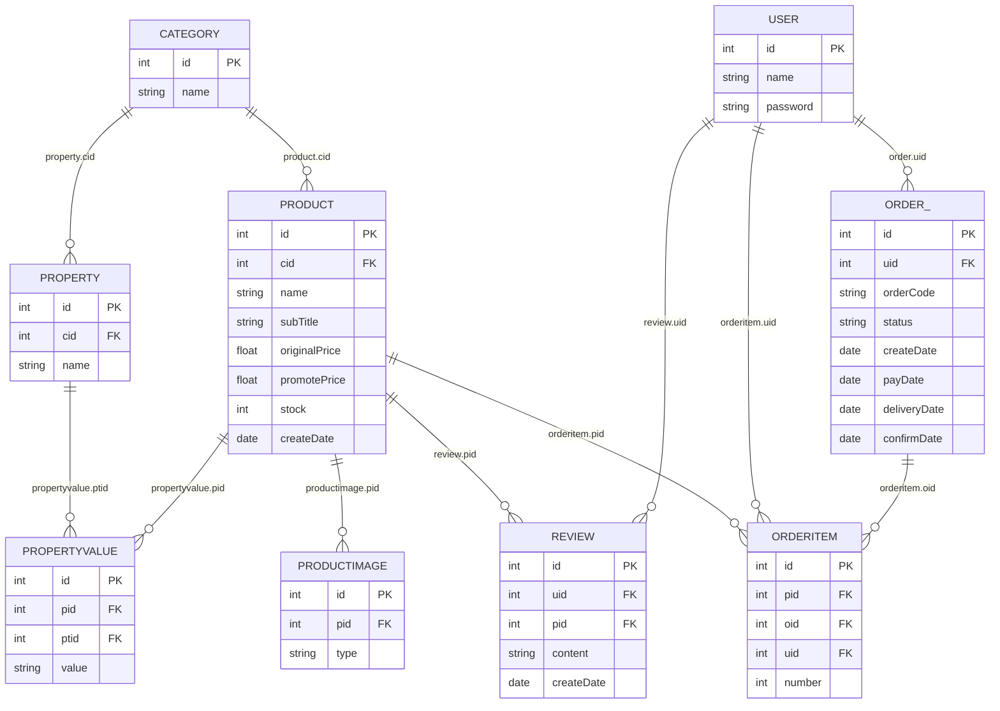

# Domain Model: the Nine Entities, Their Tables, Join Columns, and Transient View Fields

`com.caozhihu.tmall.pojo` holds exactly nine `@Entity` classes. They are the whole object model of the
application: Hibernate discovers them through `packagesToScan` = `com.caozhihu.*`, and there is no
`.hbm.xml`, no `orm.xml` and no persistence unit — the annotations on these files *are* the mapping.
The flip side is that nothing validates them: `hibernate.hbm2ddl.auto=none` means Hibernate emits no DDL
and no schema check at startup, so `src/sql/tmall_ssh_h2.sql` is the only definition of the columns and
a field renamed without a matching DDL rename surfaces as an SQL error on first use, not at boot
(`src/com/caozhihu/tmall/pojo/Product.java#L7-L35`, `src/sql/tmall_ssh_h2.sql#L58-L69`). The mechanics
of how these classes reach the database are in
[Persistence Layer](/openwiki/architecture/persistence-layer.md); this page owns the classes themselves.

Every entity follows the same conventions, which makes the exceptions worth remembering:

- the identifier is a primitive `int id` mapped with
  `@Id @GeneratedValue(strategy = GenerationType.IDENTITY)` — identity generation, so an `INSERT`
  executes while `save()` runs and the generated key is readable immediately afterwards;
- tables and columns that are not annotated borrow the Java property name;
- every association is a unidirectional `@ManyToOne` with an explicit `@JoinColumn`; **no entity maps a
  collection and no association has an inverse side** (see §3);
- render-only data lives in `@Transient` fields that Hibernate never sees (see §5).

## 1. The nine entities at a glance

*All eleven relationships are declared on the many side as `@ManyToOne @JoinColumn`; the crow's-foot end is always an owning entity, never a mapped collection. `Order` maps to the table written `order_`.*

The grouping is meaningful: `Category` and `User` are the only entities that own no join column at all,
`Product` is the hub that four entities point at, and `User` is pointed at by three different rows
(`Order`, `OrderItem`, `Review`) for three different reasons — ownership of an order, of a cart or
order line, and of a review.

## 2. Entity by entity

### Category — table `category`

`@Table(name = "category")`. Two mapped fields only: `int id`
(`@Column(name = "id")`) and `String name`. Category declares **no association whatsoever** — it is
always the parent, never the child, and it has no "color", "sort order" or activation flag that many
catalogue schemas carry. Both `Product` and `Property` hang off it through their own `cid` column.

Two `@Transient` fields make it a view object as well: `List<Product> products` and
`List<List<Product>> productsByRow` (`src/com/caozhihu/tmall/pojo/Category.java#L6-L20`).

### Property — table `property`

`@Table(name = "property")`. Fields: `int id`, `@Column(name = "name") String name`, and
`@ManyToOne @JoinColumn(name = "cid") Category category`
(`src/com/caozhihu/tmall/pojo/Property.java#L5-L19`). A `Property` is an attribute *definition*
scoped to a category (品牌, 型号, 分辨率 …); its allowed values are not a column set but the free-text
`PropertyValue.value` rows that reference it. Nothing on the entity constrains the name, its
uniqueness per category, or the number of properties a category may have.

### Product — table `product`

`@Table(name = "product")`. `int id` is annotated with a bare `@Column` (so the column name falls back
to `id`); scalars are `String name`, `String subTitle`, `float originalPrice`, `float promotePrice`,
`int stock`, `java.util.Date createDate`; the single association is
`@ManyToOne @JoinColumn(name = "cid") Category category`
(`src/com/caozhihu/tmall/pojo/Product.java#L7-L24`).

Which price is which matters beyond display: **`promotePrice` is the money multiplier** used for the
cart total (`total += oi.getProduct().getPromotePrice() * oi.getNumber()` in
`src/com/caozhihu/tmall/action/ForeAction.java#L179-L184`), for `Order.total` recomputation
(`src/com/caozhihu/tmall/service/impl/OrderItemServiceImpl.java#L30-L35`), and for the total returned by
order creation (`src/com/caozhihu/tmall/service/impl/OrderServiceImpl.java#L25-L34`). `originalPrice` is
read only by JSPs, as a struck-through comparison price. `stock` is likewise display-and-script data:
the only writer of `setStock` in `src/` is Struts parameter binding from the admin product forms, and
no purchase path reads or decrements it — the cart's "cannot exceed stock" rule is client-side
JavaScript only (`web/include/cart/cartPage.jsp#L82-L111`), while `ForeAction.buyone` / `addCart` add
`num` items without any stock check (`src/com/caozhihu/tmall/action/ForeAction.java#L148-L211`).

Product also carries five `@Transient` fields (`firstProductImage`, `productSingleImages`,
`productDetailImages`, `reviewCount`, `saleCount`) described in §5.

### PropertyValue — table `propertyvalue`

`@Table(name = "propertyvalue")`. Fields: `int id`; `Product product` over the join column `pid`;
`Property property` over the join column `ptid`; and `String value`, whose column name falls back to
`value` (`src/com/caozhihu/tmall/pojo/PropertyValue.java#L5-L21`).

This is the only entity with **two** parent associations, and the model's only row that binds two other
entities together: the value of attribute `property` for product `product`. Note the asymmetry between
mapping and DDL — the script constrains `ptid` with a foreign key but gives `pid` none
(`src/sql/tmall_ssh_h2.sql#L1357-L1365`).

Rows are never created by an explicit "add value" action. `PropertyValueServiceImpl.init(Product)` walks
every `Property` of the product's category, looks up the `(product, property)` pair, and inserts a blank
`PropertyValue` when the pair is missing, so that the admin edit screen always has a row to update
(`src/com/caozhihu/tmall/service/impl/PropertyValueServiceImpl.java#L17-L44`). `PropertyValueAction.edit`
calls `init(product)` and *then* `listByParent(product)`, which is the only place the initialised rows
are read (`src/com/caozhihu/tmall/action/PropertyValueAction.java#L7-L13`); there is no code that deletes
a pair, so adding then removing a `Property` leaves its values behind (the "欠缺" the delete action's own
comment admits: `src/com/caozhihu/tmall/action/PropertyAction.java#L32-L39`).

### ProductImage — table `productImage`

`@Table(name = "productImage")` (the script spells the table `productimage`; identifiers are unquoted,
so both resolve to the same table). Fields: `int id`; `Product product` over the join column `pid`; and
`String type` (`src/com/caozhihu/tmall/pojo/ProductImage.java#L7-L20`).

**No image bytes are stored.** The row records which product and which kind of image it is; the JPEG
lives on the filesystem named `<id>.jpg` under `img/productSingle` or `img/productDetail`, a folder
`ProductImageAction.add` picks from `type`, together with the two resized copies
(`src/com/caozhihu/tmall/action/ProductImageAction.java#L20-L52`). Deleting a row therefore orphans
files, and copying the database without the webapp image folders produces rows whose `src` 404s.

`type` is a free `varchar(255)` with no constraint; the vocabulary lives on the service interface
(§4). Any value that is not exactly `type_single` — including `null` — is treated as a detail image by
the folder branch, and only `type_single` rows are eligible to become a product's thumbnail.

### Review — table `review`

`@Table(name = "review")`. Fields: `int id`, `@ManyToOne @JoinColumn(name = "uid") User user`,
`@ManyToOne @JoinColumn(name = "pid") Product product`, `String content`, `java.util.Date createDate`
(`src/com/caozhihu/tmall/pojo/Review.java#L6-L23`; the script types `content` as `varchar(4000)`).

A review points at a user and a product but **not at an order or an order item**, so no row records
which purchase produced it — a user can review a product they never bought, and the same product can be
reviewed repeatedly by the same user, because there is no per-order or per-user uniqueness constraint
anywhere. The single write path is `ReviewServiceImpl.saveReviewAndUpdateOrderStatus(review, order)`,
which updates the order status and inserts the review in one transaction
(`src/com/caozhihu/tmall/service/impl/ReviewServiceImpl.java#L18-L23`); `ForeAction.doreview` is the
only caller and it is reached through `forereview`, which reads a review target out of the caller's own
`Order.orderItems` (`src/com/caozhihu/tmall/action/ForeAction.java#L310-L338`).

### User — table `user`

`@Table(name = "user")`. Fields: `int id`, `String password`, `String name`. This is the only entity
with no join column and no `@Transient` field (`src/com/caozhihu/tmall/pojo/User.java#L5-L15`).

Three facts about it are model-level, not generated plumbing:

- **The password is stored and compared in clear text.** `UserServiceImpl.get(name, password)` passes
  the submitted password straight into an equality criterion
  (`src/com/caozhihu/tmall/service/impl/UserServiceImpl.java#L11-L18`); nothing hashes or salts it, and
  the column is a plain `varchar(255)`.
- **`name` is not unique.** Neither the entity nor the DDL declares a unique constraint; uniqueness is
  only an application-level pre-check (`UserService.isExit`, called by `ForeAction.register`).
- **`name` is HTML-escaped on the way in**, at registration and at login
  (`HtmlUtils.htmlEscape` in `src/com/caozhihu/tmall/action/ForeAction.java#L26-L53`), and masked on the
  way out (`getAnonymousName`, §4).

### Order — table `order_`

`@Table(name = "order_")` — the trailing underscore avoids the reserved word `order`, which the script
uses as well (`src/sql/tmall_ssh_h2.sql#L39-L56`). Fields: `int id`;
`@ManyToOne @JoinColumn(name = "uid") User user`; the shipping block `orderCode`, `address`, `post`,
`receiver`, `mobile`, `userMessage`; four lifecycle timestamps `createDate`, `payDate`, `deliveryDate`,
`confirmDate`; and the `status` string (`src/com/caozhihu/tmall/pojo/Order.java#L9-L31`).

There is no `OrderItem` collection on `Order` and no status-validation logic on the entity: the four
dates are written once each by the action that performs the corresponding transition, and the entity
enforces no ordering, no monotonicity and no rule that a later date requires an earlier one. `status` is
a plain `varchar` with no check constraint; its vocabulary lives on `OrderService` (§4). `Order` also
carries the three `@Transient` fields `orderItems`, `total` and `totalNumber`, and the derived
`getStatusDesc()` (`src/com/caozhihu/tmall/pojo/Order.java#L33-L65`).

Because `User` has no inverse collection, "my orders" is not an association traversal:
`OrderServiceImpl.listByUserWithoutDelete(user)` builds `eq("user", user)` plus
`ne("status", OrderService.delete)` (`src/com/caozhihu/tmall/service/impl/OrderServiceImpl.java#L36-L42`).

### OrderItem — table `orderItem`

`@Table(name = "orderItem")` (script: `orderitem`). Fields: `int id`,
`@ManyToOne @JoinColumn(name = "pid") Product product`,
`@ManyToOne @JoinColumn(name = "oid") Order order`,
`@ManyToOne @JoinColumn(name = "uid") User user`, `int number`
(`src/com/caozhihu/tmall/pojo/OrderItem.java#L5-L23`).

`OrderItem` is both the cart line and the order line, distinguished by whether `oid` is set:

- a **cart line** is an `OrderItem` with `uid` set and `oid` null. Every cart screen finds its lines with
  `orderItemService.list("user", user, "order", null)` (`src/com/caozhihu/tmall/action/ForeAction.java#L213-L221`),
  and the header counter does the same
  (`src/com/caozhihu/tmall/interceptor/CartTotalItemNumberInterceptor.java#L32-L44`);
- **checkout** converts those rows: `OrderServiceImpl.createOrder(order, ois)` saves the `Order` and then
  sets `oi.setOrder(order)` on each line and updates it
  (`src/com/caozhihu/tmall/service/impl/OrderServiceImpl.java#L23-L34`).

The script leaves `oid` without a foreign key even though the entity maps the association
(`src/sql/tmall_ssh_h2.sql#L14698-L14707`). `number` is the only varied field; every total is recomputed
by multiplying it with `product.promotePrice`, so an order's money is not stored on the order row and
changes if the product's price changes afterwards.

## 3. No inverse collections: how parent-scoped lists are fetched

The mapping is deliberately one-directional. Eleven `@ManyToOne` associations exist and not one
`@OneToMany`, `@ManyToMany` or `mappedBy`. Two consequences follow, and both are load-bearing.

**A parent cannot hand out its children.** Any child list must be queried from the child's own service.
The generic helpers `BaseServiceImpl.listByParent(Object)`, `list(Page, Object)` and `total(Object)`
derive the criteria property from the parent's *class name*: the simple name is uncapitalized with
`StringUtils.uncapitalize` and used as the property, so a `Category` parent becomes the criteria
`Restrictions.eq("category", parent)`, an `Order` parent becomes `eq("order", parent)`, a `Product`
parent `eq("product", parent)` (`src/com/caozhihu/tmall/service/impl/BaseServiceImpl.java#L70-L106`).
The Java field name on the child entity is therefore a cross-class contract: renaming
`Product.category` or `OrderItem.order` silently changes the rows the helper returns — or makes the
query fail — with no compile-time signal. The same convention names the pair-parameter keys of
`list(Object... pairParams)` (`"product"`, `"user"`, `"order"`, `"type"`,
`src/com/caozhihu/tmall/service/impl/BaseServiceImpl.java#L128-L146`).

**A null value in that pair list means `IS NULL`, not "ignore this key".** `list(Object...)` folds the
arguments into a `HashMap` and emits `Restrictions.isNull(key)` when the value is null, `eq(key, value)`
otherwise. That single line is how "still in the cart" is expressed: passing `"order", null` selects the
order-less lines belonging to a user, and it is used identically in four `ForeAction` methods and in the
cart counter interceptor (`src/com/caozhihu/tmall/service/impl/BaseServiceImpl.java#L136-L145`).
Because the pairs go into a map, passing the same key twice also silently discards the earlier pair.

The concrete parent → child scopes in use:

| Parent | Child | Child association property | Helper actually called |
|---|---|---|---|
| `Category` | `Product` | `category` (on `Product`) | `productService.listByParent(category)` (`ProductServiceImpl.fill`), `productService.list(page, category)` (`ProductAction.list`) |
| `Category` | `Property` | `category` (on `Property`) | `propertyService.listByParent(category)` (`PropertyValueServiceImpl.init`), plus the overrides `listByCategory(category)`, `list(page, category)`, `total(category)` (`PropertyServiceImpl.java#L16-L44`) |
| `Product` | `PropertyValue` | `product` | `propertyValueService.listByParent(product)`; the pair form for one attribute (`PropertyValueServiceImpl.get`) |
| `Product` | `ProductImage` | `product` | `productImageService.list("product", product, "type", …)` |
| `Product` | `Review` | `product` | `reviewService.listByParent(product)`, `reviewService.total(product)` |
| `Product` | `OrderItem` | `product` | `orderItemService.list("product", product)` (the `saleCount` computation) |
| `Order` | `OrderItem` | `order` | `orderItemService.listByParent(order)` (`OrderItemServiceImpl.fill`) |
| `User` | `OrderItem` | `user` | `orderItemService.list("user", user, "order", null)` |
| `User` | `Order` | `user` | `OrderServiceImpl.listByUserWithoutDelete` |
| `User` | `Review` | `user` | mapped and constrained in the DDL, but no caller: reviews are only ever read per product |

The parent-scoped **count** helper is a separate statement from the paged list
(`total(parent)` builds `select count(*) from <FQN> bean where bean.<prop> = ?0`), so paging screens do a
count and a page query with no shared snapshot — the details are in
[Pagination and Search](/openwiki/workflows/pagination-and-search.md). Note also that `total(Object)` is
free to receive any parent object; `ProductAction.list` pairs the product page with
`propertyService.total(category)`, i.e. a property count used as a product count
(`src/com/caozhihu/tmall/action/ProductAction.java#L11-L25`). 【人工评审待确认】 whether that pairing is
intended or a copy-and-paste of the `PropertyAction.list` line above it.

Finally, every one of these list methods appends `Order.desc("id")` (`BaseServiceImpl.java#L46-L50`,
`#L76-L79`, `#L144`), which is why things the UI calls "first" are actually the highest-`id` row — see
`setFirstProductImage` in §5.

## 4. Derived accessors and the string vocabularies

Two accessors on entities produce values that were never persisted, and they are consumed directly by
JSPs:

- **`Order.getStatusDesc()`** — a `switch` over `status` returning 待付 / 待发 / 待收 / 等评 / 完成 / 刪除
  for the six status constants; the local `desc` is initialised to `"未知"` and the `default` branch
  keeps it, so any unrecognised value renders as 未知 (`src/com/caozhihu/tmall/pojo/Order.java#L40-L65`).
  Its only reader is `${o.statusDesc}` in
  `web/admin/listOrder.jsp#L55`; the storefront pages instead compare the raw literal in EL
  (`${o.status=='waitPay'}` in `web/include/cart/boughtPage.jsp#L163`, `'waitConfirm'` at `#L158`).
  Because the value switched on is the `status` string itself, a row whose `status` is `null` makes
  `getStatusDesc()` throw a `NullPointerException` during rendering; the column is nullable in the DDL
  (`src/sql/tmall_ssh_h2.sql#L39-L56`) and no constraint prevents it, so "status is always set" holds
  only because every write path sets it (`ForeAction.createOrder` → `waitPay`, `payed` → `waitDelivery`,
  `OrderAction.delivery` → `waitConfirm`, `orderConfirmed` → `waitReview`, `doreview` → `finish`,
  `deleteOrder` → `delete`).
- **`User.getAnonymousName()`** — masks the stored name for review display: `null` name → `null`,
  length ≤ 1 → `"*"`, length 2 → first character plus `"*"`, longer → first and last character kept with
  every character between them replaced by `"*"` (`src/com/caozhihu/tmall/pojo/User.java#L17-L34`). The
  JSPs that render reviews use it (`web/include/product/productReview.jsp#L31`,
  `web/include/cart/reviewPage.jsp#L59`); nothing else computes the masked form.

Both vocabularies live on **service interfaces, not entities**, so an entity has no compile-time
knowledge of the values it can hold:

| Vocabulary | Declaration | Values | Consumers |
|---|---|---|---|
| Order status | `OrderService` (`src/com/caozhihu/tmall/service/OrderService.java#L12-L17`) | `waitPay`, `waitDelivery`, `waitConfirm`, `waitReview`, `finish`, `delete` | every order transition in `ForeAction` / `OrderAction`, `Order.getStatusDesc`, `listByUserWithoutDelete`, plus literal comparisons in `boughtPage.jsp` |
| Product image type | `ProductImageService` (`src/com/caozhihu/tmall/service/ProductImageService.java#L6-L11`) | `type_single`, `type_detail` | `setFirstProductImage`, `ForeAction.product`, `ProductImageAction`, and the literal in `web/admin/listProductImage.jsp#L63` |

Changing a constant's *string* value silently breaks the matching literal in the JSP and the values
already stored by the seed script (`INSERT INTO productimage VALUES (… 'type_single')`,
`src/sql/tmall_ssh_h2.sql#L164`); changing a constant's *name* breaks the compilation of the switch
labels and the `case OrderService.waitReview` arms. 【人工评审待确认】 whether the duplicated literals are
considered an accepted trade-off.

## 5. `@Transient` view fields and who fills them

`@Transient` marks a field Hibernate ignores: it is never written, never read back and cannot appear in
a `DetachedCriteria` or HQL string. Ten such fields exist across three entities, and each has a
runtime filler that must run before the view that needs it:

| Field | Filled by | Reached from |
|---|---|---|
| `Category.products` (`List<Product>`) | `ProductServiceImpl.fill(Category)`, which also calls `setFirstProductImage` per product | `fill(List<Category>)` from `ForeAction.home`; `fill(category)` from `ForeAction.category` |
| `Category.productsByRow` (`List<List<Product>>`) | `ProductServiceImpl.fillByRow(List<Category>)` — chunks `category.getProducts()` into groups of 8 | `ForeAction.home` only |
| `Product.firstProductImage` | `ProductImageServiceImpl.setFirstProductImage(Product)` | `ProductServiceImpl.fill`, `OrderItemServiceImpl.fill`, `ForeAction.product` / `search`, `ProductAction.list`, the cart screens |
| `Product.productSingleImages` / `Product.productDetailImages` | `ForeAction.product` (two `list("product", p, "type", …)` calls, then the setters) | product detail page only |
| `Product.reviewCount` | `ProductServiceImpl.setSaleAndReviewNumber(Product)` via `reviewService.total(product)` | `ForeAction.product` / `category` / `search` / `revice` |
| `Product.saleCount` | same method, summing `OrderItem.number` over `list("product", product)` | as above |
| `Order.orderItems` | `OrderItemServiceImpl.fill(Order)` via `listByParent(order)` | `ForeAction.bought` / `confirmPay` / `revice`, `OrderAction.list` |
| `Order.total` / `Order.totalNumber` | same method: `Σ number × product.promotePrice` and `Σ number` | as above |

Points a reader will otherwise get wrong:

- **`fillByRow` depends on `fill` having run first.** It reads `category.getProducts()` rather than
  querying, so calling it on categories whose `products` is still `null` throws `NullPointerException`
  (`src/com/caozhihu/tmall/service/impl/ProductServiceImpl.java#L42-L56`). `ForeAction.home` happens to
  call `fill(categories)` then `fillByRow(categories)` in that order
  (`src/com/caozhihu/tmall/action/ForeAction.java#L18-L24`).
- **"First" product image means newest single image.** `setFirstProductImage` returns immediately if the
  field is already set, otherwise takes element 0 of
  `list("product", product, "type", ProductImageService.type_single)` — a list ordered `id desc` by the
  helper — so the thumbnail is the highest-`id` `type_single` row, not the oldest
  (`src/com/caozhihu/tmall/service/impl/ProductImageServiceImpl.java#L16-L26`). The early return makes
  the call idempotent, which is what lets both `ProductServiceImpl.fill` and `OrderItemServiceImpl.fill`
  call it on objects that may already carry an image.
- **`saleCount` counts cart lines and unpaid orders.** `setSaleAndReviewNumber` sums `number` over *all*
  `OrderItem` rows for the product with no status filter and no join to `Order`, so lines still sitting
  in somebody's cart (where `oid` is null) are counted as sold; the in-file comment records that the
  author replaced a count-of-rows implementation with this one and considers it to have introduced
  another problem (`src/com/caozhihu/tmall/service/impl/ProductServiceImpl.java#L58-L72`).
  【人工评审待确认】 whether the extra lines are accepted or a defect to fix. `reviewCount` by contrast
  is a plain `count(*)` over `Review` for the product.
- **`Order.total` has two near-twins.** `Order.total` is the transient sum recomputed at read time;
  `OrderService.createOrder` *returns* a total without setting it on the `Order`
  (`OrderServiceImpl.java#L23-L34`), and `ForeAction.createOrder` stores that return value in the
  action's own `float total` field (`Action4Parameter.total`,
  `src/com/caozhihu/tmall/action/ForeAction.java#L243-L262`). Editing `Order.total` in code does not
  make it a stored column, and saving the order does not persist it.
- **The admin screens keep the image lists on the action, not the product.**
  `ProductImageAction.list` and `ProductAction.list` assign to `Action4Pojo.productSingleImages` /
  `productDetailImages` (`src/com/caozhihu/tmall/action/ProductImageAction.java#L12-L18`), so
  `Product.productSingleImages` is populated on the storefront path only.
- **Rendering an unfilled transient field is silent.** A JSP that reads `${p.saleCount}` on a product no
  service filled prints `0`, and an unfilled `products`/`orderItems` collection renders as an empty
  `c:forEach` — no exception, no warning.
- **Transient fields are lost on round-trip.** Hibernate ignores them on `save`/`update`, so an entity
  passed through a form and re-saved comes back without them; anything a JSP needs must be refilled by
  the action that renders it (see [View Layer](/openwiki/architecture/view-layer.md)).

## 6. Invariants, failure modes and extension points

- **All nine ids are `int` + `IDENTITY`.** `BaseServiceImpl.save` casts `HibernateTemplate.save`'s
  `Serializable` return to `Integer`, so switching a single entity's `@Id` to `long` turns every insert
  on that service into a `ClassCastException` (`BaseServiceImpl.java#L108-L116`). Identity generation is
  also why actions may read `getId()` immediately after saving — `CategoryAction.add` builds the image
  file name from the new id (`src/com/caozhihu/tmall/action/CategoryAction.java#L28-L35`) and
  `ForeAction.buyone` returns the new `OrderItem` id (`ForeAction.java#L148-L171`).
- **No cascade, and deletes are limited by the DDL rather than by the mapping.** No association declares
  `cascade`, so a delete never removes child rows: `CategoryAction.delete`, `ProductAction.delete` and
  `ForeAction.deleteOrder` each issue a single `delete` on one row. Nine of the eleven join columns carry
  a DDL foreign key (`product.cid`, `property.cid`, `productimage.pid`, `propertyvalue.ptid`,
  `order_.uid`, `review.uid`, `review.pid`, `orderitem.uid`, `orderitem.pid`), so the database rejects
  deleting a parent that still has children; the two columns without a constraint —
  `propertyvalue.pid` and `orderitem.oid` — let the child rows survive as orphans
  (`src/sql/tmall_ssh_h2.sql#L1357-L1365`, `#L14698-L14707`).
- **Associations are eagerly fetched.** `@ManyToOne` defaults to `EAGER`, so loading an `OrderItem`
  loads its `Product`, `Order` and `User`, and loading a `Product` loads its `Category`. That is what
  lets a JSP walk `oi.product.promotePrice` on a detached object after the DAO call returned. Because
  this application installs no `OpenSessionInView` filter, adding a `@OneToMany` or switching any
  association to `fetch = LAZY` would move the failure to render time
  ([Persistence Layer](/openwiki/architecture/persistence-layer.md)).
- **Column names are convention.** Only `id`, `name` (`Property`), `cid`, `pid`, `ptid`, `uid` and `oid`
  are annotated; every other column name is the Java property name, so `subTitle`, `promotePrice`,
  `orderCode` and `createDate` must keep matching the hand-written DDL. Add a field and nothing happens
  until a query selects it.
- **Adding an entity means adding a service with a matching name.** `BaseServiceImpl`'s constructor
  resolves its own entity class by reflection from the subclass name (`…ServiceImpl` in
  `…service.impl` → class in `…pojo`), so a new entity needs its `ServiceImpl` twin in the expected
  package; otherwise `clazz` is null and the first query fails at runtime
  ([Service Layer](/openwiki/architecture/service-layer.md)).

## 7. Where the README disagrees with the annotations

`README.md` publishes a 表结构 table of the nine tables and an 一/多 table of eleven relationships. The
relationship list matches the annotations and the DDL row for row with one exception: the last entry is
written `User-用户 / User-评价`, whose many side names `User` again. The actual association is
`Review.user` → `user.id` via `review.uid` (`src/com/caozhihu/tmall/pojo/Review.java#L14-L20`), so the
many side should read `Review-评价`. Treat the annotations as the source of truth.

Two smaller documentation gaps are worth knowing before trusting that README table:

- It lists `数据库：MySQL` in the stack description, while the repository as checked in runs H2 in MySQL
  mode against the adapted script `src/sql/tmall_ssh_h2.sql`; the entity annotations are
  dialect-independent but the DDL file is not the one quoted in the README
  ([Configuration Surface](/openwiki/architecture/configuration.md)).
- It says nothing about the `@Transient` fields or the derived accessors, even though every storefront
  page depends on them — the README's model of the data is the persisted model only.

## See also

- [Persistence Layer](/openwiki/architecture/persistence-layer.md) — how these annotated classes reach
  the database, the criteria the services build over them, and the transaction boundaries.
- [Service Layer](/openwiki/architecture/service-layer.md) — the CRUD surface and the reflection that
  binds each service to its entity.
- [Order Lifecycle](/openwiki/workflows/order-lifecycle.md) — the `status` vocabulary in motion.
- [Storefront Shopping](/openwiki/workflows/storefront-shopping.md) — cart, checkout and review flows
  built on `OrderItem`.
- [Image Pipeline](/openwiki/workflows/image-pipeline.md) — `ProductImage` rows and the files behind
  them.
- [Operations: Data and Schema](/openwiki/operations/data-and-schema.md) — the seed script, the tables
  it creates and the demo rows it inserts.
