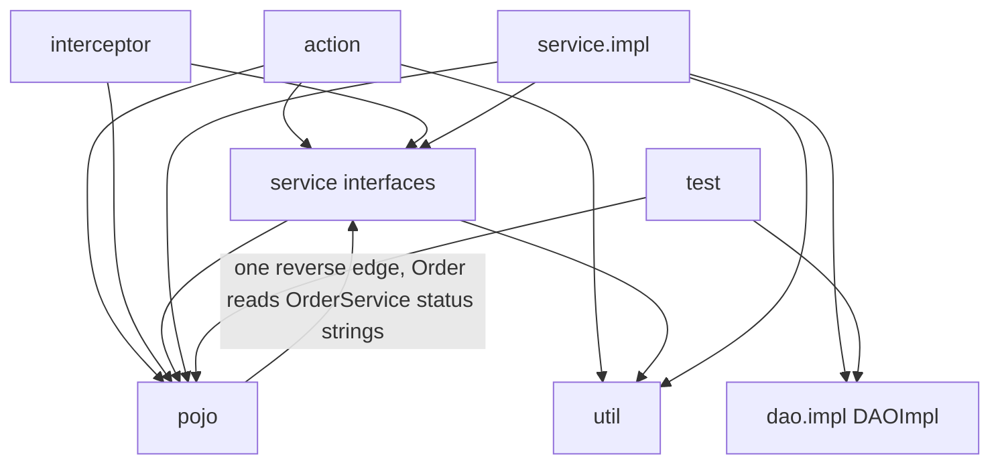
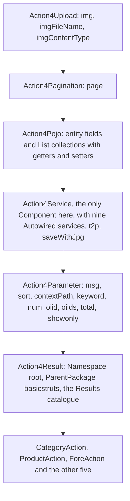
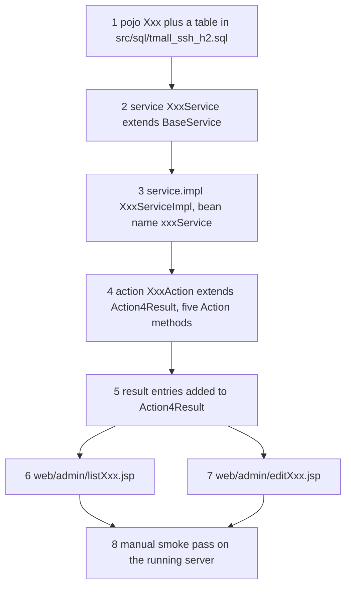

# SDD Baseline: Package, Naming, and Placement Rules for New Code

This is the conventions page the project instructions ask for (规则2：归纳本项目基线约束规范,
`openwiki/INSTRUCTIONS.md`). It states a rule only where the repository already demonstrates it, and
cites the file that demonstrates it, so the reader can re-check every line. It is a **draft baseline
(规范初稿) that needs human review** (规则5), and per 规则3 it invents no business rule and no
acceptance criterion — everything the code cannot settle is collected in the review list at the end
of the page, marked 【人工评审待确认】.

Read this page before adding an endpoint, a screen, an entity or a service. It owns *where a file
goes and what it must be called*. The mechanisms behind those rules live on
[Action Layer](/openwiki/architecture/action-layer.md) (the `Action4*` chain, `t2p()`, result
resolution), [Service Layer](/openwiki/architecture/service-layer.md) (the reflection-derived
`clazz`, delegation, transactions), [View Layer](/openwiki/architecture/view-layer.md) (the JSP
include graph) and [Request Pipeline](/openwiki/architecture/request-pipeline.md) (URL to result to
view). The do-not-break name lists are on
[Runtime Invariants](/openwiki/conventions/runtime-invariants.md); the runtime behaviour of one
admin CRUD pass is [Admin CRUD Screens](/openwiki/workflows/admin-crud.md).

The single fact that makes naming load-bearing here: `src/struts.xml` declares **no `<action>`
element** (`src/struts.xml#L7-L26`), so every one of the 47 endpoints exists only as an `@Action`
string on a method, and every result name only as a string in a `@Results` block that must match a
`@Result`-declared path or a JSP file name.

## 1. The package map and the direction dependencies run

| Package | What belongs in it | Evidence |
|---|---|---|
| `com.caozhihu.tmall.action` | Concrete actions (`CategoryAction`, `ProductAction`, `ForeAction`, …) and the six-class `Action4*` chain. Imports `service` interfaces, `pojo`, `util` — never `service.impl` or `dao.impl` | `src/com/caozhihu/tmall/action/CategoryAction.java#L1-L14`, `src/com/caozhihu/tmall/action/Action4Service.java#L3-L4` |
| `com.caozhihu.tmall.service` | One interface per entity, each `extends BaseService`; entity-aware method signatures; status/type string constants | `src/com/caozhihu/tmall/service/ProductService.java#L9-L16`, `src/com/caozhihu/tmall/service/OrderService.java#L10-L22` |
| `com.caozhihu.tmall.service.impl` | `XxxServiceImpl` per interface plus `BaseServiceImpl` and `ServiceDelegateDAO`. This is the only package that touches `dao.impl` | `src/com/caozhihu/tmall/service/impl/ServiceDelegateDAO.java#L3-L25` |
| `com.caozhihu.tmall.dao.impl` | `DAOImpl` only: a `HibernateTemplate` subclass named by `@Repository("dao")`, with no interface above it | `src/com/caozhihu/tmall/dao/impl/DAOImpl.java#L9-L18` |
| `com.caozhihu.tmall.pojo` | JPA-annotated entities; view-only fields marked `@Transient` | `src/com/caozhihu/tmall/pojo/Product.java#L7-L36` |
| `com.caozhihu.tmall.interceptor` | Struts interceptors extending `AbstractInterceptor` | `src/com/caozhihu/tmall/interceptor/AuthInterceptor.java#L18-L24` |
| `com.caozhihu.tmall.util` | Plain helpers with no Spring annotation and no project imports (`Page`, `ImageUtil`) | `src/com/caozhihu/tmall/util/Page.java#L3-L14`, `src/com/caozhihu/tmall/util/ImageUtil.java#L9-L10` |
| `com.caozhihu.tmall.test` | Test classes compiled by the same launcher as production code | `src/com/caozhihu/tmall/test/TestTmall.java#L15-L17` |



*The only import edges that exist between the project's packages. `action` never reaches `service.impl` or `dao.impl`, and `service.impl` reaches `dao.impl` from exactly one class.*

Two consequences worth knowing before adding a file:

- **`src/` is the single source root.** The embedded launcher compiles every `.java` under `src/`
  into `web/WEB-INF/classes` on each start and copies the non-Java resources with them
  (`src/StartJetty.java#L146-L160`, `MIGRATION.md#L28-L35`). New code goes under
  `src/com/caozhihu/tmall/<package>/`; `web/WEB-INF/classes` is disposable output.
- **The Spring scan is package-based, not file-listed.** `<context:component-scan
  base-package="com.caozhihu.tmall.*"/>` collects the `@Service`/`@Component`/`@Repository` beans and
  `<property name="packagesToScan">com.caozhihu.*</property>` collects the entities
  (`src/applicationContext.xml#L14-L17`, `#L51-L55`). A class outside those trees is never wired and
  never mapped, no matter what it is named.

## 2. Action placement: in `.action`, extending `Action4Result`

Every concrete action class in the repository extends `Action4Result`
(`CategoryAction`, `ProductAction`, `ProductImageAction`, `PropertyAction`, `PropertyValueAction`,
`UserAction`, `OrderAction`, `ForeAction` — 47 `@Action` methods between them). The chain, in the
order the code declares it, and what each link contributes:



*What a new action inherits by extending `Action4Result`. The chain is the only place these members are declared.*

| Chain class | Supplies | Citation |
|---|---|---|
| `Action4Upload` | `img`, `imgFileName`, `imgContentType` — the multipart upload fields every action may bind | `src/com/caozhihu/tmall/action/Action4Upload.java#L5-L28` |
| `Action4Pagination` | `page` of type `Page` | `src/com/caozhihu/tmall/action/Action4Pagination.java#L5-L13` |
| `Action4Pojo` | the nine entity properties (`category`, `product`, `order`, …) and ten `List` properties, each with a getter a JSP can read | `src/com/caozhihu/tmall/action/Action4Pojo.java#L9-L28` |
| `Action4Service` | `@Component`; the nine `@Autowired` service properties with getters/setters; `t2p(Object)`; `saveWithJpg(File)` | `src/com/caozhihu/tmall/action/Action4Service.java#L15-L83` |
| `Action4Parameter` | the loose request parameters: `msg`, `sort`, `contextPath`, `keyword`, `num`, `oiid`, `oiids`, `total`, `showonly` | `src/com/caozhihu/tmall/action/Action4Parameter.java#L3-L29` |
| `Action4Result` | `@Namespace("/")`, `@ParentPackage("basicstruts")` and the whole `@Results` catalogue; the class body is empty | `src/com/caozhihu/tmall/action/Action4Result.java#L8-L68` |

Rules that follow from the above:

- **One class per entity in the back office, one class for the whole storefront.** The admin
  endpoints are split by entity (`CategoryAction` holds the five `admin_category_*` methods, and so
  on), while `ForeAction` holds all 24 `fore…` endpoints
  (`src/com/caozhihu/tmall/action/ForeAction.java#L16-L338`). A new admin screen therefore means a
  new `XxxAction`; a new storefront page usually means one more method on `ForeAction`.
- **A method is an endpoint only if it carries `@Action("…")`.** The string is the URL, the returned
  `String` is a result name, and neither is checked by the compiler
  (`src/com/caozhihu/tmall/action/CategoryAction.java#L16-L26`).
- **New result names go into the shared catalogue on `Action4Result`, not into the subclass.** The
  list pages, edit pages and redirects of every entity are declared once
  (`src/com/caozhihu/tmall/action/Action4Result.java#L10-L67`); `CategoryAction.list()` returns
  `"listCategory"` without declaring anything (`#L25`), which is only resolvable because the parent
  carries the `@Result`. The recorded acceptance run confirms the arrangement works end to end
  (`MIGRATION.md#L75-L83`).
- **`@ParentPackage("basicstruts")` is what attaches the application's interceptor stack.**
  `basicstruts` is the package defined in `src/struts.xml`, and it sets
  `<default-interceptor-ref name="auth-dafault">` — so an action that does not inherit this
  annotation runs without the auth/cart/category interceptors
  (`src/struts.xml#L10-L25`).
- **Service injection is by the inherited property names.** `Action4Service` declares
  `categoryService`, `propertyService`, `productService`, `productImageService`,
  `propertyValueService`, `userService`, `orderService`, `orderItemService`, `reviewService`, each
  annotated `@Autowired`, and each `ServiceImpl` is declared `@Service("<sameName>")`
  (`src/com/caozhihu/tmall/action/Action4Service.java#L19-L44` versus
  `src/com/caozhihu/tmall/service/impl/ProductServiceImpl.java#L15`). A service added for a new
  entity must be reachable through this chain — which in practice means adding the property (or
  reusing a generic service) rather than injecting into the concrete action only.
- **`t2p(Object)` is the inherited way to turn an id-only parameter into a persistent object**
  (`…/admin_category_edit?category.id=27` → `t2p(category)` →
  `src/com/caozhihu/tmall/action/Action4Service.java#L57-L71`, used at
  `src/com/caozhihu/tmall/action/CategoryAction.java#L58`). Uploads use the inherited `saveWithJpg`
  (`src/com/caozhihu/tmall/action/Action4Service.java#L75-L83`).
- Actions themselves are not annotated — `Action4Service` is the only `@Component` in the whole
  action package (`src/com/caozhihu/tmall/action/Action4Service.java#L15`), and the concrete actions
  rely on `struts.objectFactory=spring` (`src/struts.xml#L9`) plus the inherited setters.

## 3. Service placement: interface plus impl, and the name that derives the entity

The pattern is uniform across all nine entity services:

| Rule | Example | Citation |
|---|---|---|
| Interface `XxxService` in `com.caozhihu.tmall.service`, `extends BaseService`, declaring only the extra domain methods | `ProductService.search`, `OrderService.createOrder`, `OrderItemService.fill` | `src/com/caozhihu/tmall/service/ProductService.java#L9-L16`, `src/com/caozhihu/tmall/service/OrderService.java#L19-L21` |
| Implementation `XxxServiceImpl` in `com.caozhihu.tmall.service.impl`, `extends BaseServiceImpl implements XxxService`, annotated `@Service("xxxService")` | `@Service("productService") class ProductServiceImpl extends BaseServiceImpl implements ProductService` | `src/com/caozhihu/tmall/service/impl/ProductServiceImpl.java#L15-L16` |
| An entity with only inherited CRUD gets an empty pair — the interface and impl carry no method at all | `CategoryService`, `CategoryServiceImpl` | `src/com/caozhihu/tmall/service/CategoryService.java#L9-L11`, `src/com/caozhihu/tmall/service/impl/CategoryServiceImpl.java#L6-L10` |
| Domain status/type strings live on the service interface as `public static final String` constants, and other layers reference them instead of literals | `OrderService.waitPay` … `delete`, `ProductImageService.type_single` / `type_detail` | `src/com/caozhihu/tmall/service/OrderService.java#L12-L17`, `src/com/caozhihu/tmall/service/ProductImageService.java#L8-L9`, consumed at `src/com/caozhihu/tmall/pojo/Order.java#L40-L64` |
| Services may depend on other services | `ProductServiceImpl` injects `ProductImageService`, `OrderItemService`, `ReviewService` | `src/com/caozhihu/tmall/service/impl/ProductServiceImpl.java#L18-L23` |

**The hard placement constraint.** `BaseServiceImpl`'s constructor derives its entity class from the
name of the instantiating subclass: it takes `getStackTrace()[1]`'s class name, strips the
`ServiceImpl` suffix to get the entity's simple name, and rewrites the package
`.service.impl` → `.pojo` (`src/com/caozhihu/tmall/service/impl/BaseServiceImpl.java#L20-L43`). So for
a working service:

1. the implementation must be named `XxxServiceImpl`;
2. its entity must be a class named `Xxx`;
3. that entity must live in the `.pojo` package that is the sibling of `.service.impl`;
4. there is no setter, no override and no `@Qualifier` to correct it afterwards — the field is
   `protected Class clazz` with a single assignment, and a `ClassNotFoundException` is only printed
   before the first query fails on a null `clazz`
   (`src/com/caozhihu/tmall/service/impl/BaseServiceImpl.java#L20-L50`).

Transactions follow the annotation convention rather than a service-layer façade:
`<tx:annotation-driven transaction-manager="transactionManager"/>`
(`src/applicationContext.xml#L16-L17`), `@Transactional` on `BaseServiceImpl.save`
(`…/BaseServiceImpl.java#L112-L116`), `@Transactional(readOnly = false)` where a method must write
across rows (`src/com/caozhihu/tmall/service/impl/PropertyValueServiceImpl.java#L22-L24`,
`src/com/caozhihu/tmall/action/PropertyAction.java#L25-L30`).

## 4. DAO access: delegate through the service, never inject the DAO

- `DAOImpl` is the only DAO class, it extends `HibernateTemplate`, it is `@Repository("dao")`, and it
  has no interface (`src/com/caozhihu/tmall/dao/impl/DAOImpl.java#L9-L18`). The absence of an
  interface is a recorded design choice, not an oversight (`README.md#L81-L95`).
- The single bridge is `ServiceDelegateDAO`: it holds `@Resource(name = "dao") private DAOImpl dao`
  and re-declares every `HibernateTemplate` operation as a plain method that forwards to `dao`
  (`src/com/caozhihu/tmall/service/impl/ServiceDelegateDAO.java#L19-L30`). `BaseServiceImpl` extends
  it, so `findByCriteria`, `find`, `save`, `delete`, `update` are callable as if they were the
  service's own (`src/com/caozhihu/tmall/service/impl/BaseServiceImpl.java#L18`, `#L45-L146`).
- Consequence for new code: a service method queries through the inherited methods or through
  `DetachedCriteria.forClass(clazz)` — it does not obtain a `SessionFactory` and does not import
  `DAOImpl`. No class outside `ServiceDelegateDAO` (and the one test) imports `dao.impl`.
- The delegation list is hand-written, one method per `HibernateTemplate` operation. A new data
  operation that `HibernateTemplate` already offers becomes available to services by adding one more
  forwarding method to `ServiceDelegateDAO` — that class is the extension point.

## 5. Entities: placement, annotation style, and the SQL script

Entities live in `com.caozhihu.tmall.pojo` and follow one annotation shape
(`src/com/caozhihu/tmall/pojo/Product.java#L7-L36`,
`src/com/caozhihu/tmall/pojo/OrderItem.java#L5-L23`):

```java
@Entity
@Table(name = "product")
public class Product {
    @Id
    @GeneratedValue(strategy = GenerationType.IDENTITY)
    @Column
    int id;

    @ManyToOne
    @JoinColumn(name = "cid")
    private Category category;
    ...
    @Transient
    private ProductImage firstProductImage;  // view-only, filled by a service
```

Rules a new entity must satisfy:

- **`@Entity` plus `@Table(name = …)`, an `int id` with `@Id @GeneratedValue(strategy =
  GenerationType.IDENTITY)` and `@Column`.** Every one of the nine entities repeats this
  (`Category`, `Order`, `OrderItem`, `Product`, `ProductImage`, `Property`, `PropertyValue`,
  `Review`, `User`).
- **Relations are `@ManyToOne` + `@JoinColumn(name = "<script column>")`, and the property must be
  named exactly the uncapitalized class name of the parent entity.** `Product.category` (column
  `cid`), `OrderItem.product` / `order` / `user` (columns `pid`, `oid`, `uid`),
  `PropertyValue.product` / `property` (`pid`, `ptid`), `ProductImage.product` (`pid`). That is not
  cosmetic: `BaseServiceImpl.listByParent`, `list(Page, Object)` and `total(Object)` build
  `Restrictions.eq(StringUtils.uncapitalize(parent.getClass().getSimpleName()), parent)` and an HQL
  `bean.<decapitalized name> = ?0`, so a relation property called anything else makes the inherited
  parent-scoped queries miss (`src/com/caozhihu/tmall/service/impl/BaseServiceImpl.java#L70-L106`).
- **Non-persistent, view-only fields are `@Transient`.** `Category.products` / `productsByRow`,
  `Product.firstProductImage` / `productSingleImages` / `productDetailImages` / `reviewCount` /
  `saleCount`, `Order.orderItems` / `total` / `totalNumber`
  (`src/com/caozhihu/tmall/pojo/Category.java#L16-L20`, `src/com/caozhihu/tmall/pojo/Order.java#L33-L38`).
  Services fill them; nothing persists them.
- **Column names are the Java field names in camelCase, and a new persistent field is a two-file
  edit.** The shipped columns `product.subTitle`, `product.originalPrice`, `order_.orderCode`,
  `order_.createDate` (`src/sql/tmall_ssh_h2.sql#L39-L69`) are named after the fields they hold,
  because a scalar declared with no annotation at all falls back to the field name
  (`src/com/caozhihu/tmall/pojo/Product.java#L19-L25`). A new persistent field therefore requires both
  halves: the entity field, written as a plain scalar rather than a `@Transient` one, and the matching
  column in `src/sql/tmall_ssh_h2.sql`, which Hibernate neither creates nor checks (see the next
  bullet). The shipped example is `remark`: `private String remark;` at
  `src/com/caozhihu/tmall/pojo/Product.java#L21` plus the appended statement
  `ALTER TABLE product ADD COLUMN remark varchar(255) DEFAULT NULL;` at
  `src/sql/tmall_ssh_h2.sql#L155` — appended rather than folded into the `CREATE TABLE product` column
  list above it (`#L58-L69`), and placed after the 85 seeded `INSERT INTO product` rows, so every seeded
  product carries a null `remark`. Nothing validates the pair, so a field whose column is missing from
  the script fails on the first query that touches it, not at startup. A field the admin screens edit
  needs its form input under the same OGNL name as its neighbours — the add and edit forms both carry
  `name="product.remark"` (`web/admin/listProduct.jsp#L117`, `web/admin/editProduct.jsp#L61`) — and no
  service, action or DAO class mentions it.
- **The schema comes from `src/sql/tmall_ssh_h2.sql`, not from Hibernate.** `hibernate.hbm2ddl.auto`
  is `none` (`src/applicationContext.xml#L56-L65`) and the script is executed by the `dbInit` bean at
  context start (`src/applicationContext.xml#L29-L44`). A new table, column or foreign key must be
  added there, together with the seed rows the screens expect
  (`src/sql/tmall_ssh_h2.sql#L11-L15`, `#L14699-L14712`). The script is a minimal adaptation of the
  original MySQL script and its data is unchanged (`src/sql/tmall_ssh_h2.sql#L1-L9`).
- **Table-name spelling is not uniform, and H2 is forgiving.** `@Table(name = "order_")`,
  `@Table(name = "productImage")`, `@Table(name = "orderItem")` versus the script's lowercase
  `productimage` / `orderitem`; unquoted identifiers are case-insensitive in H2, so both spellings
  resolve. A new entity should copy the script's spelling rather than the older annotations'.

## 6. Interceptors: in `.interceptor`, and registered in the stack

An interceptor lives in `com.caozhihu.tmall.interceptor`, extends
`com.opensymphony.xwork2.interceptor.AbstractInterceptor`, and may `@Autowired` services
(`src/com/caozhihu/tmall/interceptor/CartTotalItemNumberInterceptor.java#L17-L23`,
`…/CategoryNamesBelowSearchInterceptor.java#L16-L19`). The project has three: `AuthInterceptor`,
`CategoryNamesBelowSearchInterceptor`, `CartTotalItemNumberInterceptor`.

**Registration is not optional and not automatic.** `src/struts.xml` declares each one as an
`<interceptor>` and then references it inside the `<interceptor-stack name="auth-dafault">`, which is
the package's `<default-interceptor-ref>`
(`src/struts.xml#L11-L25`). An interceptor that is declared but not referenced in that stack never
runs — and because the stack is the package default, adding a reference there applies it to every
action in the `basicstruts` package at once, storefront and admin alike. The stack name is spelled
`auth-dafault` (sic) and appears in exactly those two places.

Two behaviours a new endpoint must account for:

- **`AuthInterceptor` gates storefront URLs by matching the URI remainder after `/fore` against a
  hard-coded array** `{"home", "checkLogin", "register", "login", "loginAjax", "product", "category",
  "search"}`; anything else under `/fore…` requires session attribute `user` or the client is sent to
  `login.jsp` (`src/com/caozhihu/tmall/interceptor/AuthInterceptor.java#L24-L46`). So adding a public
  storefront endpoint means adding its URI suffix — the part after `fore` — to that array, or the new
  page will redirect to the login page for anonymous visitors.
- **That check reads the raw request URI.** `AuthInterceptor` computes `contextPath` but uses
  `request.getRequestURI()` directly (`#L35-L38`), whereas the other two interceptors strip the
  context path first (`…/CartTotalItemNumberInterceptor.java#L29-L32`). It works because Jetty serves
  the application as the root context (`MIGRATION.md#L33`, `#L75-L80`).
- Interceptors write the session keys the fragments read — `cs` and `cartTotalItemNumber`
  (`…/CategoryNamesBelowSearchInterceptor.java#L31-L34`,
  `…/CartTotalItemNumberInterceptor.java#L32-L44`) — so renaming a key here is a cross-layer change,
  not a local one.

## 7. `util` helpers and `test` placement

- `com.caozhihu.tmall.util` holds the two cross-layer helpers and nothing else: `Page` (the paging
  bean whose `count` defaults to `5`, and whose `total`/`param`/`getTotalPage`/`getLast`/
  `isHasPreviouse`/`isHasNext` contract is what the pager fragment reads) and `ImageUtil` (static
  image conversion and resize). Neither is annotated, and neither imports anything from the project
  (`src/com/caozhihu/tmall/util/Page.java#L3-L14`, `src/com/caozhihu/tmall/util/ImageUtil.java#L9-L10`,
  consumer: `web/include/admin/adminPage.jsp#L19-L52`).
- Tests live in `com.caozhihu.tmall.test` and use one pattern: JUnit 4 with
  `@RunWith(SpringJUnit4ClassRunner.class)` and
  `@ContextConfiguration("classpath:applicationContext.xml")`, `@Test @Transactional` methods, and
  `@Autowired` beans (`src/com/caozhihu/tmall/test/TestTmall.java#L15-L31`). JUnit and `spring-test`
  are vendored in `web/WEB-INF/lib` and there is no test task anywhere in the repository, so a test
  is a class a human runs (see [Testing and Verification](/openwiki/testing/verification.md)).
  Because the launcher compiles everything under `src/` in one `javac` call, a new test joins the
  same compilation and must stay inside the vendored classpath. `src/com/caozhihu/tmall/test/tmp.java`
  is an empty file — it contributes no class and is not a template to copy.

## 8. Checklist: adding a new admin CRUD screen

The five-step cycle already exists for seven entities; a new one repeats the same file set. Each
row states the file to create and the exact strings involved, with the shipped example in the last
column.

| # | Create / change | Rule | Shipped example |
|---|---|---|---|
| 1 | `src/com/caozhihu/tmall/pojo/Xxx.java` | entity in `.pojo`, `@Entity`/`@Table`/`@Id IDENTITY`, parent relation named after the parent entity (§5); each persistent scalar written as a plain field, which fixes its column name and creates the schema-script obligation in row 1b | `pojo/Product.java#L7-L36` |
| 1b | `src/sql/tmall_ssh_h2.sql` | add the table, its columns and seed rows, and an `ALTER TABLE … RESTART WITH n` line if the ids matter; a column added to an existing entity later is appended with `ALTER TABLE xxx ADD COLUMN …` after that table's `INSERT` block instead of editing its `CREATE TABLE` | `sql/tmall_ssh_h2.sql#L58-L69`, `#L14712-L14716`, `#L155` |
| 2 | `src/com/caozhihu/tmall/service/XxxService.java` | `extends BaseService`; add only domain methods | `service/ProductService.java` |
| 3 | `src/com/caozhihu/tmall/service/impl/XxxServiceImpl.java` | `extends BaseServiceImpl implements XxxService`, `@Service("xxxService")`, class name must be `Xxx` + `ServiceImpl` | `service/impl/ProductServiceImpl.java#L15-L16` |
| 4 | `src/com/caozhihu/tmall/action/XxxAction.java` | `extends Action4Result`; one method per URL, each `@Action("admin_xxx_<verb>")` | `action/CategoryAction.java` |
| 5 | `src/com/caozhihu/tmall/action/Action4Result.java` | add `@Result(name = "listXxx", location = "/admin/listXxx.jsp")`, `@Result(name = "editXxx", location = "/admin/editXxx.jsp")` and the redirect `@Result(name = "listXxxPage", type = "redirect", location = "/admin_xxx_list")` — the parent-scoped variant carries an OGNL parent key in the location, e.g. `location = "/admin_product_list?category.id=${product.category.id}"` | `#L15-L44` |
| 6 | `web/admin/listXxx.jsp` | include `../include/admin/adminHeader.jsp` + `../include/admin/adminNavigator.jsp`; a data table; a `div.pageDiv` containing `../include/admin/adminPage.jsp` when paged; an add form posting to `admin_xxx_add`; and — for parent-scoped lists — a hidden parent id | `web/admin/listCategory.jsp#L12-L13`, `#L70-L72`, `#L77`; `web/admin/listProduct.jsp#L96-L98`, `#L103`, `#L135-L140` |
| 7 | `web/admin/editXxx.jsp` | post to `admin_xxx_update`, with hidden `xxx.id` and hidden parent id | `web/admin/editCategory.jsp#L25-L43`, `web/admin/editProduct.jsp#L46-L83` |

The exact URL and result-name vocabulary for the five verbs, as shipped:

| Verb | URL | Action method returns | Resolves to |
|---|---|---|---|
| list | `admin_xxx_list` | `"listXxx"` | forward `/admin/listXxx.jsp` |
| add | `admin_xxx_add` | `"listXxxPage"` | redirect `/admin_xxx_list` (with the parent id when scoped) |
| edit | `admin_xxx_edit?xxx.id=N` | `"editXxx"` | forward `/admin/editXxx.jsp`, after `t2p(xxx)` |
| update | `admin_xxx_update` | `"listXxxPage"` | redirect back to the list |
| delete | `admin_xxx_delete?xxx.id=N` | `"listXxxPage"` | redirect back to the list |

Source: `src/com/caozhihu/tmall/action/Action4Result.java#L15-L44` plus the five methods of
`src/com/caozhihu/tmall/action/CategoryAction.java#L16-L60`.

Four details that decide whether the screen works:



*The order in which the files of a new admin CRUD screen have to exist. Step 3's bean name and step 5's result names are the two strings that only fail at runtime.*

- **The list method must seed the pager.** `list()` creates `new Page()` when `page == null`, sets
  `page.setTotal(...)` before rendering, and for a parent-scoped list also calls
  `page.setParam("&category.id=" + category.getId())` so the pager links keep the parent id
  (`src/com/caozhihu/tmall/action/ProductAction.java#L11-L25`,
  `web/include/admin/adminPage.jsp#L23-L51`). A top-level list (categories, users, orders) sets no
  `param`.
- **Redirects that must keep a parent must be evaluable from the acting action instance.**
  `listCategoryPage` redirects to the bare `/admin_category_list`, while `listPropertyPage`,
  `listProductPage` and `listProductImagePage` build their location with OGNL from the child object
  on the action — `/admin_property_list?category.id=${property.category.id}`,
  `/admin_product_list?category.id=${product.category.id}`,
  `/admin_productImage_list?product.id=${productImage.product.id}`
  (`src/com/caozhihu/tmall/action/Action4Result.java#L18-L33`). When the request carried only ids,
  the handler therefore calls `t2p(...)` before returning
  (`src/com/caozhihu/tmall/action/ProductImageAction.java#L54-L62`).
- **Form field names are OGNL paths onto the inherited action fields**, not DTO names:
  `name="category.name"`, `name="product.category.id"`, `name="product.remark"`, `name="property.name"`,
  and uploads always `name="img"` (`web/admin/listCategory.jsp#L77-L88`,
  `web/admin/listProduct.jsp#L107-L133`, `web/admin/listProperty.jsp#L68-L76`). A field added to an
  existing form follows the same path — the edit form binds it as `name="product.remark"` with a
  `${product.remark}` echo (`web/admin/editProduct.jsp#L61`).
- **Delete links go through the admin header's confirm hook**: the anchor carries
  `deleteLink="true"` and `web/include/admin/adminHeader.jsp` intercepts the click
  (`web/admin/listProduct.jsp#L86-L88`, `web/include/admin/adminHeader.jsp#L59-L71`). Validation is
  the same file's `checkEmpty` / `checkNumber` / `checkInt` helpers, bound to the input `id`s —
  nothing on the server validates a field.

## 9. Checklist: adding a new storefront endpoint

The storefront uses the same chain with different names. One endpoint, end to end:

1. **Action method** — add a method to `ForeAction` (or a new `XxxAction extends Action4Result`) with
   `@Action("fore<verbInCamelCase>")`: `foreaddCart`, `forechangeOrderItem`, `foredeleteOrderItem`,
   `foreconfirmPay`. The verb segment after `fore` is camelCase; the admin layer's snake_case
   `admin_<entity>_<verb>` does not apply here
   (`src/com/caozhihu/tmall/action/ForeAction.java#L18-L338`).
2. **Method name** — by habit the operation name without the `fore` prefix (`home`, `product`,
   `search`, `addCart`, `createOrder`), with a few existing deviations (`ForeAction.home` serves
   `forehome`; `ForeAction.revice` serves `forereview`; `ForeAction.forealipay` serves `forealipay`).
   Nothing depends on the method name — the `@Action` string is the contract.
3. **Result for a new page** — forward: return `"<page>.jsp"` and add
   `@Result(name = "<page>.jsp", location = "/<page>.jsp")` to `Action4Result`; then create
   `web/<page>.jsp` (`src/com/caozhihu/tmall/action/Action4Result.java#L45-L59`).
4. **Result for a redirect** — return `"<name>Page"` against a `type = "redirect"` result; the
   shipped ones pass ids through OGNL, e.g. `forebuy?oiids=${oiid}`,
   `forealipay?order.id=${order.id}&total=${total}` (`#L61-L66`).
5. **Page JSP** — `web/<page>.jsp` holds only the page directive plus the include order the rest of
   the storefront uses: `include/header.jsp` → `include/top.jsp` → `include/search.jsp` or
   `include/simpleSearch.jsp` → `include/<domain>/<name>Page.jsp` → `include/footer.jsp`
   (`web/home.jsp#L11-L15`; the full per-page table is on
   [View Layer](/openwiki/architecture/view-layer.md)).
6. **Fragment JSP** — put the markup in `web/include/<domain>/<name>Page.jsp`, named after the page
   it backs: `home.jsp` → `include/home/homePage.jsp`, `cart.jsp` → `include/cart/cartPage.jsp`
   (`web/home.jsp#L14`, `web/include/home/homePage.jsp`).
7. **Auth** — if the endpoint is reachable before login, add its suffix (the URI minus `fore`) to
   `AuthInterceptor`'s `noNeedAuthPage`
   (`src/com/caozhihu/tmall/interceptor/AuthInterceptor.java#L25-L45`).
8. **Data in and out** — read and write through the inherited action fields and service properties;
   JSPs read them with EL (`${categories}`, `${product.name}`) and post them as OGNL paths, exactly
   as the admin screens do (`web/include/search.jsp#L15-L31`).
9. **Session keys** — anything the page needs across requests goes in the session under an existing
   key (`user`, `cs`, `cartTotalItemNumber`, `orderItems`), not into a new ad-hoc attribute
   (`src/com/caozhihu/tmall/action/ForeAction.java#L51`, `#L185`).

## 10. 【人工评审待确认】

Every item below is a question the repository cannot answer; nothing above depends on the answer, but
a baseline that will be enforced by a team needs one.

- **How much of `README.md` is normative?** It is the original tutorial narrative, and parts of it no
  longer describe this code: it says `Action4Result` extends `Action4Service`
  (`README.md#L334`) while the code inserts `Action4Parameter` between them
  (`src/com/caozhihu/tmall/action/Action4Result.java#L68`); it attributes upload handling to
  `Action4Upload` while `saveWithJpg` lives on `Action4Service`
  (`README.md#L316-L321`, `src/com/caozhihu/tmall/action/Action4Service.java#L75-L83`); it frames the
  stack as Tomcat + MySQL (`README.md#L1-L28`, `#L140-L204`) while this checkout runs embedded Jetty
  and H2 (`MIGRATION.md#L1-L12`). Should the baseline cite README as a standard, as history only, or
  not at all?
- **Is the shared `@Results` catalogue on `Action4Result` the standard?** All 47 endpoints resolve
  their views from one inherited annotation block. Keep declaring results there, or require each new
  action to declare its own results? (`src/com/caozhihu/tmall/action/Action4Result.java#L10-L67`.)
- **Is the reflection-based `clazz` derivation a standard to keep or a legacy smell to replace?** The
  `XxxServiceImpl` ↔ `pojo.Xxx` pairing rule in §3 exists only because of it
  (`src/com/caozhihu/tmall/service/impl/BaseServiceImpl.java#L20-L43`). Replacing it changes several
  other rules on this page.
- **Is the missing admin auth gate intended?** `AuthInterceptor` only inspects URIs starting with
  `/fore`, so no `admin_*` URL is authenticated (`src/com/caozhihu/tmall/interceptor/AuthInterceptor.java#L37-L45`);
  `web/WEB-INF/web.xml` declares no security constraint (`web/WEB-INF/web.xml#L6-L40`). Is a new
  admin screen expected to be public, or must a reviewer add a gate?
- **Is direct JSP access intended?** The Struts filter maps `/*` but the JSPs under `web/` and
  `web/admin/` are also file paths a browser can request directly
  (`web/WEB-INF/web.xml#L6-L17`). Are they meant to be view-only targets?
- **Must `AuthInterceptor`'s whitelist keep growing per endpoint?** The public storefront set is a
  hard-coded array of URI suffixes (`#L25-L27`); should new endpoints instead be marked at the
  action, or should the interceptor list be derived?
- **Should the DAO stay interface-less?** `DAOImpl` has no interface above it and the delegation list
  in `ServiceDelegateDAO` is hand-written; `README.md#L81-L85` presents both as deliberate. Is that
  the standard for new data operations?
- **Do the two documented deviations set precedent?** `pojo.Order` imports `service.OrderService` for
  the status strings (`src/com/caozhihu/tmall/pojo/Order.java#L3`, `#L40-L65`) and
  `service.OrderService` imports `service.impl.BaseServiceImpl` — both cross the direction shown in
  §1. Acceptable, or to be cleaned up?
- **Should the parent-property naming requirement be written into the entity rules explicitly?** It
  is implied by `BaseServiceImpl.listByParent`/`total(Object)` but documented nowhere in the source
  (`src/com/caozhihu/tmall/service/impl/BaseServiceImpl.java#L70-L106`).
- **Are `@Table` names allowed to differ in case from the SQL script?** Shipped entities use
  `order_`, `productImage`, `orderItem` against a script that creates `productimage` and `orderitem`
  (`src/com/caozhihu/tmall/pojo/ProductImage.java#L8`, `src/sql/tmall_ssh_h2.sql#L156`, `#L14699`). Pick
  one spelling for new entities.
- **Must the seed script's header comment record structural appends?** Its header lists four *syntactic*
  migration adaptations and states that the business table structures and data were not changed
  (`src/sql/tmall_ssh_h2.sql#L1-L9`), while the file also appends
  `ALTER TABLE product ADD COLUMN remark varchar(255) DEFAULT NULL;` (`#L155`), which leaves the seeded
  `product` table with a column its `CREATE TABLE` never declares. Should the comment be updated to list
  each such append, and is the append the standing convention for a later column rather than editing the
  `CREATE TABLE` it belongs to?
- **Do test classes belong in the deployed source tree?** `TestTmall` sits under `src/` and is
  compiled by the application launcher into `web/WEB-INF/classes`; is that the intended placement
  (`src/com/caozhihu/tmall/test/TestTmall.java#L1-L17`, `src/StartJetty.java#L146-L160`)?
- **Is the misspelled interceptor stack name `auth-dafault` frozen?** It is a string contract
  referenced twice in `src/struts.xml` (`#L18-L25`); renaming it is a coordinated edit.
- **Must a new admin screen reuse the existing five verbs and result names?** The verb set
  (`list`/`add`/`edit`/`update`/`delete`) and the `<verb><Entity>` / `<verb><Entity>Page` result
  names are uniform in the code, but nothing states that a screen must cover all five, and
  `ProductImageAction` / `PropertyValueAction` / `UserAction` / `OrderAction` ship only subsets
  (`src/com/caozhihu/tmall/action/Action4Result.java#L15-L44`).
- **Must new code keep the two-layer service split?** Every entity has an `XxxService` interface plus
  an `XxxServiceImpl` that may be empty for pure CRUD (`service/CategoryService.java#L9-L11`). Is the
  interface required for new entities, or is `extends BaseServiceImpl` alone acceptable?
