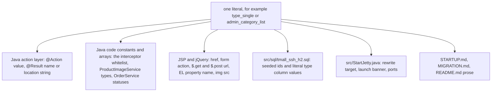

# Runtime Invariants and Safe-Change Checklist

`src/struts.xml` declares **no `<action>`, no `<result>` and no view**. Every endpoint, result name,
redirect parameter, bindable property, session key, image file name and seed id in this application
therefore exists only as a string literal spread across Java annotations, JSP markup, jQuery calls,
the seed SQL and the launcher — with no compiler, no XML schema, no static check and no test over
any of it. (The repository's single test class imports no assertion type, and there is no build
descriptor or CI.) A rename compiles, the application starts, and nothing complains until somebody
clicks the affected control.

This page is the do-not-break list for those names. Each entry states the string or shape, where it
is defined, everything that must change with it (all of it grep-able from the literal), and the
symptom when it drifts. It is the checklist to run **before** an edit; the mechanisms behind the
names live on [Request Pipeline](/openwiki/architecture/request-pipeline.md),
[View Layer](/openwiki/architecture/view-layer.md),
[Configuration Surface](/openwiki/architecture/configuration.md),
[Runtime Bootstrap](/openwiki/architecture/runtime-bootstrap.md) and
[Workflow: Image Upload, Conversion, and Serving](/openwiki/workflows/image-pipeline.md), and the
general verification strategy (including the manual smoke path) is
[Testing and Verification](/openwiki/testing/verification.md).

## 1. How to read an entry

One literal usually has several carriers, and they live in different languages:



*One name, six kinds of carrier. A rename is only safe when all of them that mention it move in the same commit.*

Three rules hold throughout:

- **`grep -rn "<literal>" src web` is the complete check for a plain literal** and is also the
  inventory: no generated file, no build output and no annotation processor repeats these names.
- **Four couplings are invisible to grep** and must be read by hand: names derived by reflection
  (`Action4Service.t2p` builds `"set" + clazz.getSimpleName()`, `BaseServiceImpl` derives the entity
  class from a stack frame), OGNL redirect parameters (the receiver's property name, not the
  sender's), the interceptor whitelist (the *suffix* of an action name, not the URL) and every
  relative JSP link (which depends on the deployed context path rather than on a literal).
- **Nothing validates a name at startup.** A wrong name shows up only as a per-request failure, a
  missing fragment, a broken image or an empty table.

## 2. Endpoint names: the `@Action` values

| Aspect | Detail |
|---|---|
| Shape | `@Action("admin_category_list")` / `@Action("forehome")` on a public `String` method; the value **is** the URL, because `Action4Result` carries `@Namespace("/")` and the convention plugin never falls back to class-name mapping |
| Defined in | 47 annotations over eight classes in `src/com/caozhihu/tmall/action/`: 24 on `ForeAction`, 23 spread over `CategoryAction`, `ProductAction`, `ProductImageAction`, `PropertyAction`, `PropertyValueAction`, `UserAction`, `OrderAction` |
| Must change together | every JSP/JS link that spells the URL; the redirect locations in `Action4Result` that name an endpoint; the interceptor `/fore` tests (§4.5); `StartJetty`'s rewrite target and banner; `web/index.jsp`; the docs (`STARTUP.md`, `README.md`, `MIGRATION.md`) |
| Symptom if it drifts | the old URL maps to nothing and the new one is unreachable by every existing link. Struts answers with an unmapped-path error — `STARTUP.md` records the observed text for a non-action path as `no action mapped` — and no link in a JSP is compiler-checked, so the failure is per-URL and appears only when the screen is used. Renaming the **target of a redirect** breaks the second request of that flow, not the first |

The two family prefixes are load-bearing beyond the mapping itself: all three custom interceptors
decide whether to run by testing the raw request URI against `startsWith("/fore")`
(`src/com/caozhihu/tmall/interceptor/AuthInterceptor.java#L37`,
`.../CartTotalItemNumberInterceptor.java#L32`,
`.../CategoryNamesBelowSearchInterceptor.java#L31`). A storefront endpoint renamed to a path that no
longer starts with `/fore` keeps working but silently loses the auth gate, the `cs` category strip
and the cart counter; an `admin_*` endpoint is never inspected either way.

## 3. Result names and the redirect locations

`Action4Result` declares the whole catalogue once — **36 names: 26 dispatcher forwards and 10
`type="redirect"` results** (`src/com/caozhihu/tmall/action/Action4Result.java#L10-L67`) — and each
action method returns one of them as a bare `String`. The name is shared by every action, so a typo
in one `return` statement is not local.

| Aspect | Detail |
|---|---|
| Shape | `return "listCategory";` must match `@Result(name = "listCategory", location = "/admin/listCategory.jsp")`; `*.jsp`, `listXxx` and `editXxx` are forwards, everything ending in `Page` is a redirect, and `registerSuccessPage` is the one redirect whose location is a plain `.jsp` |
| Defined in | `src/com/caozhihu/tmall/action/Action4Result.java#L10-L67`; the `return` statements in the eight action classes |
| Must change together | the `@Result` name, every `return` that uses it, and (for the naming habit) the JSP file the location points at; adding a *new* result means adding it to this shared block, not to the subclass |
| Symptom if it drifts | that endpoint no longer resolves a view at all: no JSP is forwarded and no `302` is issued. Because the block is shared, all endpoints returning the same name fail together, and the action method has already run by then |

The ten redirects, and the parameters they carry into the *next* request:

| Result name | Location (`Action4Result`) | OGNL parameters | Receiver that must bind them |
|---|---|---|---|
| `listCategoryPage` | `/admin_category_list` | — | `CategoryAction#list` |
| `listPropertyPage` | `/admin_property_list?category.id=${property.category.id}` | `category.id` | `PropertyAction#list` → `Action4Pojo.category` → `Category.id` |
| `listProductPage` | `/admin_product_list?category.id=${product.category.id}` | `category.id` | `ProductAction#list` → `Action4Pojo.product` → `Product.category` → `Category.id` |
| `listProductImagePage` | `/admin_productImage_list?product.id=${productImage.product.id}` | `product.id` | `ProductImageAction#list` → `Action4Pojo.productImage` → `ProductImage.product` → `Product.id` |
| `listOrderPage` | `/admin_order_list` | — | `OrderAction#list` |
| `registerSuccessPage` | `/registerSuccess.jsp` | — | none (static page) |
| `homePage` | `forehome` (relative) | — | `ForeAction#home` |
| `buyPage` | `forebuy?oiids=${oiid}` | `oiids` | `ForeAction#buy` → `int[] oiids` |
| `alipayPage` | `forealipay?order.id=${order.id}&total=${total}` | `order.id`, `total` | `ForeAction#forealipay` → `Action4Pojo.order` → `Order.id`, and `Action4Parameter.total` |
| `reviewPage` | `forereview?order.id=${order.id}&showonly=${showonly}` | `order.id`, `showonly` | `ForeAction#revice` → `Order.id`, `Action4Parameter.showonly` |

Invariants that follow, all of them silent when broken:

- **The `${...}` path is a property path on the *sending* action** (`property.category.id` only
  works because `Action4Pojo.property` is a `Property` with a `category` association), and the
  parameter *name* is a setter path on the *receiving* action. Both ends must move together.
- **The value must be non-null when the redirect is rendered.** That is the reason the delete and
  edit handlers call `t2p(...)` before returning a `Page` result: with an id-only or null entity the
  expression renders empty (`?category.id=`) or fails. What an **empty** `${...}` binds to an `int`
  property is not settled by the repository. 【人工评审待确认】
- **A dropped parameter does not necessarily fail loudly.** With the parameter absent, the receiver's
  entity property stays `null`, and `BaseServiceImpl.list(Object... pairParams)` turns a null value
  into `Restrictions.isNull(key)` (`src/com/caozhihu/tmall/service/impl/BaseServiceImpl.java#L129-L146`)
  — an empty table instead of an error — while `BaseServiceImpl.total(Object parent)` dereferences
  `parent.getClass()` (`#L94-L99`) and `t2p` dereferences the parameter (`Action4Service.java#L57-L71`),
  which fails with an unchecked error. Which of the two happens depends on the endpoint, so check the
  receiver's method body before assuming a rename is cosmetic.

## 4. Names that bind one request to another

### 4.1 OGNL property names, form fields and AJAX keys

Parameter binding is done by `defaultStack`'s parameter interceptor against the value stack, whose top
object is the action instance. There is **no per-action parameter list**: the bindable surface is
exactly the fields plus public setters on `Action4Upload` (`img`, `imgFileName`, `imgContentType`),
`Action4Pagination` (`page`), `Action4Pojo` (nine entities, ten lists) and `Action4Parameter` (`msg`,
`sort`, `contextPath`, `keyword`, `num`, `oiid`, `oiids`, `total`, `showonly`).

| Name as written in the request | Emitted by | Bound onto |
|---|---|---|
| `category.name`, `category.id` | `web/admin/listCategory.jsp#L81`, `web/admin/editCategory.jsp#L30`/`#L42` | `Action4Pojo.category` → `Category.name` / `Category.id` |
| `product.name`, `product.subTitle`, `product.remark`, `product.originalPrice`, `product.promotePrice`, `product.stock`, `product.id`, `product.category.id` | `web/admin/listProduct.jsp#L107-L137` (the 备注 input row at `#L117`, the shifted hidden `product.category.id` at `#L137` carrying `value="${category.id}"`), `web/admin/editProduct.jsp#L50-L83` (`value="${product.remark}"` at `#L61`, hidden `product.category.id` at `#L83`) | `Action4Pojo.product` → `Product` (three levels deep for the last one) |
| `property.name`, `property.id`, `property.category.id` | `web/admin/listProperty.jsp#L72-L76`, `web/admin/editProperty.jsp#L31-L36` | `Action4Pojo.property` → `Property` |
| `productImage.type`, `productImage.product.id` | `web/admin/listProductImage.jsp#L63-L64`, `#L116-L117` (hidden inputs, values `type_single` / `type_detail`, see §4.6) | `Action4Pojo.productImage` → `ProductImage` |
| `propertyValue.value`, `propertyValue.id` | `web/admin/editPropertyValue.jsp#L27` (`$.post` to `admin_propertyValue_update`) | `Action4Pojo.propertyValue` → `PropertyValue` |
| `order.address`, `order.post`, `order.receiver`, `order.mobile`, `order.userMessage` | `web/include/cart/buyPage.jsp#L19-L32`, `#L119` (POST to `forecreateOrder`) | `Action4Pojo.order` → `Order` |
| `order.id`, `product.id`, `review.content` | `web/include/cart/reviewPage.jsp#L73-L78` (POST to `foredoreview`) | `Action4Pojo.order`, `.product`, `.review` |
| `orderItem.id` | `web/include/cart/cartPage.jsp#L25` (`$.post` to `foredeleteOrderItem`) | `Action4Pojo.orderItem` → `OrderItem.id` |
| `user.name`, `user.password` | `web/include/loginPage.jsp#L52-L59`, `web/include/registerPage.jsp#L56-L64`, `web/include/product/imgAndInfo.jsp#L107` (`$.get` to `foreloginAjax`) | `Action4Pojo.user` |
| `keyword` | `web/include/search.jsp#L17`, `web/include/simpleSearch.jsp#L11` (POST to `foresearch`) | `Action4Parameter.keyword` |
| `sort` | `web/include/category/sortBar.jsp#L52-L67` (`all`, `review`, `date`, `saleCount`, `price`) | `Action4Parameter.sort`, consumed by the `switch` in `ForeAction#category` |
| `num`, `product.id` | `web/include/product/imgAndInfo.jsp#L54`, `web/include/cart/cartPage.jsp#L198` (`$.get`/`$.post` to `foreaddCart`, `forechangeOrderItem`) | `Action4Parameter.num`, `Action4Pojo.product.id` |
| `oiids` (repeated) | `web/include/cart/cartPage.jsp#L126`, and the `buyPage` redirect | `Action4Parameter.oiids` (`int[]`) |
| `page.*`, `page.start` | `web/include/admin/adminPage.jsp#L23-L51` | `Action4Pagination.page` → `Page` (see §4.3) |

Three further rules about the same namespace:

- **The `Action4Pojo` property names are also the EL names the JSPs read.** `${categories}`,
  `${products}`, `${propertyValues}`, `${orderItems}`, `${product.firstProductImage.id}` and the
  `remark` cell of the product list (`${p.remark}`, `web/admin/listProduct.jsp#L75`) all resolve
  through the getters of this class and of the entities. Renaming a field plus its getter compiles,
  and the JSP renders empty.
- **A name that no caller emits is still bindable.** `page.count` is never emitted,
  `categorycount` is read from `param` by two fragments but emitted by no link, and
  `Action4Parameter.contextPath` is never set by any code path — `web/include/search.jsp#L12` and
  `web/include/simpleSearch.jsp#L5` read `${contextPath}`, so those two logo links currently resolve
  to the *current* URL. Inventing a `contextPath` parameter (or calling the setter) changes them to
  that value. 【人工评审待确认】
- **Every input also has an `id`, and the admin JS validates by that id, not by the `name`.** The
  shared helpers `checkEmpty`, `checkNumber` and `checkInt` (`web/include/admin/adminHeader.jsp#L19-L57`)
  each select `$("#" + id)`, and each form's `submit` handler passes the field's `id` as a plain
  string — `checkEmpty("name", "产品名称")`, `checkInt("stock", "库存")`
  (`web/admin/listProduct.jsp#L17-L29`, `web/admin/editProduct.jsp#L19-L31`). The new 备注 row is
  reachable the same way through `id="remark"` (`#L117` / `#L61`), and no handler checks it yet.
  Renaming an `id` without its JS argument leaves the helper selecting nothing, and nothing then
  rejects the field — the action layer takes the bound entity as it arrives
  (`ProductAction#add` saves it, `#update` merges it). Whether the `undefined` that
  `$("#…").val()` returns aborts the submission or the browser posts the form anyway is not settled
  by the repository. 【人工评审待确认】

**Symptom of drift:** a renamed form field or AJAX key binds nothing, the entity property stays
`null`/`0`, and the action writes or reads that empty value — a new product with a null name, a
quantity change that finds no row, an attribute edit that stores nothing. No error is raised, because
an unresolvable parameter name is simply ignored. On an **update** form the same drift is destructive
rather than merely inert: the bound entity reaches the service still carrying the empty value and is
merged over the stored row, so the column that was there is cleared (`ProductAction#update` merges the
bound `product` and copies only `createDate` back from the database row,
`src/com/caozhihu/tmall/action/ProductAction.java#L47-L53`), and the screen returns to the list showing
a blank field.

### 4.2 The `img` upload field

| Aspect | Detail |
|---|---|
| Shape | `<input type="file" name="img"/>` inside `enctype="multipart/form-data"`; `defaultStack`'s file-upload interceptor binds it to the inherited `File img` plus `imgFileName` / `imgContentType` |
| Defined in | `src/com/caozhihu/tmall/action/Action4Upload.java#L7-L9`; forms at `web/admin/listCategory.jsp#L86`, `web/admin/editCategory.jsp#L37`, `web/admin/listProductImage.jsp#L58` and `#L111` (single and detail panels) |
| Must change together | the input's `name`, the `Action4Upload` fields and getters, and `Action4Service.saveWithJpg(File)`, which reads the inherited `img` field directly (`src/com/caozhihu/tmall/action/Action4Service.java#L75-L83`) |
| Symptom if it drifts | binding produces no file, so `img` stays `null` and `FileUtils.copyFile(null, file)` throws an unchecked error **after** the row has already been saved; the list screen reloads with the new row and a missing/old image. `imgFileName` and `imgContentType` are never read anywhere, so renaming *those* two is behaviourally inert |

### 4.3 `Page`, `defaultCount` and the `hasPreviouse` spelling

| Aspect | Detail |
|---|---|
| Shape | `Page` with `start`, `count`, `total`, `param` and the derived `totalPage`, `last`, `hasPreviouse`, `hasNext`; `public static final int defaultCount = 5`, assigned to `count` by the no-arg constructor (`src/com/caozhihu/tmall/util/Page.java#L3-L50`) |
| Consumers | `web/include/admin/adminPage.jsp` is the only pager in the tree: it reads `${page.param}`, `${page.totalPage}`, `${page.total}`, `${page.start}`, `${page.count}`, `${page.hasNext}`, `${page.last}` and `${!page.hasPreviouse}` (`#L19-L53`) |
| Must change together | the Java property/method name **and** every EL expression in `adminPage.jsp`; `page.setParam("&category.id=" + category.getId())` in `ProductAction#list` and `PropertyAction#list` and the `${page.param}` concatenations that append it raw after `?page.start=…` |
| Symptom if it drifts | see below |

Four separate contracts hide in that bean:

- **`defaultCount = 5` is the only source of `count` in the running system.** No link emits
  `page.count`, so every paged screen (`admin_category_list`, `admin_user_list`, `admin_order_list`,
  `admin_property_list`, `admin_product_list`) shows 5 rows per page purely because of this constant,
  and `getLast()`/`getTotalPage()` divide and mod by `count`. Changing the constant changes the page
  size and every derived offset on all five screens at once, with no error. `count` is also
  request-bindable, and `count == 0` makes the render fail on a division, not render an empty page.
- **`hasPreviouse` is spelled that way in Java and in the JSP.** The getter is `isHasPreviouse()`
  and only `adminPage.jsp#L22` and `#L28` read it. Renaming the method to `isHasPrevious()` removes
  the property, so those two `<c:if>` tests stop resolving; the guarantees are that the `disabled`
  class and the two "previous" links stop being computed. Whether JSP EL reports the unknown bean
  property as an error page or as an empty test is framework behaviour that this repository does not
  settle. 【人工评审待确认】
- **`param` is the filter suffix, and it is appended as raw text.** Its only writers build the string
  `"&category.id=" + id`; `adminPage.jsp` concatenates it after the `start` value. If the `param`
  name, the suffix shape or the leading `&` drifts, the paging links lose the parent id: the next page
  then reloads with `category` unbound, which for `admin_product_list` /
  `admin_property_list` means `total(category)` dereferences null instead of the user seeing another
  category's rows.
- **`page.start` is the only paging channel.** `?page.start=15` binds `start`; the JSP builds every
  link as `status.index * page.count`, which is what makes `isHasNext()`'s `start == getLast()` test
  mean "last page".

**Symptom of a rename in this group:** the affected EL expressions stop resolving (no paging
controls, or an error) and/or `?page.start=…` no longer binds, so every list stays on its first page.

### 4.4 Session attribute keys

Exactly four `HttpSession` attributes carry state between requests; all four are plain string keys in
`ActionContext.getContext().getSession()`.

| Key | Writer | Readers | Symptom if renamed |
|---|---|---|---|
| `user` | `ForeAction#login` / `#loginAjax`, removed by `#logout` (`src/com/caozhihu/tmall/action/ForeAction.java#L51`, `#L57`, `#L98`) | `AuthInterceptor#L40`; `CartTotalItemNumberInterceptor#L33`; eight `ForeAction` methods; `web/include/top.jsp#L18-L25` (`${!empty user}`, `${user.name}`) | login still redirects to the home page but nothing is authenticated: every protected `/fore` URL `302`s back to `login.jsp`, the top bar keeps showing 请登录, and the cart badge stays 0 |
| `orderItems` | `ForeAction#buy` (`#L185`) — the only writer | `ForeAction#createOrder` (`#L245`) | checkout reads `null` and dereferences it (`ois.isEmpty()`), so the POST to `forecreateOrder` fails instead of forwarding to `login.jsp`; the cart/checkout flow is dead until the session is rebuilt |
| `cs` | `CategoryNamesBelowSearchInterceptor#L33`, on every `/fore*` request | `web/include/search.jsp#L20`, `web/include/simpleSearch.jsp#L14` | the two "categories below the search box" strips render empty; no error and no log |
| `cartTotalItemNumber` | `CartTotalItemNumberInterceptor#L41`/`#L43` | `web/include/top.jsp#L33` | the cart badge renders empty; the interceptor still runs its query and writes the same key under its own name, so this is a render-only failure |

Note the two interceptors **recompute** their key on every `/fore*` request before the action runs,
so a rename that touches only the interceptor leaves a stale or absent value rather than an error.

### 4.5 Interceptor-whitelist method names

| Aspect | Detail |
|---|---|
| Shape | `String[] noNeedAuthPage = {"home", "checkLogin", "register", "loginAjax", "login", "product", "category", "search"}` compared against `StringUtils.substringAfterLast(uri, "/fore")` for any URI starting with `/fore` |
| Defined in | `src/com/caozhihu/tmall/interceptor/AuthInterceptor.java#L25-L46` |
| Must change together | the `@Action` **value** of the storefront endpoint (its tail after `/fore`), the array entry, and nothing else — the Java method name and the URL prefix are not checked |
| Symptom if it drifts | renaming a public storefront action (for example `foreproduct` → `foreproductPage`) makes its derived key unknown, so an anonymous visitor is `response.sendRedirect("login.jsp")`-ed and the action never runs; for the AJAX endpoints (`forecheckLogin`, `foreloginAjax`, `foreaddCart`) that means the browser receives the login page HTML where it expects `success`/`fail` (§4.8) and the UI silently takes its failure branch. Renaming a *protected* endpoint is harmless as long as its new tail is not one of these eight |

Two related invariants: the test uses the raw `getRequestURI()` **without** stripping the context
path (the other two interceptors do strip it —
`CartTotalItemNumberInterceptor.java#L29-L32`), so it only matches while the app is deployed at `/`;
and the eight names must stay in sync with the actions that are genuinely public, or a public page
becomes unreachable to logged-out visitors with no error message other than the login page.

### 4.6 Image naming and resize conventions

Everything the image pipeline writes is named after the **row id**, in a directory chosen by a
string, always with the extension `.jpg`:

| Written | Exact path built by the code | Size | Confirmed by |
|---|---|---|---|
| category image | `new File(getRealPath("img/category"), category.getId() + ".jpg")` | as uploaded, re-encoded | `CategoryAction#add` / `#update` |
| product image, type `type_single` | `img/productSingle/<productImage.id>.jpg` | as uploaded, re-encoded | `ProductImageAction#add` |
| `type_single` derivative | `img/productSingle_small/<productImage.id>.jpg` | `resizeImage(file, 56, 56, f_small)` | `ProductImageAction#add` |
| `type_single` derivative | `img/productSingle_middle/<productImage.id>.jpg` | `resizeImage(file, 217, 190, f_middle)` | `ProductImageAction#add` |
| product image, `type_detail` | `img/productDetail/<productImage.id>.jpg` | as uploaded, re-encoded | `ProductImageAction#add` |
| carousel | `img/lunbo/1.jpg` … `4.jpg` | checked-in only, no writer | `web/include/home/carousel.jsp#L23-L33` |

The invariants that go with it:

- **The id comes from the saved row, in the same request.** Both writers call the service `save()`
  first and then read `getId()` off the in-memory entity, which works because every `@Id` is
  `@GeneratedValue(strategy = GenerationType.IDENTITY)`. Renaming or reformatting the file name (using
  `imgFileName`, adding a suffix, zero-padding the id) makes the file unreachable: readers only ever
  compose `"<id>.jpg"` (§4.7), so the image is a silent 404 in the browser while the file sits on disk.
- **The directory strings are the contract, not the constants.** `ProductImageAction#add` selects
  `img/productSingle` with `if (ProductImageService.type_single.equals(productImage.getType()))` and
  a plain `else` → `img/productDetail`; `ProductImageService.type_single` / `type_detail` are the only
  two values the code knows, and they are also written **literally** into `listProductImage.jsp`'s
  hidden inputs and into every seeded `productimage.type` value. Renaming a constant therefore needs
  the JSP values and the seed values as well; and because the branch is `if`/`else`, a new constant
  alone re-routes every unknown value into `productDetail`.
- **`ProductImageService.setFirstProductImage` filters on `type_single`.** It is the only place that
  answers "which image represents this product", it takes the highest `id` from that list, and it is
  called from `ProductServiceImpl.fill(Category)`, `ForeAction#product`/`#search`,
  `ProductAction#list` and `OrderItemServiceImpl.fill(Order)`.
- **The two sizes exist only at those two call sites.** `resizeImage` stretches
  (`getScaledInstance`) into a `TYPE_INT_RGB` box of exactly the requested size; it never crops, and
  the numbers 56/217/190 appear nowhere else in the tree. Changing them changes nothing else and
  breaks nothing — the markup sets no `width`/`height` for those images — but the layout shifts.
- **`mkdirs()` must run before a derivative is written.** `f_small.getParentFile().mkdirs()` and
  `f_middle.getParentFile().mkdirs()` are what let the write succeed when a directory is absent;
  without them `ImageIO.write` throws, `resizeImage` catches only `IOException` and prints a stack
  trace, and the thumbnail is simply missing afterwards.
- **`saveWithJpg` converts in place.** It copies the multipart temp file to the final path and then
  re-encodes that same path through `ImageUtil.change2jpg` (`PixelGrabber` with `forceRGB = true`, a
  `DirectColorModel` with no alpha mask) and `ImageIO.write(..., "jpg", file)`. Any upload format
  becomes a `.jpg`, transparency is dropped, and a re-upload for the same id overwrites the file with
  no delete step. Whether AWT can hand back previously decoded pixels for a path that was just
  overwritten is not settled by the repository. 【人工评审待确认】
- **Failure is silent by construction.** `saveWithJpg` swallows `IOException`; a `null` conversion or
  resize result flows into an unchecked `IllegalArgumentException`; `ProductImageAction#add` writes
  the primary file unconditionally while `CategoryAction#update` guards on `img != null` and
  `CategoryAction#add` does not.

### 4.7 The `img` `src` paths the JSPs emit

Every `src` in the tree is a **relative** URL with no leading slash; the dynamic ones are always
`<directory>/<id>.jpg`, and the id is either the row being iterated or `firstProductImage.id`.

| `src` expression | Id source | Readers (grep-able literal) |
|---|---|---|
| `img/category/${c.id}.jpg` / `${category.id}.jpg` / `${product.category.id}.jpg` | the category row | `web/admin/listCategory.jsp#L53`, `web/include/category/categoryPage.jsp#L7`, `web/include/product/productPage.jsp#L6` |
| `img/productSingle/${pi.id}.jpg` | the `ProductImage` row | `web/include/product/imgAndInfo.jsp#L148` (large image), `web/admin/listProductImage.jsp#L85-L87` (link and thumbnail) |
| `img/productSingle_small/${pi.id}.jpg` (plus `bigImageURL="img/productSingle/${pi.id}.jpg"`) | the `ProductImage` row | `web/include/product/imgAndInfo.jsp#L151` — the only reader of the 56×56 derivative |
| `img/productSingle_middle/${…firstProductImage.id}.jpg` | `firstProductImage` | `web/include/home/homepageCategoryProducts.jsp#L26`, `web/include/category/productsByCategory.jsp#L29`, `web/include/cart/cartPage.jsp#L241`, `buyPage.jsp#L67`, `boughtPage.jsp#L120`, `confirmPayPage.jsp#L33` |
| `img/productSingle/${…firstProductImage.id}.jpg` | `firstProductImage` | `web/include/productsBySearch.jsp#L18`, `web/include/cart/reviewPage.jsp#L7`, `web/admin/listProduct.jsp#L69`, `web/admin/listOrder.jsp#L84` |
| `img/productDetail/${pi.id}.jpg` | the `ProductImage` row | `web/include/product/productDetail.jsp#L33`, `web/admin/listProductImage.jsp#L138-L139` |
| `img/lunbo/1.jpg` … `4.jpg` | checked-in files | `web/include/home/carousel.jsp#L23-L33` |
| `img/site/*` | checked-in files | `web/include/header.jsp`, `web/include/admin/adminNavigator.jsp#L13` (`../` here), and most fragments |

Rules that follow:

- **Renaming a directory under `web/img` touches the writer (§4.6) and every reader in this table.**
  `grep -rn "productSingle_small" src web` (and the same for each of the five directory names,
  `img/category`, `img/lunbo`, `img/site`) enumerates both sides.
- **A wrong or empty id is a broken image, never an error.** `${p.firstProductImage.id}` on a product
  with no `type_single` image renders empty, so the URL collapses to `img/productSingle/.jpg` and the
  browser shows a broken image; a wrong directory returns nothing. There is no server-side validation
  of any `src`.
- **The relative form depends on the deployed context path being `/`.** A dispatcher forward keeps the
  action URL, and every action URL is at the context root (`@Namespace("/")`), so a relative `src` in
  a forwarded JSP resolves against `/`. Requesting `/admin/listCategory.jsp` directly re-bases the same
  paths under `/admin/` and the images break. A rename that adds a path segment to an endpoint does
  the same thing to every relative link on the page (see §7 for `CONTEXT_PATH`).

### 4.8 Status, type and AJAX-body literals

| Literal | Defined in | Also written as a literal in | Symptom if it drifts |
|---|---|---|---|
| `waitPay`, `waitDelivery`, `waitConfirm`, `waitReview`, `finish`, `delete` (order status) | `src/com/caozhihu/tmall/service/OrderService.java#L12-L17` | `web/include/cart/boughtPage.jsp#L74-L77` (the `orderStatus` attributes the JS filters on) and `#L158-L178` (`<c:if test="${o.status=='…'}">`); `web/admin/listOrder.jsp#L69` (`waitDelivery`) | the stored value and the compared value diverge, so the order tables filter to nothing and the status-specific blocks disappear; the DB column simply holds the new string |
| `type_single` / `type_detail` | `src/com/caozhihu/tmall/service/ProductImageService.java#L8-L9` | `web/admin/listProductImage.jsp#L63` / `#L116`; every `productimage.type` row in the seed script | see §4.6 — the folder branch, both admin lists and `setFirstProductImage` all go wrong at once |
| `success` / `fail` (AJAX response body) | `web/success.jsp` contains the bare word `success`, `web/fail.jsp` contains `fail` | compared by script in `web/include/product/imgAndInfo.jsp#L48` (`forecheckLogin`, `foreaddCart`), `web/include/cart/cartPage.jsp` (`forechangeOrderItem`, `foredeleteOrderItem`) and `web/admin/editPropertyValue.jsp#L29` (`admin_propertyValue_update`) | every asynchronous interaction takes its failure branch without any server error: the login modal shows 账号密码错误 on a correct password, "已加入购物车" never appears, the attribute-edit border stays red |
| `msg` (action property) | set by `ForeAction#register` / `#login` | read as `${msg}` by `web/include/loginPage.jsp#L7-L8` and `web/include/registerPage.jsp#L7-L8` | the inline error text disappears; the form still posts |

## 5. Data and configuration invariants

### 5.1 The seed script and the id calibration

| Aspect | Detail |
|---|---|
| Shape | `src/sql/tmall_ssh_h2.sql` executed at **every** Spring context refresh, plus five `ALTER TABLE … ALTER COLUMN id RESTART WITH n` statements at the end of that file |
| Defined in | `src/applicationContext.xml#L31-L44` (the `dbInit` bean, `scripts = classpath:sql/tmall_ssh_h2.sql`, `sqlScriptEncoding=UTF-8`), and `src/sql/tmall_ssh_h2.sql#L14712-L14716` |
| Values | `category` 84 (max seeded id 83), `product` 963 (max 962), `productimage` 10211 (max 10198), `property` 258 (max 257), `propertyvalue` 14092 (max 14091); `user`, `order_`, `review` and `orderitem` are created empty with no statement |
| Must change together | the script's row set, the five calibration values, the entity `@Table`/`@Column` names, and the criterion/HQL property names the services build; the file must stay under `src/` because the reference is `classpath:` and the launcher only copies `src/**` resources into `web/WEB-INF/classes` |
| Symptom if it drifts | a row-set change without recalibration makes new ids diverge from the recorded acceptance expectation (`MIGRATION.md` records "first new category id = 84"); a table/column mismatch fails at the first query, not at startup, because the schema is no longer managed by Hibernate (see 5.2) |

Three couplings make this script part of the runtime contract rather than test data:

- **A new product column is appended after the seeded rows, not declared in the table.** `remark` is
  absent from the `CREATE TABLE product` block (`#L58-L69`); it arrives as
  `ALTER TABLE product ADD COLUMN remark varchar(255) DEFAULT NULL;` at `#L155`, i.e. after the 85
  positional `INSERT INTO product VALUES (…)` rows (`#L70-L154`, ids up to 962) and immediately before
  `CREATE TABLE productimage`. Two consequences: every seeded product has a `NULL` `remark`, so the
  admin list's 备注 column renders blank for the whole demo until a product is edited; and the eight
  positional values per row stay keyed to `CREATE TABLE product`'s column order, which the entity's
  field order does not affect — a field added to `Product` needs a statement like this one here, since
  the schema is not entity-managed (§5.2).
- **The criteria vocabulary is built from class names and literals.**
  `BaseServiceImpl.total()` composes `"select count(*) from " + clazz.getName()`
  (`#L60-L68`), while `listByParent`, `list(Page,Object)` and `total(Object)` derive the property name
  from `StringUtils.uncapitalize(parent.getClass().getSimpleName())` (`#L73-L106`), and callers pass
  literal keys such as `list("product", product, "type", ProductImageService.type_single)` or
  `list("user", user, "order", null)`. Renaming an entity property or class therefore requires editing
  those Java literals too; the failure appears when Hibernate compiles the query, not at startup.
- **Rows are ephemeral, files are durable.** The database is a pure in-memory H2 instance rebuilt on
  every start, so an id can be reused after a restart and silently overwrite the previous session's
  orphan file of the same name (see §6).

### 5.2 Spring and Hibernate settings

| Setting | Location | If it changes |
|---|---|---|
| bean names `ds`, `dbInit`, `sf`, `transactionManager`; `@Resource(name = "sf")` / `@Resource(name = "dao")` in `DAOImpl` and `ServiceDelegateDAO` | `src/applicationContext.xml#L21`, `#L31`, `#L47`, `#L69`; `src/com/caozhihu/tmall/dao/impl/DAOImpl.java#L10-L18` | an unresolved `ref`/`name` fails the context load (DAO injection), and `transactionManager` is referenced by `tx:annotation-driven` at `#L17` |
| `sf` keeps `depends-on="dbInit"` | `src/applicationContext.xml#L47` | the seed script would run after Hibernate initialises; `STARTUP.md` records the symptom as `Table "XXX" not found` |
| `hibernate.hbm2ddl.auto=none` | `src/applicationContext.xml#L63` | back to entity-driven schema maintenance; `MIGRATION.md#L64-L71` records that the `update` value re-created the `propertyvalue.pid` foreign key that the seed data violates, producing DDL errors at startup |
| `hibernate.dialect=org.hibernate.dialect.H2Dialect` | `src/applicationContext.xml#L58` | queries fail against the in-memory database |
| `packagesToScan = com.caozhihu.*` and `component-scan base-package="com.caozhihu.tmall.*"` | `src/applicationContext.xml#L15`, `#L51-L55` | entities disappear from the `SessionFactory`, or service/DAO/action-component beans are never created and every `@Autowired` stays null |
| datasource URL `jdbc:h2:mem:tmall_ssh;MODE=MySQL;DB_CLOSE_DELAY=-1`, user `sa`, empty password, driver `org.h2.Driver` | `src/applicationContext.xml#L21-L27` | the URL is also the credential published in `STARTUP.md` and the launcher banner; `DB_CLOSE_DELAY=-1` is what keeps the in-memory database alive so the H2 console on port 8082 sees the same data |
| script reference `classpath:sql/tmall_ssh_h2.sql` | `src/applicationContext.xml#L39` | a resource outside `src/` never reaches the classpath |

### 5.3 Struts constants, package and stack name

| Setting | Location | If it changes |
|---|---|---|
| `struts.objectFactory=spring` | `src/struts.xml#L9` | actions and interceptors are instantiated without the container, so every `@Autowired` service field stays null and the first action that touches a service fails |
| `struts.i18n.encoding=UTF-8` | `src/struts.xml#L8` | the request-encoding half of the UTF-8 story (`web.xml` also installs a `CharacterEncodingFilter`) is lost |
| package `basicstruts` and the `@ParentPackage("basicstruts")` on `Action4Result` | `src/struts.xml#L10`, `src/com/caozhihu/tmall/action/Action4Result.java#L9` | the two spellings must match; a new action class that does not inherit the annotation runs with no project interceptors |
| `<interceptor-stack name="auth-dafault">` and `<default-interceptor-ref name="auth-dafault">` | `src/struts.xml#L18-L25` | both sides must keep the same spelling (including the typo); if they diverge no project interceptor runs at all — no auth gate, no `cs`, no `cartTotalItemNumber` |
| the three `<interceptor name=…>` entries and their `class=` values | `src/struts.xml#L12-L17` | a renamed interceptor breaks its `<interceptor-ref name=…>`; the declared order (auth → category names → cart total → `defaultStack`) is what runs, and `defaultStack` last is what performs parameter binding and multipart handling for every endpoint |

## 6. The checked-in demo image set under `web/img`

The image directories are simultaneously **checked-in demo assets** and **runtime output**: the
upload endpoints write into the same directories the JSPs read from, through
`ServletActionContext.getServletContext().getRealPath(...)` against the `web/` resource base.

| Directory | Contents | Written by | Read by |
|---|---|---|---|
| `web/img/category/` | 28 files: one `<id>.jpg` for each of the 17 seeded categories (ids 60, 64, 68–83), plus orphan files for ids that have **no** seeded row (`1.png`, `2`, `6`–`12`, `66`, `70`) | `CategoryAction#add` / `#update` | §4.7 category rows |
| `web/img/productSingle/` | the `<productImage.id>.jpg` files of the seeded `type_single` rows (419 rows, ids from 629 to 10192), plus a few orphan ids (`19`, `21`, `22`) | `ProductImageAction#add` | §4.7 single rows |
| `web/img/productSingle_small/` | the same id set as `web/img/productSingle`, at 56×56 | `ProductImageAction#add` | `imgAndInfo.jsp#L151` only |
| `web/img/productSingle_middle/` | the same id set again, at 217×190 | `ProductImageAction#add` | the home, category and cart list pages |
| `web/img/productDetail/` | the `<productImage.id>.jpg` files of the seeded `type_detail` rows (510 rows, ids up to 10198), plus an orphan `17.jpg` | `ProductImageAction#add` | §4.7 detail rows |
| `web/img/lunbo/` | `1.jpg` … `5.jpg`, no writer anywhere | — (checked-in only) | `carousel.jsp` references `1`–`4`; `5.jpg` is unreferenced |
| `web/img/site/` | the site chrome (`logo.gif`, `simpleLogo.png`, `tmallbuy.png`, `gouwujuan.png`, `buyflow.png`, `paySuccess.png`, `alipay2wei.png`, `wangwang.gif`, `star/`, …) plus a stray `alipay2wei.png.bak` | — (checked-in only) | `web/include/header.jsp`, `include/admin/adminNavigator.jsp#L13` (`../img/site/tmallbuy.png`), and most fragments |

Invariants and observed facts about this set:

- **It is tracked.** `.gitignore` excludes only `web/WEB-INF/classes/`, `dist/`, `build/`, `out/`,
  `target/`, OS metadata, `*.log`, `*.mv.db` and `*.trace.db` — not `web/img`. A fresh checkout
  therefore reproduces the demo screens, while an upload performed during a session is an **untracked
  addition** to the same directories whose row disappears at the next restart (the database is
  in-memory), leaving an orphan file that a later session can overwrite because ids are reused from
  the calibrated values in §5.1.
- **Only `<id>.jpg` is reachable.** No reader composes any other extension or name, so
  `web/img/category/1.png` can never be requested by the application, and a committed file whose id
  has no row in the seed is never referenced by a dynamic screen.
- **A row without a file renders as a broken image, not as an error.** The category rows and the
  seeded product-image rows are the only ids any screen asks for; the markup contains no fallback.
- Whether the committed set is intended as a deliverable fixture or as hand-curated content — and
  which side (row or file) is authoritative when they disagree, as in the orphan files listed above —
  is stated nowhere in the repository. 【人工评审待确认】 (see also §9)

## 7. Launcher invariants in `src/StartJetty.java`

The launcher is the only code that knows the port, the context path and the class-loading and rewrite
behaviour that `web.xml` cannot express — and `MIGRATION.md` records that `web.xml` was changed by zero
lines, so these settings are the supported way to adapt the deployment.

| Setting | Value | If it changes |
|---|---|---|
| `PORT = 8080`, `H2_CONSOLE_PORT = 8082`, `CONTEXT_PATH = "/"` | `src/StartJetty.java#L49-L51` | the banner and `STARTUP.md` stop matching. `CONTEXT_PATH` must stay `/`: every link and `src` in the JSPs is relative to the context root, `AuthInterceptor` tests the raw URI without stripping the context path (§4.5), and the mapping is `@Namespace("/")` |
| `context.addSystemClass("org.apache.logging.log4j.")`, `"org.h2."`, `"org.apache.juli."`, `"org.apache.jasper."`, `"org.apache.el."`, `"javax.servlet.jsp."`, `"org.eclipse.jetty.apache.jsp."` | `#L73-L81` | every jar sits on both the JVM classpath and `WEB-INF/lib`; dropping an entry loads a second copy — `STARTUP.md` names the symptoms (`ServiceConfigurationError`, `TldCache cannot be cast`, H2 seeing a different empty in-memory database) |
| `context.setConfigurations(...)` — the full chain ending in `AnnotationConfiguration` and `JettyWebXmlConfiguration` | `#L85-L88` | the embedded default chain omits `AnnotationConfiguration`, so the JSP `ServletContainerInitializer` never runs and JSP compilation fails with `getTldCache() is null` (`STARTUP.md` tells you not to change this chain) |
| the rewrite rule: an anonymous `Rule` that returns `"/forehome"` **only** when `"/".equals(target)` | `#L95-L104` | `web.xml` has no `<welcome-file-list>` and may not be edited, so `/` needs this rewrite; a `RewritePatternRule` with pattern `/` is regex/prefix semantics, rewrites every path — including `/img/**` — to `/forehome`, and the whole site's images are answered with the home-page HTML. Anything other than an exact-match rule breaks either `/` (404) or static serving |
| `server.setStopAtShutdown(true)`; H2 console started as a second server on 8082 | `#L105-L108` | the console must stay out of the app's port: the Struts filter is mapped to `/*`, so an in-app `/h2-console/*` path answers `no action mapped` |
| `ensureCompiledClasses` / `syncResources`: `javac` over every `.java` under `src/`, `-encoding UTF-8 -nowarn -source 8 -target 8`, classpath = `web/WEB-INF/lib/*.jar` + `WEB-INF/classes`, output `web/WEB-INF/classes`; then every non-`.java` file under `src/` is copied preserving relative paths | `#L149-L213` | `web/WEB-INF/classes` is git-ignored output, so the source of truth is `src/` alone; a compile error aborts `main()` before any port binds, which is why test code and any new dependency must be part of that same compile, and why a resource referenced as `classpath:` must live under `src/`. `*.jar` files are discovered by globbing the directory — no build descriptor lists them |

## 8. The safe-change procedure

1. **Classify the literal.** Is it an endpoint (§2), a result name or redirect (§3), a bindable name
   (§4.1–§4.2), a `Page` property (§4.3), a session key (§4.4), a whitelist entry (§4.5), an image
   name or size (§4.6–§4.7), a data literal (§4.8), a seed/config value (§5) or a launcher setting
   (§7)?
2. **Enumerate every carrier:** `grep -rn "<literal>" src web` for a plain literal, then the docs
   (`README.md`, `STARTUP.md`, `MIGRATION.md`) for the URLs they publish.
3. **Read the four grep-invisible couplings** before renaming: the `/fore` suffix check in
   `AuthInterceptor`, the `${...}` property paths in the redirects plus the receiver's setter, the
   relative links that depend on the context path, and the reflection-derived names in
   `Action4Service.t2p` and `BaseServiceImpl`.
4. **For a `/fore*` name, check the whitelist array first** — that is the step that turns a "rename a
   link" change into an auth change.
5. **For an image name or directory, change the writer and every reader in the same commit**, and
   remember the seed values and the checked-in files (§6).
6. **For a config or launcher setting, restart and read the banner**, then `GET /` and
   `GET /img/site/logo.gif`: the rewrite regression is only visible as an image URL answering with HTML.
7. **Run the manual smoke path** on [Testing and Verification](/openwiki/testing/verification.md)
   (home, admin list, one admin CRUD round trip, the storefront cart→checkout chain for redirect
   changes) — and clean up the untracked file an upload test leaves in `web/img/category/`.
8. **Do not rely on the test class.** `TestTmall` only proves that the Spring context loads and that
   `DAOImpl` works; it issues no HTTP request and asserts nothing, so no endpoint name, result name,
   session key or image path in this page is covered by it.

Useful greps, by literal family:

```bash
# endpoint inventory: 47 @Action values, 24 of them on ForeAction
grep -rn '@Action("' src/com/caozhihu/tmall/action | wc -l

# the whole rename set for one endpoint, e.g. the admin category list
grep -rn "admin_category_list" src web

# result names: 36 @Result declarations, all in one shared block
grep -c '@Result(name' src/com/caozhihu/tmall/action/Action4Result.java

# the interceptor whitelist entries are the tails of the storefront @Action values
grep -rn "noNeedAuthPage" src/com/caozhihu/tmall/interceptor/AuthInterceptor.java

# image directories and the upload field: writer and reader together
grep -rn "productSingle_small" src web ; grep -rn 'name="img"' web

# image type literals: constant, JSP hidden inputs, seed rows
grep -rn "type_single" src web

# the newest bindable name: entity field, both admin forms, the appended column
grep -rn "remark" src web

# session keys and the pager property names
grep -rn 'put("user"' src ; grep -rn "page\." web/include/admin/adminPage.jsp

# seed ids and the calibration
grep -n "RESTART WITH" src/sql/tmall_ssh_h2.sql

# config names that are looked up by string
grep -rn 'depends-on="dbInit"' src ; grep -rn "auth-dafault" src ; grep -rn "addSystemClass" src/StartJetty.java
```

## 9. Human review required

- **What a renamed `Page` property does at render time.** `${!page.hasPreviouse}` in
  `adminPage.jsp` names a getter that is deliberately misspelled; whether JSP EL reports the missing
  property as an error page or as an empty test is framework behaviour the repository does not settle.
  The same question applies to `${page.count}` and the other derived properties.
  【人工评审待确认】
- **What an empty `${...}` binds to an `int` property.** Redirect locations render values like
  `${productImage.product.id}`; the argument binding result when that renders `?product.id=` (empty
  value) is not determined by repository evidence. 【人工评审待确认】
- **What the calibration statements are protecting.** Dropping the five `RESTART WITH` statements
  would leave most tables unchanged only if H2 continues from `max(id)+1`; `productimage` is the one
  table whose calibrated value (10211) exceeds its max seeded id (10198), so the intended effect of
  that specific value on a post-seed upload is a reviewer's question. 【人工评审待确认】
- **Which side of the image set is authoritative.** The committed files include ids with no seeded
  row (`web/img/category/1.png`, `66.jpg`, `70.jpg`, `web/img/productSingle/19.jpg`, `21.jpg`,
  `22.jpg`, `web/img/productDetail/17.jpg`) and `web/img/lunbo/5.jpg` is referenced by nothing; a
  file-by-file reconciliation of all 929 seeded `productimage` rows against the directories was not
  performed for this page. 【人工评审待确认】
- **`Action4Parameter.contextPath` is never set.** Two JSP fragments read `${contextPath}`; whether
  the field is vestigial or intended to be populated (and by whom) is not stated.
  【人工评审待确认】
- **What a validator helper does when its selector matches nothing.** `$("#" + id).val()` returns
  `undefined` for an `id` that no element carries (§4.1), and whether the resulting error aborts the
  submit handler or the browser posts the form anyway is front-end behaviour the repository does not
  settle and no test covers. 【人工评审待确认】
- **Whether `admin_*` endpoints should be gated at all** is open on
  [Action URL Catalog](/openwiki/reference/action-catalog.md); it matters here only because the
  whitelist in §4.5 is the sole auth mechanism.
- **Whether the AWT path in `change2jpg` can return cached pixels** for a path that was just
  overwritten is a runtime behaviour with no test; it is recorded in detail on
  [Workflow: Image Upload, Conversion, and Serving](/openwiki/workflows/image-pipeline.md).
  【人工评审待确认】

## Related pages

- [Configuration Surface](/openwiki/architecture/configuration.md) — where each XML file, bean name
  and launcher constant is defined, and the 【H2改造】 blocks with the retained MySQL fallback.
- [Request Pipeline](/openwiki/architecture/request-pipeline.md) — filters, the interceptor stack,
  OGNL binding, result resolution and the `302`/forward mechanics behind §2–§4.
- [View Layer](/openwiki/architecture/view-layer.md) — the JSP include graph, the EL reads and the
  static asset tree behind §4.7 and §6.
- [Runtime Bootstrap](/openwiki/architecture/runtime-bootstrap.md) — how the launcher brings up the
  app, the resource base and the class-loading fixes summarised in §7.
- [Workflow: Image Upload, Conversion, and Serving](/openwiki/workflows/image-pipeline.md) — the
  mechanism behind §4.6–§4.7, including the failure semantics of one bad upload.
- [Workflow: Pagination and Search](/openwiki/workflows/pagination-and-search.md) — the `Page`
  round trip behind §4.3.
- [Workflow: Admin CRUD Screens](/openwiki/workflows/admin-crud.md) and
  [Workflow: Storefront Shopping](/openwiki/workflows/storefront-shopping.md) — the flows that
  exercise the endpoint, result, redirect and session names.
- [Reference: Action URL Catalog](/openwiki/reference/action-catalog.md) — the per-endpoint
  inventory (bound parameters, result, target) behind §2 and §3.
- [Domain Model](/openwiki/concepts/domain-model.md) and
  [Persistence Layer](/openwiki/architecture/persistence-layer.md) — the entity definitions and the
  criteria vocabulary behind §5.1.
- [Testing and Verification](/openwiki/testing/verification.md) — the manual smoke path and the grep
  recipes that check changes to these names.
- [SDD Baseline](/openwiki/concepts/sdd-baseline.md) — where new code goes and what it must be
  called; this page says which existing names must not move.
must not move.
 called; this page says which existing names must not move.
must not move.
