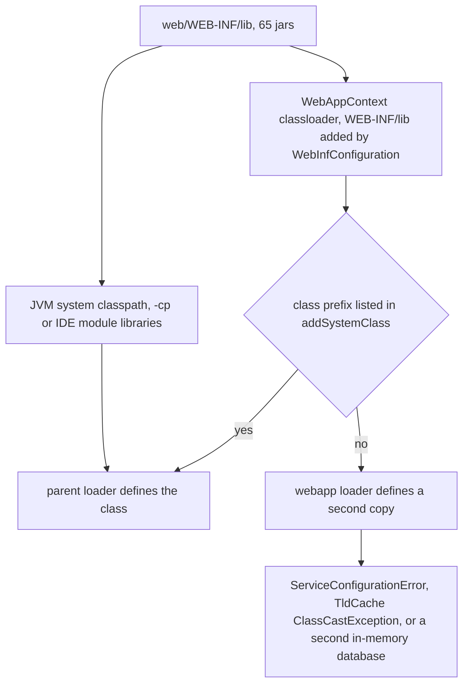
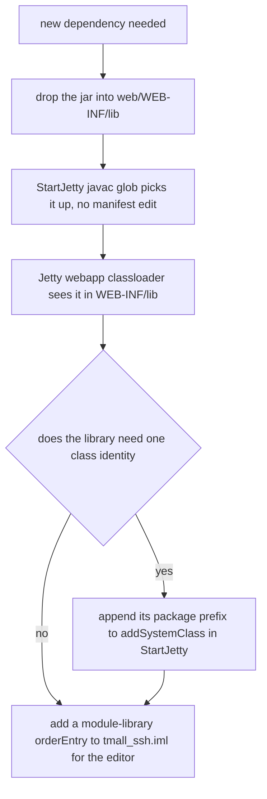

# Runtime Dependencies: Vendored Jars, JDK Compatibility, and the Missing Build

This checkout has **no `pom.xml`, no `build.gradle`, no `build.xml` and no CI workflow** anywhere in the
repository. There is no dependency manifest at all: the dependency declaration is the directory
`web/WEB-INF/lib`, and the *file names* carry the versions. Everything below is therefore about a set of
committed binary jars plus the code that consumes them — `StartJetty`'s classpath glob for compilation,
Jetty's webapp classloader for execution, and `tmall_ssh.iml` for the editor
(`MIGRATION.md#L13-L24`, `STARTUP.md#L29-L40`).

`MIGRATION.md` records that `web/WEB-INF/lib` was **empty** in the original repository and that the whole
dependency set was rebuilt for the embedded-Jetty/H2 conversion, at the versions the original source
expects, with **no framework version upgraded or replaced** (`MIGRATION.md#L9-L11`, `MIGRATION.md#L20-L20`).
That constraint — not a lock file — is what pins the versions here, and it is the first thing to check
before touching any jar.

## 1. The dependency declaration is a directory

| Fact | Value | Where it is visible |
|---|---|---|
| Directory | `web/WEB-INF/lib` | 65 `*.jar` files, no `pom`/`module` metadata, only jars |
| Compile classpath | every `*.jar` in that directory, case-insensitive match, **sorted**, joined with `File.pathSeparator`, plus `web/WEB-INF/classes` | `src/StartJetty.java#L208-L213`, `src/StartJetty.java#L165-L171` |
| Runtime classpath (layered) | same jars on the JVM classpath **and** `WEB-INF/lib` added to the webapp classloader | `src/StartJetty.java#L38-L41`, `src/StartJetty.java#L71-L81` |
| Editor classpath | 65 per-jar `<orderEntry type="module-library">` references; dead Windows absolute paths (`D:/myRepository`) were replaced by them | `tmall_ssh.iml#L41-L47`, `tmall_ssh.iml#L48-L632` |
| Version control | the jars are committed; `.gitignore` covers only generated output and stray files (`web/WEB-INF/classes/`, `dist/`, `build/`, `out/`, `target/`, `*.log`, `*.mv.db`) | `.gitignore#L1-L18` |

Two consequences follow immediately:

- **The version of every library is only ever a string in a file name.** `hibernate-core-5.3.7.Final.jar`
  *is* the Hibernate version. Replacing the file is the only upgrade mechanism, and no tool checks that
  the replacement is compatible with anything else.
- **Nothing mediates or resolves versions.** The launcher globs the whole directory, so a second copy of
  a library (say another `asm-*.jar`) is added to the classpath rather than chosen over the first. There
  is no conflict detection, no exclusion mechanism and no transitive resolution — every transitive jar
  that a framework needs had to be vendored by hand, which is why the directory contains Hibernate's and
  Struts2's companions as first-class files.

`MIGRATION.md` is internally inconsistent about the count — its change list says 65 jars (`#L20`) while
its dependency section is headed "64" (`#L58`) — but the directory holds **65** jars today.
【人工评审待确认】 which number the migration note intends, and whether the count is meant to be an
invariant at all.

## 2. Inventory, grouped by purpose

Provenance note: the directory contains no `pom`/`module` descriptors, so a jar's owner can only be
inferred from its name and version. The grouping below is therefore an inference from the file names plus
the consuming code listed in section 3. 【人工评审待确认】 the exact per-jar provenance for the framework
companion jars.

### Struts2 2.5.14.1 and its companions (8 jars)

| Jar | Role in this checkout |
|---|---|
| `struts2-core-2.5.14.1.jar` | the dispatcher (`StrutsPrepareAndExecuteFilter` in `web/WEB-INF/web.xml#L6-L17`), interceptors, `defaultStack` |
| `struts2-convention-plugin-2.5.14.1.jar` | turns every `@Action` annotation into a live URL — `src/struts.xml` declares **no** `<action>` element |
| `struts2-spring-plugin-2.5.14.1.jar` | supplies the object factory behind `struts.objectFactory=spring` (`src/struts.xml#L9`) |
| `freemarker-2.3.26-incubating.jar` | the FreeMarker line the Struts2 2.5.14.1 release expects (see section 4) |
| `ognl-3.1.15.jar` | OGNL, Struts2's expression/parameter-binding engine |
| `commons-fileupload-1.3.3.jar` | the `defaultStack` file-upload interceptor, needed because `Action4Upload` exposes `img` / `imgFileName` / `imgContentType` (`src/com/caozhihu/tmall/action/Action4Upload.java#L5-L9`) |
| `commons-lang3-3.6.jar` | Struts2 internal utilities |
| `commons-io-2.5.jar` | directly imported by business code: `org.apache.commons.io.FileUtils` (`src/com/caozhihu/tmall/action/CategoryAction.java#L5-L5`, `src/com/caozhihu/tmall/action/Action4Service.java#L5-L5`) |

### Spring 4.3.18.RELEASE (12 jars)

`spring-aop`, `spring-beans`, `spring-context`, `spring-context-support`, `spring-core`,
`spring-expression`, `spring-jdbc`, `spring-orm`, `spring-test`, `spring-tx`, `spring-web`,
`spring-webmvc` — all at `4.3.18.RELEASE`, i.e. one identical version string across the whole set.
The ones with a named consumer in this repository:

| Jar | Named consumer |
|---|---|
| `spring-web` | `ContextLoaderListener` and `CharacterEncodingFilter` in `web/WEB-INF/web.xml#L19-L39` |
| `spring-orm` | `LocalSessionFactoryBean`, `HibernateTransactionManager`, and `HibernateTemplate` which `DAOImpl` extends (`src/applicationContext.xml#L46-L72`, `src/com/caozhihu/tmall/dao/impl/DAOImpl.java#L3-L11`) |
| `spring-jdbc` | `DriverManagerDataSource` and `DataSourceInitializer` (`src/applicationContext.xml#L21-L44`) |
| `spring-tx` + `spring-aop` | `<tx:annotation-driven transaction-manager="transactionManager"/>` (`src/applicationContext.xml#L17`) |
| `spring-context` + `spring-beans` + `spring-core` | `<context:annotation-config>`, component scan, `@Autowired` / `@Resource` injection (`src/applicationContext.xml#L14-L15`) |
| `spring-expression` | SpEL, used internally by Spring 4.3 (no `@Value` in `src/`) |
| `spring-test` | `SpringJUnit4ClassRunner` + `@ContextConfiguration` in the single test (see section 3) |

`spring-webmvc` and `spring-context-support` have **no declared consumer** in the repository — no
`DispatcherServlet`, no cache/JavaMail/velocity integration is configured
(`web/WEB-INF/web.xml#L1-L41`). 【人工评审待确认】 whether they are needed transitively or are simply part
of the conventional Spring web set.

### Hibernate 5.3.7 stack (11 jars + the JDK 11 shims)

`hibernate-core-5.3.7.Final.jar`, `hibernate-commons-annotations-5.0.4.Final.jar`,
`javax.persistence-api-2.2.jar` (the JPA annotations every entity imports,
`src/com/caozhihu/tmall/pojo/Category.java#L3-L3`), `jandex-2.0.5.Final.jar`,
`javassist-3.23.1-GA.jar`, `byte-buddy-1.8.17.jar`, `classmate-1.3.4.jar`, `antlr-2.7.7.jar`,
`dom4j-1.6.1.jar`, `jboss-logging-3.3.2.Final.jar`,
`jboss-transaction-api_1.2_spec-1.1.1.Final.jar`.

The Hibernate line also forces two of the JDK shims (`jaxb-api-2.3.1.jar`) — see section 4 for why.

### Jetty 9.4.58 (12 modules + schemas)

`jetty-annotations`, `jetty-http`, `jetty-io`, `jetty-jndi`, `jetty-plus`, `jetty-rewrite`,
`jetty-security`, `jetty-server`, `jetty-servlet`, `jetty-util`, `jetty-webapp`, `jetty-xml` — every one
at the identical version string `9.4.58.v20250814` — plus `jetty-schemas-3.1.jar`.

They are not decorative: `StartJetty` imports and wires them directly
(`src/StartJetty.java#L1-L13`) — `jetty-server`/`jetty-webapp`/`jetty-xml` for the `Server` and
`WebAppContext`, `jetty-annotations` for the `AnnotationConfiguration` that activates the JSP
`ServletContainerInitializer`, `jetty-plus`/`jetty-jndi` for `EnvConfiguration`/`PlusConfiguration`, and
`jetty-rewrite` for the exact-match `/` → `/forehome` rule (`src/StartJetty.java#L83-L104`). Because the
launcher names these classes at compile time, the Jetty module set is part of the *compile* classpath,
not only the runtime one.

### JSP / EL / JSP compiler (4 jars)

`org.mortbay.jasper.apache-jsp-8.5.100.jar`, `org.mortbay.jasper.apache-el-8.5.100.jar`,
`org.eclipse.jetty.apache-jsp-9.4.58.v20250814.jar` (Jetty's Jasper glue) and
`org.eclipse.jdt.ecj-3.26.0.jar` (the JSP compiler).

This group carries the entire view-layer runtime: `web.xml` declares **no servlet at all**
(`web/WEB-INF/web.xml#L1-L41`), so JSP support exists only because these jars are on the classpath and
because the launcher's `Configuration` chain runs
`AnnotationConfiguration`/`JasperInitializer` (`src/StartJetty.java#L83-L88`). There is **no standalone
`jsp-api` jar** in the directory: the JSP API travels inside the Jasper artifacts, which is why the
`javax.servlet.jsp.` prefix is one of the pinned class prefixes in section 6.
【人工评审待确认】 whether Jasper always selects the vendored ECJ compiler over a JDK `javac`.

### Database (2 jars)

| Jar | Status |
|---|---|
| `h2-1.4.200.jar` | **active** — driver of the `ds` bean (`org.h2.Driver`), of the in-memory URL `jdbc:h2:mem:tmall_ssh;MODE=MySQL;DB_CLOSE_DELAY=-1`, and of the console started on port 8082 (`src/applicationContext.xml#L19-L27`, `src/StartJetty.java#L107-L108`) |
| `mysql-connector-java-8.0.13.jar` | **inactive** — the MySQL datasource (`com.mysql.cj.jdbc.Driver`, `jdbc:mysql://localhost:3306/tmall_ssh`) is retained only as a comment block, kept "for switching back" (`src/applicationContext.xml#L74-L101`, `MIGRATION.md#L42`) |

### Logging (3 jars)

`log4j-api-2.9.1.jar`, `log4j-core-2.9.1.jar`, `commons-logging-1.2.jar`. The log4j2 configuration is
`src/log4j2.xml`, which reaches the classpath root only because the launcher copies every non-`.java`
file from `src/` into `web/WEB-INF/classes` preserving paths (`src/StartJetty.java#L188-L206`); the
vendored log4j2 core then finds it by its standard classpath file name. Note that no `slf4j-api` and no
`log4j-jcl`/`log4j-slf4j` bridge jar is vendored: 【人工评审待确认】 which bridge each framework picks and
therefore which of its messages reach the `Console` appender.

### ASM / bytecode / AOP (5 jars)

`asm-9.7.1.jar`, `asm-commons-9.7.1.jar`, `asm-tree-9.7.1.jar`, `aspectjweaver-1.9.2.jar`,
`aopalliance-1.0.jar`. The ASM version is a JDK 17 requirement (section 4); `aopalliance` is the
interception interface Spring AOP needs. `aspectjweaver` has no visible consumer: `src/` contains no
`@Aspect` type and `applicationContext.xml` declares no `<aop:…>` element.
【人工评审待确认】 whether `aspectjweaver` is vestigial. 【人工评审待确认】 which consumers use the three
ASM jars (the Struts convention plugin is the one `MIGRATION.md` names; Jetty's annotation scanning and
Spring's repackaged bytecode libraries are other candidates).

### Servlet API and JSTL (3 jars)

`servlet-api-3.1.jar` — the Servlet 3.1 API used by both the compiled code
(`src/com/caozhihu/tmall/interceptor/AuthInterceptor.java#L13-L15` imports `javax.servlet.*`) and the
runtime. `jstl-api-1.2.jar` + `jstl-impl-1.2.jar` — both halves of JSTL (section 4); they are load-bearing
because the JSPs declare the `c`, `fmt` and `fn` tag libraries
(`web/include/header.jsp#L5-L7`, `web/admin/listCategory.jsp#L11-L11`).

【人工评审待确认】 `web/WEB-INF/web.xml` declares descriptor version `4.0` while the only vendored servlet
API jar is `servlet-api-3.1.jar` and the container is Jetty 9.4 (a Servlet 3.1 implementation); whether
the newer descriptor declaration has any consequence in practice is not decidable from this repository
(`web/WEB-INF/web.xml#L2-L5`).

### Test-only (2 jars beyond the Spring set)

`junit-4.12.jar` and `hamcrest-core-1.3.jar`, alongside `spring-test-4.3.18.RELEASE.jar`. They exist for
exactly one class, `src/com/caozhihu/tmall/test/TestTmall.java`
(`src/com/caozhihu/tmall/test/TestTmall.java#L6-L16`), which is the only test in the repository
([Testing and Verification](/openwiki/testing/verification.md)). Because the launcher compiles **every**
`.java` under `src/` in one `javac` invocation (`src/StartJetty.java#L158-L183`), these jars sit on the
same classpath as production code and the compiled test class is deployed into
`web/WEB-INF/classes` with the business classes. A missing test jar therefore breaks the *launch*, not
just a test run — and a new dependency imported by the test has to be vendored like any other.

## 3. Which jars the application's own configuration makes mandatory

The dependency set is not arbitrary: several jars are named by configuration files, so removing them
breaks startup rather than merely disabling a feature.

| Jar | Why it is mandatory | Evidence |
|---|---|---|
| `struts2-core-2.5.14.1.jar` | the filter class in `web.xml` is a Struts2 class | `web/WEB-INF/web.xml#L6-L17` |
| `struts2-convention-plugin-2.5.14.1.jar` | `struts.xml` has no `<action>` mapping; every endpoint comes from `@Action` annotations | `src/struts.xml#L7-L26`, `src/com/caozhihu/tmall/action/CategoryAction.java#L16-L16` |
| `struts2-spring-plugin-2.5.14.1.jar` | `struts.objectFactory=spring` | `src/struts.xml#L9-L9` |
| `spring-web-4.3.18.RELEASE.jar` | `ContextLoaderListener` + `CharacterEncodingFilter` | `web/WEB-INF/web.xml#L19-L39` |
| `spring-orm`, `spring-jdbc`, `spring-tx` (+ `spring-aop`) | the four bean definitions and `<tx:annotation-driven>` in the root context | `src/applicationContext.xml#L14-L72` |
| `hibernate-core-5.3.7.Final.jar`, `javax.persistence-api-2.2.jar` | `LocalSessionFactoryBean`, `HibernateTemplate`, and the annotation-mapped entities | `src/applicationContext.xml#L46-L66`, `src/com/caozhihu/tmall/pojo/Category.java#L3-L3` |
| `h2-1.4.200.jar` | the datasource driver and the console | `src/applicationContext.xml#L21-L27`, `src/StartJetty.java#L107-L108` |
| `log4j-api` + `log4j-core-2.9.1.jar` | the logging configuration is a log4j2 file | `src/log4j2.xml#L1-L18` |
| all 12 Jetty modules | `StartJetty` compiles against them | `src/StartJetty.java#L1-L13` |
| `jstl-api-1.2` + `jstl-impl-1.2.jar` | taglib declarations in the JSPs | `web/include/header.jsp#L5-L7` |

## 4. Version choices the migration documents constrain

Each of these is a deliberate artifact choice rather than an arbitrary download
(`MIGRATION.md#L51-L62`):

| Constraint | Why | Where it shows up |
|---|---|---|
| **No framework version may be upgraded** — Spring `4.3.18.RELEASE`, Struts2 `2.5.14.1`, Hibernate `5.3.7.Final` must stay at the versions the source expects; Jetty is held on `9.4.x` and H2 on `1.4.x` | the conversion's hard constraint: business source, JSPs and `web.xml` were not to change, including the framework versions they were written against | `MIGRATION.md#L7-L11`, `MIGRATION.md#L20-L20` |
| `freemarker-2.3.26-incubating.jar` instead of plain `2.3.26` | the plain `2.3.26` artifact was withdrawn from Maven Central; the `-incubating` build is the same version line | `MIGRATION.md#L60-L60` |
| JSTL as `jstl-api-1.2.jar` + `jstl-impl-1.2.jar` | JSTL is not published as a single jar | `MIGRATION.md#L61-L61` |
| `asm-9.7.1.jar` (with `asm-commons`/`asm-tree`) instead of the `5.2` line | on JDK 17 the Struts convention plugin reads JDK classes from the `jrt:/` virtual filesystem, i.e. v61 bytecode, which only ASM 9 parses | `MIGRATION.md#L55-L55` |
| `javax.annotation-api-1.3.2.jar` | `@Resource` was removed from the JDK in 11+ and is used by the DAO layer | `MIGRATION.md#L53-L53`, `src/com/caozhihu/tmall/dao/impl/DAOImpl.java#L7-L14` |
| `jaxb-api-2.3.1.jar` | Hibernate 5.3 depends on JAXB, which 11+ no longer ships | `MIGRATION.md#L54-L54` |
| `StartJetty.openJdk9PlusModules()` | Spring 4.x reflects into JDK-internal packages, so the launcher performs a programmatic `--add-opens` equivalent | `MIGRATION.md#L56-L56`, `src/StartJetty.java#L215-L236` |

## 5. JDK 8 / 11 / 17 compatibility

The project runs on JDK 8, 11 or 17, with the recorded verification performed on JDK 17 (Temurin
17.0.20.1) (`STARTUP.md#L5-L8`, `MIGRATION.md#L51-L56`). Four kinds of accommodation make that possible,
and three of them are visible in the jar directory:

1. **Bytecode level is fixed at 8**, not inherited from the runtime JDK: the launcher compiles with
   `-source 8 -target 8` (`src/StartJetty.java#L165-L171`), so the same classes load on any of the three
   JDKs. This also constrains the source level: no post-Java-8 language feature can be used in `src/`.
2. **API shims as jars** — `javax.annotation-api-1.3.2.jar` and `jaxb-api-2.3.1.jar` (table above).
3. **ASM 9.7.1** for reading JDK 17 class files during Struts convention scanning.
4. **Programmatic module opening** — `openJdk9PlusModules()` runs as the first statement of `main`
   (`src/StartJetty.java#L54`, `#L215-L236`) and opens nine JDK packages reflectively; it is a no-op on
   JDK 8 because `Class.forName("java.lang.Module")` fails there.

There is nothing else: no `--add-opens` in a launch script (there is no launch script), no `.jvmargs`
file, no `JAVA_TOOL_OPTIONS` convention and no JDK-version-specific profile in any file. All JDK-9+
accommodation lives in `StartJetty` itself, so a dependency that needs module access means editing Java,
not adding a build or launch flag.

【人工评审待确认】 whether any of the nine `addOpens` calls actually take effect (every failure is
swallowed, so a silently ignored call looks identical from outside), and whether the old
`byte-buddy-1.8.17` / `h2-1.4.200` pair behaves fully on JDK 17 outside the paths covered by the recorded
acceptance run — both predate that JDK and neither is listed among the recorded JDK-17 workarounds
(`MIGRATION.md#L51-L56`, `MIGRATION.md#L73-L83`).

## 6. The classpath-duplication constraint

Both documented launch modes put **the same jars on the JVM system classpath and in `WEB-INF/lib`**:
command-line mode passes `-cp "web/WEB-INF/lib/*"`, and IDE mode has the same jars as module libraries
(`src/StartJetty.java#L38-L41`, `STARTUP.md#L29-L40`, `tmall_ssh.iml#L48-L632`). Jetty's
`WebInfConfiguration` additionally adds `WEB-INF/lib` to the webapp classloader, so without intervention
a class such as `org.apache.logging.log4j.core.Logger` would be defined twice in one JVM.

*How one vendored jar can produce two class definitions, and where `addSystemClass` cuts the second one off.*

The launcher's answer is seven `addSystemClass(prefix)` calls, which force those classes to be loaded only
by the parent loader (`src/StartJetty.java#L71-L81`):

| Prefix | What it protects | Symptom if it is lost |
|---|---|---|
| `org.apache.logging.log4j.` | one log4j2 plugin/service registry | `ServiceConfigurationError` at startup, appenders silently lost |
| `org.h2.` | one `org.h2` identity so the 8082 console and the datasource share the single in-memory database | the console shows no business data (two isolated `mem:tmall_ssh` databases) |
| `org.apache.juli.` | the logging bridge the JSP engine uses | 【人工评审待确认】 no standalone juli jar exists in `web/WEB-INF/lib` |
| `org.apache.jasper.`, `org.apache.el.`, `javax.servlet.jsp.`, `org.eclipse.jetty.apache.jsp.` | one JSP/EL API identity so the webapp's Jasper accepts the `TldCache` published by Jetty's glue | `TldCache` `ClassCastException` or `getTldCache() is null`; the webapp comes up **unavailable** |

Operationally this produces three rules that a dependency change must respect:

- **Do not remove or replace a jar that supplies a pinned prefix.** The prefixes exist because of the
  duplication; removing the duplicate without removing the pin, or adding a conflicting copy, is what
  reintroduces `ServiceConfigurationError` and the TldCache failure
  (`src/StartJetty.java#L76-L81`, `STARTUP.md#L83-L83`).
- **A newly added jar may need its own prefix.** If its classes are also visible to the system loader
  (which they are: the launcher compiles against the same directory), a stateful library with a service
  registry — the pattern that made `log4j` and `h2` fail — needs to be added to the list, which
  `STARTUP.md` treats as one of the two settings not to modify casually.
- **A missing jar in this category fails as a confusing runtime error, not as a build error**, because
  compilation only needs the API jars while the duplicated-class failures happen at webapp deployment
  time.

`MIGRATION.md` names exactly this as the reason the pins exist: every jar sits on the JVM classpath *and*
in `WEB-INF/lib`, and duplicate classes cause `ServiceConfigurationError` and `TldCache ClassCastException`
(`MIGRATION.md#L34-L34`).

## 7. There is no build file: how a dependency change is made

Procedure for adding or replacing a dependency in this checkout:

*The three places a new dependency touches — the library directory, the launcher's pin list, and the IDE metadata; none of them is a build descriptor.*

1. **Drop the `.jar` into `web/WEB-INF/lib`.** That is the whole declaration: the launcher's compile
   classpath glob (`src/StartJetty.java#L208-L213`) and Jetty's webapp loader both read the directory, so
   compilation and runtime pick the jar up with no other edit. There is nothing to regenerate and no
   dependency cache to refresh.
2. **Add the classpath entry to `tmall_ssh.iml`** if the IDE should see it — the metadata lists every jar
   individually (`tmall_ssh.iml#L48-L632`), so the editor diverges silently from the real classpath
   otherwise. `MIGRATION.md` records the sibling `.vscode/settings.json` for VSCode/TRAE; that file is in
   `.openwikiignore` and is not visible in this checkout, so only the `.iml` can be verified here.
3. **Add the package prefix to `StartJetty`'s `addSystemClass` list** if the library needs a single
   identity across the two classloaders (section 6). This is the case for any library discovered through a
   service registry or holding a singleton resource.
4. **Nothing else exists to change** — no `pom.xml`, `build.gradle`, `build.xml`, no CI workflow and no
   test task anywhere in the repository (`MIGRATION.md#L13-L24`, `STARTUP.md#L29-L40`).

Hazards specific to this arrangement:

- **No version mediation.** Two versions of the same library both land on the classpath; the JDK's
  sorted glob order decides for compilation, but class resolution at runtime additionally depends on
  classloader order. Nothing in the repository detects the conflict.
- **Mixed-version frameworks are possible by accident.** The 12 Jetty modules share one version string
  and are wired into a single `Server` by `StartJetty`; replacing one of them in isolation produces a
  mixed-version Jetty that no tool will flag.
- **The IDE metadata is not authoritative.** `StartJetty` never reads `tmall_ssh.iml`, so an IDE that
  compiles successfully can still fail at launch (and vice versa) when the two disagree.
- **Test jars are runtime jars.** See section 2 — anything the test imports must be vendored, or the
  launcher's own compilation aborts (`src/StartJetty.java#L179-L183`).
- **Version changes are framework changes.** Given `MIGRATION.md`'s no-upgrade constraint, replacing a
  framework jar is a decision that has to be justified against the recorded baseline
  ([SDD Baseline](/openwiki/concepts/sdd-baseline.md)), not a routine dependency bump.

【人工评审待确认】 Should the vendored jars be replaced by a build file (`pom.xml`/`build.gradle`) with
explicit versions and transitive resolution, or is the directory-plus-`addSystemClass` arrangement the
intended permanent design for this training/SDD baseline? Both the compile step and the classloader
pinning assume the directory layout; a build file would move the version facts out of the file names that
every existing page and the migration note reference.

## 8. Detecting and repairing a damaged jar

A truncated download is a plausible failure mode for a hand-assembled jar directory, and the repository
records both the symptom and the repair recipe (`STARTUP.md#L79-L86`):

| Symptom | Meaning | Action |
|---|---|---|
| `zip END header not found` (or a similar archive error) when a jar is opened by the compiler or classloader | the jar file is truncated/corrupt | re-download that single artifact from the public mirror `https://maven.aliyun.com/repository/public/` |
| — | batch integrity check over the whole directory | `for f in web/WEB-INF/lib/*.jar; do unzip -tq "$f" >/dev/null \|\| echo "$f 损坏"; done` |

The `unzip -tq` loop is the only dependency-integrity tool the repository documents; it tests each jar's
central directory and prints the names of the files that fail, which is exactly the granularity needed
because the jars are addressed individually by file name. After repairing a jar, the observable proof that
the dependency set is again coherent is the normal start path — the banner with the three URLs, the
storefront and admin endpoints returning `200`, and the H2 console attaching to the seeded database
(`MIGRATION.md#L73-L83`, [Runtime Bootstrap](/openwiki/architecture/runtime-bootstrap.md)).

Note that corruption is not detected by anything automated: there is no CI, no checksum file and no
lock file, so a damaged jar is discovered by a failed launch or by running the loop by hand.

## 9. Review items

- 【人工评审待确认】 Should the vendored jar set be replaced by a build descriptor with transitive
  resolution (section 7), or is the directory the intended design?
- 【人工评审待确认】 `MIGRATION.md` says 65 jars in its change list and 64 in its dependency section; the
  directory holds 65 (section 1).
- 【人工评审待确认】 Which consumers actually use `asm`, `asm-commons` and `asm-tree` 9.7.1 — the Struts
  convention plugin alone, or also Jetty's annotation scanning?
- 【人工评审待确认】 `aspectjweaver-1.9.2.jar`, `spring-webmvc-4.3.18.RELEASE.jar`,
  `spring-context-support-4.3.18.RELEASE.jar` and `freemarker-2.3.26-incubating.jar` have no visible
  consumer in `src/`, `web/`, or the XML configuration; confirm whether they are transitively required or
  vestigial cargo.
- 【人工评审待确认】 Which logging bridge (`commons-logging-1.2.jar` with no `log4j-jcl`, and no
  `slf4j-api`) each framework picks, and therefore which framework messages reach the console appender.
- 【人工评审待确认】 `org.apache.juli.` is pinned to the parent loader although no standalone juli jar is
  vendored; confirm which artifact supplies those classes and whether the prefix is still needed.
- 【人工评审待确认】 `web/WEB-INF/web.xml` declares descriptor version 4.0 while the vendored servlet API
  is 3.1 and the container is Jetty 9.4; whether that mismatch has any effect.
- 【人工评审待确认】 Whether the recorded JDK-17 acceptance run covers everything the old
  `h2-1.4.200` / `byte-buddy-1.8.17` artifacts are asked to do on JDK 17, since neither appears among the
  documented JDK-17 workarounds.

The class-loading and JSP-activation questions that overlap with this page are owned by
[Runtime Bootstrap](/openwiki/architecture/runtime-bootstrap.md), the file-and-value inventory by
[Configuration Surface](/openwiki/architecture/configuration.md), and the test-side consequences of a
vendored jar by [Testing and Verification](/openwiki/testing/verification.md).
