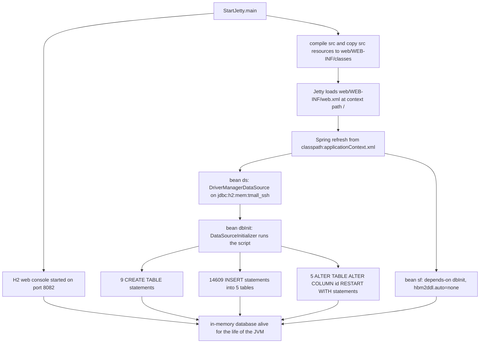

# Operations: Data, Schema, and Seed State

Nothing in this project creates a table or a column except one SQL file. Hibernate is configured
`hibernate.hbm2ddl.auto=none` and the only schema statement that ever runs is the seed script a Spring
bean executes at context refresh, so `src/sql/tmall_ssh_h2.sql` — not the entity annotations — decides
what the database looks like and what it contains. This page owns that file and the data surface around
it: the nine tables and their seeded rows, the identity calibration block, the exact adaptation diff
against the untouched `sql/tmall_ssh.sql`, the lifetime and reset semantics of an in-memory database,
the H2 console on port 8082, and the commented MySQL fallback. How statements travel from Java to the
database is [Persistence Layer](/openwiki/architecture/persistence-layer.md); the entities and their
associations are [Domain Model](/openwiki/concepts/domain-model.md); the values inside
`applicationContext.xml` are [Configuration Surface](/openwiki/architecture/configuration.md); launching
and troubleshooting are [Startup and Diagnostics](/openwiki/operations/startup-and-diagnostics.md).

## 1. One file owns the schema, and Hibernate cannot change it

Three configuration facts together produce the whole data story:

- `hibernate.hbm2ddl.auto=none` (`src/applicationContext.xml#L56-L65`). The in-file comment records why
  it is not `update`: with `update`, Hibernate derived foreign keys from the entity annotations (for
  example `propertyvalue.pid`), the demo rows did not satisfy them, and startup printed constraint
  violations (`MIGRATION.md#L64-L71`).
- the `dbInit` bean, a Spring `DataSourceInitializer` over the `ds` datasource, whose nested
  `ResourceDatabasePopulator` sets `sqlScriptEncoding=UTF-8` and runs exactly one script,
  `classpath:sql/tmall_ssh_h2.sql` (`src/applicationContext.xml#L29-L44`).
- `sf` declares `depends-on="dbInit"`, so the script always finishes before the `SessionFactory` is
  built and before any DAO query can run (`src/applicationContext.xml#L46-L47`).

The consequences an operator has to hold on to:

- **No DDL, no validation, no mapping check at startup.** Hibernate 5.3 with `none` emits nothing and
  checks nothing. A table or column that the script does not define is invisible until the first query
  that needs it, and then it is an SQL error, not a boot failure
  (`src/com/caozhihu/tmall/pojo/Product.java#L7-L12` versus `src/sql/tmall_ssh_h2.sql#L58-L69`).
- **The script is create-only and runs on every context refresh.** It contains nine plain
  `CREATE TABLE` statements with no `DROP TABLE` and no `IF NOT EXISTS`
  (`src/sql/tmall_ssh_h2.sql#L11-L15`, `#L33-L38`, `#L39-L56`, `#L58-L69`, `#L155-L162`, `#L1093-L1099`,
  `#L1357-L1365`, `#L14688-L14697`, `#L14698-L14707`), and the populator sets no `continueOnError`, so it
  is written for a fresh, empty database. Executing it a second time against a database that already
  holds those tables fails at the first `CREATE TABLE`; there is no re-seed statement and no reset
  endpoint. The supported way back to the seeded state is a restart (§6).

## 2. Startup-time data flow



*The order in which the launcher, the Spring context, the seed script and the H2 console meet the one in-memory database.*

The console is started before `server.start()` (`src/StartJetty.java#L108-L110`), so port 8082 listens
while the context is still refreshing and the tables appear as soon as `dbInit` has run. The whole path
above is walked in detail in
[Startup and Diagnostics](/openwiki/operations/startup-and-diagnostics.md) and
[Runtime Bootstrap](/openwiki/architecture/runtime-bootstrap.md).

## 3. The nine tables and exactly what each is seeded with

`src/sql/tmall_ssh_h2.sql` creates nine tables and issues **14609** `INSERT` statements in total, into
exactly five of them. The other four are created and left empty.

| Table | `CREATE TABLE` | `INSERT` range | Seeded rows | Seeded id range | Foreign keys declared in the DDL |
|---|---|---|---|---|---|
| `category` | `#L11-L15` | `#L16-L32` | 17 | 60–83 | — |
| `user` | `#L33-L38` | — | 0 | — | — |
| `order_` | `#L39-L56` | — | 0 | — | `uid` → `user(id)` |
| `product` | `#L58-L69` | `#L70-L154` | 85 | 87–962 | `cid` → `category(id)` |
| `productimage` | `#L155-L162` | `#L164-L1092` | 929 | 629–10198 | `pid` → `product(id)` |
| `property` | `#L1093-L1099` | `#L1100-L1356` | 257 | 1–257 | `cid` → `category(id)` |
| `propertyvalue` | `#L1357-L1365` | `#L1367-L14687` | 13321 | 716–14091 | `ptid` → `property(id)` (no `pid`) |
| `review` | `#L14688-L14697` | — | 0 | — | `pid` → `product(id)`, `uid` → `user(id)` |
| `orderitem` | `#L14698-L14707` | — | 0 | — | `uid` → `user(id)`, `pid` → `product(id)` (no `oid`) |

Every line anchor in the table above is in `src/sql/tmall_ssh_h2.sql`.

What the seeded set actually looks like:

- Every `INSERT` uses the positional form with no column list — `INSERT INTO category VALUES (60,'安全座椅');`
  — so the column order in the `CREATE TABLE` is the load contract
  (`src/sql/tmall_ssh_h2.sql#L16`, `#L70`, `#L164`, `#L1100`, `#L1367`).
- `category` holds 17 storefront top-level categories with gapped ids (60, 64, 68, 69, 71–83); two names
  carry a trailing space (`男士手拿包 `, `扫地机器人 `) (`src/sql/tmall_ssh_h2.sql#L16-L32`).
- `product` holds 85 rows, exactly five per category, ids spaced in groups of five
  (87–91 for `cid` 83, 147–151 for `cid` 82, … 958–962 for `cid` 60)
  (`src/sql/tmall_ssh_h2.sql#L70-L154`).
- `productimage` holds 929 rows over the full id band 629–10198, each pointing at a seeded product and
  carrying either `type_single` or `type_detail` — the literal vocabulary the upload path and the JSPs
  both depend on (`src/sql/tmall_ssh_h2.sql#L164-L1092`,
  [Runtime Invariants](/openwiki/conventions/runtime-invariants.md#48-status-type-and-ajax-body-literals)).
- `property` holds the 257 product-attribute names, grouped by category id
  (`src/sql/tmall_ssh_h2.sql#L1100-L1356`), and `propertyvalue` holds the 13321 `(product, property,
  value)` rows that fill the product-detail pages (`src/sql/tmall_ssh_h2.sql#L1367-L14687`).
- The four empty tables are exactly the ones the UI fills at runtime: `user` on registration
  (`src/com/caozhihu/tmall/action/ForeAction.java#L27-L40`), `orderitem` for cart lines whose order is
  null (`src/com/caozhihu/tmall/action/ForeAction.java#L151-L169`, `#L189-L211`, `#L213-L220`), and
  `order_` plus `orderitem` and `review` on checkout and review
  (`src/com/caozhihu/tmall/action/ForeAction.java#L243-L259`, `#L334`). A freshly started application
  therefore has **no demo account** — the login form cannot succeed until someone registers — and an
  empty cart, order list and review list.

To check the row set by hand, log into the console (§7) and compare:

```sql
SELECT COUNT(*) FROM category;      -- 17
SELECT COUNT(*) FROM product;       -- 85
SELECT COUNT(*) FROM productimage;  -- 929
SELECT COUNT(*) FROM property;      -- 257
SELECT COUNT(*) FROM propertyvalue; -- 13321
SELECT MAX(id) FROM product;        -- 962
```

`user`, `order_`, `review` and `orderitem` should report zero rows until the UI writes to them.

## 4. The identity calibration block at the end of the script

The last eight lines of `src/sql/tmall_ssh_h2.sql` are a calibration block
(`src/sql/tmall_ssh_h2.sql#L14708-L14715`): five `ALTER TABLE … ALTER COLUMN id RESTART WITH n`
statements that set each identity counter to the next-id value the original MySQL dump had recorded as
`AUTO_INCREMENT=n`.

| Table | Calibrated next id | Upstream `AUTO_INCREMENT` | Highest seeded id |
|---|---|---|---|
| `category` | 84 | 84 (`sql/tmall_ssh.sql#L8`) | 83 |
| `product` | 963 | 963 (`sql/tmall_ssh.sql#L62`) | 962 |
| `productimage` | 10211 | 10211 (`sql/tmall_ssh.sql#L155`) | 10198 |
| `property` | 258 | 258 (`sql/tmall_ssh.sql#L1092`) | 257 |
| `propertyvalue` | 14092 | 14092 (`sql/tmall_ssh.sql#L1358`) | 14091 |

Three properties of this block matter:

- **It reproduces the original counter, not `max(id) + 1`.** `productimage` is calibrated to 10211 while
  its highest seeded id is 10198, so twelve ids are skipped exactly as they were upstream
  (`src/sql/tmall_ssh_h2.sql#L1086-L1092`, `#L14713`).
- **It has exactly one statement per upstream `AUTO_INCREMENT=n`.** The MySQL dump carries five such
  suffixes, on `category`, `product`, `productimage`, `property` and `propertyvalue`
  (`sql/tmall_ssh.sql#L8`, `#L62`, `#L155`, `#L1092`, `#L1358`); the four tables whose `id` column has no
  counter — `user`, `order_`, `review`, `orderitem` — get no statement, so nothing sets their counters and
  the first row the UI inserts into any of them is id 1.
- **It is the only thing keeping new ids comparable with the recorded acceptance expectation.** The
  recorded check is that the first newly added `category` id is 84 (`MIGRATION.md#L81-L82`), which is
  also the value the manual smoke path asserts
  ([Verification](/openwiki/testing/verification.md#4-the-manual-smoke-path)). Add rows without editing
  these five values and new ids silently diverge from that expectation.

## 5. What the adaptation actually changed (`src/sql/tmall_ssh_h2.sql` vs `sql/tmall_ssh.sql`)

`sql/tmall_ssh.sql` is the original MySQL dump, kept untouched and still MySQL-only: it opens with a
byte-order mark and then `DROP DATABASE IF EXISTS tmall_ssh;`, `CREATE DATABASE tmall_ssh DEFAULT
CHARACTER SET utf8;` and `USE tmall_ssh;` (`sql/tmall_ssh.sql#L1-L3`). It cannot be run against H2 as
it stands. The adapted copy states its own four adaptations in its header comment
(`src/sql/tmall_ssh_h2.sql#L1-L9`), and they are the complete diff:

| Change | Upstream | Adapted copy |
|---|---|---|
| Database setup lines removed | `sql/tmall_ssh.sql#L1-L3`, including the leading BOM | absent; the file starts with a plain `--` comment line (`src/sql/tmall_ssh_h2.sql#L1`) |
| Table option suffixes stripped | nine × `) ENGINE=InnoDB [AUTO_INCREMENT=n] DEFAULT CHARSET=utf8;` (`sql/tmall_ssh.sql#L8`, `#L31`, `#L49`, `#L62`, `#L155`, `#L1092`, `#L1358`, `#L14690`, `#L14700`) | nine × `);` |
| `int(11)` → `int` | 22 occurrences | none left in any statement (the only remaining mention is the header comment, `src/sql/tmall_ssh_h2.sql#L6`) |
| Calibration appended | no counterpart | five `ALTER TABLE … RESTART WITH` statements (`src/sql/tmall_ssh_h2.sql#L14711-L14715`) |

Everything else is data-identical: row counts match table by table — 17 `category`, 85 `product`,
929 `productimage`, 257 `property`, 13321 `propertyvalue`, 14609 `INSERT` statements in each file — and
`MIGRATION.md` records the same intent as "business table structure and all INSERT data untouched, only
minimal syntax adaptation" (`MIGRATION.md#L44-L49`).

Two operational readings:

- The adapted file is **not** MySQL-ready (no `CREATE DATABASE`/`USE`, and `ALTER COLUMN … RESTART WITH`
  is the H2 form of the upstream counter), while the upstream file is not H2-ready. Changing demo data
  therefore means editing both files, or accepting that the two diverge.
- The BOM is gone in the adapted copy. Spring's script runner splits the file into statements, so a
  stray BOM on the first line is a parse hazard the adaptation avoided by removing that line.

## 6. Lifetime, reset, and where the script must live

The database is a named in-memory H2 database whose URL carries `DB_CLOSE_DELAY=-1`
(`src/applicationContext.xml#L23-L24`). It therefore lives as long as the JVM does and disappears with
it, and it is per-JVM: an H2 console started outside this process connects to a different, empty database
(`STARTUP.md#L68-L69`).

What that means in practice:

- **Restarting is the reset.** Stop the process and every row written since startup is gone; start it
  again and the script rebuilds the same tables and the same 14609 rows with the same calibrated
  counters (`STARTUP.md#L71-L75`, [Startup and Diagnostics](/openwiki/operations/startup-and-diagnostics.md#5-restart-persistence-and-reset)).
  Rows the smoke path adds — a registered user, cart lines, an order, a review, an admin-added category —
  never survive, while the images those flows write under `web/img/` do
  ([Image Pipeline](/openwiki/workflows/image-pipeline.md)).
- **`web/WEB-INF/classes/sql/tmall_ssh_h2.sql` is a build artefact, not a source.** The reference is
  `classpath:sql/tmall_ssh_h2.sql` (`src/applicationContext.xml#L39`), so the file has to stay under
  `src/` at that relative path; the launcher copies non-Java resources from `src/` into
  `web/WEB-INF/classes` on every start, but only when the destination is missing or older than the
  source by modification time (`src/StartJetty.java#L188-L205`), and that whole directory is ignored by
  version control (`.gitignore#L1-L2`). Edit `src/sql/tmall_ssh_h2.sql`; if a run ever seems to ignore
  your edit, compare timestamps with the copied file rather than editing the copy.
- **The script is re-executed at every context refresh, and only on a fresh database** (§1), so the
  sequence for a schema change is always: edit the script, restart, re-check the console.

## 7. Inspecting the data: the H2 console on port 8082

The launcher starts H2's own web console as a **second, independent web server** before the Jetty
application server, on its own port:
`org.h2.tools.Server.createWebServer("-webPort", "8082").start()` (`src/StartJetty.java#L107-L108`).

| Field | Value | Evidence |
|---|---|---|
| URL | `http://localhost:8082` | `src/StartJetty.java#L116`, `STARTUP.md#L53-L59` |
| JDBC URL | `jdbc:h2:mem:tmall_ssh;MODE=MySQL;DB_CLOSE_DELAY=-1` | `src/applicationContext.xml#L24`, `src/StartJetty.java#L117`, `STARTUP.md#L57` |
| User | `sa` | `src/applicationContext.xml#L25`, `STARTUP.md#L58` |
| Password | empty | `src/applicationContext.xml#L26`, `STARTUP.md#L59` |

Why it is not part of the application: `web/WEB-INF/web.xml` maps the Struts2 filter to `/*`
(`web/WEB-INF/web.xml#L14-L17`), so an in-app console path is handed to the dispatcher and answered with
`no action mapped` (`STARTUP.md#L68`, `MIGRATION.md#L32`). The console reaches the application's data
because it runs in the same JVM, keeps the database alive through `DB_CLOSE_DELAY=-1`, and loads the same
`org.h2` classes that the launcher pins to the parent class loader (`src/StartJetty.java#L71-L74`).
Console-side operational behaviour — that it is fire-and-forget, that it listens while the context is
still refreshing, and how to reclaim the two ports — is in
[Startup and Diagnostics](/openwiki/operations/startup-and-diagnostics.md#4-the-h2-console-on-port-8082).

Useful while inspecting:

```sql
SELECT table_name FROM information_schema.tables WHERE table_schema = 'PUBLIC';
SELECT COUNT(*) FROM product;                     -- 85 after a fresh start
SELECT id, name FROM category ORDER BY id;        -- ids start at 60, not 1
SELECT * FROM propertyvalue WHERE ptid = 257;     -- one product's attribute rows
```

The console is read/write against the live database: statements issued there persist only until the JVM
stops, and nothing re-creates the seeded state except a restart.

## 8. Changing the schema or the seeded data safely

1. **Edit `src/sql/tmall_ssh_h2.sql` only** — add the `CREATE TABLE`/`ALTER` and the `INSERT` rows there,
   keeping the file under `src/sql/` and keeping any change you consider demo-data truth mirrored into
   `sql/tmall_ssh.sql` if the two scripts are meant to stay equivalent (§5).
2. **Keep the calibration honest.** If you add rows whose ids exceed a calibrated value, raise the
   matching `RESTART WITH`; if you add a table that mirrors an upstream `AUTO_INCREMENT=n`, append a
   sixth statement. Leaving the block stale only shows up later, as new ids that no longer match the
   recorded MySQL parity.
3. **Respect the positional `INSERT`.** A row is written as bare values with no column names
   (`src/sql/tmall_ssh_h2.sql#L16`), so adding a column in the middle of a `CREATE TABLE` silently shifts
   every value in every following row of that table; H2 rejects a row with the wrong number of values at
   startup, but a same-arity reordering fails in no way at all.
4. **Keep the entities aligned.** Nothing validates the mapping against the DDL (§1): a new column needs
   a matching entity field (or a mapping annotation) and vice versa, and table names must agree with the
   unquoted identifier the mapping emits. Two divergences are already load-bearing —
   `propertyvalue.pid` is mapped but unconstrained, and the mapping's `productImage`/`orderItem` differ in
   case from the script's `productimage`/`orderitem`
   (`src/sql/tmall_ssh_h2.sql#L1357-L1365`, `#L14698-L14707`,
   `src/com/caozhihu/tmall/pojo/PropertyValue.java#L13-L19`,
   `src/com/caozhihu/tmall/pojo/ProductImage.java#L8`,
   `src/com/caozhihu/tmall/pojo/OrderItem.java#L6`), which is also why `order_` carries its trailing
   underscore (`src/com/caozhihu/tmall/pojo/Order.java#L9-L11`).
5. **Do not add constraints the demo rows cannot satisfy.** The seeded `propertyvalue` rows reference
   product ids that are not in the `product` seed set — the last statement of the file,
   `INSERT INTO propertyvalue VALUES (14091,484,113,'壁挂式');`, points at `pid` 484, which no seeded
   product has (`src/sql/tmall_ssh_h2.sql#L14687` versus `#L70-L154`). That is the data-side reason the
   `hbm2ddl.auto=update` foreign key on `propertyvalue.pid` failed
   (`MIGRATION.md#L64-L71`), and the DDL declares a foreign key only on `ptid`
   (`src/sql/tmall_ssh_h2.sql#L1363`).
6. **Apply the change by restarting**, then inspect through the console (§6, §7). Do not expect the
   script to be re-runnable against the running database, and do not edit the copy under
   `web/WEB-INF/classes`.

The criteria/HQL strings the services build against these table and property names are a separate
coupling: renaming an entity class or property requires editing Java literals too, and the failure
appears when Hibernate compiles the query, not at startup
([Runtime Invariants](/openwiki/conventions/runtime-invariants.md#51-the-seed-script-and-the-id-calibration)).

## 9. The commented MySQL fallback

The original MySQL configuration is still in the file, retained as an XML comment
(`src/applicationContext.xml#L74-L101`):

- a second `sf` using `org.hibernate.dialect.MySQL5Dialect`, `hibernate.show_sql=false` and
  `hibernate.hbm2ddl.auto=update` (`#L78-L93`);
- a second `ds` using `com.mysql.cj.jdbc.Driver`,
  `jdbc:mysql://localhost:3306/tmall_ssh?characterEncoding=UTF-8`, user `root`, password `admin`
  (`#L94-L100`);
- the in-file recipe (`#L76`): 1) 注释掉上面【H2改造-1/2/3】三段；2) 取消本段注释；3) 从 H2 控制台脚本恢复.

What the switch means for the data, as distinct from the bean wiring
([Configuration Surface](/openwiki/architecture/configuration.md#the-retained-mysql-configuration-and-how-to-switch-back)):

- **The seed script disappears from the picture.** `dbInit` lives inside `【H2改造-2】`, so switching back
  removes the script runner entirely and hands schema creation and evolution back to
  `hibernate.hbm2ddl.auto=update`, which is how the original project worked. The demo rows then have to
  be imported from `sql/tmall_ssh.sql`, which is the only file that creates the `tmall_ssh` database and
  `USE`s it (`sql/tmall_ssh.sql#L1-L3`).
- **The driver is already vendored**, `web/WEB-INF/lib/mysql-connector-java-8.0.13.jar`, so nothing has to
  be downloaded (`MIGRATION.md#L40-L42`).
- **Bean names collide.** The commented block redefines `ds` and `sf`, the names the live beans already
  use, which is why the recipe orders commenting before uncommenting.
- **Step 3 is not actionable as written.** The in-file instruction is `从 H2 控制台脚本恢复`, which does
  not say whether it means re-importing `sql/tmall_ssh.sql` into a running MySQL or something else; the
  ambiguity is flagged in
  [Configuration Surface](/openwiki/architecture/configuration.md#the-retained-mysql-configuration-and-how-to-switch-back)
  and belongs in the review list below.

Once switched, note the H2 console is useless for this data (its URL is the in-memory database), and the
five calibrations of §4 no longer apply — MySQL uses the `AUTO_INCREMENT=n` values baked into
`sql/tmall_ssh.sql`.

## 10. Where the repository prose and the data disagree

- **`STARTUP.md`'s console example returns nothing.** `STARTUP.md#L63-L66` suggests
  `SELECT * FROM product WHERE cid = 1;`, but the lowest seeded category id is 60
  (`src/sql/tmall_ssh_h2.sql#L16-L32`), so that query is valid SQL and always empty. `SELECT * FROM
  category;` (the other example) works.
- **`STARTUP.md` still describes a start-up warning that no longer exists.** Its troubleshooting table
  lists the `PROPERTYVALUE FOREIGN KEY(PID)` constraint violation as a harmless current warning
  (`STARTUP.md#L85`), while `MIGRATION.md` records that setting `hibernate.hbm2ddl.auto` to `none`
  removed it (`MIGRATION.md#L71`); the runbook records the same drift
  ([Startup and Diagnostics](/openwiki/operations/startup-and-diagnostics.md#8-failure-symptoms-symptom-to-cause-to-action)).
- **`MIGRATION.md` counts the dependency jars inconsistently** — 65 in its change list, 64 in its
  dependency section, while `web/WEB-INF/lib` currently holds 65. That count is tracked in
  [Runtime Dependencies](/openwiki/integrations/runtime-dependencies.md) and is not a data concern here.
- `MIGRATION.md` and `STARTUP.md` agree with the repository on the facts this page reports: nine business
  tables in the console run (`MIGRATION.md#L81`), calibration "such as `category` starting at 84"
  (`STARTUP.md#L75`), and the seed script path `src/sql/tmall_ssh_h2.sql` (`STARTUP.md#L73`).

## Review items 【人工评审待确认】

- **Is the demo seed data authoritative for future work?** The script defines 17 categories, 85 products,
  929 product images, 257 properties and 13321 property values, and five calibrated counters. Whether a
  future change may add or prune demo rows freely (and re-baseline the calibrations) or must preserve
  these numbers is not stated anywhere in the repository.
- **The orphan `propertyvalue.pid` values.** Seeded rows reference product ids absent from the `product`
  seed set (for example `pid` 484 in the last statement, `src/sql/tmall_ssh_h2.sql#L14687`). Whether this
  is an accepted artefact of the upstream dump or data worth repairing — and whether a real foreign key
  on `propertyvalue.pid` should eventually be added — is a decision, not a code fact.
- **The `productimage` calibration gap.** The calibrated counter is 10211 while the highest seeded image
  id is 10198 (`src/sql/tmall_ssh_h2.sql#L14713`). Whether a future row addition should preserve that
  upstream gap or tighten the counter to the next free id is undecided.
- **`user`, `order_`, `review` and `orderitem` start at id 1 with no calibration.** Because the upstream
  dump recorded no `AUTO_INCREMENT` for them, the adapted script emits no `RESTART WITH`. Whether they
  should also be calibrated for reproducibility is not settled by the code.
- **The MySQL switch, step 3.** "Restore from the H2 console script"
  (`src/applicationContext.xml#L76`) does not identify the intended recovery path; whether the intent is
  to import `sql/tmall_ssh.sql` into a MySQL instance, and whether the two scripts must then be kept in
  step, needs a human decision.
- **The camel-case `@Table` names.** `productImage` and `orderItem` (entities) versus `productimage` and
  `orderitem` (DDL) only agree through unquoted-identifier handling
  (`src/com/caozhihu/tmall/pojo/ProductImage.java#L8`,
  `src/com/caozhihu/tmall/pojo/OrderItem.java#L6`, `src/sql/tmall_ssh_h2.sql#L155`, `#L14698`). Whether to
  normalise them before any move to a case-sensitive MySQL setup is a pending call.

## Related pages

- [Configuration Surface](/openwiki/architecture/configuration.md) — every value in
  `applicationContext.xml`: `ds`, `dbInit`, the `【H2改造】` blocks and the commented MySQL fallback.
- [Persistence Layer](/openwiki/architecture/persistence-layer.md) — how statements reach this schema
  through `DAOImpl`/`HibernateTemplate`, and the mapping-versus-script divergences it records.
- [Domain Model](/openwiki/concepts/domain-model.md) — the nine entities, their `@Table`/`@Column` names
  and their `@Transient` view fields.
- [Startup and Diagnostics](/openwiki/operations/startup-and-diagnostics.md) — launch, the H2 console's
  operational properties, restart/reset and the symptom-to-cause table.
- [Runtime Invariants](/openwiki/conventions/runtime-invariants.md) — the seed script and calibration as
  a must-change-together invariant set.
- [Verification](/openwiki/testing/verification.md) — the manual smoke path and the id-84 expectation.
- [Order Lifecycle](/openwiki/workflows/order-lifecycle.md) and
  [Image Pipeline](/openwiki/workflows/image-pipeline.md) — the flows that turn the four empty tables and
  the seeded image rows into runtime state.
