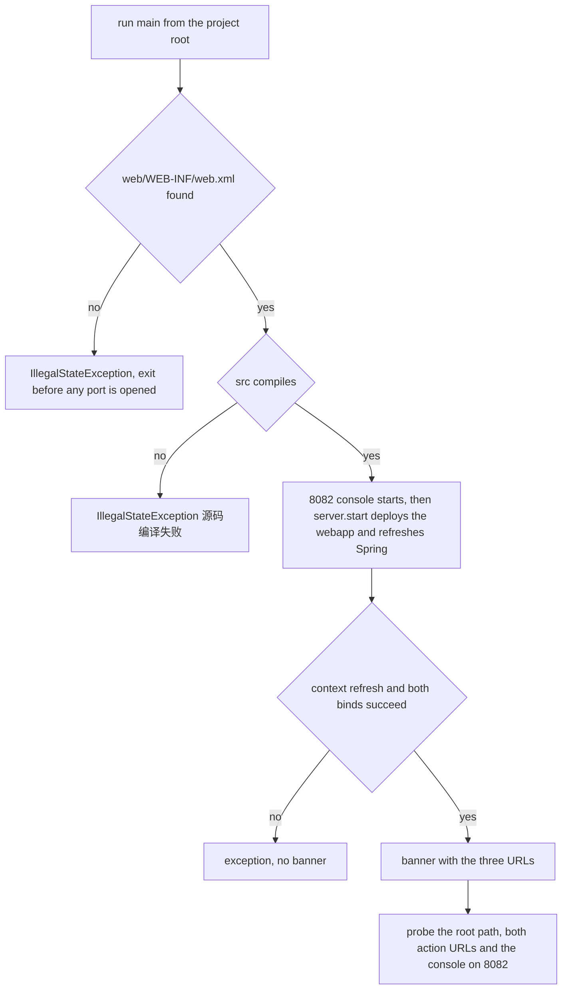

# Operations: Running the App and Troubleshooting Start-up

This checkout runs without a Tomcat installation and without a MySQL installation: a single
`main()` compiles the sources, starts embedded Jetty on port 8080 with `web/` as the web
application, and starts the H2 console on port 8082 (`STARTUP.md#L3-L8`, `MIGRATION.md#L3-L11`).
This page is the operator's side of that arrangement — how to launch it, what a healthy start
looks like, what survives a restart, and what each failure symptom means.

The *why* behind the wiring (the `addSystemClass` list, the explicit Jetty `Configuration`
chain, the exact-match `/` rewrite, the JDK 9+ module opening) is owned by
[Runtime Bootstrap](/openwiki/architecture/runtime-bootstrap.md); the file-and-value inventory by
[Configuration Surface](/openwiki/architecture/configuration.md); the jar set by
[Runtime Dependencies](/openwiki/integrations/runtime-dependencies.md). Those mechanisms are
referred to here only as far as an operator needs them to fix a start-up failure.

## 1. The three launch recipes

All three recipes run the same entry point, `public static void main(String[] args)` in
`src/StartJetty.java` (`src/StartJetty.java#L53-L122`). None of them needs a build step, a server
installation or a database.

| # | Recipe | What you do | Works on |
|---|---|---|---|
| A | IDE | Open/import the project root, find `src/StartJetty.java`, run its `main()`; on the first IDEA run set the Working directory to the project root | any JDK 8/11/17 |
| B | Single-file source run | `java -cp "web/WEB-INF/lib/*" src/StartJetty.java` from the project root | JDK 11+ |
| C | `javac` fallback | compile, then run the class (below) | JDK 8 (and any JDK) |

Recipe A (`STARTUP.md#L12-L27`):

1. Open or import the project root directory;
2. run the `main()` method of `src/StartJetty.java` (IDEA users set the Working Directory to the
   project root on the first run);
3. a successful start is signalled by the banner in section 2.

Recipe B (`STARTUP.md#L29-L33`, `src/StartJetty.java#L38-L41`):

```bash
java -cp "web/WEB-INF/lib/*" src/StartJetty.java
```

Run it **from the project root**. This form is Java's single-file source launcher, which JDK 8
does not have.

Recipe C — the JDK 8 path (`STARTUP.md#L35-L40`):

```bash
javac -encoding UTF-8 -cp "web/WEB-INF/lib/*" -d web/WEB-INF/classes src/StartJetty.java
java -cp "web/WEB-INF/lib/*:web/WEB-INF/classes" StartJetty
```

Two things to know about recipe C:

- it compiles only `StartJetty` itself into `web/WEB-INF/classes`; everything else under `src/` is
  compiled *inside* `main` by `ensureCompiledClasses()` (`src/StartJetty.java#L64`, `#L145-L186`),
  so the classpath on that first `javac` must contain the jars;
- the `java -cp` line separates the two classpath entries with `:` — the Unix path separator
  (`STARTUP.md#L39`). On Windows the documented recipes would need translation; see section 9.

### The working-directory contract

The launcher does not take a path argument. `locateProjectRoot()` first walks up to four parent
directories from the JVM working directory looking for `web/WEB-INF/web.xml`, and if that fails it
falls back to the code-source location of `StartJetty` and walks up to six parents
(`src/StartJetty.java#L124-L143`). The project root is defined by the presence of that descriptor,
so run from anywhere inside the checkout and the launcher normally still finds it; run from
somewhere else entirely and it aborts in the first second (see section 3).

Two consequences worth internalising before the first launch:

- `web/WEB-INF/classes` is disposable output, regenerated on every start and ignored by
  `.gitignore` (`.gitignore#L1-L2`). A fresh clone has no compiled classes, which is harmless on a
  JDK and relevant on a JRE (section 8);
- the first start takes **about 5–8 seconds** because every `.java` file under `src/` is compiled
  and the seed SQL is executed during the Spring context refresh (`STARTUP.md#L27`).

## 2. What a healthy start prints

The launcher prints the banner only after `server.start()` has returned
(`src/StartJetty.java#L110-L121`). The exact output is:

```
========================================================
 Tmall_SSH 已启动 (Jetty 9 嵌入式, H2 内存库)
   前台商城 : http://localhost:8080/
   后台管理 : http://localhost:8080/admin_category_list
   H2控制台 : http://localhost:8082
     - JDBC URL : jdbc:h2:mem:tmall_ssh;MODE=MySQL;DB_CLOSE_DELAY=-1
     - 用户名   : sa      密码 : (留空)
========================================================
```

*Line 2: "Tmall_SSH started (embedded Jetty 9, H2 in-memory database)"; the next three lines are
the storefront, the back office and the H2 console; the last two repeat the console's login
parameters. `STARTUP.md#L18-L25` quotes the same banner without the two JDBC/credential lines.*

| Address | What it is | Evidence |
|---|---|---|
| `http://localhost:8080/` | Storefront home page. The launcher rewrites the exact path `/` to `/forehome` | `STARTUP.md#L46-L47`, `src/StartJetty.java#L90-L104` |
| `http://localhost:8080/forehome` | The same storefront reached through its action URL directly | `STARTUP.md#L47-L47` |
| `http://localhost:8080/admin_category_list` | Back office entry (category management) | `STARTUP.md#L48-L48`, `src/StartJetty.java#L115-L115` |
| `http://localhost:8082` | H2 database console, opened directly in a browser | `STARTUP.md#L49-L49`, `src/StartJetty.java#L108-L108` |

Both ports are compile-time constants (`PORT = 8080`, `H2_CONSOLE_PORT = 8082`,
`CONTEXT_PATH = "/"` in `src/StartJetty.java#L49-L51`), so the banner, this page and the
acceptance record in `MIGRATION.md#L73-L83` all name the same three addresses. A port change is a
Java edit plus a restart, not a configuration option
([Configuration Surface](/openwiki/architecture/configuration.md#7-launcher-constants-and-the-settings-that-cannot-be-expressed-in-xml)).

**The banner is the start signal, not a health check.** It cannot appear if the launch aborted
earlier (section 3), and the recorded acceptance run is what proves the pages actually render
([Testing and Verification](/openwiki/testing/verification.md#4-the-manual-smoke-path)).

## 3. Where a start can abort before the banner



*The launch gate: every failure before the banner, and the probes that follow it.*

The launcher's own messages, in the order they can appear:

| Message | Raised by | Meaning |
|---|---|---|
| `找不到 web/WEB-INF/web.xml，请确认项目根目录: <dir>` | `main` (`src/StartJetty.java#L60-L62`) | a root was located but the descriptor is missing |
| `无法定位项目根目录（未找到 web/WEB-INF/web.xml），请将 working directory 设为项目根目录` | `locateProjectRoot()` (`#L142`) | neither walk found `web/WEB-INF/web.xml` |
| `找不到源码目录 src/` | `ensureCompiledClasses()` (`#L150-L151`) | `src/` is not where the launcher looks |
| `[StartJetty] 编译错误: <diagnostic>` | the in-process `javac` diagnostic listener (`#L174-L178`) | one line per compilation error |
| `源码编译失败，请查看上方编译错误` | `ensureCompiledClasses()` (`#L179-L183`) | the compile task failed; the launch aborts before any port is bound |
| `[StartJetty] 当前是 JRE 环境，跳过编译，直接使用 web/WEB-INF/classes 已有产物` | `ensureCompiledClasses()` (`#L153-L157`) | no system Java compiler: the launcher *skips* compiling **and** skips resource sync |
| `[StartJetty] 已编译 <n> 个源码文件 -> <classes dir>` | `ensureCompiledClasses()` (`#L184-L185`) | the normal pre-start message |
| `复制资源失败: <file>` | `syncResources()` (`#L188-L206`) | a non-Java resource under `src/` could not be copied into `web/WEB-INF/classes` |

Because compilation happens before any server object exists (`src/StartJetty.java#L64`) and the
H2 console is started before `server.start()` (`#L107-L110`), a failed launch never leaves a
healthy pair of listeners behind; the documented recovery still kills the owners of **both** ports
(`STARTUP.md#L81`).

## 4. The H2 console on port 8082

Open `http://localhost:8082` in a browser and log in with (`STARTUP.md#L53-L59`):

| Field | Value |
|---|---|
| JDBC URL | `jdbc:h2:mem:tmall_ssh;MODE=MySQL;DB_CLOSE_DELAY=-1` |
| User Name | `sa` |
| Password | *(empty)* |

The same values are printed by the launcher's banner (`src/StartJetty.java#L117-L118`) and appear
in `src/applicationContext.xml#L21-L27` as the datasource `url`, `username` and `password`. Once
logged in, the console runs ordinary SQL against the running application's data, e.g.
(`STARTUP.md#L61-L66`):

```sql
SELECT * FROM category;
SELECT * FROM product WHERE cid = 1;
```

Operational facts about this console:

- **It is a second, independent web server**, started by
  `org.h2.tools.Server.createWebServer("-webPort", "8082").start()` (`src/StartJetty.java#L107-L108`).
  It is deliberately *not* mounted inside the application: `web/WEB-INF/web.xml#L14-L17` maps the
  Struts2 filter to `/*`, so an in-app console path is handed to the dispatcher and answered with
  `no action mapped` (`STARTUP.md#L68-L68`).
- **It sees the application's data only because `DB_CLOSE_DELAY=-1` keeps the in-memory database
  alive for the lifetime of the JVM** (`MIGRATION.md#L37-L39`), and because the console and the
  datasource load the same `org.h2` classes
  ([Runtime Bootstrap](/openwiki/architecture/runtime-bootstrap.md#6-why-jars-are-pinned-to-the-parent-classloader)).
  An H2 console started outside this JVM connects to a *different*, empty in-memory database
  (`STARTUP.md#L69-L69`).
- The console is started **before** `server.start()`, so port 8082 listens while the Spring context
  is still refreshing; the tables appear once the `dbInit` bean has run (`src/StartJetty.java#L107-L110`).
- The launcher keeps no reference to the console server object — it is fire-and-forget for the life
  of the JVM ([Runtime Bootstrap](/openwiki/architecture/runtime-bootstrap.md#9-the-h2-console-on-its-own-port)).

The recorded acceptance run logged into this console and queried the nine business tables
(`MIGRATION.md#L73-L83`); the seeded id ranges and the tables that stay empty are on
[Data and Schema](/openwiki/operations/data-and-schema.md).

## 5. Restart, persistence and reset

The database is pure in-memory, so **everything is lost when the process stops and is rebuilt when
it starts** (`STARTUP.md#L69-L69`, `STARTUP.md#L71-L75`):

- at every context refresh, the `dbInit` bean (a Spring `DataSourceInitializer`) executes
  `classpath:sql/tmall_ssh_h2.sql` — the adapted copy of the original `sql/tmall_ssh.sql` — which
  creates the nine business tables and inserts the demo rows (`src/applicationContext.xml#L29-L44`,
  `MIGRATION.md#L40-L44`);
- `sf` carries `depends-on="dbInit"`, so the script always runs before Hibernate or any DAO queries
  (`src/applicationContext.xml#L46-L47`);
- the script ends with identity calibration, `ALTER TABLE … ALTER COLUMN id RESTART WITH n`
  (`category=84`, `product=963`, `productimage=10211`, `property=258`, `propertyvalue=14092`), so
  the first row inserted after a restart continues where the original MySQL `AUTO_INCREMENT` would
  have (`src/sql/tmall_ssh_h2.sql#L14712-L14716`, `MIGRATION.md#L49-L49`).

**Restarting is the reset.** That is the only supported way to get back to the seeded state, and it
is also why a smoke run leaves no rows behind
([Testing and Verification](/openwiki/testing/verification.md#4-the-manual-smoke-path)).

Two corollaries:

- The script is *create-only*: it contains nine plain `CREATE TABLE` statements and no `DROP TABLE`
  or `IF NOT EXISTS` (the `DROP DATABASE`/`CREATE DATABASE`/`USE` lines of the MySQL original were
  removed, `src/sql/tmall_ssh_h2.sql#L1-L9`). Its only other statements are six `ALTER TABLE`s: one
  appended `ALTER TABLE product ADD COLUMN remark` (`#L155`, owned by
  [Data and Schema](/openwiki/operations/data-and-schema.md)) and the five identity calibrations
  above. It is therefore written for a fresh, empty in-memory database and cannot be re-run against
  a database that already holds those tables — re-seeding means restarting the JVM.
- Rows are ephemeral, files are not. Anything the UI writes to disk (for example the uploaded
  category image under `web/img/category/`) survives the restart and shows up as an untracked file
  ([Testing and Verification](/openwiki/testing/verification.md#4-the-manual-smoke-path)).

## 6. Stopping

- `Ctrl+C` in the launching console (or otherwise terminating the process) ends the JVM;
  `server.setStopAtShutdown(true)`
  (`src/StartJetty.java#L105`) registers a JVM shutdown hook so Jetty and its handlers stop in the
  normal order instead of being killed mid-request
  ([Runtime Bootstrap](/openwiki/architecture/runtime-bootstrap.md#5-deploying-the-untouched-web-application)).
- There is no stop endpoint, no reload, no watchdog and no `System.exit`; `server.join()` is the
  last statement of `main`, which is what keeps the process alive (`src/StartJetty.java#L121`).
- Restart to pick up changes: `web/WEB-INF/classes` is regenerated at every start, and there is no
  hot-reload path.
- The database dies with the JVM, so a stop is also a data erase — and a stop followed by a start is
  a full reset to the seeded demo data (section 5).
- Because the H2 console is started before the Jetty server and no handle is kept on it, the
  documented way to reclaim both ports after an unclean exit is
  `lsof -ti:8080,8082 | xargs kill` (`STARTUP.md#L81`). 【人工评审待确认】 whether a launch that
  fails between the console start (`src/StartJetty.java#L108`) and `server.start()` (`#L110`) can
  leave a JVM alive holding 8082 — that depends on H2's thread model, not on repository code.

## 7. Logs

| Destination | Detail | Evidence |
|---|---|---|
| Console (stdout) | the `Console` appender, `target="SYSTEM_OUT"`, pattern `[%-5p] %d %c - %m%n`, attached to the `Root` logger at `INFO` | `src/log4j2.xml#L4-L6`, `#L15-L17` |
| `dist/my.log` | the `File` appender, pattern `%m%n`, relative to the **process working directory**, attached only to the logger `mh.sample2.Log4jTest2` | `src/log4j2.xml#L7-L9`, `#L12-L14` |
| Version control | `dist/` and `*.log` are both ignored; the in-memory H2 artefacts `*.mv.db` / `*.trace.db` are ignored defensively | `.gitignore#L5`, `#L14-L19` |

Practical reading: framework and application output normally appears **on the console**, because
the root logger's only appender is `Console` and no class in `src/` ever references the logger
`mh.sample2.Log4jTest2` ([Configuration Surface](/openwiki/architecture/configuration.md#6-srclog4j2xml)).
Do not go looking in `dist/my.log` for the start-up trace; if the file exists at all it is
untracked either way. The configuration file only takes effect because the launcher copies
non-Java resources from `src/` into `web/WEB-INF/classes` on every start, which is where the
application classpath looks for `log4j2.xml`
([Runtime Bootstrap](/openwiki/architecture/runtime-bootstrap.md#4-self-compilation-into-webweb-infclasses)).

【人工评审待确认】 whether Log4j2 creates an empty `dist/my.log` at start-up for the
otherwise-unused `File` appender, and whether the `mh.sample2.Log4jTest2` logger is vestigial.

## 8. Failure symptoms: symptom to cause to action

| Symptom | Cause | Action |
|---|---|---|
| `Port 8080 already in use` (and no banner) | another process — typically a previous run — already owns one of the two ports the launcher binds | `lsof -ti:8080,8082 \| xargs kill`, then relaunch from the project root (`STARTUP.md#L81`) |
| Launch fails with a bind exception before the banner | same as above; the banner is printed only after `server.start()` returns, so a taken port produces no banner at all (`src/StartJetty.java#L110-L121`) | free **both** ports — 8080 and 8082 — and relaunch (`STARTUP.md#L81`) |
| A jar is rejected with `zip END header not found` (or any archive/zip error naming a file under `web/WEB-INF/lib`) | that jar is truncated or corrupt; the jar directory is hand-assembled and nothing verifies it | re-download that single artefact from the public mirror `https://maven.aliyun.com/repository/public/...`; check the whole directory with `for f in web/WEB-INF/lib/*.jar; do unzip -tq "$f" >/dev/null \|\| echo "$f 损坏"; done` (`STARTUP.md#L82`; more on [Runtime Dependencies](/openwiki/integrations/runtime-dependencies.md#8-detecting-and-repairing-a-damaged-jar)) |
| JSP compilation fails with `getTldCache() is null` or `TldCache cannot be cast`, and the webapp comes up unavailable | someone edited the two load-bearing blocks in `src/StartJetty.java`: the explicit `Configuration[]` chain that includes `AnnotationConfiguration`, or the `addSystemClass` list that gives the JSP/EL classes a single identity | revert those lines — `STARTUP.md` tells readers explicitly not to change the `Configuration` chain or the `addSystemClass` configuration (`STARTUP.md#L83`, `src/StartJetty.java#L71-L88`); mechanism on [Runtime Bootstrap](/openwiki/architecture/runtime-bootstrap.md#7-the-explicit-configuration-chain) |
| A console URL (for example `http://localhost:8080/h2-console`) answers `no action mapped` | the H2 console is **not** mounted in the application: the Struts2 filter is mapped to `/*`, so every path on 8080 belongs to the dispatcher | use the console's own port, `http://localhost:8082` (`STARTUP.md#L84`, `src/StartJetty.java#L107-L108`) |
| `Table "XXX" not found` (any business table) while starting or on the first page request | the schema was never created: the `dbInit` bean is missing from `src/applicationContext.xml`, or `sf` lost its `depends-on="dbInit"`, so Hibernate or a DAO query runs before the seed script | confirm both are present — the `dbInit` `DataSourceInitializer` and `sf … depends-on="dbInit"` (`STARTUP.md#L86`, `src/applicationContext.xml#L29-L47`) |
| `Referential integrity constraint violation: "FK…: PUBLIC.PROPERTYVALUE FOREIGN KEY(PID) REFERENCES PUBLIC.PRODUCT(ID)"` in the start-up log | **historic**, not current: with `hibernate.hbm2ddl.auto=update` Hibernate auto-created foreign keys the original MySQL schema never had (such as `propertyvalue.pid`), and the seed rows do not satisfy them | nothing — it no longer appears, because `hibernate.hbm2ddl.auto` is now `none` and the schema is owned entirely by the seed script (`src/applicationContext.xml#L56-L65`, `MIGRATION.md#L64-L71`). If it reappears, someone set the property back to `update`. `STARTUP.md#L85` still describes it as a harmless warning; that row predates the fix |
| `IllegalStateException: 无法定位项目根目录…` or `找不到 web/WEB-INF/web.xml，请确认项目根目录: <dir>` | the working directory is not inside the checkout and the class location is not either | start from the project root, or set the IDE Working directory to the project root (`src/StartJetty.java#L60-L62`, `#L124-L143`) |
| `[StartJetty] 编译错误: …` followed by `源码编译失败，请查看上方编译错误` | a source file under `src/` does not compile against the vendored jars with `-source 8 -target 8` | fix the reported source error; the launch abort happens before any port is bound (`src/StartJetty.java#L174-L183`) |
| `[StartJetty] 当前是 JRE 环境，跳过编译，直接使用 web/WEB-INF/classes 已有产物` | the launch is running on a JRE (`ToolProvider.getSystemJavaCompiler()` returned `null`) | the launcher skips compiling **and** resource sync and uses whatever is already in `web/WEB-INF/classes`, which is git-ignored output (`src/StartJetty.java#L153-L157`, `.gitignore#L1-L2`); run on a JDK, or pre-compile with recipe C |
| `ServiceConfigurationError` during start-up, or log4j appenders that silently do not fire | the same duplicated-jar problem the `addSystemClass` list exists to prevent, after an entry was removed or replaced | restore the list; it is append-only (`src/StartJetty.java#L71-L81`, `MIGRATION.md#L34-L34`) |

Genuine functional verification after any repair is the recorded smoke path: the banner, then
`/`, `/forehome`, `/admin_category_list` and a console query
([Testing and Verification](/openwiki/testing/verification.md#4-the-manual-smoke-path)).

## 9. Environment facts

| Fact | Detail | Evidence |
|---|---|---|
| JDK | JDK 8, 11 or 17 all run the project; the recorded verification environment is **JDK 17 (Temurin 17.0.20.1)** | `STARTUP.md#L7-L7`, `MIGRATION.md#L51-L56` |
| External services | none: no Tomcat, no MySQL. Jetty 9.4.58 and H2 1.4.200 are vendored as jars in `web/WEB-INF/lib` (65 jars) | `STARTUP.md#L3-L8`, `MIGRATION.md#L9-L11`, `MIGRATION.md#L20-L20` |
| JDK 11+ shims | `javax.annotation-api`, `jaxb-api`, `asm-9.7.1` and `StartJetty.openJdk9PlusModules()` exist so the old framework stack runs on modern JDKs | `MIGRATION.md#L53-L56` |
| Command shape | the documented commands are POSIX-shell forms — `:` as the classpath separator in the JDK 8 fallback, and `lsof`/`xargs`/`unzip -tq`/`for … done` in the failure recipes. The repository ships no launcher script of any kind (no `.bat`, `.cmd`, `.ps1` or `.sh`), so there is no Windows-specific recipe to follow either 【人工评审待确认】 whether one should be recorded | `STARTUP.md#L29-L40`, `STARTUP.md#L81-L82` |
| Path independence | the launcher resolves everything relative to the discovered project root and has no OS-specific path; the IDE metadata's dead Windows absolute paths were replaced by per-jar references under `web/WEB-INF/lib` | `src/StartJetty.java#L124-L143`, `MIGRATION.md#L21-L21` |
| Output locations | compiled classes in `web/WEB-INF/classes`, optional log file `dist/my.log`, both ignored by git | `.gitignore#L1-L2`, `#L5`, `#L14-L15` |

No installation, download or environment variable is part of the recipe: a JDK plus this checkout
is the whole prerequisite list (`STARTUP.md#L5-L8`).

## 10. Review items

- 【人工评审待确认】 Is the JRE path of `ensureCompiledClasses()` (`src/StartJetty.java#L153-L157`)
  survivable on a fresh clone? `web/WEB-INF/classes` is git-ignored, so a JRE-only launch would
  have no compiled business classes; confirm whether that is a supported state or should be a
  hard error with an explicit message.
- 【人工评审待确认】 Whether a launch that fails between the H2 console start and `server.start()`
  can leave a JVM holding port 8082 (section 6).
- 【人工评审待确认】 Should the `STARTUP.md#L85` troubleshooting row about the `PROPERTYVALUE`
  foreign-key warning be removed or marked historical now that `hbm2ddl.auto=none` eliminated it?
- 【人工评审待确认】 Should Windows-shaped commands (path separator `;`, `netstat`-based port
  recovery) be documented next to the POSIX recipes, or is the POSIX-only recipe set intentional?
- 【人工评审待确认】 Is the empty-`dist/my.log` expectation in section 7 correct for Log4j2 2.9.1,
  and is the `mh.sample2.Log4jTest2` logger vestigial?

## Related pages

- [Runtime Bootstrap](/openwiki/architecture/runtime-bootstrap.md) — why the launch sequence,
  classloader pinning and `Configuration` chain are shaped this way.
- [Configuration Surface](/openwiki/architecture/configuration.md) — which file holds which value,
  including `log4j2.xml` and the launcher constants.
- [Runtime Dependencies](/openwiki/integrations/runtime-dependencies.md) — the vendored jar set,
  JDK compatibility and damaged-jar repair.
- [Data and Schema](/openwiki/operations/data-and-schema.md) — the seeded tables, id calibration
  and the console queries that prove them.
- [Testing and Verification](/openwiki/testing/verification.md) — the manual smoke path that turns a
  healthy start into real evidence.
- [Quickstart](/openwiki/quickstart.md) — task routing for the rest of the wiki.
