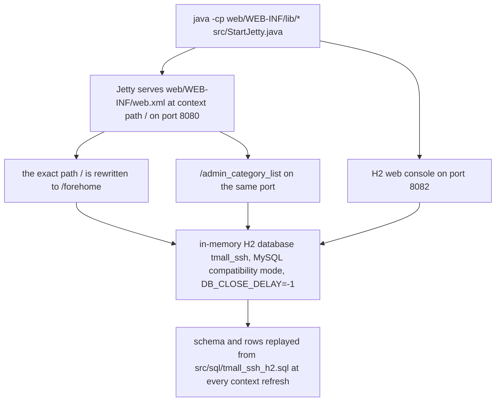

# Quickstart: Task Routing Map

Tmall_SSH is a clone of the Tmall storefront on the classic SSH stack — Struts2 2.5.14.1 +
Spring 4.3.18 + Hibernate 5.3.7 + JSP — built to practise that stack end to end. It has two
faces: a customer-facing shop (`/forehome`, category, product, cart, checkout, review) and an
admin back office (`/admin_*` list/add/edit/delete screens). This checkout is the
*self-contained* variant: no external Tomcat, no MySQL, so a single `main()` serves a working
site on `http://localhost:8080/` from nothing installed but a JDK.

Every HTTP endpoint is one `@Action`-annotated method — **47** of them, 24 storefront (`fore…`,
all on `ForeAction`) and 23 back office (`admin_…`, spread over `CategoryAction` and the six other
admin classes). `src/struts.xml` declares no `<action>` element — it configures the interceptor
stack and nothing else (`src/struts.xml#L7-L26`) — so URLs, result names and views exist only in
annotations and JSPs. That single fact is why so much of this wiki is about names that must not
drift: [Action Layer](/openwiki/architecture/action-layer.md) owns the `Action4*` chain that
generates the mapping, and [Action URL Catalog](/openwiki/reference/action-catalog.md)
is the row-by-row lookup table.

Two further properties of this checkout shape how you work in it: the database is an in-memory H2
store whose schema and demo rows come from one SQL script — see
[Operations: Data and Schema](/openwiki/operations/data-and-schema.md) — and the launcher compiles
the sources itself, so there is no build step.

## Start it

```bash
java -cp "web/WEB-INF/lib/*" src/StartJetty.java
```

Run it from the project root, or run `main()` in `src/StartJetty.java` from an IDE with the
working directory set to the project root. (The single-file-source form above needs JDK 11+;
on JDK 8, compile first — see
[Operations: Running the App](/openwiki/operations/startup-and-diagnostics.md).)
JDK 8, 11 or 17 all work; the recorded verification environment is JDK 17.

A healthy start prints the banner and then serves three URLs
(`src/StartJetty.java#L49-L51`, `#L110-L120`):

| URL | What it is |
|---|---|
| http://localhost:8080/ | Storefront home. The launcher rewrites the exact path `/` to `/forehome` |
| http://localhost:8080/admin_category_list | Back office (one of the 23 `admin_*` endpoints) |
| http://localhost:8082 | H2 console — JDBC URL `jdbc:h2:mem:tmall_ssh;MODE=MySQL;DB_CLOSE_DELAY=-1`, user `sa`, empty password |

`STARTUP.md` lists the same destinations plus `/forehome` as a separate row; `forehome` is the
action the root path is rewritten to, not a fourth service.



*One command, three surfaces, one in-memory database.*

Two consequences worth knowing before you touch anything:

- **Nothing persists across a restart.** The database is H2, in memory for the life of the JVM,
  and it is re-seeded from `src/sql/tmall_ssh_h2.sql` at every context refresh. Restarting
  restores the demo rows and discards whatever you inserted.
- **There is no build step to remember.** `StartJetty` compiles every `.java` under `src/` into
  `web/WEB-INF/classes` and copies the non-Java resources on *every* launch, so edits under
  `src/` take effect on the next start and `web/WEB-INF/classes` is disposable output.
  There is no `pom.xml`, `build.gradle` or `build.xml` anywhere in the tree.

Both ports are hard-coded constants in the launcher, and the H2 console deliberately runs on a
separate port because the Struts2 filter mapped to `/*` would swallow an in-app console path.

## What this wiki is

This checkout exists as a spec-driven-development rehearsal on a legacy project —
`MIGRATION.md` states that purpose (用途：SDD 存量项目演练) and records the acceptance evidence
for the embedded-Jetty/H2 variant, including zero changes to the original business source. That
evidence describes the migration; it is not a description of today's tree. The repository now also
carries `.openspec/specs/` — the spec-first change loop's documents, one spec plus its companion
self-check report — and the iteration they describe did edit business source: `Product` gained an
unannotated persisted `remark` field (`src/com/caozhihu/tmall/pojo/Product.java#L21`, accessors
`#L110-L116`), the single schema script appends one statement
(`src/sql/tmall_ssh_h2.sql#L155`), and the two admin product screens carry the remark header, cell
and inputs (`web/admin/listProduct.jsp#L52`, `#L75`, `#L115-L119`;
`web/admin/editProduct.jsp#L59-L63`) — with the Action, Service and DAO layers untouched.
[SDD Change Loop](/openwiki/workflows/sdd-iteration.md) owns that loop and reads those two
documents section by section.

This wiki is the draft specification baseline (规范初稿) for the project, requested by
`openwiki/INSTRUCTIONS.md`, and is explicitly waiting for human technical review. The one shipped
spec declares this wiki as its baseline — `基线来源：openwiki/（只读，本次开发唯一权威规范）`,
read-only and authoritative for the change (`.openspec/specs/scene2-product-remark.md#L1-L6`) —
and every component it touches carries a `溯源依据` citation naming the wiki page that justifies
the edit (`.openspec/specs/scene2-product-remark.md#L14-L22`, `#L24-L30`).

It records only facts verifiable against the repository: `src/**`, `web/**`, `sql/**`,
`.openspec/specs/**` and the repository documents that state intent (`README.md`, `MIGRATION.md`,
`STARTUP.md`). It invents no business rule and no acceptance criterion. Everything that cannot be
confirmed from the source is labelled **【人工评审待确认】** and needs a reviewer's decision; each
page collects its own review items, and [SDD Baseline](/openwiki/concepts/sdd-baseline.md) is the
normative page to review first.

`AGENTS.md` frames how to use all of this: treat source and tests as authoritative, pull wiki
pages just in time rather than preloading them, fall back to this quickstart's links when
retrieval tools are unavailable, and do not hand-edit generated OpenWiki pages.

## Route by task

| If you are doing X | Read |
|---|---|
| Run it, or diagnose a start that failed | [Operations: Running the App](/openwiki/operations/startup-and-diagnostics.md), [Runtime Bootstrap](/openwiki/architecture/runtime-bootstrap.md), [Runtime Dependencies](/openwiki/integrations/runtime-dependencies.md) |
| Understand the system before changing anything | [System Overview](/openwiki/architecture/overview.md), [Domain Model](/openwiki/concepts/domain-model.md) |
| Try a spec-first change — write a spec before the code | [SDD Change Loop](/openwiki/workflows/sdd-iteration.md) — where `.openspec/specs/` documents live, the read-only wiki baseline, the per-component traceability rule, and the `scene2-product-remark` iteration as the worked template; plus [SDD Baseline](/openwiki/concepts/sdd-baseline.md) for where the new files go |
| Find or change an endpoint URL, a result name or the view behind it | [Action URL Catalog](/openwiki/reference/action-catalog.md), [Action Layer](/openwiki/architecture/action-layer.md), [Request Pipeline](/openwiki/architecture/request-pipeline.md) |
| Add an endpoint, or touch the `Action4*` chain, `t2p()` or action service injection | [Action Layer](/openwiki/architecture/action-layer.md), [Request Pipeline](/openwiki/architecture/request-pipeline.md), [Service Layer](/openwiki/architecture/service-layer.md), [Runtime Invariants](/openwiki/conventions/runtime-invariants.md) |
| Add an admin CRUD screen | [Admin CRUD Screens](/openwiki/workflows/admin-crud.md), [Action Layer](/openwiki/architecture/action-layer.md), [Service Layer](/openwiki/architecture/service-layer.md), [SDD Baseline](/openwiki/concepts/sdd-baseline.md) |
| Add a field to an existing entity, e.g. a field on `Product` | [Domain Model](/openwiki/concepts/domain-model.md) (the entity field and its column), [Operations: Data and Schema](/openwiki/operations/data-and-schema.md) (the appended `ALTER TABLE` in `src/sql/tmall_ssh_h2.sql`), [Admin CRUD Screens](/openwiki/workflows/admin-crud.md) (the `product.<field>` input row, list column and edit echo), [Runtime Invariants](/openwiki/conventions/runtime-invariants.md) (the names that must not drift); `Product.remark` is the shipped example — see [SDD Change Loop](/openwiki/workflows/sdd-iteration.md) |
| Change checkout, cart, payment or reviews | [Storefront Shopping](/openwiki/workflows/storefront-shopping.md), [Order Lifecycle](/openwiki/workflows/order-lifecycle.md), [Domain Model](/openwiki/concepts/domain-model.md) |
| Change uploads or how images are served | [Image Upload and Serving](/openwiki/workflows/image-pipeline.md), [Admin CRUD Screens](/openwiki/workflows/admin-crud.md) |
| Touch a JSP page, a fragment or the static assets | [View Layer](/openwiki/architecture/view-layer.md) — the page/fragment include convention, the Action getters and session keys the markup reads, and where `img/`, `css/` and `js/` are served from |
| Change data, schema or seed rows | [Operations: Data and Schema](/openwiki/operations/data-and-schema.md), [Domain Model](/openwiki/concepts/domain-model.md), [Persistence Layer](/openwiki/architecture/persistence-layer.md) |
| Change paging or search behavior | [Pagination and Search](/openwiki/workflows/pagination-and-search.md) |
| Change Spring, Struts, `web.xml` or logging wiring | [Configuration Surface](/openwiki/architecture/configuration.md), [Request Pipeline](/openwiki/architecture/request-pipeline.md), [Runtime Bootstrap](/openwiki/architecture/runtime-bootstrap.md) |
| Change the service/persistence plumbing (CRUD, delegation, transactions) | [Service Layer](/openwiki/architecture/service-layer.md), [Persistence Layer](/openwiki/architecture/persistence-layer.md) |
| Check whether a change is safe *before* making it | [Runtime Invariants](/openwiki/conventions/runtime-invariants.md) — the do-not-break list of string-coupled names |
| Verify a change, or find out what is provable here | [Testing and Verification](/openwiki/testing/verification.md) — one Spring-context JUnit test, no test task, one manual smoke path |
| Write new code that matches the project's conventions | [SDD Baseline](/openwiki/concepts/sdd-baseline.md) — package, naming and placement rules, plus that page's review items |

A useful reading order for a first pass: [System Overview](/openwiki/architecture/overview.md)
for the four runtime domains, then one workflow close to your task, then
[Runtime Invariants](/openwiki/conventions/runtime-invariants.md) before you edit. If your
change adds a page, an endpoint or a class rather than altering an existing flow, read
[SDD Baseline](/openwiki/concepts/sdd-baseline.md) first — it is the normative half of this
baseline. If the change is specified before it is written — a document under `.openspec/specs/`
first, code second — start at [SDD Change Loop](/openwiki/workflows/sdd-iteration.md), which
records how the one shipped iteration traced each edit back to a page of this wiki.
