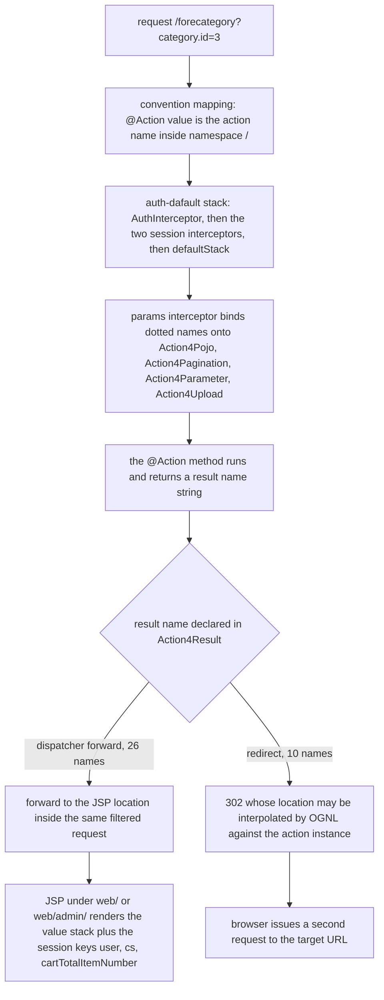

# Reference: Action URL Catalog

Every HTTP endpoint this application serves is one `@Action`-annotated method on one of the eight
classes in `src/com/caozhihu/tmall/action/`. There are **47 of them**: 24 on `ForeAction`
(the storefront, `fore…` names) and 23 spread over `CategoryAction`, `ProductAction`,
`PropertyAction`, `ProductImageAction`, `PropertyValueAction`, `OrderAction` and `UserAction`
(the back office, `admin_…` names). `src/struts.xml` declares **no `<action>` element**, so the URL,
the bound parameters, the result name and the view behind every row below exist only in Java
annotations and JSPs.

Use this page to answer "which URL / which result name do I change?" — the mechanism pages explain
*why* the conventions are what they are:
[Action Layer Conventions](/openwiki/architecture/action-layer.md) (the `Action4*` chain, `t2p()`,
the result-name contract), [Request Pipeline](/openwiki/architecture/request-pipeline.md)
(filters, interceptor stack, parameter binding, dispatch),
[Runtime Invariants](/openwiki/conventions/runtime-invariants.md) (the names that must not drift),
[Admin CRUD Screens](/openwiki/workflows/admin-crud.md) and
[Storefront Shopping](/openwiki/workflows/storefront-shopping.md) (the flows built from these rows).

## How every URL in this table is formed

- **Namespace and package are inherited, not per-action.** `Action4Result` — the direct superclass of
  all eight action classes — carries `@Namespace("/")` and `@ParentPackage("basicstruts")`
  (`src/com/caozhihu/tmall/action/Action4Result.java#L8-L9`). The namespace is the root, so the URL of
  `@Action("forehome")` is exactly `/forehome`, with no class-name or package prefix. `basicstruts` is
  the package in `src/struts.xml` that installs the `auth-dafault` interceptor stack, so **all 47
  endpoints run the same three custom interceptors plus `defaultStack`**, and none of the concrete
  action classes repeats a namespace, parent package or result annotation.
- **The `@Action` value is the URL.** Because every method carries an explicit value
  (`@Action("admin_category_list")`), the convention plugin's class-name-derived fallback naming is
  never used — `CategoryAction.list` is `/admin_category_list`, not `/category/list`. Callers always
  use the extensionless form; no JSP or JS in the repository appends `.action`.
- **Only `@Action` methods are reachable.** Helpers on the chain (`t2p`, `saveWithJpg`) and every
  non-annotated method are not addresses at all.
- **Parameters are bound by public setters on the `Action4*` chain, never as method arguments.**
  Dotted names create nested objects: `category.id=27` instantiates a `Category` carrying only the id,
  which is why `t2p()` exists to swap in the persistent row. The bindable surface is exactly
  `Action4Pojo` (nine entities, ten lists), `Action4Pagination` (`page.*` → `Page.start/count/total/param`),
  `Action4Parameter` (`num`, `oiid`, `oiids`, `total`, `keyword`, `sort`, `showonly`) and
  `Action4Upload` (`img`, `imgFileName`, `imgContentType`). Adding a bindable name means adding a
  field plus a public setter to one of those classes — there is no per-action parameter whitelist.
- **The "bound parameters" column lists what the repository actually sends**, taken from the JSP
  form field names and jQuery/`$.post` keys that call the URL. A parameter the action could accept but
  no caller emits is noted as such, not listed as bound.



*How one endpoint row resolves: mapping, stack, binding, result name, then either a forward or a `302`.*

## Auth status: what the two URL families mean at the gate

`AuthInterceptor` is the only auth check in the application and it evaluates only URIs starting with
`/fore` (`src/com/caozhihu/tmall/interceptor/AuthInterceptor.java#L25-L46`): for those it takes the
substring after the last `/fore` and compares it against a hard-coded array
`{home, checkLogin, register, loginAjax, login, product, category, search}`. That splits the
storefront into the **8 public URLs** (first table) and the **16 that require a `user` object in the
session** (second table) — a rejected request is answered with `sendRedirect("login.jsp")` and the
action never runs, so an AJAX caller receives the login page HTML instead of `success`.

**None of the 23 `admin_*` URLs is checked at all** — the interceptor's `startsWith("/fore")` test
never matches them, so every back-office list, write and delete endpoint executes anonymously.
【人工评审待确认】 whether that is intended for this practice project or an oversight; it is
recorded as an observed fact of the current source, and it is why storefront code can reach
`admin_order_delivery` (see that row).

## Storefront endpoints that need no session (8 public URLs)

| URL | class#method | bound parameters | result → target | called from / notes |
|---|---|---|---|---|
| `forehome` | `ForeAction#home` | — | `home.jsp` → forward `/home.jsp` | `web/index.jsp` redirect, the `/` rewrite in `StartJetty`, the logo/home links in `include/top.jsp`. Fills `categories` (with first product image and `productsByRow`) for `homepageCategoryProducts.jsp`. |
| `foreregister` | `ForeAction#register` | `user.name`, `user.password` | `register.jsp` → forward `/register.jsp` when the name is already taken; `registerSuccessPage` → redirect `/registerSuccess.jsp` on success | POST form in `include/registerPage.jsp`. HTML-escapes `user.name` before the duplicate check and sets `msg` (rendered by the fragment's JS). The `repeatpassword` input has no `name`, so it is never submitted. The submit button is wrapped in `<a href="registerSuccess.jsp">` 【人工评审待确认】 which of the POST and the anchor navigation wins in a browser. |
| `forelogin` | `ForeAction#login` | `user.name`, `user.password` | `login.jsp` → forward `/login.jsp` on bad credentials; `homePage` → redirect `forehome` on success | POST form in `include/loginPage.jsp` (`user.name` / `user.password`). On success puts the `User` into the session under `user`, which is what every protected `/fore` URL then checks. |
| `foreproduct` | `ForeAction#product` | `product.id` | `product.jsp` → forward `/product.jsp` | Product links in `include/category/productsByCategory.jsp`, `include/productsBySearch.jsp`, `include/home/homepageCategoryProducts.jsp`, `include/cart/cartPage.jsp`, `include/cart/buyPage.jsp`, `include/cart/boughtPage.jsp`, `web/admin/listOrder.jsp`. Loads single/detail images, property values, reviews and sale/review counts. |
| `forecheckLogin` | `ForeAction#checkLogin` | — | `success.jsp` or `fail.jsp` → forward `/success.jsp` / `/fail.jsp` | AJAX `$.get` from `include/product/imgAndInfo.jsp` before add-to-cart and buy. Payload is the bare word `success` / `fail`. |
| `foreloginAjax` | `ForeAction#loginAjax` | `user.name`, `user.password` | `success.jsp` or `fail.jsp` | AJAX `$.get` from `include/product/imgAndInfo.jsp` with explicit `{"user.name": …, "user.password": …}` keys (the modal's own `name`/`password` inputs are read by jQuery id, not submitted). Writes the session `user` like `forelogin`. |
| `forecategory` | `ForeAction#category` | `category.id`, `sort` | `category.jsp` → forward `/category.jsp` | `forecategory?category.id=` from `include/search.jsp`, `include/simpleSearch.jsp`, `include/home/categoryMenu.jsp`; `include/category/sortBar.jsp` adds `sort=all`, `review`, `date`, `saleCount` or `price`. `sort` is read only when non-null and reorders the category's product list in memory; the five values exist only in `ForeAction.category`'s switch and in `sortBar.jsp`. `forecategory?category.id=…&sort=…` is bound to the same action name (relative link from `category.jsp`). |
| `foresearch` | `ForeAction#search` | `keyword` | `searchResult.jsp` → forward `/searchResult.jsp` | POST form in `include/search.jsp` and `include/simpleSearch.jsp`. Hard-codes a 20-row window (`productService.search(keyword, 0, 20)`); there is no `page.start` on this endpoint. |

`include/category/productsByCategory.jsp` and `include/home/homepageCategoryProducts.jsp` cap the
number of rendered categories at `param.categorycount` (default 100), but **no link anywhere in the
repository emits `categorycount`** — it is only reachable by typing it, so `forecategory` and
`forehome` always render the default cap.

## Storefront endpoints that require a session user (16 URLs)

| URL | class#method | bound parameters | result → target | called from / notes |
|---|---|---|---|---|
| `forelogout` | `ForeAction#logout` | — | `homePage` → redirect `forehome` | "退出" link in `include/top.jsp`. Removes the session `user`. |
| `forebuyone` | `ForeAction#buyone` | `product.id`, `num` | `buyPage` → redirect `forebuy?oiids=${oiid}` | "立即购买" link in `include/product/imgAndInfo.jsp`, which appends `&num=<value>`. Merges into an existing cart row for the same product (incrementing `number`) or inserts a new `OrderItem`; writes the singular `oiid` property that the redirect forwards as the plural `oiids` parameter. |
| `forebuy` | `ForeAction#buy` | `oiids` (int array, repeated `&oiids=` per selected row) | `buy.jsp` → forward `/buy.jsp` | `include/cart/cartPage.jsp` builds `&oiids=<oiid>` once per selected row; the `buyPage` redirect from `forebuyone` supplies a one-element array. Accumulates `total` and writes the `orderItems` list into the session for `forecreateOrder`. |
| `foreaddCart` | `ForeAction#addCart` | `product.id`, `num` | `success.jsp` → forward `/success.jsp` | AJAX `$.get` from `include/product/imgAndInfo.jsp` after a successful `forecheckLogin`. Increases the existing cart row for the product or inserts one. |
| `forecart` | `ForeAction#cart` | — | `cart.jsp` → forward `/cart.jsp` | Cart link in `include/top.jsp`. Lists the session user's order items with `order` = `null`. |
| `forechangeOrderItem` | `ForeAction#changeOrderItem` | `product.id`, `num` | `success.jsp` → forward `/success.jsp` | AJAX `$.post` from `include/cart/cartPage.jsp` on every quantity change. Sets the absolute `number` (not a delta) on the matching row. |
| `foredeleteOrderItem` | `ForeAction#deleteOrderItem` | `orderItem.id` | `success.jsp` → forward `/success.jsp` | AJAX `$.post` from `include/cart/cartPage.jsp` after the confirm modal. Deletes by the id-only `orderItem`. |
| `forecreateOrder` | `ForeAction#createOrder` | `order.address`, `order.post`, `order.receiver`, `order.mobile`, `order.userMessage` | `login.jsp` → forward `/login.jsp` only when the session `orderItems` list is **empty**; otherwise `alipayPage` → redirect `forealipay?order.id=${order.id}&total=${total}` | POST form in `include/cart/buyPage.jsp`. Reads the session `orderItems` written by `forebuy`, generates `orderCode` (`yyyyMMddHHmmssSSS`), sets `user`, `createDate` and status `waitPay`, and overwrites `total` with the service-returned order total. The guard dereferences the session list, so calling this URL in a fresh session (no `orderItems` key) throws instead of redirecting. |
| `forealipay` | `ForeAction#forealipay` | `order.id`, `total` | `alipay.jsp` → forward `/alipay.jsp` | Reached from the `alipayPage` redirect and from the "付款" link in `include/cart/boughtPage.jsp` (`forealipay?order.id=${o.id}&total=${o.total}`). The action body only returns the view name; `alipayPage.jsp` prints `${param.total}` — the **raw request parameter**, not an action property. |
| `forepayed` | `ForeAction#payed` | `order.id`, `total` | `payed.jsp` → forward `/payed.jsp` | "确认支付" link in `include/cart/alipayPage.jsp` (`forepayed?order.id=${order.id}&total=${param.total}`). `t2p(order)`, then status `waitDelivery` and `payDate` = now. |
| `forebought` | `ForeAction#bought` | — | `bought.jsp` → forward `/bought.jsp` | "我的订单" in `include/top.jsp` and the two links in `include/cart/payedPage.jsp`. Lists orders with status ≠ `delete` and fills each order's items. |
| `foreconfirmPay` | `ForeAction#confirmPay` | `order.id` | `confirmPay.jsp` → forward `/confirmPay.jsp` | "确认收货" link in `include/cart/boughtPage.jsp`, rendered only when the order status is `waitConfirm`. |
| `foreorderConfirmed` | `ForeAction#orderConfirmed` | `order.id` | `orderConfirmed.jsp` → forward `/orderConfirmed.jsp` | "确认支付" link in `include/cart/confirmPayPage.jsp`. Status `waitReview`, `confirmDate` = now. |
| `foredeleteOrder` | `ForeAction#deleteOrder` | `order.id` | `success.jsp` → forward `/success.jsp` | AJAX `$.post` from `include/cart/boughtPage.jsp` after the confirm modal. Sets the order status to `delete`; the row is filtered out of `forebought`. |
| `forereview` | `ForeAction#revice` | `order.id`, `showonly` | `review.jsp` → forward `/review.jsp` | "评价" link in `include/cart/boughtPage.jsp`, and the `reviewPage` redirect from `foredoreview`. Note the method name: the URL is `forereview` while the Java method is `revice()`. `showonly` is read by `reviewPage.jsp` as `param.showonly` to choose between the review list and the input form. |
| `foredoreview` | `ForeAction#doreview` | `order.id`, `product.id`, `review.content` | `reviewPage` → redirect `forereview?order.id=${order.id}&showonly=${showonly}` | POST form in `include/cart/reviewPage.jsp`. HTML-escapes `review.content`, attaches product/date/user, saves the review and sets the order status to `finish`, then sets `showonly = true` so the redirect renders the review list of the product. |

## Back-office endpoints, none of them authenticated (23 `admin_*` URLs)

| URL | class#method | bound parameters | result → target | called from / notes |
|---|---|---|---|---|
| `admin_category_list` | `CategoryAction#list` | `page.start` | `listCategory` → forward `/admin/listCategory.jsp` | `include/admin/adminNavigator.jsp`, the breadcrumb in every admin JSP, and the pagination links `?page.start=…` from `include/admin/adminPage.jsp`. Creates a default `Page` when none is bound. |
| `admin_category_add` | `CategoryAction#add` | `category.name`, `img` (multipart file) | `listCategoryPage` → redirect `/admin_category_list` | Multipart POST form in `web/admin/listCategory.jsp`. Saves the row, then writes the upload to `img/category/<new id>.jpg` via `saveWithJpg` — unconditionally, without the `img != null` guard that `update` uses. |
| `admin_category_update` | `CategoryAction#update` | `category.id`, `category.name`, `img` (multipart file) | `listCategoryPage` → redirect `/admin_category_list` | Multipart POST form in `web/admin/editCategory.jsp` carrying the id in a hidden field. Replaces the image only when a file was selected. |
| `admin_category_delete` | `CategoryAction#delete` | `category.id` | `listCategoryPage` → redirect `/admin_category_list` | Plain GET link with `deleteLink="true"` in `web/admin/listCategory.jsp` (the confirm dialog is client-side JS in `include/admin/adminHeader.jsp`). |
| `admin_category_edit` | `CategoryAction#edit` | `category.id` | `editCategory` → forward `/admin/editCategory.jsp` | Edit icon in `web/admin/listCategory.jsp` (`admin_category_edit?category.id=${c.id}`). `t2p(category)` loads the row so the form can show `category.name`. |
| `admin_property_list` | `PropertyAction#list` | `category.id`, `page.start` | `listProperty` → forward `/admin/listProperty.jsp` | Breadcrumb/product-management links (`admin_property_list?category.id=${c.id}` in `web/admin/listCategory.jsp`). Sets `page.param = "&category.id=<id>"` **before** `t2p(category)` so the pagination links carry the parent id. |
| `admin_property_add` | `PropertyAction#add` | `property.name`, `property.category.id` | `listPropertyPage` → redirect `/admin_property_list?category.id=${property.category.id}` | POST form in `web/admin/listProperty.jsp` (hidden `property.category.id`). Carries a method-level `@Transactional(readOnly = false)` although the action instance is not a Spring bean. |
| `admin_property_delete` | `PropertyAction#delete` | `property.id` | `listPropertyPage` → redirect `/admin_property_list?category.id=${property.category.id}` | GET link with `deleteLink="true"` in `web/admin/listProperty.jsp`. `t2p(property)` is required both for the delete call and for the redirect's association. |
| `admin_property_edit` | `PropertyAction#edit` | `property.id` | `editProperty` → forward `/admin/editProperty.jsp` | Edit icon in `web/admin/listProperty.jsp`. |
| `admin_property_update` | `PropertyAction#update` | `property.id`, `property.name`, `property.category.id` | `listPropertyPage` → redirect `/admin_property_list?category.id=${property.category.id}` | POST form in `web/admin/editProperty.jsp`. No `t2p()` — the bound `Property` already carries every field to write. |
| `admin_product_list` | `ProductAction#list` | `category.id`, `page.start` | `listProduct` → forward `/admin/listProduct.jsp` | Breadcrumb links (`admin_product_list?category.id=${c.id}`). Sets `page.param = "&category.id=<id>"`. **The page total comes from `propertyService.total(category)`**, i.e. the product list's pagination is computed from the category's *property* count 【人工评审待确认】 (the other list actions use their own service). |
| `admin_product_add` | `ProductAction#add` | `product.name`, `product.subTitle`, `product.originalPrice`, `product.promotePrice`, `product.stock`, `product.category.id` | `listProductPage` → redirect `/admin_product_list?category.id=${product.category.id}` | POST form in `web/admin/listProduct.jsp` (hidden `product.category.id`). Stamps `createDate` = now. |
| `admin_product_delete` | `ProductAction#delete` | `product.id` | `listProductPage` → redirect `/admin_product_list?category.id=${product.category.id}` | GET link with `deleteLink="true"` in `web/admin/listProduct.jsp`. `t2p(product)` supplies the association the redirect needs. |
| `admin_product_edit` | `ProductAction#edit` | `product.id` | `editProduct` → forward `/admin/editProduct.jsp` | Edit icon in `web/admin/listProduct.jsp`. |
| `admin_product_update` | `ProductAction#update` | `product.id`, `product.category.id`, `product.name`, `product.subTitle`, `product.originalPrice`, `product.promotePrice`, `product.stock` | `listProductPage` → redirect `/admin_product_list?category.id=${product.category.id}` | POST form in `web/admin/editProduct.jsp`. Reloads the row first to copy the unchanged `createDate` onto the bound object. |
| `admin_productImage_list` | `ProductImageAction#list` | `product.id` | `listProductImage` → forward `/admin/listProductImage.jsp` | Image icon in `web/admin/listProduct.jsp` (`admin_productImage_list?product.id=${p.id}`). Loads the `type_single` and `type_detail` sets; `t2p(product)` fills the breadcrumb. |
| `admin_productImage_add` | `ProductImageAction#add` | `productImage.type`, `productImage.product.id`, `img` (multipart file) | `listProductImagePage` → redirect `/admin_productImage_list?product.id=${productImage.product.id}` | Two multipart POST forms in `web/admin/listProductImage.jsp`, one per type, with `type` as a hidden field (`type_single` / `type_detail`). Saves the row, writes the file under `img/productSingle/` or `img/productDetail/`, and for `type_single` also writes the 56×56 and 217×190 derivatives. |
| `admin_productImage_delete` | `ProductImageAction#delete` | `productImage.id` | `listProductImagePage` → redirect `/admin_productImage_list?product.id=${productImage.product.id}` | GET link with `deleteLink="true"` in `web/admin/listProductImage.jsp` (both tables). Calls `t2p(productImage)` because the redirect dereferences `productImage.product.id`; the service called for the delete is `propertyService`. |
| `admin_propertyValue_edit` | `PropertyValueAction#edit` | `product.id` | `editPropertyValue` → forward `/admin/editPropertyValue.jsp` | List icon in `web/admin/listProduct.jsp` ("设置属性"). `t2p(product)`, then `propertyValueService.init(product)` (creating missing rows) and a list of the product's property values. |
| `admin_propertyValue_update` | `PropertyValueAction#update` | `propertyValue.id`, `propertyValue.value` | `success.jsp` → forward `/success.jsp` | AJAX `$.post` from `web/admin/editPropertyValue.jsp` on each `keyup` of a value field. Reads `propertyValue.getValue()` **before** `t2p(propertyValue)`, then writes it back onto the refreshed entity; the response body is the bare word `success`. |
| `admin_order_list` | `OrderAction#list` | `page.start` | `listOrder` → forward `/admin/listOrder.jsp` | `include/admin/adminNavigator.jsp` ("订单管理") and the rest of the admin navigation. Paged orders, each filled with its items. |
| `admin_order_delivery` | `OrderAction#delivery` | `order.id` | `listOrderPage` → redirect `/admin_order_list` | "发货" button in `web/admin/listOrder.jsp` rendered only when the status is `waitDelivery`, **and** the "催卖家发货" button in `include/cart/boughtPage.jsp`, which is a logged-in customer's page calling this unauthenticated admin URL. `t2p(order)`, then status `waitConfirm` with `deliveryDate` = now. |
| `admin_user_list` | `UserAction#list` | `page.start` | `listUser` → forward `/admin/listUser.jsp` | `include/admin/adminNavigator.jsp` ("用户管理"). Read-only: no add/edit/delete sibling exists for users. |

## The 36 result names declared on `Action4Result`

All result definitions live in one `@Results` block on `Action4Result`
(`src/com/caozhihu/tmall/action/Action4Result.java#L10-L67`); no concrete action class declares
`@Result`, `@Results`, `@Namespace` or `@ParentPackage`. There are 36 names — **26 dispatcher
forwards** and **10 `type="redirect"` results** — and every one of them is returned by at least one
`@Action` method in the current source. The naming convention is strict: `*.jsp`, `listXxx` and
`editXxx` are forwards; every name ending in `Page` is a redirect.

| Result name | Type | Target | Returned by |
|---|---|---|---|
| `success.jsp` | forward | `/success.jsp` (body: `success`) | `forecheckLogin`, `foreloginAjax`, `foreaddCart`, `forechangeOrderItem`, `foredeleteOrderItem`, `foredeleteOrder`, `admin_propertyValue_update` |
| `fail.jsp` | forward | `/fail.jsp` (body: `fail`) | `forecheckLogin`, `foreloginAjax` |
| `listCategory` | forward | `/admin/listCategory.jsp` | `admin_category_list` |
| `editCategory` | forward | `/admin/editCategory.jsp` | `admin_category_edit` |
| `listProperty` | forward | `/admin/listProperty.jsp` | `admin_property_list` |
| `editProperty` | forward | `/admin/editProperty.jsp` | `admin_property_edit` |
| `listProduct` | forward | `/admin/listProduct.jsp` | `admin_product_list` |
| `editProduct` | forward | `/admin/editProduct.jsp` | `admin_product_edit` |
| `listProductImage` | forward | `/admin/listProductImage.jsp` | `admin_productImage_list` |
| `editPropertyValue` | forward | `/admin/editPropertyValue.jsp` | `admin_propertyValue_edit` |
| `listUser` | forward | `/admin/listUser.jsp` | `admin_user_list` |
| `listOrder` | forward | `/admin/listOrder.jsp` | `admin_order_list` |
| `home.jsp` | forward | `/home.jsp` | `forehome` |
| `register.jsp` | forward | `/register.jsp` | `foreregister` (duplicate name) |
| `login.jsp` | forward | `/login.jsp` | `forelogin` (bad credentials), `forecreateOrder` (session cart empty) |
| `product.jsp` | forward | `/product.jsp` | `foreproduct` |
| `category.jsp` | forward | `/category.jsp` | `forecategory` |
| `searchResult.jsp` | forward | `/searchResult.jsp` | `foresearch` |
| `buy.jsp` | forward | `/buy.jsp` | `forebuy` |
| `cart.jsp` | forward | `/cart.jsp` | `forecart` |
| `alipay.jsp` | forward | `/alipay.jsp` | `forealipay` |
| `payed.jsp` | forward | `/payed.jsp` | `forepayed` |
| `bought.jsp` | forward | `/bought.jsp` | `forebought` |
| `confirmPay.jsp` | forward | `/confirmPay.jsp` | `foreconfirmPay` |
| `orderConfirmed.jsp` | forward | `/orderConfirmed.jsp` | `foreorderConfirmed` |
| `review.jsp` | forward | `/review.jsp` | `forereview` |
| `listCategoryPage` | redirect | `/admin_category_list` | `admin_category_add`, `admin_category_update`, `admin_category_delete` |
| `listPropertyPage` | redirect | `/admin_property_list?category.id=${property.category.id}` | `admin_property_add`, `admin_property_update`, `admin_property_delete` |
| `listProductPage` | redirect | `/admin_product_list?category.id=${product.category.id}` | `admin_product_add`, `admin_product_update`, `admin_product_delete` |
| `listProductImagePage` | redirect | `/admin_productImage_list?product.id=${productImage.product.id}` | `admin_productImage_add`, `admin_productImage_delete` |
| `listOrderPage` | redirect | `/admin_order_list` | `admin_order_delivery` |
| `registerSuccessPage` | redirect | `/registerSuccess.jsp` | `foreregister` (success) |
| `homePage` | redirect | `forehome` | `forelogin` (success), `forelogout` |
| `buyPage` | redirect | `forebuy?oiids=${oiid}` | `forebuyone` |
| `alipayPage` | redirect | `forealipay?order.id=${order.id}&total=${total}` | `forecreateOrder` |
| `reviewPage` | redirect | `forereview?order.id=${order.id}&showonly=${showonly}` | `foredoreview` |

Facts worth knowing before editing this block:

- **Six of the ten redirect locations interpolate OGNL** against the acting action instance, so the
  entity has to be persistent (post-`t2p()`) before the result is returned — otherwise the
  dereference of `product.category.id` / `productImage.product.id` raises
  `TransientObjectException`, as the comment in `ProductImageAction.delete` records. The other four
  (`listCategoryPage`, `listOrderPage`, `homePage`, `registerSuccessPage`) are fixed targets.
- **Each interpolated parameter name is also the receiver's OGNL property name.** `oiids`,
  `order.id`, `total`, `showonly`, `category.id` and `product.id` appear on both sides of these
  round trips; a rename on one side binds nothing useful on the other and fails silently.
- **Admin redirects are context-relative (`/…`); storefront redirects are bare action names**
  (`forehome`, `forebuy?…`), which the browser resolves against the current path.
- **`login.jsp` is both a result name and a URL.** The name forwards internally to `/login.jsp`;
  the same file is also served directly as a plain JSP, because `/login.jsp` is not an action
  candidate. Both reach the same HTML.
- **A name returned by an action but missing from this block is not a compile error** — it fails at
  runtime, after the action body has already run.

## What each endpoint changes (state, session and side effects)

| Effect | Endpoint(s) that perform it |
|---|---|
| Order status `waitPay` (+ generated `orderCode`, `createDate`, owner) | `forecreateOrder` |
| Order status `waitDelivery` + `payDate` | `forepayed` |
| Order status `waitConfirm` + `deliveryDate` | `admin_order_delivery` |
| Order status `waitReview` + `confirmDate` | `foreorderConfirmed` |
| Order status `finish` + insert of the `Review` row | `foredoreview` |
| Order status `delete` | `foredeleteOrder` |
| Insert / update an `OrderItem` row | `forebuyone`, `foreaddCart`, `forechangeOrderItem`; delete: `foredeleteOrderItem` |
| Session key `user` written / removed | `forelogin`, `foreloginAjax` / `forelogout` |
| Session key `orderItems` written / read | written by `forebuy`, read by `forecreateOrder` |
| Action property `msg` set for the error banner | `foreregister` (name taken), `forelogin` (bad credentials) |
| Action property `total` accumulated / overwritten | accumulated in `forebuy`, overwritten in `forecreateOrder`; display-only on `forealipay` / `forepayed`, where the JSP reads `${param.total}` |
| Uploaded file written under the web root | `admin_category_add`, `admin_category_update` (`img/category/<id>.jpg`), `admin_productImage_add` (`img/productSingle/…`, `img/productDetail/…`, plus the two resized derivatives) |

Parameters that exist in the request but are *display-only* (never read by the action body):
`total` on `forealipay` / `forepayed`, and `showonly` on `forereview` — both are read by the JSPs
through `param.*`. `Action4Parameter.contextPath` has a setter but no caller anywhere in the
repository, so the two `${contextPath}` logo links in `include/search.jsp` and
`include/simpleSearch.jsp` render an empty `href`.

## JSP layer behind the results, and the direct-JSP escape hatch

- The 16 storefront result names forward to thin wrapper JSPs at the web root (`/home.jsp`,
  `/cart.jsp`, …), each of which includes `include/header.jsp`, `include/top.jsp`, an optional
  search fragment and one page fragment from `include/cart/`, `include/category/`, `include/home/`
  or `include/product/`.
- The admin result names forward to `web/admin/*.jsp`, which include
  `include/admin/adminHeader.jsp`, `include/admin/adminNavigator.jsp`, and — for the four paged
  lists — `include/admin/adminPage.jsp` plus `include/admin/adminFooter.jsp`.
- Because `/home.jsp`, `/admin/listCategory.jsp` and friends are **not** action candidates, they
  pass through the Struts filter and are served directly by the JSP servlet: no interceptors, no
  bound parameters, empty lists. The admin JSPs reach their actions through relative links without
  a leading slash (`href="admin_category_list"`, `href="admin_productImage_delete?productImage.id=…"`),
  which resolve to root-namespace URLs only when the browser's URL is the action URL
  (`/admin_category_list`). Opened directly at `/admin/listCategory.jsp`, the same links resolve
  under `/admin/` and reach no action, and the `img/…` references break in the same way. Two entry
  paths reach the same write endpoints; only one of them renders correctly.
- `web/include/admin/adminNavigator.jsp` and every other admin fragment contain no login link and
  read no session user — consistent with the missing `admin_*` auth check above.

## How to verify this table against the source

There is no automated web-layer test in the repository (see
[Testing and Verification](/openwiki/testing/verification.md)); the checks that actually work are
greps and HTTP probes:

```bash
# endpoint count and distribution: 47 lines, 24 of them fore*
grep -rn '@Action("' src/com/caozhihu/tmall/action | wc -l
grep -rn '@Action("' src/com/caozhihu/tmall/action/ForeAction.java | wc -l

# result-name count: 36 lines in one file
grep -c '@Result(name' src/com/caozhihu/tmall/action/Action4Result.java

# exercise the three interesting cells of the auth column (app on port 8080)
curl -i http://localhost:8080/forehome          # 200, rendered home page (public)
curl -i http://localhost:8080/forecart          # 302, Location: login.jsp (protected, no session)
curl -i http://localhost:8080/admin_user_list   # 200 without a session cookie (unguarded admin)
```

When you change a URL or result name, grep both trees — `src/com/caozhihu/tmall/action` **and**
`web` — for the literal string, because the same name is hard-coded in JSP links, jQuery URLs,
`@Results` locations, `StartJetty`'s `/` rewrite and the startup docs.

## Related pages

- [Action Layer Conventions and the Action4* Chain](/openwiki/architecture/action-layer.md) — the classes, setters, `t2p()` and workspace-upload helpers behind these URLs.
- [Request Pipeline (Filters, Convention Mapping, Interceptors)](/openwiki/architecture/request-pipeline.md) — how a URL here is mapped, bound and dispatched, and the interceptor stack the auth column refers to.
- [Runtime Invariants](/openwiki/conventions/runtime-invariants.md) — the endpoint, redirect-parameter, session-key and image-naming strings that must stay in sync.
- [Workflow: Admin CRUD Screens](/openwiki/workflows/admin-crud.md) — the list → edit → add/update/delete → redirect cycle of the `admin_*` rows.
- [Workflow: Storefront Shopping](/openwiki/workflows/storefront-shopping.md) — the cart, checkout, pay, confirm and review chain of the `fore*` rows.
- [Testing and Verification Strategy](/openwiki/testing/verification.md) — why the grep-and-probe checks above are the available evidence.
