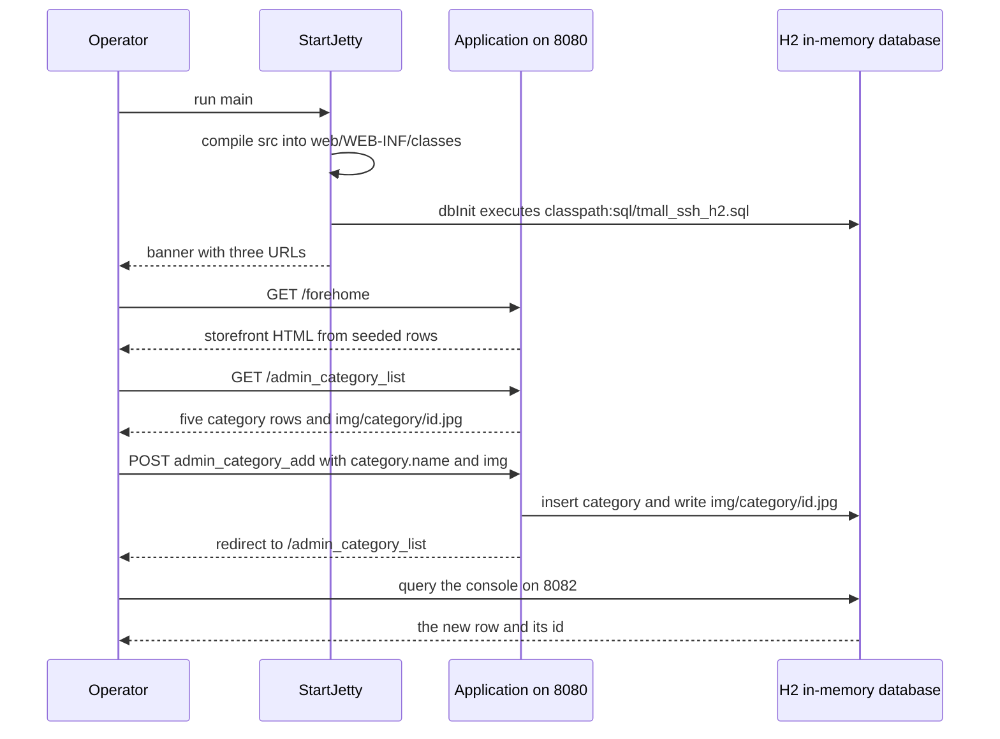
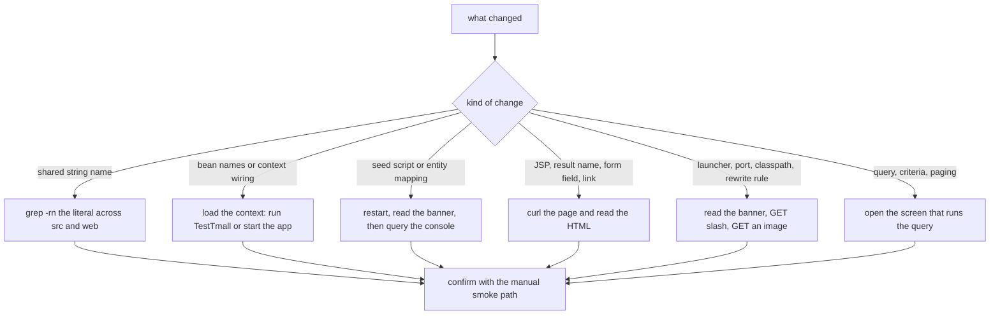

# Testing and Verification Strategy

Tmall_SSH has one test class and no way to run it automatically. There is no `pom.xml`,
`build.gradle` or `build.xml`, no CI workflow and no test script anywhere in the repository, so
"the test suite" is a single file a human has to start, and "the regression suite" is a manual
path that a human has to walk. This page records that situation exactly — the inventory, what
the one test actually proves, how to run it, the smoke path that produces the recorded
end-to-end evidence, and the static checks that are the only complete option for the
string-coupled names this codebase is full of.

Verification in practice has three layers, in increasing cost:

| Layer | What runs it | What it can catch |
|---|---|---|
| Spring-context load (`TestTmall`) | a human, with a JUnit 4 runner | bean wiring, the H2 datasource, the seed script, Hibernate mapping of `Category` |
| Static greps | a human, before an edit | the cross-file string contracts (endpoints, result names, bean names, session keys, image paths, table/column names) |
| The manual smoke path | a human, with a browser or `curl` | everything the first two cannot see: JSP rendering, parameter binding, the write path, the storefront and admin screens |

The contract-level symptom tables live on
[Runtime Invariants](/openwiki/conventions/runtime-invariants.md); the failure runbook lives on
[Startup and Diagnostics](/openwiki/operations/startup-and-diagnostics.md).

## 1. The inventory, as it is

| Item | What it is | Does anything run it? |
|---|---|---|
| `src/com/caozhihu/tmall/test/TestTmall.java` | the only test class: one JUnit 4 class, two `@Test` methods | No. Nothing invokes it at build time, at startup, or on commit |
| `src/com/caozhihu/tmall/test/tmp.java` | an empty file — zero bytes, no type declaration | No; it contributes no class file and no test |
| `web/WEB-INF/lib/junit-4.12.jar`, `web/WEB-INF/lib/hamcrest-core-1.3.jar` | JUnit 4 and its matcher library | Vendored. Loaded by the launcher's `javac` classpath, not by a test runner |
| `web/WEB-INF/lib/spring-test-4.3.18.RELEASE.jar` | `SpringJUnit4ClassRunner`, `@ContextConfiguration`, test transaction support | Vendored, same story |
| `web/WEB-INF/lib/**` (65 jars) | the file names *are* the dependency declaration | `StartJetty`'s compile step globs all of them |
| `tmall_ssh.iml` | IDE metadata with 65 per-jar `<orderEntry>` lines (`MIGRATION.md` records a companion `.vscode/settings.json`, which is git-ignored and absent from this checkout) | The IDE only — `StartJetty` reads the directory, not the metadata |
| CI / test task / shell script | nothing exists | — |

Two consequences that shape everything below:

- **There is no separate test source set.** The launcher compiles *every* `.java` under `src/`
  in one `javac` invocation into `web/WEB-INF/classes`, so the test package is compiled and
  deployed with the business code (see [Runtime Dependencies](/openwiki/integrations/runtime-dependencies.md)).
- **A test file is not free.** Because the same compile step fails the whole launch
  (`IllegalStateException("源码编译失败…")`), anything a test imports has to stay on the
  `web/WEB-INF/lib` classpath.

## 2. What `TestTmall` is, and what loading it proves

The whole file:

```java
@RunWith(SpringJUnit4ClassRunner.class)
@ContextConfiguration("classpath:applicationContext.xml")
public class TestTmall {

    @Autowired
    DAOImpl dao;

    @Test
    @Transactional
    public void delete(){
        DetachedCriteria detachedCriteria = DetachedCriteria.forClass(Category.class);
        List<Category> categories = (List<Category>) dao.findByCriteria(detachedCriteria);
        for (Category category : categories) {
            dao.delete(category);
        }
    }

    @Test
    @Transactional
    public void test(){
        DetachedCriteria detachedCriteria = DetachedCriteria.forClass(Category.class);
        List<Category> cs = (List<Category>) dao.findByCriteria(detachedCriteria);
        if (cs.isEmpty()) {
            for (int i = 0; i < 10; i++) {
                Category c = new Category();
                c.setName("测试分类" + (++i));
                dao.save(c);
            }
            System.out.println("成功添加10个测试类");
        }
    }
}
```

Reading it as a verification artifact:

- **It loads the real root context.** `classpath:applicationContext.xml` is the same file
  `web/WEB-INF/web.xml`'s `ContextLoaderListener` loads, with no Jetty, no filter chain and no
  JSP engine in play.
- **It bypasses the service layer.** It `@Autowired`s `DAOImpl` itself and calls
  `findByCriteria`, `save` and `delete` on the template, so none of the nine `XxxServiceImpl`
  beans' criteria vocabulary, count queries or transaction boundaries is exercised.
- **It asserts nothing.** `org.junit.Assert` is not imported; a green run means only "the
  context refreshed and these statements did not throw". The only output is the printed line
  inside the insert branch.
- **Both methods are `@Transactional`**, so Spring's test transaction support rolls them back:
  `delete()` really does delete every `Category` row and the insert branch really does insert,
  but the rollback means no row written by either test survives the run.
- **`test()` is a no-op on a normal run.** Its body is guarded by `cs.isEmpty()`, and `dbInit`
  seeds `category` at every context refresh, so the insert branch is skipped and the method
  degrades to a criteria read. If it ever does run on an empty table, the `(++i)` inside a
  loop that also increments `i` makes the body execute five times, while the printed message
  claims ten categories — do not read that message as a count of rows.
- **Both tests share one cached Spring context**, hence one `dbInit` run and one in-memory
  database for the JVM.

What a successful context load proves, and what it does not:

| Loads successfully ⇒ these are intact | Why |
|---|---|
| `ds` + the H2 URL + the driver class | `DriverManagerDataSource` initialises against `jdbc:h2:mem:tmall_ssh;MODE=MySQL;DB_CLOSE_DELAY=-1` |
| `dbInit` and the seed script | `DataSourceInitializer` executes `classpath:sql/tmall_ssh_h2.sql` during refresh; a parse error fails the load |
| `sf` and the `@Resource(name = "sf")`/`@Resource(name = "dao")` names | `LocalSessionFactoryBean` builds the `SessionFactory` and injects it into `dao` by name |
| `transactionManager` + `<tx:annotation-driven>` | the `@Transactional` test methods only become transactional if both exist |
| the `Category` mapping and the `category` table | the criteria and the `delete` calls need both |

Things this context load **cannot** catch:

- **A broken `XxxServiceImpl` ↔ `pojo.Xxx` pairing is silent here.** All nine services are
  instantiated during the refresh (component scan, non-lazy singletons), but `BaseServiceImpl`'s
  constructor resolves `clazz` by reading its own stack trace and `Class.forName`, and it
  swallows `ClassNotFoundException` after printing it. The bean comes up with `clazz` unset and
  fails later, at the first query built from it.
- **No HTTP request is issued**, so `@Action` URLs, result names, JSP rendering, the
  interceptors and the `/fore*` auth whitelist are entirely outside it.
- **No data is asserted**, so the seed script's row contents, the identity calibration and the
  image-file naming contract are not covered.
- **No write is committed**, so committed-write behaviour (flush outside a rolled-back test
  transaction) is unverified.

## 3. Running the one test (there is no test task)

Because there is no build tool, the only launch mechanism is JUnit 4's own runner on a
classpath the repository already contains. `web/WEB-INF/classes` must exist first — it is
git-ignored and absent from a fresh checkout, and it is created by the launcher's compile step.

```bash
# 1. produce web/WEB-INF/classes: this compiles all of src, then blocks on server.join(),
#    so stop it (Ctrl-C) once the banner appears if you only wanted the classes
java -cp "web/WEB-INF/lib/*" src/StartJetty.java    # JDK 11+; on JDK 8 use the javac + java pair in STARTUP.md

# 2. run the only test class
java -cp "web/WEB-INF/lib/*:web/WEB-INF/classes" org.junit.runner.JUnitCore com.caozhihu.tmall.test.TestTmall
```

Notes that matter before you rely on the result:

- **No repository document records this command or a test run.** `MIGRATION.md`'s acceptance
  table is an application-level record; the recipe above is what the vendored jars and the
  launcher's output directory imply. Whether it should be documented or scripted is
  【人工评审待确认】.
- **The test is JVM-local.** It builds its own Spring context and its own in-memory H2
  database, so it needs no running Jetty, shares no data with a running app, and its database
  cannot be opened from the console on 8082.
- **It pays the full startup cost** — the seed script is executed on every context refresh.
- In an IDE, running the class directly works for the same reason: `src` is a source root and
  `tmall_ssh.iml` puts all 65 jars on the module classpath.

## 4. The manual smoke path

This is the evidence that actually proves a change end to end, and the path the recorded
acceptance table in `MIGRATION.md` was produced with.



*The smoke path in order: every step after the banner is something the recorded acceptance table checks.*

1. **Start.** Run `src/StartJetty.java`'s `main()` (IDE) or
   `java -cp "web/WEB-INF/lib/*" src/StartJetty.java` from the project root. The success signal
   is the banner and the three URLs it prints; there is no banner if the port is taken, the
   source compile fails, or the Spring context cannot refresh.
2. **Root path and static assets.**
   `curl -i http://localhost:8080/` renders the storefront home (the launcher's exact-match
   rewrite to `/forehome`), and `curl -i http://localhost:8080/img/site/logo.gif` returns image
   bytes, not HTML — that second probe is what proves the rewrite rule is still narrow.
3. **Storefront action.** `curl -i http://localhost:8080/forehome` renders the same page
   addressed directly, with real categories and products from the seeded tables. `MIGRATION.md`
   records `200` for it.
4. **Admin list.** `curl -i http://localhost:8080/admin_category_list` renders five rows (the
   default page count) each with `.jpg">` thumbnails; `MIGRATION.md`
   records `200` for it.
5. **Admin CRUD round trip** — the only way to observe the write path:
   - *Add.* On the list page's 新增分类 panel, type a name into the `category.name` input and
     choose an image for the `<input type="file" name="img">`, then submit. The form posts to
     `admin_category_add`, which saves the row, writes the image, and returns the
     `listCategoryPage` redirect to `/admin_category_list`. Expect the new row, an id that
     continues past the calibrated seed (the first new `category` id is `84`), and a working
     thumbnail.
   - *Edit.* Follow the pencil link `admin_category_edit?category.id=<id>`; the form posts
     `category.id` + `category.name` (+ optional `img`) to `admin_category_update` and returns
     the same redirect. Expect the renamed row.
   - *Delete.* Follow the trash link `admin_category_delete?category.id=<id>` and expect the
     redirect plus a list without the row.
6. **H2 console.** Open `http://localhost:8082` and log in with JDBC URL
   `jdbc:h2:mem:tmall_ssh;MODE=MySQL;DB_CLOSE_DELAY=-1`, user `sa`, empty password. Then:

   ```sql
   SELECT count(*) FROM category;
   SELECT id, name FROM category ORDER BY id DESC;
   ```

   The top id in the second query is the id the UI used, which is how the identity calibration
   is confirmed. More console checks, including the seeded id range and the tables that are
   created but empty, are on [Data and Schema](/openwiki/operations/data-and-schema.md).
7. **What the path proves, and its limits.** It covers datasource, seeding, Spring wiring,
   OGNL parameter binding, JSP rendering, the result-name redirects and the write path. It
   produces no machine-checkable artifact, and it takes about a minute of clicking. For a
   storefront change the longer chain (cart → `forebuy` → checkout → pay → review) is on
   [Workflow: Storefront Shopping](/openwiki/workflows/storefront-shopping.md).

**One durable side effect.** The database is rebuilt at every start, so an add/edit/delete
smoke run leaves no rows behind — but the uploaded image is written through the servlet context
real path into the working tree (`web/img/category/<id>.jpg`), and `web/img` is not
git-ignored. Delete the file after the round trip or it shows up as an untracked change.

## 5. Cheapest evidence per kind of change



*Which check to reach for first, by the kind of change under review; the smoke path closes the loop.*

| Change | Cheapest check | Why it is enough, and where it stops |
|---|---|---|
| Renaming or adding a shared string name (endpoint URL, result name, service bean name, session key, image directory, `dao`/`sf` bean name, table/column name) | `grep -rn "<literal>" src web` (plus the docs for the entry URLs) | Complete for plain literals, and this is the only complete check available; blind to names derived by reflection or convention (§6) |
| Editing `applicationContext.xml`, the `ds`/`dbInit`/`sf`/`transactionManager`/`dao` names, or the shape of a service class | load the context: run `TestTmall`, or start the app and watch for the banner | Both fail loudly on a wiring break; neither asserts behaviour after successful wiring |
| Editing the seed script or an entity mapping | restart — the script runs at every context refresh, before Hibernate — then query the console | A SQL error aborts the context and no banner appears; with `hbm2ddl.auto=none` a missing table or column fails at the first query, not at startup |
| Changing a query, a criteria property name or paging | open the screen that runs the query, then confirm the rows in the console | A wrong property name fails only when Hibernate compiles the query; nothing asserts row contents |
| Changing a JSP, a result name, a form field name or a link | grep the literal in `src` **and** `web`, then `curl -i` the page | The rendered HTML is the evidence; a result-name mistake surfaces *after* the action method has already run |
| Changing the launcher, ports, classpath or the `/` rewrite rule | start and read the banner, then `GET /` and `GET /img/site/logo.gif` | The rewrite regression is only visible as images returning HTML rather than bytes |
| Changing the jar set | the documented `unzip -tq` integrity loop, then a start | The launch's compile step is the real check: a missing class — including the JUnit/`spring-test` jars — aborts `main()` before any port is bound |

## 6. Grep recipes for the string-coupled names

The names that bind this application together are plain string literals spread across `src/`
and `web/`, which is why a literal search is a real check and not a shortcut. The inventory
counts below are stable facts of the current tree:

```bash
# the whole rename set for one name: JSP links, jQuery URLs, @Results locations, docs
grep -rn "<literal>" src web
grep -rn "admin_category_list" src web        # StartJetty banner, Action4Result redirect, CategoryAction @Action, JSP links
grep -rn "forehome" src web                   # StartJetty rewrite target, homePage result, ForeAction @Action, index.jsp, loginPage.jsp, top.jsp

# endpoint inventory: 47 @Action values, 24 of them in ForeAction
grep -rn '@Action("' src/com/caozhihu/tmall/action | wc -l
grep -c '@Action("' src/com/caozhihu/tmall/action/ForeAction.java

# result names: 36 @Result declarations, all in one block on Action4Result
grep -c '@Result(name' src/com/caozhihu/tmall/action/Action4Result.java

# service bean name <-> Action4Service field name
grep -rn '@Service("' src/com/caozhihu/tmall/service/impl

# dependency set
ls web/WEB-INF/lib/*.jar | wc -l              # 65
```

Blind spots — things a grep on a literal cannot see, so verify them by reading the code:

- `BaseServiceImpl` derives the entity class from a stack frame and the string replacements
  `"ServiceImpl"` / `".service.impl"` → `".pojo"`; no literal connects `XxxServiceImpl` to
  `pojo.Xxx`.
- `Action4Service.t2p(Object)` builds the setter name as `"set" + clazz.getSimpleName()`, so the
  entity class name and the `Action4Pojo` property are coupled by reflection.
- Redirect locations carry OGNL expressions such as `?category.id=${property.category.id}`, and
  each expression is a property path on the receiving action.
- JSP links are relative (`href="admin_category_list"`), so changing the namespace or adding a
  path segment breaks them without appearing in any literal search for the endpoint name.

## 7. Coverage gaps (no automatic check exists)

These are facts about the current tree, not proposals:

- **No web-layer test at all.** Nothing issues an HTTP request; the app is dispatched by the
  Struts2 filter mapped to `/*`, there is no `DispatcherServlet`, and no Struts test-plugin jar
  is vendored. Result names, `@Action` URLs, interceptors, the `/fore*` auth whitelist and every
  JSP are verified only by eye and by `curl`.
- **No service-layer test.** `BaseServiceImpl`'s criteria and count vocabulary, the
  `clazz` reflection pairing, the `listByParent` naming convention, `Page` paging and the
  `@Transactional` boundaries have no test; see
  [Service Layer](/openwiki/architecture/service-layer.md) and
  [Persistence Layer](/openwiki/architecture/persistence-layer.md).
- **No assertions anywhere.** The only test class imports no assertion type; seed row contents,
  counts, the identity calibration and the image-file naming contract are checked manually
  (console query, admin round trip).
- **No coverage measurement, no static analysis, no dependency or vulnerability scan.** The one
  integrity check that exists for the jar directory is the `unzip -tq` loop in `STARTUP.md`.
- **No CI.** Nothing enforces that the single test is ever run, so its value depends entirely on
  a person choosing to run it.
- **Test isolation is rollback-only, and test code ships.** `TestTmall.class` is deployed inside
  `web/WEB-INF/classes` with the business classes, because there is one compile unit and one
  output directory.

【人工评审待确认】: the gaps above are observations; which of them should become work items
(adding a servlet-level smoke test, asserting seed data, splitting the test source set) is a
reviewer's call, not something the repository states.

## 8. Human review required (cannot be confirmed from source)

- **Is the `TestTmall` shape normative?** Whether new verification must follow the same
  single-class, JUnit 4 + Spring context + `@Transactional`, DAO-level, print-based style is
  undocumented; the same question is item 12 of the review list on
  [SDD Baseline](/openwiki/concepts/sdd-baseline.md). 【人工评审待确认】
- **Should the empty `src/com/caozhihu/tmall/test/tmp.java` be deleted?** It compiles to
  nothing today; nothing in the repository states its purpose. 【人工评审待确认】
- **Should the test command be documented or scripted?** No document records how (or whether)
  `TestTmall` is meant to be run; the JUnit runner invocation in §3 is derived from the vendored
  jars and the launcher's output directory. 【人工评审待确认】
- **Is `MIGRATION.md`'s acceptance table a standing regression checklist or a one-off migration
  record?** It is the only end-to-end evidence in the repository (startup banner, `/forehome`,
  `/admin_category_list`, static resources, console login, identity calibration, "business
  sources unchanged"), and nothing states whether each change must re-run and update it.
  【人工评审待确认】
- **Is manual smoke testing the intended verification for the web layer?** With no servlet test
  harness vendored, the alternatives are adding a test dependency or accepting the click-through
  path; the repository records no decision. 【人工评审待确认】

## Related pages

- [Persistence Layer (DAOImpl, HibernateTemplate, Transactions)](/openwiki/architecture/persistence-layer.md) — what `TestTmall` drives, and the transaction boundaries it does not cover.
- [Service Layer (BaseService, Reflection-Based BaseServiceImpl, Delegation)](/openwiki/architecture/service-layer.md) — the `clazz` pairing and criteria vocabulary with no test at all.
- [Runtime Invariants and Safe-Change Checklist](/openwiki/conventions/runtime-invariants.md) — the string-coupled contracts the greps in §6 protect, with their symptoms.
- [Operations: Running the App and Troubleshooting](/openwiki/operations/startup-and-diagnostics.md) — the launch recipes, the banner and the failure symptoms behind the smoke path.
- [Operations: In-Memory Data, Schema Scripts, and Seeding](/openwiki/operations/data-and-schema.md) — the console queries, seeded ids and calibration checks.
- [SDD Baseline: Structure, Naming, and Placement Conventions](/openwiki/concepts/sdd-baseline.md) — where a new test belongs and the open question about its shape.
- [Reference: Action URL Catalog](/openwiki/reference/action-catalog.md) — the endpoint and result-name inventory the greps count.
- [Runtime Dependencies (Vendored Jars and JDK Compatibility)](/openwiki/integrations/runtime-dependencies.md) — why the JUnit and `spring-test` jars are compile-critical.
- [Workflow: Admin CRUD Screens](/openwiki/workflows/admin-crud.md) — the list → add → edit → delete cycle exercised in §4.
- [Workflow: Storefront Shopping](/openwiki/workflows/storefront-shopping.md) — the longer storefront path a storefront change needs.
