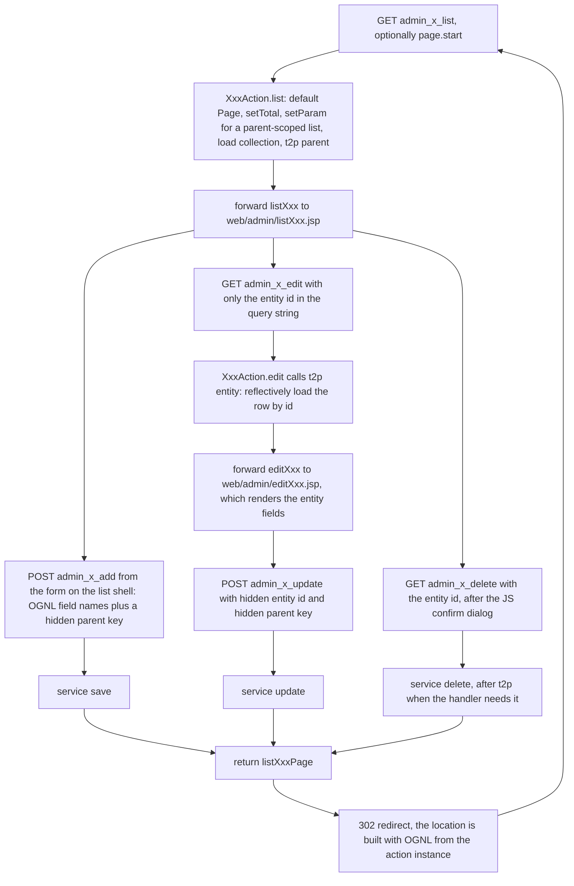

# Workflow: Admin CRUD Screens

The back office is 23 of the 47 `@Action` endpoints — every URL whose name starts with `admin_`
([Reference: Action URL Catalog](/openwiki/reference/action-catalog.md) lists them all). They are not
23 separate screens: they are **one cycle repeated over seven entities**, with the entity name as the
middle segment of the URL and the step as the last one. `CategoryAction`, `PropertyAction` and
`ProductAction` implement the full set of five; `ProductImageAction`, `PropertyValueAction`,
`UserAction` and `OrderAction` implement fragments of it.

What makes the cycle work is a chain of string contracts the compiler never checks: the `@Action`
value is the URL, the returned result name is looked up in the `@Results` block on `Action4Result`,
the redirect location is an OGNL expression evaluated against the acting action instance, and the
form field names in the JSPs are OGNL property paths bound onto the `Action4Pojo` fields. The
conventions themselves are on [Action Layer Conventions](/openwiki/architecture/action-layer.md)
(the `Action4*` chain, `t2p()`) and [SDD Baseline](/openwiki/concepts/sdd-baseline.md) (naming rules
for a new CRUD screen); this page is about how one pass through the cycle behaves at runtime, what it
depends on, and where it is inconsistent.

Two properties of the whole family hold before any single step:

- **Nothing authenticates it.** `AuthInterceptor` never sees these URLs — see
  [Security: the missing admin gate](#security-the-missing-admin-gate) below.
- **Nothing validates it.** No action method checks a field; the only checks in the whole back office
  are jQuery helpers in `web/include/admin/adminHeader.jsp`.

## The cycle in one diagram

*One pass of the back-office cycle for an entity `x`: the list shell is also the add form, and every write leaves through a redirect instead of rendering a page.*

## Step 1 — the list screen, which is also the add form

Every list action except `ProductImageAction.list` follows the same four or five statements:

1. `if (page == null) { page = new Page(); }` — the `Page` object is created only when the request
   did not bind one, so `page.start` and `page.count` arrive from the query string and default to
   `start=0, count=5` (`Page.defaultCount`).
2. `page.setTotal(...)` from the entity's own service — `categoryService.total()`,
   `userService.total()`, `orderService.total()`, `propertyService.total(category)` for a
   parent-scoped list.
3. `page.setParam("&category.id=" + category.getId())` for `PropertyAction.list` and
   `ProductAction.list` only: the parent key is stored as a query-string fragment so the pagination
   links on page 2, 3, … keep the list scoped to the same category.
4. Load the collection (`categories`, `properties`, `products`, `users`, `orders`, and for images the
   two type-filtered lists) onto the action, then `t2p(parent)` when the shell needs more than the
   parent's id — `${category.name}` in the breadcrumb of `listProperty.jsp`, for instance.

The list shell then renders three things: a table of rows with per-row links, the pagination fragment,
and — on four of the six list screens — an add form that posts to `admin_<entity>_add`. The product
table carries the family's newest column: a 备注 column bound to `${p.remark}`, sitting between
产品小标题 and 原价格 (`web/admin/listProduct.jsp#L50-L53` for the header row, `#L73-L76` for the
cells). Two list screens are exceptions:

- `ProductImageAction.list` builds no `Page` at all; `listProductImage.jsp` has no pagination block,
  because a product's images are shown in full in two tables (single images and detail images).
- `PropertyValueAction` has no list endpoint: `admin_propertyValue_edit` plays that role (below).

Rows carry the links that start the next step, in a fixed shape:

- edit: `admin_<entity>_edit?<entity>.id=${row.id}`,
- delete: `admin_<entity>_delete?<entity>.id=${row.id}` with the marker attribute `deleteLink="true"`,
- the screens of a child entity, scoped to this row as parent:
  `admin_property_list?category.id=${c.id}`, `admin_product_list?category.id=${c.id}`,
  `admin_productImage_list?product.id=${p.id}`, `admin_propertyValue_edit?product.id=${p.id}`.

The add form's field names are OGNL property paths, not names of their own: `category.name`,
`property.name`, `product.name`/`product.subTitle`/`product.remark`/`product.originalPrice`/
`product.promotePrice`/`product.stock`, `productImage.type`, plus a hidden parent key
(`property.category.id`, `product.category.id`, `productImage.product.id`) and the upload field `img`.
The product add panel is the widest of the four — roughly `web/admin/listProduct.jsp#L100-L142` — and
its 备注 row (`id="remark"`, `name="product.remark"`) sits directly after 产品小标题 at `#L115-L119`,
with the hidden `product.category.id` at `#L137`. Three of these forms are
`enctype="multipart/form-data"`: the one on `listCategory.jsp` and the two on `listProductImage.jsp`
(one per `productImage.type`); `listProperty.jsp` and `listProduct.jsp` post plain forms.
`listUser.jsp` and `listOrder.jsp` keep a `$("#addForm").submit` handler although they render no form
at all.

There is no server-side validation behind any of it. `adminHeader.jsp` defines `checkEmpty`,
`checkNumber` and `checkInt`, and each shell wires them into a `submit` handler for its own form
(`checkNumber` for `originalPrice`/`promotePrice`, `checkInt` for `stock`, and so on); the delete
confirmation is the same file's `$("a").click` handler reading the `deleteLink` attribute. `remark` is
the one bound product field that no helper sees: neither the add shell's handler
(`web/admin/listProduct.jsp#L15-L31`) nor the edit shell's (`web/admin/editProduct.jsp#L17-L33`)
passes it to `checkEmpty`, although both check `name` and `subTitle`. 【人工评审待确认】 whether that
gap is intended — the `scene2-product-remark` self-check report calls leaving `remark` unchecked
deliberate but justifies it by saying the non-empty check is left to `name` alone
(`.openspec/specs/scene2-product-remark-selfcheck.md#L36`), which the shipped handlers contradict by
checking `subTitle` too. If JavaScript is off, or the request is issued by hand, nothing rejects the
write.

## Step 2 — edit: the URL carries only the id

The edit link puts nothing but the identifier in the query string, so the bound entity on the action
is an id-only object; `edit()` calls `t2p(that entity)` and returns the `editXxx` forward. The edit
shell then reads the populated fields off the value stack (`value="${category.name}"`,
`${property.name}`, `${product.subTitle}`, `${product.remark}`, …) and posts back to
`admin_<entity>_update` with the id in a hidden input — plus the parent key in a second hidden input,
because the update handler's redirect target needs that association. The product edit form spans
roughly `web/admin/editProduct.jsp#L46-L87`: the 备注 row echoing `${product.remark}` sits directly
after 产品小标题 at `#L59-L63`, and the two hidden inputs carry `product.id` at `#L82` and
`product.category.id` at `#L83`.

Two edit screens behave differently:

- **`admin_propertyValue_edit` is scoped by product, not by property value.** The URL carries
  `product.id`; `edit()` calls `t2p(product)`, then `propertyValueService.init(product)`, which creates
  a `PropertyValue` row for every property of the product's category that does not have one yet, then
  `propertyValueService.listByParent(product)`. The screen renders one text input per row with no form
  element and no submit button.
- **`admin_property_update` deliberately skips `t2p()`.** The source comment on the call says the
  conversion is unnecessary here because the write goes straight to the database with a `Property`
  that already carries every field to be written; the contrast with `delete()`, which does call
  `t2p(property)`, is intentional in the code as written.

## Step 3 — add / update / delete write, then redirect

The three write steps share one shape: call the injected service, then return a result name. The
return value is one of five `Page` results, all declared as `type="redirect"` in the single
`@Results` block on `Action4Result`:

| Write on | returns | redirect location | parent key source |
|---|---|---|---|
| `admin_category_add` / `_update` / `_delete` | `listCategoryPage` | `/admin_category_list` | none — fixed target |
| `admin_property_add` / `_update` / `_delete` | `listPropertyPage` | `/admin_property_list?category.id=${property.category.id}` | `property.category`, from `t2p()` in `delete` or the hidden form field elsewhere |
| `admin_product_add` / `_update` / `_delete` | `listProductPage` | `/admin_product_list?category.id=${product.category.id}` | `product.category`, same two ways |
| `admin_productImage_add` / `_delete` | `listProductImagePage` | `/admin_productImage_list?product.id=${productImage.product.id}` | `productImage.product`, from `t2p()` in `delete` or the hidden form field in `add` |
| `admin_order_delivery` | `listOrderPage` | `/admin_order_list` | none — fixed target |

The redirect (a 302 back to the list, so a browser refresh cannot resubmit the POST) is what makes the
parent key load-bearing. `Action4Result`'s comment above the property results records that a
`location` value may contain OGNL expressions; they are evaluated against the *acting* action instance
while the result is built, so anything an expression dereferences must already be populated. That is
the whole reason `t2p()` shows up in delete handlers: `ProductImageAction.delete` carries a source
comment explaining that without the conversion the redirect's
`${productImage.product.id}` raises `TransientObjectException`. `CategoryAction.delete` is the delete
handler that does *not* convert, because its redirect target is fixed, and `OrderAction.delivery`
shows the other use of `t2p()` on a write path: after loading the row it sets `deliveryDate` to now
and the status to `OrderService.waitConfirm`.

The add and update steps also compensate for fields the browser cannot supply:

- `ProductAction.add` stamps `product.createDate` with `new Date()`, and `ProductAction.update`
  reloads the row through `productService.get(product.getId())` to copy the unchanged `createDate`
  onto the bound object — the edit form has no date input, and the code's comment says the date does
  not change. That compensation is the only product-specific code on the write path: the forms submit
  six scalars (`product.name`, `product.subTitle`, `product.remark`, `product.originalPrice`,
  `product.promotePrice`, `product.stock`), and adding `remark` to them cost no change to
  `ProductAction` at all, because `Product.remark` is an ordinary mapped field
  (`src/com/caozhihu/tmall/pojo/Product.java#L21`) whose column the seed script supplies separately
  (`src/sql/tmall_ssh_h2.sql#L155`).
- Creates that own a file persist first and rename afterwards: `CategoryAction.add` saves the row and
  then writes the upload to `img/category/<new id>.jpg`, and `ProductImageAction.add` writes to
  `img/productSingle/` or `img/productDetail/` according to the posted `productImage.type`, deriving
  the small and middle sizes for single images. The database write and the file write are not atomic,
  and the file name is the id Hibernate assigned during the save. (The write itself, and
  `saveWithJpg()`, are covered by [Workflow: Image Upload and Serving](/openwiki/workflows/image-pipeline.md).)

## Step 4 — back on the list, still scoped to the parent

The redirect lands on the plain list URL with the parent key in the query string, so the second
request re-binds `category.id`/`product.id` onto `Action4Pojo`, and the list action re-derives
`page.param` from it. That round trip is not cosmetic: `PropertyAction.list` and `ProductAction.list`
call `category.getId()` while building `page.param`, so a request to either list endpoint **without**
the parent key fails rather than showing an unscoped list. The same is true for the pagination links —
`adminPage.jsp` appends `${page.param}` to every generated `href`, which is why the parameter is set
before the render. The mechanics of `Page` and `page.param` are on
[Workflow: Pagination and Search](/openwiki/workflows/pagination-and-search.md).

## The endpoint matrix per entity

The middle segment of the URL is spelled exactly like the `Action4Pojo` property it binds — except
that `propertyValue` and `productImage` are camel-cased while `category`, `property`, `product`,
`user` and `order` are not.

| Entity | list | add | edit | update | delete | other | forward results | write redirect |
|---|---|---|---|---|---|---|---|---|
| `category` | `admin_category_list` | `_add` | `_edit` | `_update` | `_delete` | — | `listCategory`, `editCategory` | `listCategoryPage` |
| `property` | `admin_property_list` | `_add` | `_edit` | `_update` | `_delete` | — | `listProperty`, `editProperty` | `listPropertyPage` |
| `product` | `admin_product_list` | `_add` | `_edit` | `_update` | `_delete` | — | `listProduct`, `editProduct` | `listProductPage` |
| `productImage` | `admin_productImage_list` | `_add` | — | — | `_delete` | — | `listProductImage` | `listProductImagePage` |
| `propertyValue` | — | — | `admin_propertyValue_edit` | `admin_propertyValue_update` (AJAX) | — | — | `editPropertyValue` | none — returns `success.jsp` |
| `user` | `admin_user_list` | — | — | — | — | — | `listUser` | — |
| `order` | `admin_order_list` | — | — | — | — | `admin_order_delivery` | `listOrder` | `listOrderPage` |

What the gaps mean in practice:

- **`user` is read-only.** The only user endpoint is the paged list; there is no admin screen that
  creates, edits or deletes a user, so user rows come from storefront registration.
- **`order` has a single state-changing button.** `admin_order_list` renders a 发货 (`delivery`) link
  only for rows whose status is `waitDelivery`; there is no admin create, edit or delete for orders.
  The statuses themselves belong to
  [Workflow: Order Lifecycle](/openwiki/workflows/order-lifecycle.md).
- **`productImage` has no edit/update.** Images can only be added or deleted; replacing one means
  deleting and re-adding it.
- **`propertyValue` has no list/add/delete.** Rows are created implicitly by `init(product)` and
  edited in place with no save button.
- **`review` and `orderItem` are bound on the action chain but have no admin URL at all.**

## The two JSP layers

The back office uses ten shells under `web/admin/` and four shared fragments under
`web/include/admin/`. Each shell decides its own page directive and taglibs (the fragments declare
none), then includes the fragments by relative path:

| Shell | Kind | Fragments it includes | Pagination |
|---|---|---|---|
| `listCategory.jsp`, `listProperty.jsp`, `listProduct.jsp`, `listUser.jsp`, `listOrder.jsp` | list | header, navigator, footer | `adminPage.jsp` inside `div.pageDiv` |
| `listProductImage.jsp` | list | header, navigator, footer | none — both image tables are rendered in full |
| `editCategory.jsp`, `editProperty.jsp`, `editProduct.jsp` | edit | header, navigator | n/a |
| `editPropertyValue.jsp` | edit (AJAX) | header, navigator | none |

| Fragment | What it contributes |
|---|---|
| `adminHeader.jsp` | opens the document, loads jQuery 2.0.0 from a CDN and the Bootstrap 3.3.6 bundle, and defines `checkEmpty` / `checkNumber` / `checkInt` plus the `deleteLink` confirmation handler |
| `adminNavigator.jsp` | the fixed top bar: logo, 分类管理 (`admin_category_list`), 用户管理 (`admin_user_list`), 订单管理 (`admin_order_list`) — the entry points into the three root lists |
| `adminPage.jsp` | the pagination block, built from `page.hasPreviouse` / `page.hasNext` / `page.totalPage` / `page.last`, appending `${page.param}` to every link |
| `adminFooter.jsp` | closes `body` and `html` |

Note that only the six list shells include `adminFooter.jsp`; all four edit shells
(`editCategory.jsp`, `editProperty.jsp`, `editProduct.jsp`, `editPropertyValue.jsp`) end without it,
so their documents are never closed. It is a rendering inconsistency, not a functional one.

## t2p(): the id-to-persistent step

`t2p()` on `Action4Service` is what turns the id-only object that OGNL created into a real row. It has
21 call sites overall, 12 of them in this back-office cycle — `CategoryAction.edit`;
`PropertyAction.list/delete/edit`; `ProductAction.list/delete/edit`;
`ProductImageAction.list/delete`; `PropertyValueAction.edit/update`; and `OrderAction.delivery`. It
works on the action's own field, not on its argument:

1. read the id reflectively: `(Integer) o.getClass().getMethod("getId").invoke(o)`;
2. fetch the row: `categoryService.get(clazz, id)` — the same `categoryService` bean for every entity,
   because `BaseService.get(Class, int)` is type-agnostic;
3. build the setter name from the entity's simple name and resolve it on the **runtime action class**:
   `getClass().getMethod("set" + clazz.getSimpleName(), clazz)`;
4. `setMethod.invoke(this, persistentBean)` — so after the call, the action's `category` (or
   `property`, `product`, `productImage`, `propertyValue`, `order`) points at the persistent row.

The whole body sits in one `try` whose `catch (Exception e)` only calls `e.printStackTrace()`. The
method returns `void`, reports nothing and rethrows nothing, so **a failed conversion is
indistinguishable from a successful one to the caller**: a request with an id that does not exist, an
id that fails the `Integer` cast, or a class whose setter is not public all leave the action field in
its previous state (usually the id-only object, or `null`) and the action method goes on to return its
result name. Downstream that shows up as an empty or half-empty edit form rather than an error page,
or — when a later statement dereferences a property that was supposed to be loaded — as whatever
`NullPointerException` that statement produces. There is no error result name for this path.

## Failure semantics and inconsistencies recorded in the code

These are the places where the current source does not match the pattern the rest of the cycle
follows. They are recorded as observed facts; the items whose intent the repository does not settle —
the property-value update ordering, the inert `@Transactional`, and the missing admin gate in the next
section — carry a 【人工评审待确认】 marker instead of being smoothed into a rule.

- **`t2p()` swallows every exception.** As above: `catch (Exception e) { e.printStackTrace(); }`, no
  return value, no error result. For most screens the effect is a blank field rather than a failure,
  which is the state a missing or bogus id produces today.
- **`PropertyValueAction.update` reads the request value before converting.** The method stores
  `propertyValue.getValue()` in a local variable, *then* calls `t2p(propertyValue)`, then writes the
  local back onto the refreshed entity; the comment justifies the order by saying `t2p()` would
  otherwise wipe the submitted value, because it replaces the bound object with the database row.
  The ordering is what the comment asserts, and it makes the handler depend on `t2p()` replacing the
  action field rather than mutating the argument. 【人工评审待确认】 whether the read-then-restore order
  is intended design or a workaround for `t2p()`, and whether an update handler should re-load the row
  at all instead of updating the bound object.
- **`PropertyAction.add` carries `@Transactional(readOnly = false)` on a class Spring does not
  manage.** The annotation sits on the method, but action instances are created by Struts and are not
  Spring beans (`Action4Service` is the only `@Component` in the package, and no `@Action` method
  exists on it), so there is no proxy for the annotation to apply to and it cannot take effect. The
  write is still transactional, because `ServiceDelegateDAO.update/save/delete` and
  `BaseServiceImpl.save` carry `@Transactional(readOnly = false)` in their own right.
  【人工评审待确认】 whether the annotation was meant to do something for this call.
- **Two handlers call a service that does not match the entity.** `ProductAction.list` computes its
  page total with `propertyService.total(category)` — the *property* count — while listing products;
  `ProductImageAction.delete` deletes through `propertyService.delete(productImage)`. Neither is
  caught by the compiler, and the delete survives because the base service's
  `delete`/`update`/`save` path is entity-agnostic (`HibernateTemplate`), so the mismatched bean name
  is a documentation defect rather than a crash. The effect of the first one is visible: the number of
  pagination pages on the product list is driven by the category's property count, not its product
  count.
- **Which write handlers call `t2p()` is decided case by case, not by a rule.** `delete` calls it for
  `property`, `product` and `productImage` but not for `category`; `update` calls it only for
  `propertyValue`; the add handlers never call it. The pattern behind the choices is what the handler
  needs downstream — a persistent association for the redirect location, a complete object for the
  service, or a populated field for the view — but nothing in the code states it as a rule.
- **The create paths write the database row and then the file, without a guard on the upload.**
  `CategoryAction.add` calls `saveWithJpg(file)` unconditionally, while `CategoryAction.update` guards
  the same call with `if (img != null)`; `saveWithJpg()` itself swallows `IOException` with a stack
  trace. A create without a selected file therefore leaves the row without an image, and
  `listCategory.jsp` renders an `img` whose `src` is `img/category/` plus the new id and `.jpg` — a
  request for a file that was never written.
- **`productImage` and `propertyValue` list/edit screens have no pagination**, and
  `ProductImageAction.list` never creates a `Page`, so a product with many images renders all of them
  in one page.

## Security: the missing admin gate

`AuthInterceptor` is the only authentication check in the application, and it acts only on URIs
starting with `/fore`: for those it compares the URI tail against the hard-coded allow-list
`{home, checkLogin, register, loginAjax, login, product, category, search}` and, when the session has
no `user`, redirects to `login.jsp` and stops the invocation. A URI beginning with `/admin_` never
matches `uri.startsWith("/fore")`, so **all 23 back-office endpoints — including every add, update and
delete, and `admin_order_delivery` — execute anonymously, with no session user, no role check and no
CSRF token**. The admin JSP shell for a screen (`/admin/listCategory.jsp`, `/admin/listProduct.jsp`,
…) is likewise a plain JSP file under the web root: requesting it directly renders the table markup
with empty lists rather than being blocked. 【人工评审待确认】 whether anonymous back-office access is
intended for a practice project or is an oversight; the current source offers no check to point at
either way, and nothing in the repository declares an admin credential, role or allow-list.

## Where to go next

- [Reference: Action URL Catalog](/openwiki/reference/action-catalog.md) — the per-URL table with the
  exact parameters each endpoint binds.
- [Action Layer Conventions](/openwiki/architecture/action-layer.md) — the `Action4*` inheritance
  chain, why `t2p()` exists, and the result-name contract.
- [SDD Baseline](/openwiki/concepts/sdd-baseline.md) — the naming checklist for a new `admin_<entity>_<verb>`
  screen, end to end.
- [SDD Iteration](/openwiki/workflows/sdd-iteration.md) — the spec-plus-selfcheck loop, whose worked
  example is the `scene2-product-remark` change that added the 备注 input and column above.
- [Runtime Invariants](/openwiki/conventions/runtime-invariants.md) — the same string contracts
  framed as do-not-break rules.
- [Workflow: Pagination and Search](/openwiki/workflows/pagination-and-search.md) — `Page`,
  `page.param` and the list SQL each list action triggers.
- [Workflow: Image Upload and Serving](/openwiki/workflows/image-pipeline.md) — what the two create
  paths written above leave on disk.
- [Workflow: Order Lifecycle](/openwiki/workflows/order-lifecycle.md) — the status `admin_order_delivery`
  advances.
