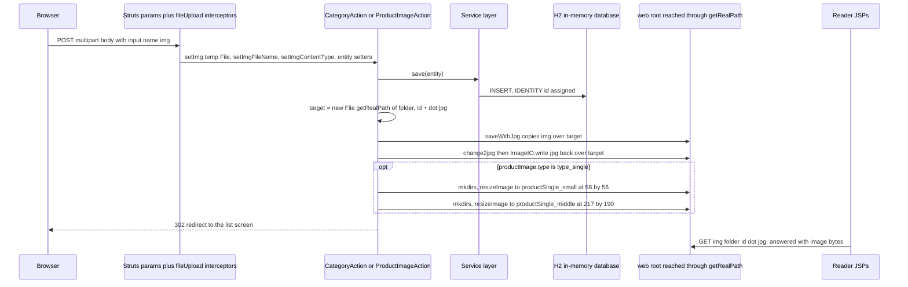
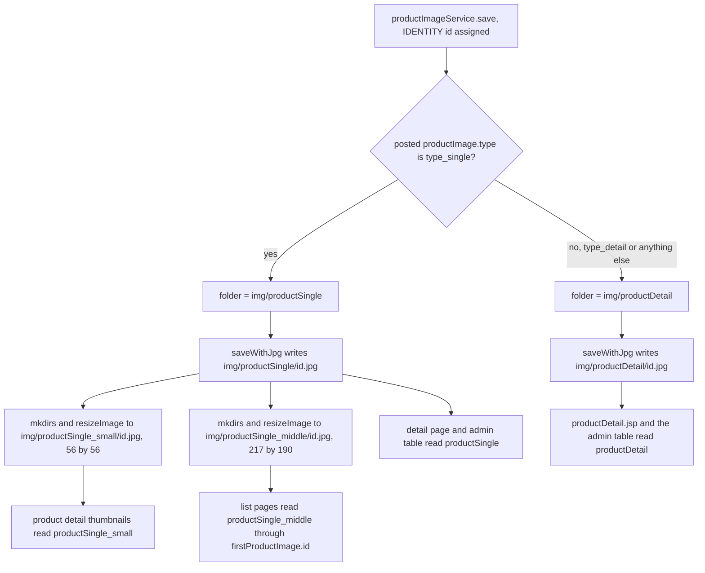

# Workflow: Image Upload, Conversion, and Serving

Only two places in the application ever write an image byte: `CategoryAction.add` / `CategoryAction.update`
and `ProductImageAction.add`. All three go through one shared helper, `Action4Service.saveWithJpg(File)`.
What the database stores is never the image — only an id and, for product images, a type; the bytes live as
files under the web root, named after that id.

That single decision produces the whole pipeline, and it is the reason the same handful of strings appear in
Java actions, in JSP `src` attributes, in the seed script and in the launcher:

| Written | Target path, exactly as the code builds it | Size |
|---|---|---|
| category image | `img/category/<category.id>.jpg` | as uploaded, re-encoded |
| product image, type `type_single` | `img/productSingle/<productImage.id>.jpg` | as uploaded, re-encoded |
| product image, type `type_single` | `img/productSingle_small/<productImage.id>.jpg` | 56 × 56 |
| product image, type `type_single` | `img/productSingle_middle/<productImage.id>.jpg` | 217 × 190 |
| product image, type `type_detail` | `img/productDetail/<productImage.id>.jpg` | as uploaded, re-encoded |

`ProductImageService.type_single` and `ProductImageService.type_detail` are the only two types the code
recognises; everything else the pipeline does — which directory is chosen, which derivatives exist, which of
several URL shapes a JSP emits — follows from them plus one service method,
`ProductImageService.setFirstProductImage(Product)`, which picks the single image a product is displayed with.

The do-not-break framing of these names, and the deployment consequences of writing into a shipped
directory, are on [Runtime Invariants](/openwiki/conventions/runtime-invariants.md) §4.6–§4.7. The upload
binding and `saveWithJpg` are introduced on
[Action Layer Conventions](/openwiki/architecture/action-layer.md); the CRUD cycle that triggers the writes is
[Workflow: Admin CRUD Screens](/openwiki/workflows/admin-crud.md). This page is the pipeline itself: binding,
conversion, naming, resizing, serving, and what is left behind.

## The binding contract: three properties, one form field

Struts' multipart file-upload interceptor (part of the framework `defaultStack`, which
`src/struts.xml` installs last) binds a form field named `img` onto three properties that
`Action4Upload` declares — and that is all it declares:

```java
protected File img;
protected String imgFileName;
protected String imgContentType;
```

Every action class inherits them through `Action4Upload → Action4Pagination → Action4Pojo → Action4Service →
Action4Parameter → Action4Result → XxxAction`. The three uploading forms all use
`enctype="multipart/form-data"` with `<input type="file" name="img"/>`:

| Form | Endpoint | Extra fields |
|---|---|---|
| `web/admin/listCategory.jsp` 新增分类 panel | `admin_category_add` | `category.name` |
| `web/admin/editCategory.jsp` | `admin_category_update` | `category.id` (hidden), `category.name` |
| `web/admin/listProductImage.jsp`, 单个图片 panel | `admin_productImage_add` | `productImage.type=type_single` (hidden), `productImage.product.id` (hidden) |
| `web/admin/listProductImage.jsp`, 详情图片 panel | `admin_productImage_add` | `productImage.type=type_detail` (hidden), `productImage.product.id` (hidden) |

The file name and content type travel into `imgFileName` / `imgContentType` and are then never read: the
pipeline ignores them and decides the extension from its own conventions (`.jpg`, always). `saveWithJpg`
reads the inherited `img` field directly, so its only argument is the destination.

## One upload end to end



*The whole pipeline for one upload: bind, persist to obtain the id, convert in place, derive the two thumbnails, then serve the files by URL.*

## Step 1 — the row is saved first, because its id is the file name

Both writers persist before they touch the disk, and both read the identifier off the in-memory entity
afterwards rather than off the `save()` return value:

- `CategoryAction.add` — `categoryService.save(category)`, then
  `getRealPath("img/category")`, then `new File(imageFolder, category.getId() + ".jpg")`.
- `ProductImageAction.add` — `productImageService.save(productImage)`, then the folder is chosen, then
  `new File(imageFolder, productImage.getId() + ".jpg")`, and `file.getName()` is kept in a local
  `fileName` so the two derivatives can reuse exactly the same name in their own directories.

This works because every `@Id` is `@GeneratedValue(strategy = GenerationType.IDENTITY)`: Hibernate gets the
generated key during the insert and writes it back onto the instance. It also means the database write and the
file write are not atomic — the row is committed before any byte exists, and the reverse (a file whose row is
later lost) is described under [Lifecycle](#lifecycle-rows-in-ram-bytes-in-the-working-tree).

`CategoryAction.update` follows the same naming but guards the write with `if (img != null)`; the two `add`
paths call `saveWithJpg` unconditionally. A multipart submit that selects no file therefore leaves a nullable
`img` that reaches `FileUtils.copyFile` — an unchecked failure after the row exists. That asymmetry and its
consequences are recorded on [Action Layer Conventions](/openwiki/architecture/action-layer.md) and
[Workflow: Admin CRUD Screens](/openwiki/workflows/admin-crud.md); the pipeline-level point is that the file
name is decided before anyone checks whether there is an image to write.

## Step 2 — `saveWithJpg()` and `ImageUtil`: convert in place, convert twice

`Action4Service.saveWithJpg(File file)` is three statements inside one `try`:

```java
FileUtils.copyFile(img, file);
BufferedImage img = ImageUtil.change2jpg(file);
ImageIO.write(img, "jpg", file);
```

The multipart temp file is copied to the final path, and then that *same* path is decoded, converted and
overwritten. Consequences worth knowing:

- **The target is the decode source.** Whatever format was uploaded is replaced in place by a JPEG encoded
  from `change2jpg`'s output, so a PNG upload leaves a `.jpg` file with no trace of the original bytes at that
  path. The temp file is untouched.
- **`change2jpg` does not use `ImageIO`.** It decodes through AWT's toolkit
  (`Toolkit.getDefaultToolkit().createImage(f.getAbsolutePath())`), pulls the pixels with a `PixelGrabber`
  constructed with `forceRGB = true`, and rebuilds a `BufferedImage` over a
  `DirectColorModel(32, 0xFF0000, 0xFF00, 0xFF)` — a model with no alpha mask, so any transparency in the
  upload is discarded before the JPEG is written.
- **The conversion is not idempotent by contract, only by accident.** Nothing checks the content type or the
  file name; any file the toolkit can decode is accepted, and any file it cannot decode fails later (see
  [Failure semantics](#failure-semantics-what-one-bad-file-does)).
- **Both writes target the same path, so a re-upload for the same id simply overwrites it.** That is how
  `admin_category_update` replaces a category image without any delete step.

`resizeImage` — used only for the two product-image derivatives — comes in two overloads:

| Overload | Behaviour |
|---|---|
| `resizeImage(File srcFile, int width, int height, File destFile)` | `ImageIO.read(srcFile)` → the in-memory overload → `ImageIO.write((RenderedImage) i, "jpg", destFile)` |
| `resizeImage(Image srcImage, int width, int height)` | new `BufferedImage` of exactly `width × height` and `TYPE_INT_RGB`, `drawImage` of `srcImage.getScaledInstance(width, height, Image.SCALE_SMOOTH)` at `0, 0` |

Two properties follow. First, the scale is a **straight stretch into the requested box** — `getScaledInstance`
is asked for `217 × 190`, so a square 400 × 400 source (the size `listProductImage.jsp` recommends) comes out
slightly squeezed horizontally, and the 56 × 56 thumbnail is produced by the same kind of stretch rather than
by cropping.
Second, the derivatives are re-encoded from the file that `saveWithJpg` just wrote, which is a JPEG by then,
so the 56 × 56 and 217 × 190 images are second-generation JPEG encodes of the uploaded photo.

## Step 3 — which directory, and whether derivatives exist



*The branch `ProductImageAction.add` takes on `productImage.type`: one primary file always, two derived files only for `type_single`.*

The branch is `if (ProductImageService.type_single.equals(productImage.getType()))`, with a plain `else` —
there is no `else if` for `type_detail`:

```java
String folder = "img/";
if (ProductImageService.type_single.equals(productImage.getType())) {
    folder += "productSingle";
} else {
    folder += "productDetail";
}
```

So `type_detail` and **any other value at all** land in `img/productDetail`. `productImage.type` is bound from
an OGNL hidden field (`productImage.type`), and no handler validates it. A hand-crafted POST with
`productImage.type=whatever` therefore stores a row of that type and writes `img/productDetail/<id>.jpg`, while
both the admin screen and the storefront pages filter on the two constants — the file exists, no screen ever
lists it.

`ProductImageAction.add` creates the two derivative directories itself with `f_small.getParentFile().mkdirs()`
and `f_middle.getParentFile().mkdirs()`; the primary directory is not created in the action (it is part of the
checked-in tree). The derivative directories are also part of the checked-in tree, so the `mkdirs()` calls are
defensive rather than load-bearing today.

Deleting an image is a database-only operation. `ProductImageAction.delete` calls `t2p(productImage)` and then
deletes through the service — no file is removed, and none of the three files (or two, for detail images) is
touched. The row disappears from both admin tables and from every reader, and the bytes stay on disk
unreferenced. (That handler also calls `propertyService.delete(productImage)` rather than
`productImageService.delete(...)`; the mismatched bean name is recorded on
[Workflow: Admin CRUD Screens](/openwiki/workflows/admin-crud.md) and does not change the file behaviour,
because the base service's delete path is entity-agnostic.)

## Step 4 — the bytes are served by the container, not by an action

`getRealPath(...)` resolves against the webapp's resource base, which the launcher sets to the `web/`
directory (`context.setResourceBase(webRoot.getAbsolutePath())`). The write target and the readable URL are
therefore literally the same directory tree, and the read path is pure static file serving:

1. `web/WEB-INF/web.xml` maps the `struts2` filter to `/*`, so every `/img/...` request enters the filter.
2. `img` is not a mapped action name and `.jpg` is not an accepted action extension, so Struts passes the
   request down the chain.
3. Jetty's `DefaultServlet` serves the file from the `web/` resource base.

Nothing has to be "published": an uploaded file is visible at `http://localhost:8080/img/<dir>/<id>.jpg` as
soon as `saveWithJpg` has written it, and the redirect back to the list screen is what makes the browser
request it.

Two launcher-level details in `StartJetty` are what keep that path working, and both are recorded as
do-not-break constraints on [Runtime Bootstrap](/openwiki/architecture/runtime-bootstrap.md):

- **The `/` rewrite must stay exact-match.** `StartJetty` installs an anonymous `Rule` that returns
  `"/forehome"` only when `"/".equals(target)`. The source comment explains why a `RewritePatternRule` cannot
  be used: its `pattern` has regex/prefix semantics, so `pattern "/"` would rewrite every path — including
  `/img/...` — to `/forehome`, and **the whole site's images would be answered with the home page HTML**.
- **The context path must stay `/`.** Every image `src` in every JSP is *relative* (`img/...`, or `../img/...`
  from the admin includes), with no `${contextPath}` prefix, so the URLs only resolve because endpoints live
  at the context root with a single path segment.

## The read side: who requests which URL

The read side never queries the filesystem; it composes a URL from an id it already has. Two id sources exist —
the `ProductImage` row at hand (admin screens) and `product.firstProductImage` (storefront thumbnails).

| URL the JSP emits | Id source | Readers |
|---|---|---|
| `img/category/<category.id>.jpg` | bound `category` (list) or `${category.id}` (detail page) | `web/admin/listCategory.jsp`, `web/include/category/categoryPage.jsp` |
| `img/productSingle/<pi.id>.jpg` | the row being iterated | `web/admin/listProductImage.jsp` (both link and thumbnail) |
| `img/productSingle_small/<pi.id>.jpg` | the row being iterated | `web/include/product/imgAndInfo.jsp` thumbnail strip — the only reader |
| `img/productSingle/<product.firstProductImage.id>.jpg` | `firstProductImage` | `web/include/product/imgAndInfo.jsp` (large image), `web/include/productsBySearch.jsp`, `web/include/cart/reviewPage.jsp`, `web/admin/listProduct.jsp`, `web/admin/listOrder.jsp` |
| `img/productSingle_middle/<p.firstProductImage.id>.jpg` | `firstProductImage` | `web/include/home/homepageCategoryProducts.jsp`, `web/include/category/productsByCategory.jsp`, `web/include/cart/cartPage.jsp`, `buyPage.jsp`, `boughtPage.jsp`, `confirmPayPage.jsp` |
| `img/productDetail/<pi.id>.jpg` | the row being iterated | `web/include/product/productDetail.jsp`, `web/admin/listProductImage.jsp` |

The product detail page is the one screen that uses three of the shapes at once: a large
`productSingle/<firstProductImage.id>.jpg`, a strip of `productSingle_small/<pi.id>.jpg` thumbnails each
carrying a `bigImageURL="img/productSingle/<pi.id>.jpg"` attribute, and the detail block from
`productDetail/<pi.id>.jpg`. A jQuery `mouseenter` handler copies the `bigImageURL` attribute onto the
large ``'s `src`, so hovering a thumbnail swaps the large view — still the same five directory names,
just driven from the DOM.

`web/include/product/productDetail.jsp` iterates `${product.productDetailImages}` while
`imgAndInfo.jsp` iterates `${product.productSingleImages}`; both lists are populated per request (by
`ForeAction.product`, and by `ProductImageAction.list` for the admin tables) rather than mapped by the entity.
On the entity, `firstProductImage`, `productSingleImages` and `productDetailImages` are all `@Transient`
fields — they carry no database column and are refilled on every request that needs them.

### `setFirstProductImage` decides the picture a product is shown with

`ProductImageServiceImpl.setFirstProductImage(Product)` is the only place that answers "which image represents
this product":

1. it returns immediately if `product.getFirstProductImage()` is already non-null (so the first caller in a
   request wins, and repeated calls are free);
2. it runs `list("product", product, "type", ProductImageService.type_single)`;
3. if the result is non-empty it assigns element `0`.

The ordering matters: `BaseServiceImpl.list(Object... pairParams)` always appends `addOrder(Order.desc("id"))`,
so element `0` is the **highest** `productImage.id` — the most recently uploaded `type_single` image, not the
first one. Adding a new single image to a product therefore changes that product's thumbnail and its big image
everywhere at once, and `type_detail` rows are invisible to this method by construction.

Its callers are all on the read path and all before rendering: `ProductServiceImpl.fill(Category)`
(storefront home and category pages), `ForeAction.product`, `ForeAction.search`, `ProductAction.list` (admin
product list, one call per row), and `OrderItemServiceImpl.fill(Order)` (cart, buy, order screens). The
transient field means the same product can be rendered with different images in different responses only if
its single-image set changed in between — there is no cache to invalidate.

**When a product has no `type_single` image at all**, `firstProductImage` stays `null` and the EL expression
`${p.firstProductImage.id}` evaluates to empty, so the emitted URL collapses to `img/productSingle/.jpg` —
a request for a file named `.jpg` that was never written. The page renders with a broken image, no server
error and no log entry. This is the same silent-failure shape as a wrong directory: the HTML references a name
nobody wrote.

## Lifecycle: rows in RAM, bytes in the working tree

The two halves of an image have very different lifetimes, and the mismatch is a consequence of the
deployment, not of the pipeline code.

- **Rows are ephemeral.** The database is H2 in-memory; `dbInit` runs `classpath:sql/tmall_ssh_h2.sql` at every
  Spring context refresh, so the application comes up in its pristine demo state each start. The seed inserts
  `productimage` rows explicitly (`INSERT INTO productimage VALUES (629,87,'type_single');` …) and calibrates
  identity with `ALTER TABLE productimage ALTER COLUMN id RESTART WITH 10211;` (and `category` with
  `RESTART WITH 84`).
- **Bytes are durable and tracked.** The seeded ids have committed, id-named files in the repository — e.g.
  `web/img/productSingle/629.jpg` and its 56 × 56 derivative `web/img/productSingle_small/629.jpg` — and
  `.gitignore` does not exclude `web/img`. A fresh checkout therefore reproduces the demo screens exactly.
- **Uploads add untracked files to that tracked tree, and their rows vanish on restart.** A file uploaded
  during a session survives a restart (it is an ordinary file), but the row that named it does not, so the new
  image simply disappears from every screen while its bytes stay behind as an orphan. A fresh checkout or a
  `git clean` removes the bytes too, leaving the untracked tree clean again.
- **Ids are reused, so an orphan file can be overwritten.** Because the counters restart at the calibrated
  values, the next upload after a restart gets the same id (`10211` for the first new product image, `84` for
  the first new category) and writes the same path, replacing the previous session's leftover silently. Only
  one file per reused id can ever be observed.
- **The working tree gets dirty.** A smoke test that uploads a category image leaves `web/img/category/84.jpg`
  behind as an untracked change, which is why the verification runbook tells you to delete it after the round
  trip.

The database side of this (in-memory lifetime, seeding, identity calibration) is on
[Data and Schema](/openwiki/operations/data-and-schema.md); whether the checked-in demo image set is a
deliverable fixture or hand-curated content is not settled anywhere in the repository — see
[Runtime Invariants](/openwiki/conventions/runtime-invariants.md) §6.

## Failure semantics: what one bad file does

Every step of the write path logs and continues, so a failure shows up as a missing or stale image rather than
as an error page. The specific shapes:

- **`saveWithJpg` swallows `IOException`** (`catch (IOException e) { e.printStackTrace(); }`) and returns
  `void`; the caller neither learns whether the file was written nor aborts the request.
- **A `null` conversion result is not checked.** `change2jpg` returns `null` when pixel grabbing is
  interrupted, and `resizeImage(Image, int, int)` returns `null` when anything inside it throws; in both cases
  the `null` flows into `ImageIO.write(...)`, which rejects it with an **unchecked** `IllegalArgumentException`
  that the surrounding `catch (IOException ...)` does not cover. A pipeline failure can therefore stop the
  action method with an exception *after* the database row (and, for the primary file, the file) already
  exists.
- **Corrupt or non-image uploads fail late.** `resizeImage(File, ...)` decodes with `ImageIO.read`, which
  returns `null` for an unsupported format and throws for unreadable input; the failure surfaces inside the
  derivative step rather than at binding time, because nothing validates the upload.
- **`productImage.type` is unvalidated**, as described above: the else branch absorbs any value and the row
  keeps whatever was posted.
- **The `add` paths write without a guard** (`CategoryAction.add` calls `saveWithJpg` even when `img` is
  `null`; `CategoryAction.update` does not), so an empty file input is a crash-shaped failure on add and a
  silent no-op on update.
- **A missing id gives an empty URL.** `${...firstProductImage.id}` on a null association collapses to an
  empty string, producing `img/productSingle/.jpg` and a browser-level 404 rather than a server error.

## Extension points

Adding a new image kind — a banner, an avatar, an extra product view — means touching four places in the same
change, because the string never appears in one place:

1. a directory under `web/img/`, committed (or created by the writer);
2. a writer branch and the `getRealPath` folder, following `ProductImageAction.add`/`CategoryAction.add`, and a
   `mkdirs()` if the directory is not checked in;
3. the size decision (the 56 × 56 / 217 × 190 derivatives exist only for `type_single`, hard-coded at the two
   `ImageUtil.resizeImage` calls);
4. every reader's `src` expression.

Two smaller notes for anyone extending the product-image branch: the type values are only the two constants,
and adding a third constant changes the `else` branch's meaning (currently "detail"), so a new type needs an
explicit branch, not a new constant alone; and, because JSPs compose the URL themselves, no server-side route
(or controller) has to be added for a new directory — it is served the same way `img/site/logo.gif` is.

## Focused verification

There is no automated test for any of this. The only test class, `com.caozhihu.tmall.test.TestTmall`, loads the
Spring context and drives `DAOImpl` against `Category`; it never performs an upload, never calls
`saveWithJpg`, `change2jpg` or `resizeImage`, and never issues an HTTP request, so a regression in any part of
this pipeline is invisible to it. Everything below is manual:

| Check | Proves |
|---|---|
| `curl -i http://localhost:8080/img/site/logo.gif` returns image bytes, not HTML | the `/` rewrite is still exact-match, i.e. image serving is not swallowed by the root rewrite |
| `GET /admin_category_list` renders `.jpg">` for the seeded categories | the seeded ids, the committed demo files and the relative URL all line up |
| Upload a category image on the 新增分类 panel, then reload the list | `name="img"`, `saveWithJpg`, and a file at `web/img/category/<new id>.jpg` (first new id `84`) |
| Upload both image types on `admin_productImage_list`, then open a storefront page for that product | the `type_single` / `type_detail` branch, the two derivatives, and `setFirstProductImage` picking up the newest single image |
| `ls web/img/category web/img/productSingle_small` after the round trip, then restart the app and reload the list | files persist while the rows do not; the upload disappears from the UI and the bytes stay as an orphan |

Cheap static checks before any rename in this area: the names are plain literals, so
`grep -rn "productSingle_small" src web` (and the same for each directory, `type_single`, `type_detail` and
`name="img"`) enumerates every writer and reader. The wider verification strategy is on
[Verification](/openwiki/testing/verification.md).

## Human review required

- **AWT-decoded pixels and the in-place overwrite.** `change2jpg` decodes through
  `Toolkit.getDefaultToolkit().createImage(f.getAbsolutePath())` and then the same path is rewritten with the
  converted image. Whether the toolkit's file-name-keyed image handling can hand back previously decoded
  pixels for a path that has just been overwritten (which would make an update appear not to take effect) is a
  runtime behaviour the repository does not settle and no test covers. 【人工评审待确认】
- **Unvalidated `productImage.type`.** The else branch silently routes any unknown type to `img/productDetail`,
  producing a file that no screen lists. Whether an unknown type should be rejected, normalised to
  `type_detail`, or is simply out of scope is not stated. 【人工评审待确认】
- **The check-in policy for upload artefacts.** The seeded image set is committed while uploaded files are
  untracked additions to the same directories, so a smoke test always dirties the tree. Whether the project
  wants those files ignored, pruned by a script, or left as-is is a project decision.
  【人工评审待确认】

## Related pages

- [Runtime Invariants](/openwiki/conventions/runtime-invariants.md) — §4.6–§4.7 frame the naming and the `img`
  field as do-not-break contracts.
- [Action Layer Conventions](/openwiki/architecture/action-layer.md) — the `Action4*` chain, `t2p()` and the
  `saveWithJpg` binding.
- [Workflow: Admin CRUD Screens](/openwiki/workflows/admin-crud.md) — the list/add/update/delete cycle that
  invokes these writers.
- [Data and Schema](/openwiki/operations/data-and-schema.md) — the seed script, identity calibration and the
  in-memory database lifetime behind the orphan-file behaviour.
- [Runtime Bootstrap](/openwiki/architecture/runtime-bootstrap.md) — the resource base and the exact-match `/`
  rewrite that make static image serving work.
- [Domain Model](/openwiki/concepts/domain-model.md) — `ProductImage`, and the transient
  `Product.firstProductImage` association.
- [Verification](/openwiki/testing/verification.md) — the manual smoke path this pipeline is checked with.
