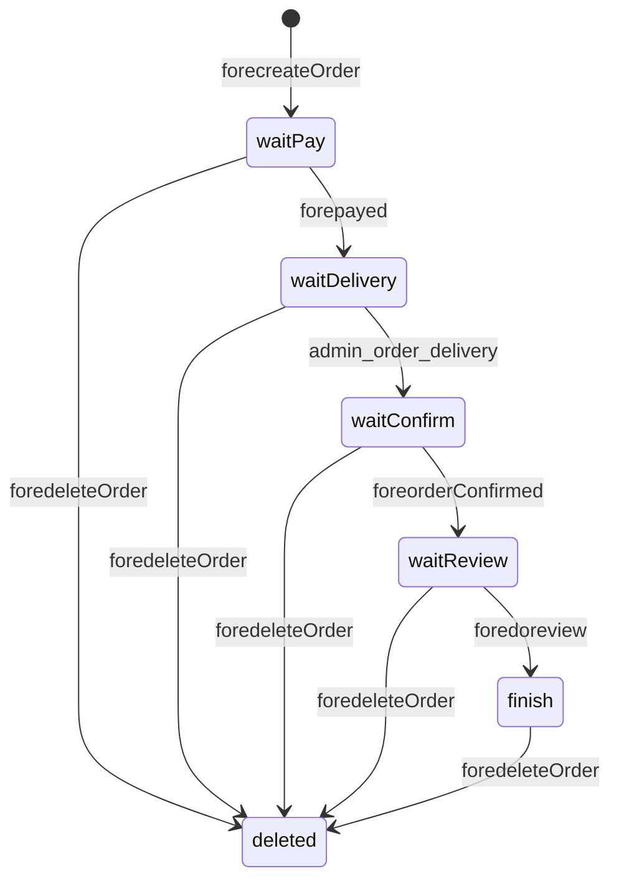
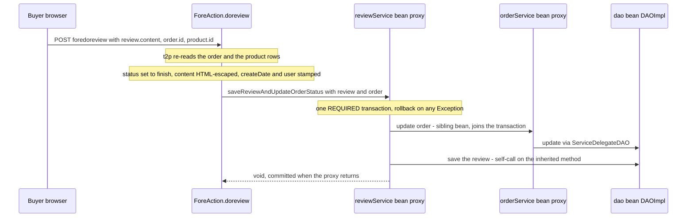

# Workflow: Order Lifecycle and Status Transitions

An order in Tmall_SSH is a single `order_` row whose lifecycle is carried by one free-form
`status` string. There is **no state-machine object, no status enum and no database constraint**:
each transition is an imperative `order.setStatus(...)` followed by `orderService.update(order)`
in a Struts action, and the six legal values are merely `public static final String` constants on
`OrderService` (`src/com/caozhihu/tmall/service/OrderService.java#L12-L17`). This page documents
that state machine end to end: what each status means, which actor action performs each
transition, the columns and entities each transition writes, the composite writes and their
transaction annotations, and the guards that are *not* there.

Related background: [Service Layer](/openwiki/architecture/service-layer.md),
[Persistence Layer](/openwiki/architecture/persistence-layer.md),
[Domain Model](/openwiki/concepts/domain-model.md),
[Data and Schema](/openwiki/operations/data-and-schema.md),
[Action URL Catalog](/openwiki/reference/action-catalog.md),
[Admin CRUD Screens](/openwiki/workflows/admin-crud.md).

## Where the lifecycle state lives

`Order` maps to table `order_` (`src/com/caozhihu/tmall/pojo/Order.java#L9-L11`). Four nullable
`Date` columns and the `status` string are the entire lifecycle record:

| Column | Set by | Cleared by |
|---|---|---|
| `orderCode` | `forecreateOrder` (generated `yyyyMMddHHmmssSSS`) | never |
| `createDate` | `forecreateOrder` | never |
| `payDate` | `forepayed` | never |
| `deliveryDate` | `admin_order_delivery` | never |
| `confirmDate` | `foreorderConfirmed` | never |
| `status` | the six write sites listed below | never (no transition reverts a status) |

The H2 bootstrap script declares `status varchar(255) DEFAULT NULL` with no `CHECK`, no `ENUM` and
no `NOT NULL` (`src/sql/tmall_ssh_h2.sql#L39-L56`; the retained MySQL original is identical,
`sql/tmall_ssh.sql#L32-L49`), so the column can hold any string — including the empty value and
`NULL`. `user` is an `@ManyToOne` on `uid` with an FK, and `orderItems`, `total` and `totalNumber`
are `@Transient` render-time decorations, never persisted (`Order.java#L17-L38`).

`OrderService` declares exactly six status constants, whose values equal their identifiers:

| Constant | Meaning in the code | Set by |
|---|---|---|
| `OrderService.waitPay` = `"waitPay"` | created, not paid | `forecreateOrder` |
| `OrderService.waitDelivery` = `"waitDelivery"` | paid, not shipped | `forepayed` |
| `OrderService.waitConfirm` = `"waitConfirm"` | shipped, not received | `admin_order_delivery` |
| `OrderService.waitReview` = `"waitReview"` | received, not reviewed | `foreorderConfirmed` |
| `OrderService.finish` = `"finish"` | reviewed | `foredoreview` |
| `OrderService.delete` = `"delete"` | soft-deleted by the buyer | `foredeleteOrder` |

Note that `OrderService.delete` is a **string value, not the inherited `delete(Object)` method** of
`BaseService`; the name is shared, the meaning is not.

## The state machine



*Every transition the code can perform, with the action that performs it. `deleted` is the
`status = "delete"` value: the row stays in `order_`, so `foredeleteOrder` is reachable from every
live state.*

Two structural properties of this graph follow from how the transitions are implemented:

- **The five forward transitions form one chain, and nothing goes back.** The only six
  `Order.setStatus` call sites in the repository are `ForeAction.java#L257`, `#L272`, `#L296`,
  `#L305`, `#L325` and `OrderAction.java#L27`; no action, service or interceptor ever restores a
  previous status.
- **Each arrow is unguarded.** Every transition action accepts a bare `order.id` and sets its target
  status without inspecting the current one, so the arrows above describe what the *UI* invites, not
  what the endpoints enforce. Whether that is intended is 【人工评审待确认】 — see
  [Gaps and open questions](#gaps-and-open-questions).

## Transition reference

`t2p(order)` in the "Binds" column is `Action4Service.t2p(Object)`: the request contributes only
`order.id`, and `t2p` re-reads the whole row through `categoryService.get(clazz, id)` and reflects it
back with `setOrder(...)` (`src/com/caozhihu/tmall/action/Action4Service.java#L57-L71`). Every
transition except creation therefore writes onto persistent state rather than onto a partially bound
object.

| Transition | Actor action (URL) | Triggered from | Binds | Status + timestamp written | Persistence call |
|---|---|---|---|---|---|
| new → `waitPay` | `forecreateOrder` (POST) | `include/cart/buyPage.jsp#L4` form posting `order.address`, `order.post`, `order.receiver`, `order.mobile` | session `orderItems` | `status`, `orderCode`, `createDate`, `user` | `orderService.createOrder(order, ois)` — `save(order)` + `orderItemService.update(oi)` per item |
| `waitPay` → `waitDelivery` | `forepayed` (GET) | `include/cart/alipayPage.jsp#L21` "确认支付" link | `t2p(order)` | `status`, `payDate` | `orderService.update(order)` |
| `waitDelivery` → `waitConfirm` | `admin_order_delivery` (GET) | `web/admin/listOrder.jsp#L69-L73` 发货 button, and `include/cart/boughtPage.jsp#L172-L174` 催卖家发货 button | `t2p(order)` | `status`, `deliveryDate` | `orderService.update(order)` |
| `waitConfirm` → `waitReview` | `foreorderConfirmed` (GET) | `include/cart/confirmPayPage.jsp#L78` "确认收货" link | `t2p(order)` | `status`, `confirmDate` | `orderService.update(order)` |
| `waitReview` → `finish` | `foredoreview` (POST) | `include/cart/reviewPage.jsp#L68-L81` form posting `review.content`, `order.id`, `product.id` | `t2p(order)`, `t2p(product)` | `status`, plus a new `review` row | `reviewService.saveReviewAndUpdateOrderStatus(review, order)` — `orderService.update(order)` + `save(review)` |
| any live status → `delete` | `foredeleteOrder` (AJAX POST) | `include/cart/boughtPage.jsp#L36-L53` delete-confirm modal posting `{"order.id": …}` | `t2p(order)` | `status` only | `orderService.update(order)` |

`forealipay` sits between creation and payment but writes nothing: it only forwards to
`alipay.jsp` (`ForeAction.java#L264-L267`), and the amount shown there comes from the URL parameter
(`${param.total}`, `alipayPage.jsp#L12-L15`), not from the order.

## Creating the order: `forecreateOrder` and `createOrder`

The create step spans the session, the action and two services
(`src/com/caozhihu/tmall/action/ForeAction.java#L243-L262`):

1. `ForeAction.buy` put the selected `OrderItem` list on the session under `orderItems` and summed
   a display total (`ForeAction.java#L173-L187`).
2. `forecreateOrder` reads that list. If it is **empty** the action returns `login.jsp`; if the
   session key is *absent* the `ois.isEmpty()` dereference throws instead of redirecting — the
   difference between an empty cart and a fresh session matters here.
3. It generates `orderCode` with `new SimpleDateFormat("yyyyMMddHHmmssSSS").format(...)`, sets
   `createDate`, sets the session `user`, and sets `status = OrderService.waitPay`.
4. `OrderService.createOrder(order, ois)` persists and attaches the items.
5. The service's return value overwrites the action's `total`, which the `alipayPage` redirect
   carries forward: `forealipay?order.id=${order.id}&total=${total}`.

`OrderServiceImpl.createOrder` is the create **composite write**
(`src/com/caozhihu/tmall/service/impl/OrderServiceImpl.java#L23-L34`):

```java
@Transactional(propagation = Propagation.REQUIRED, rollbackForClassName = "Exception")
public float createOrder(Order order, List<OrderItem> ois) {
    save(order);
    float total = 0;
    for (OrderItem oi : ois) {
        oi.setOrder(order);
        orderItemService.update(oi);
        total += oi.getProduct().getPromotePrice() * oi.getNumber();
    }
    return total;
}
```

- `save(order)` is a **self-invocation** on the inherited `BaseServiceImpl.save`, so no new
  boundary is opened; the outer `createOrder` annotation governs.
- `orderItemService.update(oi)` leaves the object through the injected `OrderItemService` **bean
  proxy**, so those calls join the same transaction under `REQUIRED`.
- `rollbackForClassName = "Exception"` widens rollback past unchecked exceptions, so a failure in
  the middle of the loop cannot leave a saved order with unattached items.
- Setting `oi.setOrder(order)` is what turns a *cart line* into an *order line*: `orderItem.oid` is
  nullable and carries no foreign-key constraint precisely because a null order means "still in the
  cart" (`OrderItem.java#L16-L18`, `src/sql/tmall_ssh_h2.sql#L14699-L14708`).

## Paying, shipping and confirming

All three middle transitions are the same shape: `t2p(order)`, one `setStatus`, one date, one
`orderService.update(order)` (`ForeAction.java#L269-L276`, `#L293-L300`;
`src/com/caozhihu/tmall/action/OrderAction.java#L23-L30`):

- `forepayed` is reached from the payment page link and immediately stamps `payDate` and
  `waitDelivery` — there is no payment gateway, the click *is* the payment.
- `admin_order_delivery` stamps `deliveryDate` and `waitConfirm`. It is the **only** admin order
  endpoint that writes; `admin_order_list` merely pages and fills (`OrderAction.java#L11-L21`).
- `foreorderConfirmed` stamps `confirmDate` and `waitReview`, ending the shipping leg.

Because `OrderServiceImpl` does not override `update`, the boundary for each of these single-entity
writes is the inherited `ServiceDelegateDAO.update(Object)`, which is annotated
`@Transactional(readOnly = false)` (`src/com/caozhihu/tmall/service/impl/ServiceDelegateDAO.java#L186-L189`)
and therefore opens its own transaction when the action calls it outside one.

Two behaviour details live in the JSPs rather than in the actions:

- `listOrder.jsp` renders the 发货 button only `if ${o.status=='waitDelivery'}` — a *presentation*
  guard, with no matching check server-side.
- `boughtPage.jsp#L172-L174` renders a 催卖家发货 ("urge the seller to ship") button whose `link`
  attribute is `admin_order_delivery?order.id=${o.id}`, and the click handler AJAX-gets that URL.
  The buyer-facing *nudge* button therefore executes the shipment transition itself.

## Reviewing and finishing

The review leg is the second composite write. `forereview` (`ForeAction.revice`) re-reads the order,
calls `orderItemService.fill(order)`, and picks the product to review as
`order.getOrderItems().get(0).getProduct()` (`ForeAction.java#L310-L318`) — only the first order item
of the order is ever presented for review, and an order with no items would throw on that index.

`foredoreview` then builds a `Review` and hands both entities to the service
(`ForeAction.java#L320-L338`):



*The `finish` transition and the `Review` insert are one unit of work: the order status update and
the review insert commit together or not at all.*

`ReviewServiceImpl.saveReviewAndUpdateOrderStatus` is deliberately ordered — the order is updated
first, the review inserted second, both inside `@Transactional(propagation = REQUIRED,
rollbackForClassName = "Exception")`
(`src/com/caozhihu/tmall/service/impl/ReviewServiceImpl.java#L18-L23`). This is the only path that
writes two entities on a status change, and the only place a transition writes a *second* table.

Note that the reviewed product comes from the form's hidden `product.id`, not from the order's own
items, and that nothing prevents a second POST of the same form: each POST inserts another `Review`
row and re-sets `finish`. Whether either is intended is 【人工评审待确认】.

## Deleting: a status value, not a row delete

`foredeleteOrder` performs a **soft delete** (`ForeAction.java#L302-L308`):

```java
t2p(order);
order.setStatus(OrderService.delete);
orderService.update(order);
return "success.jsp";
```

No `delete` SQL is issued and the `order_` row — with its dates, address and attached items — stays
forever. Every read path that must hide it filters on the status value:

- `OrderService.listByUserWithoutDelete(User)` builds a `DetachedCriteria` with
  `Restrictions.eq("user", user)` **and** `Restrictions.ne("status", OrderService.delete)`
  (`OrderServiceImpl.java#L36-L42`), which is what `forebought` renders
  (`bought.jsp` ← `include/cart/boughtPage.jsp`).
- `admin_order_list` does **not** filter: it uses `orderService.listByPage(page)` from
  `BaseServiceImpl` plus `orderService.total()` (`OrderAction.java#L11-L21`,
  `src/com/caozhihu/tmall/service/impl/BaseServiceImpl.java#L52-L68`), so soft-deleted orders still
  appear in the back office — labelled `刪除` by `getStatusDesc` — and are counted in the paging
  total. Whether that is intended is 【人工评审待确认】.
- Cart cleanup is a separate, *hard* delete: `foredeleteOrderItem` calls `orderItemService.delete`
  on whatever `orderItem.id` the request supplies, with no check that the item is still an
  unattached cart line (`ForeAction.java#L237-L241`).

## Reading an order back

Two helpers decorate an order for rendering, and both are read-only:

- `OrderItemServiceImpl.fill(Order)` reloads the items with `listByParent(order)`, sums
  `number * promotePrice` into the transient `total`, sums `number` into `totalNumber`, and sets a
  first product image on every item's product (`src/com/caozhihu/tmall/service/impl/OrderItemServiceImpl.java#L25-L41`;
  the list overload loops over orders). Call sites: `admin_order_list`, `forebought`,
  `foreconfirmPay`, `forereview`.
- `Order.getStatusDesc()` maps the six status values to the Chinese labels the admin list shows
  (`src/com/caozhihu/tmall/pojo/Order.java#L40-L65`): `waitPay`→待付, `waitDelivery`→待发,
  `waitConfirm`→待收, `waitReview`→等评, `finish`→完成, `delete`→刪除, and `未知` for anything else.
  `listOrder.jsp#L55` renders it as `${o.statusDesc}`, and the same JSP's 发货 button compares
  `${o.status}` directly.

Because the totals are `@Transient` and recomputed at render time from the *current*
`promotePrice`, the amount shown after the fact can differ from the amount `createOrder` returned
when the order was placed; the money formula (`promotePrice * number`) is written three times — in
`ForeAction.buy`, in `OrderServiceImpl.createOrder` and in `OrderItemServiceImpl.fill`.

`getStatusDesc` switches on the raw `status` string, so a row whose `status` is `NULL` — permitted
by the nullable column — throws a `NullPointerException` while the admin list renders rather than
showing `未知`.

## Transaction boundaries at a glance

| Operation | Annotation | Entities in one unit |
|---|---|---|
| `ServiceDelegateDAO`/`BaseServiceImpl` `save`, `update`, `delete` | `@Transactional(readOnly = false)` | one entity per call — the boundary for every single-entity transition |
| `OrderServiceImpl.createOrder` | `@Transactional(propagation = REQUIRED, rollbackForClassName = "Exception")` | `Order` + N `OrderItem` |
| `ReviewServiceImpl.saveReviewAndUpdateOrderStatus` | `@Transactional(propagation = REQUIRED, rollbackForClassName = "Exception")` | `Order` + `Review` |

The advice is applied through `tx:annotation-driven` against the Hibernate
`transactionManager` (`src/applicationContext.xml#L14-L17`, `#L68-L72`), so the two composite
methods are the only places where a partially applied order transition is impossible. A new
transition that must touch more than one entity has to be added as a sibling-bean method with the
same annotation pair for the same guarantee.

## Gaps and open questions

The following are code facts with an unresolved intent; each needs a human decision rather than a
rule read out of the implementation. They are all marked 【人工评审待确认】.

1. **No status precondition.** No transition action reads the current status before overwriting it,
   so `forepayed`, `foreorderConfirmed`, `foredoreview` and `admin_order_delivery` can move an order
   from any status into their target. The only guards are the JSP `c:if` blocks that decide which
   button to show. 【人工评审待确认】
2. **No ownership or role check.** The `fore*` transition endpoints rely solely on
   `AuthInterceptor`'s "a session `user` exists" rule for `/fore` URLs
   (`src/com/caozhihu/tmall/interceptor/AuthInterceptor.java#L24-L48`); the interceptor never
   compares the session user with `order.user`. `admin_order_delivery` does not match the `/fore`
   prefix at all, so it is outside that check entirely. 【人工评审待确认】
3. **A buyer URL performs the shipping transition.** The 催卖家发货 button in `boughtPage.jsp`
   calls `admin_order_delivery`, so the buyer's own browser drives `waitDelivery` → `waitConfirm`
   before the seller acts. 【人工评审待确认】
4. **The session cart is never cleared.** `forecreateOrder` does not remove `orderItems` from the
   session, and `OrderItem.order` is a single FK, so a re-submitted buy form runs `createOrder`
   again and re-points the same items at a new order, leaving the earlier order item-less.
   【人工评审待确认】
5. **Repeat reviews are possible.** Each POST of `foredoreview` inserts another `Review` for the
   posted `product.id` and re-sets `finish`; only the first order item's product is ever offered by
   `forereview`. 【人工评审待确认】
6. **Soft-deleted orders remain visible to admin**, since `admin_order_list` and `total()` filter on
   nothing, and `status` is nullable with no constraint while `getStatusDesc` cannot tolerate
   `NULL`. 【人工评审待确认】

## Verification

There is no automated test for any of these transitions. The single test class in the repository
(`src/com/caozhihu/tmall/test/TestTmall.java#L15-L47`) exercises `Category` only, and the H2
bootstrap data contains zero `order_`, `orderitem` and `review` rows
(`/openwiki/operations/data-and-schema.md`), so the lifecycle has to be exercised by hand: register
a user, fill the cart, place an order, click through payment, ship it from
`/admin_order_list`, confirm receipt, post a review, and then check the row in `order_` after a
soft delete. Any change to the status strings, to the `getStatusDesc` switch, to the JSP `c:if`
conditions or to the redirect parameters (`order.id`, `total`) is a **string-coupled** change: the
compiler sees nothing, and the failure surfaces only as a missing button, an `未知` label or a bound
`order` with no fields set.
