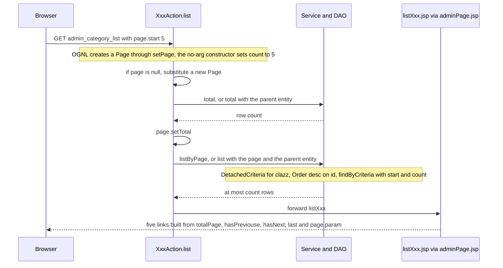
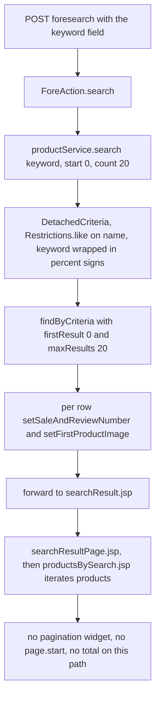

# Workflow: Pagination and Search

Two different list-screening mechanisms live in this application, and they share almost nothing:

1. **Back-office paging.** Five `admin_*` list endpoints page their rows through a single
   plain bean, `com.caozhihu.tmall.util.Page`, and render their controls from one fragment,
   `web/include/admin/adminPage.jsp`. Paging is a *pair of queries* — a `count(*)` for the
   metadata and a criteria slice for the rows.
2. **Storefront search.** `foresearch` is one query with a **hard-coded** `start = 0`,
   `count = 20` window and **no paging UI anywhere on the storefront**. Search is a separate
   capability: it does not use `Page`, and `Page` is not involved in it.

Nothing else in the tree emits a paging control: `page.start` appears only in
`web/include/admin/adminPage.jsp`. That asymmetry — paged administration, unpaged shopping — is
the subject of this page.

The names this page is about are string-coupled across Java, JSP and the database, in the way
[Runtime Invariants](/openwiki/conventions/runtime-invariants.md) describes. Where that page
states the invariant, this page explains the mechanism, and links out for the do-not-break rule.

## The five paged endpoints, and the one that is not

| Endpoint | Action method | `page.total` comes from | Row query | Pager |
|---|---|---|---|---|
| `admin_category_list` | `CategoryAction#list` | `categoryService.total()` — no filter | `categoryService.listByPage(page)` | `adminPage.jsp` |
| `admin_user_list` | `UserAction#list` | `userService.total()` — no filter | `userService.listByPage(page)` | `adminPage.jsp` |
| `admin_order_list` | `OrderAction#list` | `orderService.total()` — no filter | `orderService.listByPage(page)`, then `orderItemService.fill(orders)` | `adminPage.jsp` |
| `admin_property_list` | `PropertyAction#list` | `propertyService.total(category)` | `propertyService.list(page, category)` | `adminPage.jsp` |
| `admin_product_list` | `ProductAction#list` | **`propertyService.total(category)`** | `productService.list(page, category)` | `adminPage.jsp` |
| `foresearch` | `ForeAction#search` | none — no total is computed | `productService.search(keyword, 0, 20)` | none |

All six are reached anonymously: `AuthInterceptor` only guards `/fore` URIs and `search` is on
its exemption list, while the `admin_*` family is never inspected at all
([Action URL Catalog](/openwiki/reference/action-catalog.md)).

## The `Page` bean

`Page` is a four-field POJO in the `util` package, not an entity and not a service:

| Field | Type | Who writes it | Meaning |
|---|---|---|---|
| `start` | `int` | request parameter `page.start` through `Action4Pagination.setPage` | offset of the first row of the current slice — the same number HibernateTemplate receives as `firstResult` |
| `count` | `int` | the no-arg constructor only | rows per slice; `defaultCount = 5` |
| `total` | `int` | the list action, from a `count(*)` query | total row count used to derive every other number |
| `param` | `String` | `ProductAction#list`, `PropertyAction#list` | the extra query-string suffix that must survive a page change |

`defaultCount` is a `public static final int` set to **5**, and the no-arg constructor assigns
`count = defaultCount`. That assignment is the *only* source of `count` in the running system:
`adminPage.jsp` never emits `page.count`, so every link the user can click produces a `Page`
whose `count` came from that constructor. The second constructor, `Page(int start, int count)`,
is not called from anywhere in the web layer.

### Derived properties and their arithmetic

Everything the pager displays is computed, never stored:

| Property | Java | Formula | Boundary handling |
|---|---|---|---|
| `totalPage` | `getTotalPage()` | `total % count == 0 ? total / count : total / count + 1` | if the result is `0` it is replaced by `1`, so an empty table still reports one page |
| `last` | `getLast()` | `total % count == 0 ? total - count : total - (total % count)` | clamped with `last < 0 ? 0 : last`, so an empty or single-page table reports `0` rather than a negative offset |
| `hasPreviouse` | `isHasPreviouse()` | `start != 0` | true unless the slice starts at the first row |
| `hasNext` | `isHasNext()` | `start != getLast()` | compares the current offset to the **offset of the last page**, not to a page index |

Two consequences are worth carrying in your head when you touch this class:

- **`getLast()` is an offset, not a page number.** It is the `start` value of the final slice,
  which is exactly what `adminPage.jsp` feeds into the `»` link as `?page.start=${page.last}`.
  Because the links elsewhere also use `status.index * page.count`, every `start` the UI can
  produce is a multiple of `count`, which is what makes the `start == getLast()` test in
  `isHasNext()` equivalent to "we are on the last page".
- **`count == 0` is fatal, not empty.** Both derived properties divide (or take `%`) by `count`,
  and `count` is settable from the request like any other bean property. `count` is 5 only
  because no caller overrides it; a request that binds `page.count=0` makes the render throw a
  division-by-zero error rather than show an empty page. Nothing in the tree does this today.

There is no ordering or filtering logic in `Page` at all — it is arithmetic over three integers.
`param` is a pure pass-through string (see [below](#pageparam-the-filter-suffix)).

## The round trip



*One page change: a count query, a criteria slice, and a forward that re-derives every link from the `Page` the action just filled in.*

The action side is uniform. Every paged list method follows the same four steps, and the only
variation is which service supplies the count and the rows:

```java
if (page == null) {          // no page.start on this URL at all
    page = new Page();       // start = 0, count = defaultCount, total = 0, param = null
}
int total = categoryService.total();
page.setTotal(total);
categories = categoryService.listByPage(page);
return "listCategory";
```

The `if (page == null)` guard is what makes the first, unpaged visit work: with no `page.start`
in the query string the inherited `Action4Pagination.page` field stays `null`, and the action
builds its own default `Page`. As soon as one `page.start` is present, OGNL has already created
the `Page` through the no-arg constructor and the guard does not fire.

## What `adminPage.jsp` requires

The fragment is included by exactly the five paged list shells (`listCategory.jsp`,
`listProperty.jsp`, `listProduct.jsp`, `listUser.jsp`, `listOrder.jsp`) inside a `div.pageDiv`,
and it declares **no** taglib and **no** page import of its own — it compiles only because the
including shell already declared the JSTL core prefix `c`. It reads these EL names, and nothing
else:

| EL name | JavaBean source on `Page` | Where it is used |
|---|---|---|
| `${page.param}` | `getParam()` / `setParam(String)` | printed in a debug `div` and appended to every `href` |
| `${page.totalPage}` | `getTotalPage()` | upper bound of the `<c:forEach>` that numbers the pages, and the debug `div` |
| `${page.total}` | `getTotal()` | debug `div` only |
| `${page.start}` | `getStart()` | current-offset comparisons and the `‹` / `›` link arithmetic |
| `${page.count}` | `getCount()` | the `‹` / `›` link arithmetic and the window test |
| `${page.last}` | `getLast()` | the `»` link |
| `${page.hasPreviouse}` | `isHasPreviouse()` | disables the `«` and `‹` items |
| `${page.hasNext}` | `isHasNext()` | disables the `›` and `»` items |

### The misspelled `hasPreviouse`

The name is misspelled in **both** places, and that is the only reason it works: the getter is
`isHasPreviouse()` on `Page` and the JSP asks for `${page.hasPreviouse}`. EL derives the property
name from the getter by stripping `is` and decapitalising, so the two spellings must stay
identical. "Fixing" the typo on one side turns the expression into a lookup of a property that
does not exist — which EL renders as `false` rather than as an error, so the `«`/`‹` pairs would
simply be permanently disabled with no exception anywhere.

### Links, the disabled state, and the number window

All six control links are query-string edits of the current page — the action name is not
repeated because they are relative links resolved against the current URL:

| Control | Emitted `href` |
|---|---|
| `«` first page | `?page.start=0${page.param}` |
| `‹` previous slice | `?page.start=${page.start-page.count}${page.param}` |
| page *n* | `?page.start=${status.index*page.count}${page.param}` |
| `›` next slice | `?page.start=${page.start+page.count}${page.param}` |
| `»` last slice | `?page.start=${page.last}${page.param}` |

Two mechanisms keep a dead link from being clickable: the `<li>` of an unavailable control gets
`class="disabled"`, and a small jQuery block returns `false` from the click handler of
`ul.pagination li.disabled a`. Note that the *current* page number is rendered inside an `li`
with `class="disabled"` and its anchor with `class="current"`, so the page you are on is also
unclickable — the offset (`status.index`) is used for the `href` while the visible text is the
one-based `status.count`.

The numbered links are not all rendered. A `<c:if>` keeps only page numbers whose distance from
the current offset falls in a 30-slot window:

```
${status.count*page.count-page.start<=20 && status.count*page.count-page.start>=-10}
```

With `count = 5` this is a sliding window of at most seven numbers around the current one (for
example at `start = 25` it shows pages 3–9). The window is expressed in *row offsets*, so
changing `defaultCount` rescales how many page numbers appear as well as how many rows a slice
holds.

## `page.param`: the filter suffix

`param` exists because three of the five paged lists are unfiltered and two are scoped to a
parent entity. Only the two scoped ones set it, and both build the identical string:

| Action | Statement | Resulting value |
|---|---|---|
| `ProductAction#list` | `page.setParam("&category.id=" + category.getId());` | `&category.id=83` |
| `PropertyAction#list` | `page.setParam("&category.id=" + category.getId());` | `&category.id=83` |

The other three (`admin_category_list`, `admin_user_list`, `admin_order_list`) never touch it,
so `param` stays `null`, EL renders it as the empty string, and their links are just
`?page.start=<n>`.

Two properties of the string are load-bearing:

- **It must begin with `&`.** `adminPage.jsp` concatenates it directly onto a complete
  `href="?page.start=…"`; there is no `?` or separator logic. A value without the leading `&`
  would produce a URL like `?page.start=5category.id=83`.
- **It must be repeated on every generated link.** Each link replaces the whole query string
  rather than extending it, so a page change is a fresh request that carries only what the links
  say. Both receiver actions need `category.id` before they can do anything else: they derive
  `page.param` from `category.getId()` and run their count and row queries against the parent
  entity. A pagination link that dropped the suffix would send a request in which `category` is
  `null`, and the action would fail on the first dereference instead of quietly listing the
  wrong scope — which is why `adminPage.jsp` prints `${page.param}` in a debug `div`, and why
  both actions set it *before* `t2p(category)` replaces the id-only object with the persistent
  row. The same round trip is re-established after every write by the `listProductPage` /
  `listPropertyPage` OGNL redirects
  ([Workflow: Admin CRUD Screens](/openwiki/workflows/admin-crud.md)).

`param` is an ordinary bean property, so Struts binds it from the query string exactly like
`page.start`. `adminPage.jsp` writes `${page.param}` into the document without escaping, so a
hand-built request such as `admin_category_list?page.param=<b>x</b>` changes the rendered admin
HTML. The repository records no intent about this, and the admin screens are unauthenticated
【人工评审待确认】.

## The service and DAO side of the slice

`BaseService` declares the pair that every paged screen uses, plus the parent-scoped variants:

```java
public List listByPage(Page page);
public int total();

public List list(Page page, Object parentObject);
public int total(Object parentObject);
```

`BaseServiceImpl` implements them against a `clazz` field it derives **reflectively** in its own
constructor: it throws and catches an exception, walks the stack trace to find the subclass name,
strips the `ServiceImpl` suffix and swaps `.service.impl` for `.pojo`. So `CategoryServiceImpl`
implies `com.caozhihu.tmall.pojo.Category`, and no subclass has to declare its entity type.

- `listByPage(page)` — `DetachedCriteria.forClass(clazz)`, `dc.addOrder(Order.desc("id"))`,
  `findByCriteria(dc, page.getStart(), page.getCount())`. **Newest row first**, one slice.
- `total()` — a separate `select count(*) from <clazz.getName()>` HQL string, converted from the
  returned `Long` and defaulting to `0` when the list is empty.
- `list(page, parent)` / `total(parent)` — same shape, with the filter property name derived from
  the parent object's class simple name, uncapitalised (`Category` → `"category"`), used both as
  a `Restrictions.eq` property and inside the count HQL. `ProductServiceImpl` inherits this pair
  unchanged; `PropertyServiceImpl` overrides both with a literal `"category"` and
  `bean.category = ?0`.

The slice itself is not performed in Java. `ServiceDelegateDAO.findByCriteria(dc, firstResult,
maxResults)` delegates to the `dao` bean, which is a `HibernateTemplate` over the `sf`
SessionFactory, so `page.start`/`page.count` become the criteria query's first result and maximum
results and end up as SQL-level `limit`/`offset`
([Service Layer](/openwiki/architecture/service-layer.md)). The only in-memory chunking in the
tree is a different thing with a similar look: `ProductServiceImpl.fillByRow` splits a category's
*full* product list into `subList` rows of 8 for the home page layout. That method is not paging
and has no `Page` in sight.

Three behavioural notes follow from this design:

- **The count and the slice are two independent queries**, issued in that order by the action
  (count first, rows second), with no shared snapshot and no `@Transactional` on the list
  methods. Concurrent inserts or deletes between them can therefore leave `total` (and the page
  numbers built from it) describing a result set that the slice no longer matches.
- **`total()` and `listByPage()` are unfiltered**, which is what makes them the right pair only
  for the three root lists. Pairing an unfiltered count with an unfiltered slice is consistent;
  pairing the parent-scoped count with a parent-scoped slice is consistent; mixing the two is
  not.
- **`ProductAction#list` mixes them.** It takes `total` from `propertyService.total(category)` —
  a count of the category's **properties** — and rows from `productService.list(page, category)`
  — the category's **products**. `page.totalPage`, `page.last` and the numbered links are all
  derived from the property count, so the pager can offer more pages than the product table can
  fill and clicking them shows an empty table. The other four list actions use the service that
  owns the rows 【人工评审待确认】.

## The storefront search path

Search is deliberately outside everything above: it binds no `Page`, computes no total and
renders no controls.



*The whole search path: one criterion, one fixed 20-row window, and a result page with no way to ask for more.*

### Entry points and binding

Both storefront search boxes are the same form: `web/include/search.jsp` (included by `home.jsp`,
`category.jsp` and `searchResult.jsp`) and `web/include/simpleSearch.jsp` (included by the
product, cart, order and account shells). Each POSTs to `foresearch` with a single text field
named `keyword`, and each re-populates the box from `${param.keyword}`, which is how the typed
term survives the forward into the result page. `keyword` is a plain `String` field on
`Action4Parameter`, inherited by `ForeAction`.

`foresearch` is one of the eight endpoint names `AuthInterceptor` exempts from the login check,
so search works for an anonymous visitor; nothing else about the request is inspected.

### What the query does — and does not — do

`ProductServiceImpl.search` is six lines and is the only search implementation in the project:

```java
DetachedCriteria dc = DetachedCriteria.forClass(clazz);
dc.add(Restrictions.like("name", "%" + keyword + "%"));
return (List<Product>) findByCriteria(dc, start, count);
```

Read against the paged list methods above, the differences are the whole story of this endpoint:

- **Fixed window, no paging.** `ForeAction.search` passes the literals `0` and `20`, so the
  result set is always the first 20 matches. `searchResultPage.jsp` contains only the results
  container, no `adminPage.jsp` and no `page.start` link, so rows 21 and beyond are unreachable
  through the UI — there is no `total` for them to page over either.
- **No explicit ordering.** Unlike every `list*` method, `search` adds no `Order`. With a
  `limit` but no `order by`, which 20 rows come back (and in what sequence) is whatever the
  database produces, so even the visible window is not stably defined.
- **One column, one predicate.** The match is a substring test on `name` only — not `subTitle`,
  not the category, not the price. The category strip that the search box displays
  (`<c:forEach items="${cs}">`) links to `forecategory`, not to a narrower search, so no other
  filtering is evidenced anywhere on this path.
- **The keyword is interpolated into a LIKE pattern, not escaped.** `"%"+keyword+"%"` means a
  keyword containing `%` or `_` is interpreted as a wildcard: searching for `%` matches every
  product, and a term like `_` matches every single-character name. No `lower()` call and no
  collation is applied in code, and the `product.name` column is declared as plain
  `varchar(255)`, so case sensitivity is whatever the database's comparison rules are rather
  than something the repository fixes. (Beware: the parameter itself is bound, so this is
  wildcard leakage, not SQL injection.)
- **A missing keyword searches for the text "null".** `ForeAction.search` does not null-check
  `keyword`, and string concatenation turns `null` into the four characters `null`, so a bare
  `GET /foresearch` (reachable anonymously) runs `name LIKE '%null%'` rather than returning an
  empty page or an error.

### Rendering, and the empty-state test

`searchResult.jsp` includes `header.jsp`, `top.jsp`, `search.jsp`, `searchResultPage.jsp` and
`footer.jsp`; `searchResultPage.jsp` wraps `productsBySearch.jsp`, which iterates `${products}` —
the `Action4Pojo` list the action filled — and prints price, `saleCount` and `reviewCount` for
each row. The same fragment is not used by any other screen.

Its "no matching products" branch tests `${empty ps}`, but nothing in the tree ever populates a
`ps` attribute: the action sets `products`, and `Action4Pojo` declares no field of that name. The
condition is therefore always true, and the `没有满足条件的产品` block is emitted for every search
response, including a successful one. That is an observed rendering bug rather than a described
behaviour, and it is the only empty-state handling on this path.

### Open questions 【人工评审待确认】

The repository settles none of the following, and the code gives no comment about intent:

- Whether the 20-row cap and the absent pager are the intended search experience or a
  half-finished feature. There is no `page.start` binding on `foresearch`, no total query, and no
  paging fragment on the result page, so adding paging means touching the action, the service
  signature and a new JSP fragment together.
- Whether search was meant to honour any of the filters the rest of the storefront has:
  `forecategory` builds a `sort` switch (`review`, `date`, `saleCount`, `price`, `all`) over the
  category's products, but `foresearch` reads neither `sort` nor a category key.
- Whether the missing `Order` on the search criteria is intentional. Because the window is fixed,
  the unstableness is invisible today; it would become a visible duplicate/missing row problem
  the moment search is paged.
- Whether LIKE metacharacters in a user-supplied keyword should be escaped, and what the intended
  case-sensitivity of product-name matching is.

## Extension points

- **A new paged admin list** needs: a default `Page` when none is bound, a `total` from *the
  service that owns the rows*, a `setParam("&<parentKey>=" + parent.getId())` if the list is
  parent-scoped, the row query through `listByPage` or `list(page, parent)`, and a shell that
  includes `adminPage.jsp` inside `div.pageDiv` — plus, for the param to work, a receiver that
  binds the same `<parentKey>`.
- **Changing the page size** means changing `Page.defaultCount`, and nothing else: the value
  propagates into `getTotalPage()`, `getLast()`, `isHasNext()` and the numbered-link window
  simultaneously. Setting it to `0` is a division-by-zero, not a page size.
- **Anything that must keep a query-string context across a page change** does it through
  `page.param`; there is no hidden form field, no session key and no bookmark-preserving
  mechanism beyond that string.
- **Search is a service-level method, not a framework feature.** `ProductService.search(String,
  int, int)` already accepts a start and a count, so a paged search is possible without changing
  the DAO layer — what is missing is the total, the ordering, and a pager on a storefront that
  has never rendered one.

## Related pages

- [Workflow: Admin CRUD Screens](/openwiki/workflows/admin-crud.md) — the list screens these
  pages belong to, and the redirects that re-establish the parent key.
- [Runtime Invariants and Safe-Change Checklist](/openwiki/conventions/runtime-invariants.md) —
  the do-not-break rules for `page.param`, `defaultCount` and the EL property names.
- [Request Pipeline](/openwiki/architecture/request-pipeline.md) — how `page.start` is bound and
  how the result names reach these JSPs.
- [Service Layer](/openwiki/architecture/service-layer.md) — `BaseService`/`BaseServiceImpl`, the
  reflected `clazz`, and the DAO delegation.
- [Reference: Action URL Catalog](/openwiki/reference/action-catalog.md) — every endpoint, its
  bound parameters and its target JSP.
