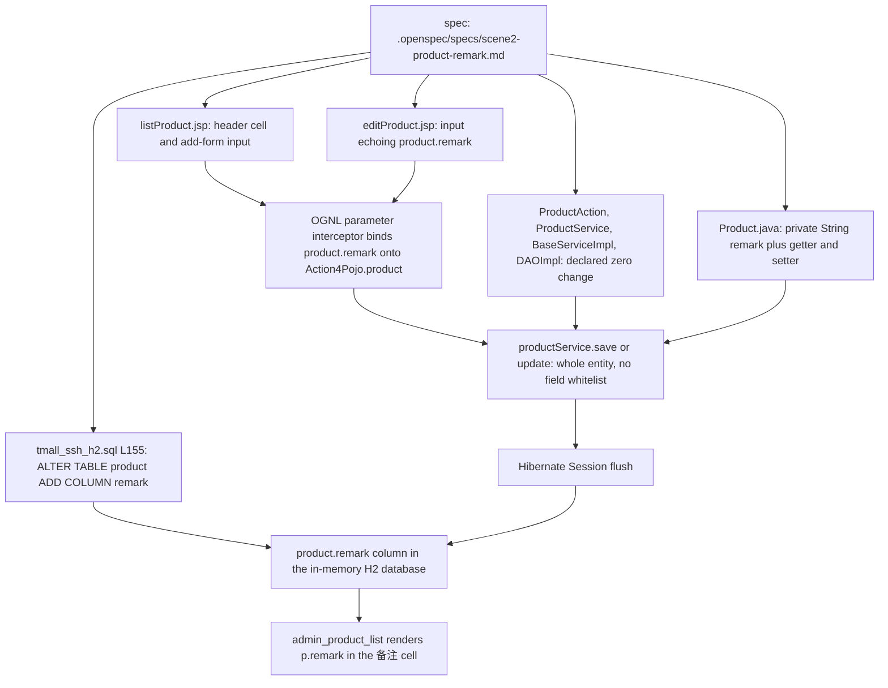
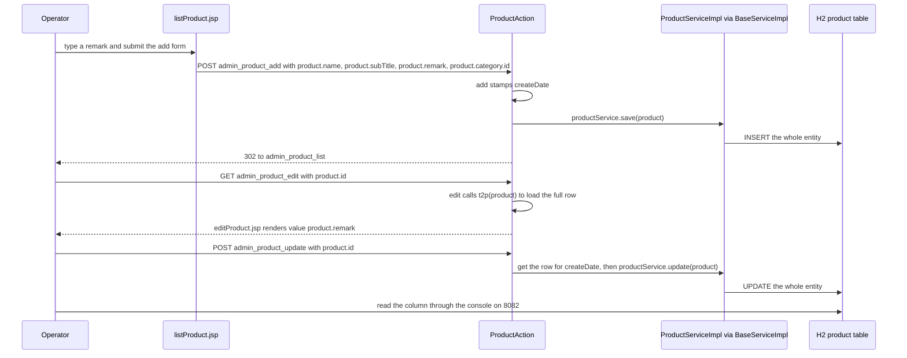

# Workflow: SDD Change Loop — the .openspec Spec, the Self-Check Report, and the Product Remark Iteration

This page owns *how a change is specified and traced here*, not the feature that was changed. It records
where the loop's documents live, how the one existing spec declares its baseline and traces each edit back
to a wiki page, what the spec and its self-check report each assert, and how the single shipped iteration
(`scene2-product-remark`) was actually carried out end to end. It writes down no rule the repository does
not demonstrate: the loop has exactly one worked example, and everything the checkout cannot settle is
collected as 【人工评审待确认】 in §9.

Where this overlaps the mechanics of the change, follow the link instead of re-deriving it:
[SDD Baseline](/openwiki/concepts/sdd-baseline.md) owns the conventions half (package/naming/placement, and
the two-file rule for a new persistent field); [Admin CRUD Screens](/openwiki/workflows/admin-crud.md) owns
the list/add/edit/update cycle the iteration rode on; [Operations: Data and Schema](/openwiki/operations/data-and-schema.md)
owns the SQL script; [Testing and Verification](/openwiki/testing/verification.md) owns what is provable
here; [Persistence Layer](/openwiki/architecture/persistence-layer.md) and
[Service Layer](/openwiki/architecture/service-layer.md) own the generic save/update path;
[Runtime Invariants](/openwiki/conventions/runtime-invariants.md) owns the string-coupled names a change
like this must not break; [Domain Model](/openwiki/concepts/domain-model.md) owns the entity map.

## 1. Where the loop's documents live

The only documents under `.openspec/` are one iteration's pair, both inside `specs/`:

| Path | Role | Header the file declares |
|---|---|---|
| `.openspec/specs/scene2-product-remark.md` | the spec — what will change and why, in Spec-First order | `迭代代号：scene2-product-remark`, `基线来源：openwiki/（只读，本次开发唯一权威规范）`, `模式：SDD Spec-First 轻量规范（先 Spec，后代码）`, `涉及代码范围：仅商品模块增量，不扩功能、不重构、不优化无关逻辑` (`.openspec/specs/scene2-product-remark.md#L1-L6`) |
| `.openspec/specs/scene2-product-remark-selfcheck.md` | the companion self-check report — the change list, compliance rows, known deviations and risks | `自查对象：本次迭代全部变更（Spec + 代码 + SQL + JSP）`, `报告日期：2026-09-27`, `状态：代码已应用，待人工运行时验收` (`.openspec/specs/scene2-product-remark-selfcheck.md#L1-L5`) |

There is no `.openspec` configuration file, template, rule document or archive folder alongside them, and
no second iteration: those two files are the directory's entire content
(`.openspec/specs/scene2-product-remark.md#L1-L6`,
`.openspec/specs/scene2-product-remark-selfcheck.md#L1-L5`). The naming the one sample demonstrates is a
shared stem plus a `-selfcheck` suffix, both under `.openspec/specs/`; whether that shape is *required* is
a reviewer's question (§9).

Nothing outside those two files defines the loop. The repository's own instruction document governs the
**wiki**, not `.openspec`: `openwiki/INSTRUCTIONS.md` states the wiki task and five rules — extract source
facts, derive baseline conventions from the code as the standard for later development, invent no business
rule or acceptance criterion and label what cannot be confirmed 【人工评审待确认】, update the documents
incrementally when code changes, and treat the output as a draft requiring human review
(`openwiki/INSTRUCTIONS.md#L4-L10`). Rule 4 there is the only repository-level statement of a documentation
duty; it points at the wiki pages, not at a spec file.

## 2. Traceability: the wiki is the spec's declared baseline

The mechanism the loop uses is one line of header plus one column per table:

- **The baseline is declared read-only.** `基线来源：openwiki/（只读，本次开发唯一权威规范）` — the wiki
  is the single authoritative specification for the change, and it is not to be edited
  (`.openspec/specs/scene2-product-remark.md#L4`). The self-check turns that into an auditable compliance
  row: *基线只读* — no baseline file was modified, deleted or regenerated during the iteration
  (`.openspec/specs/scene2-product-remark-selfcheck.md#L21-L25`).
- **Every changed component carries a `溯源依据` (traceability basis).** The six-row component table names
  the file, the kind of change and the wiki page that justifies it; the field-design table carries the same
  column (`.openspec/specs/scene2-product-remark.md#L14-L22`, `#L24-L30`). The citations in that iteration
  are: `domain-model.md` "Product — table product" field list and `§5 @Transient` for the entity field
  (`#L17`), `data-and-schema.md §1` for "the only schema source is the script, `hbm2ddl.auto=none`"
  (`#L18`), `admin-crud.md` for the OGNL form paths and for `edit()` echoing `${product.xxx}`
  (`#L19-L22`, `#L37`, `#L44`), and `Product.java`'s own no-annotation habit plus `subTitle`'s
  `varchar(255)` width for the column shape (`#L27-L30`). The self-check's strict-traceability row repeats
  the same citations (`.openspec/specs/scene2-product-remark-selfcheck.md#L25`).
- **The citations resolve, but they are human-readable only.** They name a wiki file by basename plus a
  heading or a paraphrased sentence — not a repository path and not a line anchor. The headings named do
  exist in this wiki today: the `Product — table product` section is `openwiki/concepts/domain-model.md#L214`,
  the `§5` `@Transient` section is `openwiki/concepts/domain-model.md#L453`, and `data-and-schema.md` §1 is
  `openwiki/operations/data-and-schema.md#L52`. Nothing validates the link, though, so renaming a wiki
  heading or moving a page breaks the trace silently — unlike the wiki's own evidence convention, which
  pins `repo://<path>#Lx-Ly`.
- **The two documents are Chinese while the baseline is English.** The self-check records *全程简体中文* as
  a compliance row (`.openspec/specs/scene2-product-remark-selfcheck.md#L30`), and the spec quotes English
  headings such as "Product — table product" verbatim inside Chinese prose
  (`.openspec/specs/scene2-product-remark.md#L17`).

## 3. What the spec asserts

The shipped spec has eight sections, and each one is a constraint on the change rather than a description
of the feature:

| § | Content | Anchor |
|---|---|---|
| 1 | 需求概述 — the three observable outcomes: remark fillable on add, editable and echoed on edit, shown as a list column | `.openspec/specs/scene2-product-remark.md#L8-L12` |
| 2 | 涉及修改组件 — six rows with change type: entity (new field + getter/setter), SQL script (new `ALTER TABLE`), `ProductAction` **zero change**, Service/DAO **zero change**, list JSP (header + cell + form row), edit JSP (form row + echo) | `#L14-L22` |
| 3 | 字段设计 — `remark` (`String`), no annotation at all (following `name`/`subTitle`), DB column `remark varchar(255) DEFAULT NULL`, not required | `#L24-L30` |
| 4 | 请求参数 — `product.remark` on `admin_product_add` and `admin_product_update` (POST), read back through `product.remark` on the edit screen and `p.remark` on the list | `#L32-L37` |
| 5 | 页面改动点 — four insertion points, each immediately after the 产品小标题 header, cell or form row, using `id="remark"` / `name="product.remark"` / `form-control` in the add row and `value="${product.remark}"` in the edit row, with no new validation | `#L39-L44` |
| 6 | 业务逻辑约束 — remark is display/edit data only, outside price, stock, image, property and order computation, outside paging/sorting/search, no new validation, `createDate` maintenance unchanged, and the column must be *appended* with `ALTER TABLE` rather than folded into `CREATE TABLE`, so that the existing 85 positional `INSERT` rows stay valid | `#L46-L51` |
| 7 | 项目规约适配 — only `com.caozhihu.tmall.pojo.Product` is touched, no new class or package, one name (`remark`) across field, column and form, and the whole chain is JSP → OGNL → `Action4Pojo.product` → Hibernate `Session` → the `product.remark` column with no new code | `#L53-L57` |
| 8 | 人工验收检查清单 — six unchecked boxes (column visible in the H2 console, list column rendered, add path, edit echo, empty-remark path, regression of the existing fields) | `#L59-L65` |

Two of those sections are what make this iteration a template rather than a feature note: §2/§7 turn
"zero change" into an explicit, reviewable claim about the Action, Service and DAO layers, and §6 states the
schema edit's *shape* (append, never rewrite) as a constraint derived from the script's positional
`INSERT`s.

## 4. What the self-check report asserts

The companion report is the loop's second half: it is the record of what was actually applied, and it
separates compliance from deviation on purpose.

- **Change list** — seven rows: the spec document itself, `Product.java` (field plus accessors),
  `src/sql/tmall_ssh_h2.sql` (the appended statement, placed after the last product `INSERT` and before
  `CREATE TABLE productimage`), `web/admin/listProduct.jsp` (header, cell, add-form row),
  `web/admin/editProduct.jsp` (row with `${product.remark}` echo), then `ProductAction.java` and the
  Service/DAO layer marked **zero change**, the latter two labelled "符合 Spec"
  (`.openspec/specs/scene2-product-remark-selfcheck.md#L7-L17`).
- **Compliance** — eight rows: baseline read-only, Spec-First, strict traceability, minimal code change
  (four files, no new class/package/dependency/validation), database adaptation (the `ALTER` sits after the
  positional `INSERT`s so column order stays compatible), engineering conventions, no over-development, and
  "全程简体中文"
  (`.openspec/specs/scene2-product-remark-selfcheck.md#L19-L30`).
- **Deviations and risks** — three potential violations with mitigations, including that the list page's JS
  validation does not cover `remark`, and four risk notes, including the NULL value of every seeded row and
  the fact that the in-memory database resets on restart
  (`.openspec/specs/scene2-product-remark-selfcheck.md#L32-L45`).

One assertion in that report does not hold up against the shipped code and is worth reading as a review
item, not as fact: it justifies leaving `remark` out of the JavaScript validation by saying the
non-empty check is borne by `name` alone, i.e. that it is consistent with the policy applied to `subTitle`
(`.openspec/specs/scene2-product-remark-selfcheck.md#L36`) — but both shipped submit handlers *do* call
`checkEmpty("subTitle", …)` (`web/admin/listProduct.jsp#L15-L31`,
`web/admin/editProduct.jsp#L17-L33`). The broader validation gap is analysed in
[Admin CRUD Screens](/openwiki/workflows/admin-crud.md); what matters for this page is that a self-check
row can state a parity that the code does not show.

## 5. The worked iteration, end to end

*The iteration's declared chain: four files changed, two layers explicitly untouched, and one new column reached through the OGNL binding that already existed.*

### 5.1 Entity and schema: the two files that carry persistence

- `Product` gained `private String remark;` between `subTitle` and `originalPrice`, and an unannotated
  `getRemark()` / `setRemark()` pair between `setSubTitle` and `getOriginalPrice`
  (`src/com/caozhihu/tmall/pojo/Product.java#L19-L25`, `#L110-L116`). No `@Column`, no `@Transient`: the
  field joins the plain-scalar block above the `@Transient` group, which is what makes it persisted under
  the default field-name-equals-column-name mapping.
- The column exists only as one appended statement,
  `ALTER TABLE product ADD COLUMN remark varchar(255) DEFAULT NULL;` at `src/sql/tmall_ssh_h2.sql#L155`
  — after the 85 positional product `INSERT`s (`#L70-L154`) and before `CREATE TABLE productimage`
  (`#L156-L163`). The `CREATE TABLE product` block above it still declares eight columns and never mentions
  `remark` (`#L58-L69`).

### 5.2 The forms: two inputs, two echoes, no new code

- `web/admin/listProduct.jsp` renders the new column between 产品小标题 and 原价格 — `<th>备注</th>` in the
  header row (`#L46-L61`) and `<td>${p.remark}</td>` in the cell row (`#L63-L76`) — and its add form has the
  remark input directly after the 产品小标题 row, as `id="remark" name="product.remark"` with the
  `form-control` class (`#L115-L119`), next to the hidden `product.category.id` that scopes the redirect
  (`#L137`).
- `web/admin/editProduct.jsp` has the matching row with `value="${product.remark}"` (`#L59-L63`) plus the
  two hidden inputs the update path needs, `product.id` and `product.category.id` (`#L82-L83`).
- Neither form adds a validation rule for the field: both submit handlers check `name`, `subTitle`,
  `originalPrice`, `promotePrice` and `stock` only (`web/admin/listProduct.jsp#L15-L31`,
  `web/admin/editProduct.jsp#L17-L33`).

### 5.3 Why `ProductAction` needed zero edits

The write path is entity-wide, so a new scalar is persisted by the code that already existed:

1. The browser posts `product.remark` (add: `web/admin/listProduct.jsp#L117`; update:
   `web/admin/editProduct.jsp#L61`). There is no per-action parameter list — `defaultStack`'s parameter
   interceptor binds the name onto the value stack, whose top object is the action
   ([Runtime Invariants](/openwiki/conventions/runtime-invariants.md) §4.1). `Action4Pojo` declares
   `protected Product product;` (`src/com/caozhihu/tmall/action/Action4Pojo.java#L9-L17`), so
   `product.remark` lands on the entity's own setter.
2. `ProductAction.add()` does exactly one thing before saving — it stamps `product.setCreateDate(new Date())`
   and calls `productService.save(product)`, returning the `listProductPage` result
   (`src/com/caozhihu/tmall/action/ProductAction.java#L27-L32`). `ProductAction.update()` reloads the row
   through `productService.get(product.getId())` only to copy the unchanged `createDate` back onto the bound
   object, then calls `productService.update(product)` (`#L47-L53`). Neither method mentions a field list.
3. Those calls resolve to the inherited generic implementations: `BaseServiceImpl.save` wraps
   `HibernateTemplate.save` (`src/com/caozhihu/tmall/service/impl/BaseServiceImpl.java#L112-L116`), and
   `update` is the mirrored delegation (`src/com/caozhihu/tmall/service/impl/ServiceDelegateDAO.java#L176-L189`).
   No layer holds a list of permitted properties, so the new field travels with the entity.
4. The read side is the same story in reverse: `admin_product_edit` binds only `product.id`, `edit()` calls
   `t2p(product)` (`src/com/caozhihu/tmall/action/ProductAction.java#L41-L45`), which reflectively loads the
   full row and sets it back on the action (`src/com/caozhihu/tmall/action/Action4Service.java#L57-L71`), and
   the JSP echoes the stored value. The result names `listProduct` / `editProduct` / `listProductPage` come
   from the shared `@Results` block (`src/com/caozhihu/tmall/action/Action4Result.java#L27-L29`).

*Consequence:* the four edited files in §5.1–5.2 plus the two zero-change rows are the whole change. A grep
for `remark` under `src/` and `web/` finds the entity, the script and the two admin JSPs and nothing else —
no service, action, criteria, sort or search code mentions it.

## 6. The schema rule this iteration exercised

The rule the iteration had to obey comes from how this checkout owns its database, and it is the part of the
loop most likely to be needed again:

- `hibernate.hbm2ddl.auto=none` (`src/applicationContext.xml#L56-L65`) and a single `dbInit`
  `DataSourceInitializer` bean running `classpath:sql/tmall_ssh_h2.sql` at every context refresh
  (`src/applicationContext.xml#L29-L44`) mean the script — not the entity annotations — decides what tables
  and columns exist. There is no validation of the mapping at startup, so a field whose column is missing
  fails on the first query that touches it, not at boot.
- The script's `product` rows are positional (`INSERT INTO product VALUES (…)`), so the `CREATE TABLE`
  column order is a load contract. A later column therefore arrives as an appended
  `ALTER TABLE … ADD COLUMN` **after** those rows — exactly what `#L155` does — and not by editing the
  `CREATE TABLE` above them (`.openspec/specs/scene2-product-remark.md#L51`,
  `.openspec/specs/scene2-product-remark-selfcheck.md#L27`). The pattern, and its place in the entity
  conventions, is stated normatively on [SDD Baseline](/openwiki/concepts/sdd-baseline.md) §5.
- One document-level inconsistency remains: the script's own header comment lists four *syntactic*
  MySQL-to-H2 adaptations and states that the business table structure and data were not changed
  (`src/sql/tmall_ssh_h2.sql#L1-L9`), while the file now appends a column and so changes the structure.
  【人工评审待确认】 whether the header is meant to record such appends.

## 7. Acceptance: what the documents expect a human to check

The iteration ships no automated acceptance. What it ships is a checklist, and the checklist is the
contract reviewed here:

| Spec checklist item | Where the expected evidence comes from |
|---|---|
| `product` table has a `remark` column after startup | the H2 console on port 8082, JDBC URL `jdbc:h2:mem:tmall_ssh;MODE=MySQL;DB_CLOSE_DELAY=-1`, user `sa`, empty password (`src/StartJetty.java#L45-L50`, `#L108-L118`, `src/applicationContext.xml#L21-L27`) |
| list page shows the 备注 header and each product's value (old rows NULL/empty) | `web/admin/listProduct.jsp#L46-L76` |
| add a product with a remark → visible in the list | add panel `web/admin/listProduct.jsp#L100-L144` posting to `admin_product_add` |
| edit echo correct → change saved → list updated | `web/admin/editProduct.jsp#L46-L86` posting to `admin_product_update` |
| empty remark saved without error | no required-field rule exists for the field in either form |
| existing fields (name / subTitle / price / stock / image / property) regress cleanly | the shared admin screens |

(Checklist items and anchors: `.openspec/specs/scene2-product-remark.md#L59-L65`; the report's own guidance
to walk them is `.openspec/specs/scene2-product-remark-selfcheck.md#L47-L53`.)

*The manual round trip the checklist describes: add, revisit the list, edit, and confirm the column through the console.*

Two things about that acceptance must be stated plainly, because they are easy to over-read:

- **These are the documents' acceptance expectations, not a machine-checkable suite.** Every box in the
  spec's checklist is still unchecked, and the report's status line still reads "code applied, awaiting
  manual runtime acceptance" (`.openspec/specs/scene2-product-remark.md#L59-L65`,
  `.openspec/specs/scene2-product-remark-selfcheck.md#L5`). Nothing in the tree asserts anything about
  `remark`: the only test class loads the Spring context and exercises `Category` through `DAOImpl`
  (`src/com/caozhihu/tmall/test/TestTmall.java#L15-L40`). The manual path, and why it is the only option,
  is [Testing and Verification](/openwiki/testing/verification.md) §4.
- **The acceptance record itself is contested.** The commit that carries the iteration states that manual
  verification of the add, edit and list display passed (`repo://.git/COMMIT_EDITMSG#L6-L7`), while the
  self-check's own status line still reads "code applied, awaiting manual runtime acceptance" and its
  checklist boxes are unchecked (`.openspec/specs/scene2-product-remark-selfcheck.md#L5`). Both records
  belong to the same change — the commit message also lists the spec, the self-check and the four modified
  files together (`repo://.git/COMMIT_EDITMSG#L1-L5`). 【人工评审待确认】 which record is authoritative, and
  whether the round trip was actually run.

## 8. Failure and lifetime caveats

- **Every seeded product has a `NULL` remark.** The `ALTER TABLE` executes after the 85 positional product
  `INSERT`s in the same script run, so those rows receive the column default and the list's 备注 cell is
  blank for the whole demo until a row is written
  (`src/sql/tmall_ssh_h2.sql#L70-L154`, `#L155`, `.openspec/specs/scene2-product-remark-selfcheck.md#L42`).
- **Remark data does not survive a restart.** The datasource is `jdbc:h2:mem:tmall_ssh` with
  `DB_CLOSE_DELAY=-1` (`src/applicationContext.xml#L21-L27`) and the script is re-executed from `dbInit` at
  every context refresh (`src/applicationContext.xml#L29-L44`), so anything typed into the forms is gone on
  the next start; the report records this as a risk outside the iteration's scope
  (`.openspec/specs/scene2-product-remark-selfcheck.md#L45`).
- **A missing column is a query-time failure, never a boot failure.** Because Hibernate neither creates nor
  validates the schema, deleting the appended statement would surface as a failing `SELECT` on the admin
  product list, not as a startup error (`src/applicationContext.xml#L56-L65`).
- **A form field that drifts is destructive on the update screen.** If the name `product.remark` were
  written differently in the edit form, the bound entity would arrive with a null remark and be merged over
  the stored row — the same failure mode the invariants page describes for every bindable name
  ([Runtime Invariants](/openwiki/conventions/runtime-invariants.md) §4.1).

## 9. Review items 【人工评审待确认】

- **Is a spec mandatory?** The checkout contains exactly one `.openspec` iteration and no rule document
  requiring one; `openwiki/INSTRUCTIONS.md` mandates only that the *wiki* is updated when code changes
  (`openwiki/INSTRUCTIONS.md#L4-L10`). Whether every change must be opened with a spec plus a self-check
  report is not settled by the repository.
- **Is `.openspec/specs/` the only permitted location, and is the `-selfcheck` name required?** Both are
  demonstrated once and prescribed nowhere.
- **Who signs off, and what does the status field mean?** The report carries a status line and an unchecked
  manual checklist with no recorded transition, no reviewer identity and no acceptance evidence.
- **Was the Spec-First ordering real?** The report asserts it as a compliance row
  (`.openspec/specs/scene2-product-remark-selfcheck.md#L24`), but the commit that carries the code also
  carries the two documents, so the checkout evidences no ordering
  (`repo://.git/COMMIT_EDITMSG#L1-L8`).
- **Should traceability use wiki paths and anchors?** The spec cites basenames plus headings, which nothing
  validates; the wiki's own convention is `repo://<path>#Lx-Ly`.
- **Is Simplified Chinese required for these documents?** The self-check records it as a compliance row
  (`.openspec/specs/scene2-product-remark-selfcheck.md#L30`) while the baseline it cites is English.
- **Should the SQL script's header comment list structural appends?** It still claims the business table
  structure and data are unchanged (`src/sql/tmall_ssh_h2.sql#L1-L9`) while the file adds a column at `#L155`.

## Where to go next

- [SDD Baseline](/openwiki/concepts/sdd-baseline.md) — the normative conventions page, including the
  two-file rule a new persistent field follows.
- [Admin CRUD Screens](/openwiki/workflows/admin-crud.md) — the list/add/edit/update cycle this iteration
  reused without editing.
- [Operations: Data and Schema](/openwiki/operations/data-and-schema.md) — the script, the seeded rows and
  the appended column.
- [Testing and Verification](/openwiki/testing/verification.md) — why the acceptance above is manual.
- [Runtime Invariants](/openwiki/conventions/runtime-invariants.md) — the names that must change together.
- [Quickstart](/openwiki/quickstart.md) — the task-routing map that points at this page for "how a change is
  specified and traced".
