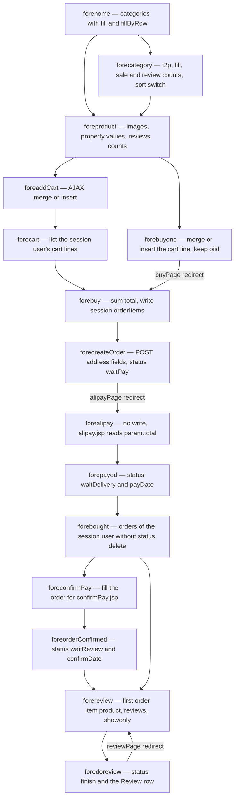
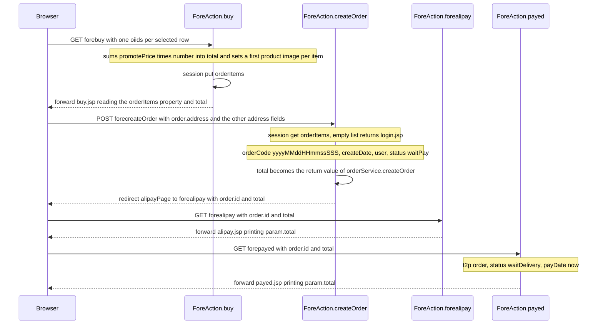

# Workflow: Storefront Shopping and Review

The shopper's path through this application is **not one flow object**. It is a run of
independent HTTP requests, each mapped to one `@Action` method on
`src/com/caozhihu/tmall/action/ForeAction.java`, with nothing held on the server between them
except four session attributes. Every step therefore re-reads its own data from the database, and
every step that hands work to the next one does so either by putting something in the session or by
returning a *redirect* result whose location is interpolated with OGNL.

This page follows that journey end to end and documents the plumbing that makes it work: the login
gate in `AuthInterceptor`, the four session keys, the four data-carrying redirect results, the
`fill()` calls that decorate entities for rendering, the `HtmlUtils.htmlEscape` calls on the account
and review writes, and the gaps the code does not close. The order-status semantics themselves are on
[Workflow: Order Lifecycle](/openwiki/workflows/order-lifecycle.md); URL-by-URL lookups are on
[Reference: Action URL Catalog](/openwiki/reference/action-catalog.md).

## The path in one picture



*The storefront chain: the browsing half is public and anonymous, the buying half needs a session `user`, and every arrow that crosses an action boundary is either a link the JSP emits or one of the four OGNL redirect results.*

Read the diagram with these properties in mind:

- **Two ways into the cart.** `forebuyone` ("立即购买") and `foreaddCart` ("加入购物车") run
  *the same* merge-or-insert logic and differ only in what they return — the first hands off to
  checkout, the second answers an AJAX caller and returns to the product page.
- **The chain is re-enterable at every step.** `forebought` lists the buyer's own orders and is
  reachable at any time from the top bar, so payment, receipt and review are separate re-entries into
  a chain that browsing does not carry in memory.
- **Nothing is transactional across steps.** Each action commits its own write, and only
  `forecreateOrder` and `foredoreview` touch more than one entity (see
  [Workflow: Order Lifecycle](/openwiki/workflows/order-lifecycle.md)).

## The login gate that wraps the chain

`AuthInterceptor` is installed first in the `auth-dafault` stack (`src/struts.xml#L18-L23`) and is the
only authentication check in the application
([Request Pipeline](/openwiki/architecture/request-pipeline.md) has the full stack):

```java
String[] noNeedAuthPage = new String[] {
        "home", "checkLogin", "register", "loginAjax", "login", "product", "category", "search"
};
...
if (uri.startsWith("/fore")) {
    String method = StringUtils.substringAfterLast(uri, "/fore");
    if (!Arrays.asList(noNeedAuthPage).contains(method)) {
        User user = (User) actionContext.getSession().get("user");
        if (null == user) {
            response.sendRedirect("login.jsp");
            return null;
        }
    }
}
```

Observable consequences that shape the whole workflow:

- The gate applies **only** to URIs starting with `/fore`, and the name it tests is the URI suffix
  after the last `/fore` — `/foreproduct` yields `product`, `/forecheckLogin` yields `checkLogin`.
  The eight whitelisted names are exactly the anonymous half of the chain: `home`, `category`,
  `product`, `search`, plus the account and AJAX-login endpoints.
- The other sixteen storefront endpoints — everything from `forelogout` through `foredoreview` —
  require `session.get("user")` to be non-null.
- Rejection is `response.sendRedirect("login.jsp")` **plus `return null`**. Returning `null` stops
  the invocation, so `CategoryNamesBelowSearchInterceptor`,
  `CartTotalItemNumberInterceptor`, parameter binding and the action body never run: the request is
  answered with a `302` to the login page and nothing else.
- **AJAX callers cannot tell that apart from a failure.** `forecheckLogin`, `foreloginAjax`,
  `foreaddCart`, `forechangeOrderItem`, `foredeleteOrderItem` and `foredeleteOrder` are compared by
  the page scripts against the literal string `success` (`web/success.jsp` contains exactly
  `success`). A rejected protected call returns the *login page HTML*, so the comparison fails and
  the scripts fall back to `location.href = "login.jsp"` (`web/include/cart/cartPage.jsp#L27-L32`,
  `web/include/cart/boughtPage.jsp#L43-L48`).
- The product page does not rely on that fallback for its two shopping buttons: it calls
  `forecheckLogin` first and, on anything but `success`, opens the login modal instead of continuing
  (`web/include/product/imgAndInfo.jsp#L43-L92`).

### Logging in

| Endpoint | Binds | Writes | Returns |
|---|---|---|---|
| `forelogin` (`ForeAction#login`) | `user.name`, `user.password` | session `user` | `login.jsp` forward on bad credentials with `msg` set, else `homePage` redirect |
| `foreloginAjax` (`ForeAction#loginAjax`) | `user.name`, `user.password` | session `user` | `success.jsp` or `fail.jsp` |
| `forelogout` (`ForeAction#logout`) | — | removes session `user` | `homePage` redirect |
| `foreregister` (`ForeAction#register`) | `user.name`, `user.password` | a new `user` row | `register.jsp` forward when the name exists, else `registerSuccessPage` redirect |

- The storefront login form posts to `forelogin` with `user.name` / `user.password`
  (`web/include/loginPage.jsp#L38-L60`); the modal on the product page calls `foreloginAjax` with the
  same keys built from jQuery (`web/include/product/imgAndInfo.jsp#L94-L120`). Both put the fetched
  `User` into the session under `user` — that single key is what every later step and every JSP
  (`${empty user}`, `${user.name}` in `web/include/top.jsp`) reads.
- `login.jsp`, `register.jsp` and `registerSuccess.jsp` are plain JSPs, not actions, so `/login.jsp`
  is served directly with no interceptors when the gate redirects there. The `login.jsp` *result
  name* forwards internally to the same file, so both paths render the same page
  ([Action URL Catalog](/openwiki/reference/action-catalog.md)).
- The free-registration form's submit control is `<a href="registerSuccess.jsp"><button>提 交</button></a>`
  inside the `foreregister` form (`web/include/registerPage.jsp#L39-L81`), so a browser click is an
  anchor navigation to the success page rather than a form POST. Which of the two wins, and whether
  registration is reachable from the UI at all, is 【人工评审待确认】.

## The state carriers

Four session attributes and four redirect results are the entire inter-step protocol. All four keys
live in the Struts session map backed by `HttpSession`, which is why ordinary JSP EL can read them
with no framework help.

| Session key | Written by | Read by | Effect / failure if absent or renamed |
|---|---|---|---|
| `user` | `forelogin`, `foreloginAjax`; removed by `forelogout` | `AuthInterceptor`; every cart/order action; `web/include/top.jsp` | Every protected `/fore*` request bounces to `login.jsp`; the cart/order actions read a `null` user |
| `orderItems` | `ForeAction.buy` only (`ForeAction.java#L185`) | `ForeAction.createOrder` only (`ForeAction.java#L245`) | Checkout breaks: `createOrder` dereferences the list, so a missing key throws instead of failing gracefully |
| `cs` | `CategoryNamesBelowSearchInterceptor` on every `/fore` request | `web/include/search.jsp#L20`, `web/include/simpleSearch.jsp#L14` | The category strip under the search box renders empty |
| `cartTotalItemNumber` | `CartTotalItemNumberInterceptor` on every `/fore` request (`0` when logged out) | `web/include/top.jsp#L33` | The cart counter in the top bar prints empty |

Two of these are refreshed by the interceptors on *every* storefront request, before parameter
binding:

- `CategoryNamesBelowSearchInterceptor` runs `categoryService.list()` and stores the full category
  list under `cs` whenever the context-path-stripped URI starts with `/fore`
  (`src/com/caozhihu/tmall/interceptor/CategoryNamesBelowSearchInterceptor.java#L22-L35`).
- `CartTotalItemNumberInterceptor` sums `number` over
  `orderItemService.list("user", user, "order", null)` for the session user and stores the result
  under `cartTotalItemNumber`, or stores `0` when there is no session user
  (`src/com/caozhihu/tmall/interceptor/CartTotalItemNumberInterceptor.java#L23-L46`). Because it runs
  *after* `AuthInterceptor`, a request the gate rejects never pays that query — and never refreshes
  the counter either.

The naming trap worth remembering: `orderItems` is **both** a session key and an `Action4Pojo` field.
The cart page and the buy page render the *action property* from the value stack (`${orderItems}`),
while `createOrder` reads the *session key*. Renaming one breaks a different thing than renaming the
other ([Runtime Invariants](/openwiki/conventions/runtime-invariants.md)).

## Step by step

### 1. Entering: `/`, `forehome`

`web/index.jsp` issues `response.sendRedirect("/forehome")` and `StartJetty` rewrites the exact path
`/` to `/forehome`, so the storefront has one entry point. `ForeAction.home` loads the catalogue for
the home layout and forwards to `home.jsp`:

```java
categories = categoryService.list();
productService.fill(categories);        // per category: products + first product image
productService.fillByRow(categories);   // per category: productsByRow, 8 per row
return "home.jsp";
```

`web/include/home/categoryAndcarousel.jsp` renders `${categories}` as the left category menu and the
first four names again in the toolbar, `productsAsideCategorys.jsp` renders `${c.productsByRow}`,
and `homepageCategoryProducts.jsp` renders up to five products of each category. Both category links
(`forecategory?category.id=${c.id}`) and product links (`foreproduct?product.id=${p.id}`) are relative
and unqualified — the browser resolves them against the current action URL.

### 2. Browsing a category: `forecategory`

`ForeAction.category` (`ForeAction.java#L102-L135`) is the storefront's only list screen with
user-chosen ordering:

1. `t2p(category)` replaces the id-only bound object with the persistent row
   ([Action Layer Conventions](/openwiki/architecture/action-layer.md)).
2. `productService.fill(category)` sets `category.products` and a `firstProductImage` on every
   product.
3. `productService.setSaleAndReviewNumber(category.getProducts())` computes the two `@Transient`
   counters per product (sales are summed from `orderItem.number`, reviews counted in the `review`
   table).
4. If `sort` is non-null it reorders **the same in-memory list** through a five-case switch:
   `review` (review count desc), `date` (creation date asc), `saleCount` (sales desc), `price`
   (promote price asc) and `all` (review count × sales desc).

The five values exist only in that switch and in `web/include/category/sortBar.jsp`, which emits
`?category.id=${category.id}&sort=<value>` — relative links that would break if the endpoint name
changed. `web/include/category/productsByCategory.jsp` then renders `${category.products}` with
price, `saleCount`, `reviewCount` and a link to `foreproduct?product.id=`. Page-product search itself
(`foresearch`, a fixed 20-row keyword query) is documented on
[Workflow: Pagination and Search](/openwiki/workflows/pagination-and-search.md).

### 3. Inspecting a product: `foreproduct`

`ForeAction.product` (`ForeAction.java#L61-L78`) is the decoration-heavy step, because
`productPage.jsp` is four fragments that each need a different view of the same row:

| Decorated field | Produced by | Rendered by |
|---|---|---|
| `product.firstProductImage` | `productImageService.setFirstProductImage(product)` | big image in `imgAndInfo.jsp`, `img/productSingle/<id>.jpg` |
| `product.productSingleImages` | `productImageService.list("product", product, "type", type_single)` | thumbnail strip; each thumbnail also drives `img/productSingle_small/<id>.jpg` |
| `product.productDetailImages` | same call with `type_detail` | `productDetail.jsp` |
| `propertyValues` | `propertyValueService.listByParent(product)` | `productDetail.jsp` |
| `reviews` | `reviewService.listByParent(product)` | `productReview.jsp`, which prints `${r.user.anonymousName}` (the `User` getter masks all but the first and last characters of the name) |
| `product.saleCount`, `product.reviewCount` | `productService.setSaleAndReviewNumber(product)` | price block and cumulative-review counter |

The buying controls live in `web/include/product/imgAndInfo.jsp`:

- 立即购买 is a plain link `forebuyone?product.id=${product.id}` to which jQuery appends
  `&num=<value>` after a successful `forecheckLogin` (`#L77-L92`, `#L233-L236`).
- 加入购物车 is an AJAX `$.get("foreaddCart", {"product.id": pid, "num": num})` after the same check
  (`#L43-L76`). The two endpoints bind the exact shapes the pipeline already documents:
  `product.id` and `num`.
- The quantity box is clamped to `${product.stock}` **in JavaScript only** (`#L14-L41`). No
  server-side stock check exists anywhere in `ForeAction`: `forebuyone`, `foreaddCart` and
  `forechangeOrderItem` write `num` as received.

### 4. Two ways into the cart

`forebuyone` and `foreaddCart` contain the same loop over the session user's cart lines
(`orderItemService.list("user", user, "order", null)`, i.e. items whose `order` is `null`):

- an existing line for the same `product.id` gets `number = number + num` and an `update`;
- otherwise a new `OrderItem` is created with `user`, `num` and the product and is `save`d.

They differ only in their exit. `forebuyone` records the affected row id in the action property
`oiid` and returns the `buyPage` redirect `forebuy?oiids=${oiid}` — **one singular property written,
one array parameter read**, which is how the request that arrives at `forebuy` carries a one-element
`int[]`. `foreaddCart` returns `success.jsp` and never leaves the product page.

### 5. The cart: `forecart`, `forechangeOrderItem`, `foredeleteOrderItem`

`ForeAction.cart` lists the same cart lines and sets a first product image on each item's product,
then forwards to `cart.jsp` → `web/include/cart/cartPage.jsp`. That page owns all remaining cart
behaviour client-side, and each gesture is an AJAX call:

| Gesture | Call | Notes |
|---|---|---|
| Quantity change (input, `+`, `-`) | `$.post("forechangeOrderItem", {"product.id": pid, "num": num})` | sends the **absolute** number, not a delta; the action sets it on the matching line |
| Delete a line | `$.post("foredeleteOrderItem", {"orderItem.id": oiid})` after the confirm modal | the action deletes by the bound `OrderItem` id, with no ownership or "still in cart" check |
| 结算 | `location.href = "forebuy?" + params` | the page builds `&oiids=<oiid>` once per selected row itself; it is disabled until something is selected |

Sum and count of the selected rows are computed in JavaScript (`calcCartSumPriceAndNumber`), not by
the action, so the totals shown on the cart page are a client-side calculation over prices the HTML
already contains.

### 6. Checkout: `forebuy` → `forecreateOrder`

`forebuy?oiids=…` is where the cart becomes a candidate order:

```java
orderItems = new ArrayList<>();
for (int oiid : oiids) {
    OrderItem oi = (OrderItem) orderItemService.get(oiid);
    total += oi.getProduct().getPromotePrice() * oi.getNumber();
    orderItems.add(oi);
    productImageService.setFirstProductImage(oi.getProduct());
}
ActionContext.getContext().getSession().put("orderItems", orderItems);
return "buy.jsp";
```

- `total` here is a **display** total accumulated from the current `promotePrice`; the amount that
  ends up on the order is recomputed later by the service (see below).
- The list is stored in the session because the browser only sends address fields next. This is the
  only writer of the session `orderItems` key.
- There is no null guard on `oiids`: a direct `GET /forebuy` with no parameter iterates `null` and
  throws rather than rendering an empty page.

`web/include/cart/buyPage.jsp` is a POST form to `forecreateOrder` carrying `order.address`,
`order.post`, `order.receiver`, `order.mobile` and `order.userMessage` — dotted names bound onto the
`Order` entity on the action. `ForeAction.createOrder` then:

1. reads the session `orderItems` list and returns the `login.jsp` **forward** when it is empty
   (a stale-cart state shows the login page even to a logged-in user);
2. generates `orderCode` with `new SimpleDateFormat("yyyyMMddHHmmssSSS")`, stamps `createDate` and
   the session `user`, and sets `status = OrderService.waitPay` (`"waitPay"`);
3. overwrites the action's `total` with the return value of `orderService.createOrder(order, ois)`,
   which saves the order and points every item at it inside one `REQUIRED` transaction;
4. returns `alipayPage` → `forealipay?order.id=${order.id}&total=${total}`.

Renaming the redirect's parameter names is a silent cross-action break: `order.id` and `total` are
the receiver's OGNL property names ([Runtime Invariants](/openwiki/conventions/runtime-invariants.md)).

### 7. Payment: `forealipay` → `forepayed`

There is no payment gateway. The handoff is a sequence of pages that pass the amount in the URL:



*The checkout and payment handoff: the session carries the item list across the POST, and the URL carries the amount across the three page transitions after it.*

- `forealipay` writes nothing at all — it only returns the view name. The amount on
  `web/include/cart/alipayPage.jsp` comes from the **raw request parameter** (`${param.total}`), and
  the 确认支付 link re-sends it onward as `forepayed?order.id=${order.id}&total=${param.total}`.
- `forepayed` is the actual transition: `t2p(order)`, `status = waitDelivery`, `payDate = now`,
  `orderService.update(order)`. `payed.jsp` again renders `${param.total}` — again the URL value, not
  the order.
- Consequence: the amount the user sees on the payment and receipt pages is whatever the URL carries.
  Nothing re-derives it from the order, and no signature or token protects the link.

### 8. My orders and receipt: `forebought` → `foreconfirmPay` → `foreorderConfirmed`

`forebought` lists the session user's orders with
`orderService.listByUserWithoutDelete(user)` (equality on `user`, inequality on the `delete` status)
and decorates each with `orderItemService.fill(orders)`, which loads the items, sets a first product
image on each item's product, and computes the transient `total` and `totalNumber`.

`web/include/cart/boughtPage.jsp` renders one table per order tagged `orderStatus="${o.status}"`, a
client-side status filter across the top, and exactly the action button that matches the current
status:

| Order status | Button rendered | Call |
|---|---|---|
| `waitPay` | 付款 | `forealipay?order.id=${o.id}&total=${o.total}` |
| `waitDelivery` | 待发货 + 催卖家发货 | the nudge button calls `admin_order_delivery?order.id=${o.id}` |
| `waitConfirm` | 确认收货 | `foreconfirmPay?order.id=${o.id}` |
| `waitReview` | 评价 | `forereview?order.id=${o.id}` |
| any | trash icon | AJAX `foredeleteOrder` with `{"order.id": id}` |

Two observations about that table, both structural rather than incidental:

- **The status is only a presentation guard.** The buttons are chosen by `${o.status}` `c:if`
  blocks; no action verifies the current status before overwriting it
  ([Workflow: Order Lifecycle](/openwiki/workflows/order-lifecycle.md)).
- **A buyer page calls an admin endpoint.** 催卖家发货 issues a GET to `admin_order_delivery`
  (`boughtPage.jsp#L169-L176`), which is not covered by the `/fore` auth gate at all, so the buyer's
  browser performs the shipment transition itself.

Receipt is then a two-step confirmation: `foreconfirmPay` (`t2p(order)` plus
`orderItemService.fill(order)`) forwards to `confirmPayPage.jsp`, which shows the three timestamps,
the item table and the transient totals, and links to
`foreorderConfirmed?order.id=${order.id}`. `foreorderConfirmed` sets `status = waitReview` and
`confirmDate = now`, then forwards to `orderConfirmedPage.jsp`.

### 9. Review: `forereview` → `foredoreview`

The review leg reopens the product page context for the purchased item:

```java
t2p(order);
orderItemService.fill(order);
product = order.getOrderItems().get(0).getProduct();   // only the first item is ever reviewed
reviews = reviewService.listByParent(product);
productService.setSaleAndReviewNumber(product);
return "review.jsp";
```

`web/review.jsp` → `web/include/cart/reviewPage.jsp` branches on the **request parameter**
`param.showonly`, not on any action property:

- `param.showonly == true` renders the existing review list of the product (the path taken after a
  submission, see below);
- otherwise it renders the `foredoreview` form, which posts `review.content`, `order.id` and
  `product.id` (the product id rides in a hidden field).

`foredoreview` closes the order and writes the review in one transaction:

1. `t2p(order)` and `t2p(product)`;
2. `order.setStatus(OrderService.finish)`, then the content is escaped, and the review is stamped with
   `product`, `createDate = now` and the session `user`;
3. `reviewService.saveReviewAndUpdateOrderStatus(review, order)` — the only composite method that
   writes an order status and a second entity together
   (`src/com/caozhihu/tmall/service/impl/ReviewServiceImpl.java#L18-L23`);
4. `showonly = true` and the `reviewPage` redirect to
   `forereview?order.id=${order.id}&showonly=${showonly}`.

So the POST never renders anything itself: it answers with a `302` back into `forereview`, which now
reads `showonly=true` from the URL and renders the list including the review just written. `forereview`
is therefore both an endpoint in the chain and the redirect target that terminates it.

## The redirect results that carry data

Four of the ten `type="redirect"` results declared on `Action4Result` belong to this workflow, and all
four interpolate the acting action instance with OGNL
(`src/com/caozhihu/tmall/action/Action4Result.java#L62-L66`):

| Result | Location | Interpolated from | Receiver binding | What breaks if renamed |
|---|---|---|---|---|
| `homePage` | `forehome` | — | — | login/logout land on a dead URL |
| `buyPage` | `forebuy?oiids=${oiid}` | `oiid` (set by `buyone`) | `oiids` (`int[]` on `Action4Parameter`) | the one-element array arrives empty; `buy` iterates `null` |
| `alipayPage` | `forealipay?order.id=${order.id}&total=${total}` | `order.id`, `total` | `order.id` on the `Order` entity, `total` on `Action4Parameter` | the payment page shows a wrong amount or `0.00` |
| `reviewPage` | `forereview?order.id=${order.id}&showonly=${showonly}` | `order.id`, `showonly` | `order.id`, `showonly` | the review page renders the input form again instead of the list |

Three rules follow from this table and are worth checking before editing any step:

- The redirect location is evaluated **before** the redirect is built, so the dereferenced property
  must already be populated. `alipayPage` reads `${order.id}` after `createOrder` has saved the order;
  `reviewPage` reads `${order.id}` after `t2p(order)` installed the persistent row. Both would raise
  the `TransientObjectException`/NPE class of failure the `admin_productImage_delete` comment records
  if the ordering changed.
- Storefront redirect locations are **bare action names**, not context-rooted paths, so they resolve
  against the current request URL. All storefront endpoints live in namespace `/`, which is what makes
  that safe ([Runtime Invariants](/openwiki/conventions/runtime-invariants.md)).
- `total` and `showonly` are carried forward by the *URL*, which is why `alipay.jsp`, `payed.jsp` and
  `reviewPage.jsp` read `param.*` rather than the value stack.

## `fill()` and the decoration contract

Nothing in the persistence model carries the collections the storefront pages display: every entity
relationship is `@ManyToOne` and the "one" side is materialised per request by a `fill`-style service
call ([Domain Model](/openwiki/concepts/domain-model.md)). The ones this workflow depends on:

| Call | Sets | Used by |
|---|---|---|
| `productService.fill(List<Category>)` → `fill(Category)` | `category.products` + each product's `firstProductImage` | `forehome` |
| `productService.fillByRow(List<Category>)` | `category.productsByRow`, chunks of 8 products | `forehome` (the category hover panels) |
| `productService.setSaleAndReviewNumber(...)` | transient `saleCount` (sum of `orderItem.number`) and `reviewCount` | `forecategory`, `foreproduct`, `forereview` |
| `productImageService.setFirstProductImage(Product)` | `product.firstProductImage` — no-op when already set, and it picks the first `type_single` row | every list and cart/order page that renders a thumbnail |
| `propertyValueService.listByParent(Product)` | `propertyValues` | `foreproduct` |
| `reviewService.listByParent(Product)` | `reviews` | `foreproduct`, `forereview` |
| `orderItemService.fill(Order)` / `fill(List<Order>)` | `order.orderItems`, transient `total`, `totalNumber`, and a first product image per item | `forebought`, `foreconfirmPay`, `forereview`, `admin_order_list` |

Two properties of this contract matter when changing a screen:

- **The decorated values never persist.** `Category.products`, `Category.productsByRow`,
  `Product.firstProductImage`, `Product.saleCount`, `Product.reviewCount`, `Order.orderItems`,
  `Order.total` and `Order.totalNumber` are all `@Transient`; they are recomputed from the current
  database state on every render. A page that is served without its `fill()` call (for example a
  direct hit on `/product.jsp`, which is not an action) renders empty collections rather than stale
  ones.
- **The money formula is written more than once.** `promotePrice * number` appears in `ForeAction.buy`,
  in `OrderServiceImpl.createOrder` and in `OrderItemServiceImpl.fill`, so the amount displayed after
  the fact is recomputed at the moment of rendering rather than read from the order.

## HTML escaping on the account and review writes

`HtmlUtils.htmlEscape` (Spring) is called at four places in `ForeAction`, all of them on the write
side:

| Call site | Value escaped | What happens next |
|---|---|---|
| `register` (`ForeAction.java#L31`) | `user.name` | duplicate check with `userService.isExit(name)`, then `save` |
| `login` (`ForeAction.java#L44`) | `user.name` | lookup with `userService.get(name, password)` |
| `loginAjax` (`ForeAction.java#L92`) | `user.name` | same lookup, AJAX result |
| `doreview` (`ForeAction.java#L327`) | `review.content` | stored on the new `Review` row |

Observable consequences:

- **The escaped form is the stored and queried form.** Registration stores the escaped name and both
  login paths escape before querying, so the round trip is consistent — but the value in the `user`
  row is the entity form of whatever the user typed, not the raw input. `user.password` is never
  escaped on either side, and no output escaping is applied when these values are rendered
  (`${user.name}` in `top.jsp`, `${r.content}` in `reviewPage.jsp` / `productReview.jsp`).
- The `register()` source comment states the intent explicitly: a name such as
  `<script>alert('papapa')</script>` is stored escaped so that the `${user.name}` link rendered after
  login cannot inject script into the page.
- Because the escaping happens only in these four places, any other path that writes `User.name` or
  `Review.content` — for example a new action, or `admin_*` screens — would bypass it. Whether
  escaping at write time (rather than at render time) is the intended policy for the whole
  application is not stated anywhere and is 【人工评审待确认】.

## Invariants, gaps and open questions

These are code facts with unresolved intent. They are recorded rather than smoothed over, and each
one is 【人工评审待确认】.

1. **No ownership check anywhere in the chain.** `forealipay`, `forepayed`, `foreconfirmPay`,
   `foreorderConfirmed`, `foredeleteOrder`, `forereview` and `foredoreview` bind a bare `order.id`
   and never compare `order.user` with the session user. Any logged-in session can therefore drive
   another user's order by id. The only check in the workflow is `AuthInterceptor`'s "a `user` key
   exists".
2. **No status precondition.** Every transition overwrites the status; the correct current status is
   enforced only by the `c:if` blocks in `boughtPage.jsp`.
3. **The session cart is never cleared.** `forecreateOrder` does not remove `orderItems` from the
   session, and `OrderItem.order` is a single FK, so re-submitting the buy form runs `createOrder`
   again and re-points the same items at a new order.
4. **Only the first order item is reviewable.** `forereview` reads
   `order.getOrderItems().get(0).getProduct()`, and an order with no items throws on that index.
   `foredoreview` re-reads the product from the form's hidden field, so the reviewed product is not
   necessarily the order's item.
5. **No server-side stock check.** Quantity is clamped to `stock` only in the product page and cart
   JavaScript.
6. **The amount shown at payment is a URL parameter.** `alipay.jsp` and `payed.jsp` print
   `${param.total}`; nothing recomputes or verifies it.
7. **`forecreateOrder` on an empty cart forwards to the login page** instead of reporting an empty
   cart; on a session with no `orderItems` key it throws.
8. **Registration through the UI is questionable** because the submit button is wrapped in an anchor
   to `registerSuccess.jsp` (see the login section above).

## Verification

There is no automated test for any part of this workflow: the single test class in the repository
(`com.caozhihu.tmall.test.TestTmall`) drives `DAOImpl` only and issues no HTTP request
([Testing and Verification](/openwiki/testing/verification.md)). The seed data contains zero `user`,
`order_`, `orderitem` and `review` rows, so the whole chain below must be walked by hand after
starting the launcher.

Cheap checks:

```bash
# public vs gated storefront URLs (app on port 8080)
curl -i http://localhost:8080/forehome      # 200, rendered home page
curl -i http://localhost:8080/forecart      # 302, Location: login.jsp
curl -i http://localhost:8080/forebuy       # 302, Location: login.jsp (not a parameter error)

# the four data-carrying redirect locations and their receivers
grep -n "Page\"" src/com/caozhihu/tmall/action/Action4Result.java
grep -rn "oiids\|order.id=\|showonly" web/include/cart web/include/product
```

Manual smoke path, which is the only thing that exercises every state carrier at once: register (or
use the documented test account `a` / `a`), open a product, add to cart, change a quantity, delete a
line, 立即购买 or 结算 to `forebuy`, submit the address form, click 确认支付 on the payment page, then
from `forebought` walk 付款 → 催卖家发货 (or `/admin_order_list` 发货) → 确认收货 → 评价 → submit. Each
step should be checked against its own page rather than against a log, because every failure mode on
this page is a silent one: a `302` to the login page, an empty list, an unbound `order`, or a wrong
amount.

## Related pages

- [Action Layer Conventions and the Action4* Chain](/openwiki/architecture/action-layer.md) — `t2p()`, the `@Results` block and the redirect/parameter conventions these steps rely on.
- [Request Pipeline](/openwiki/architecture/request-pipeline.md) — the interceptor stack, the auth gate and the exact OGNL shapes every link and AJAX call in this workflow sends.
- [Reference: Action URL Catalog](/openwiki/reference/action-catalog.md) — the full `fore*` / `admin_*` table with bound parameters, results and callers.
- [Workflow: Order Lifecycle and Status Transitions](/openwiki/workflows/order-lifecycle.md) — what each status write means and the transactions it runs in.
- [Workflow: Pagination and Search](/openwiki/workflows/pagination-and-search.md) — `foresearch` and the storefront's other list-screening path.
- [Domain Model and Database Entities](/openwiki/concepts/domain-model.md) — the nine entities, their join columns and their `@Transient` view-only fields.
- [Runtime Invariants and Safe-Change Checklist](/openwiki/conventions/runtime-invariants.md) — the session keys, redirect parameters and endpoint names that must not drift.
 not drift.
